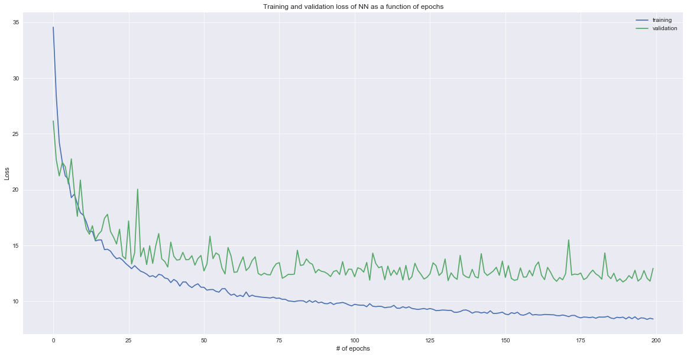

## Contents
{:.no_toc}
*  
{: toc}
# **Models**

The various models learned in class were implemented to attempt prediction of the wearer's arm movements based upon the output of the six sensors embedded in the shirt. The data used in these models were from a single subject, pooled across all three trials collected in the protocol. The subject data was taken from subject #4, because that particular data set had the fewest outliers as discussed in the **Data Description and Initial EDA** section. Additionally, due to the high frequency of the collecte data, the data was downsampled to reduce the training time of the models. 


**Train Test Split**
The data was split as a function of time - with the first 80% of the data used as the training set, and the last 20% reserved for testing. Initially, we had done a train_test_split randomly, however this yields artificially inflated test scores of the models because in the actual application of the shirt, it is impossible to predict\results based on future data.

## **A. Data Preparation and Cleaning**


```python
plt.style.use('ac209a.mplstyle')
```


```python
def standardize(X, X_ref):
    mean = np.mean(X_ref)
    std = np.std(X_ref)
    return (X-mean)/std
```


```python
def normalize(X, X_ref):
    return (X-np.min(X_ref))/(np.max(X_ref)-np.min(X_ref))
```


```python
def deriv_1st(df, features):
    prev = df.iloc[0:-2]
    nxt = df.iloc[2:]
    new_features = [f+'_1st' for f in features]
    results = pd.DataFrame(nxt[features].values - prev[features].values, columns=new_features)
    time_diff = pd.DataFrame(nxt['t'].values-prev['t'].values)
    for feature in new_features:
        results[feature] = results[[feature]].div(time_diff.values)
    return results
```


```python
def deriv_2nd(df, features):
    prev = df.iloc[0:-2]
    now = df.iloc[1:-1]
    nxt = df.iloc[2:]
    new_features = [f+'_2nd' for f in features]
    results = pd.DataFrame(nxt[features].values-2*now[features].values+prev[features].values, columns=new_features)
    time_diff = pd.DataFrame((nxt['t'].values-now['t'].values)*(now['t'].values-prev['t'].values))
    for feature in new_features:
        results[feature] = results[[feature]].div(time_diff.values)
    return results
```


```python
def prev_values(df, features, num):
    for i in range(1, num+1):
        new_features = [f+'_prev_'+str(i) for f in features]
        prev_df = df[features].shift(i)
        prev_df.columns = new_features
        df = pd.concat([df, prev_df], axis=1)
    return df.dropna()
```


```python
def add_features(df, features, angs, if_1st_deriv=False, if_2nd_deriv=False, num_prev=0):
    if if_1st_deriv: 
        df_1st_deriv = deriv_1st(df, features)
    else:
        df_1st_deriv = pd.DataFrame()
    if if_2nd_deriv:
        df_2nd_deriv = deriv_2nd(df, features)
    else:
        df_2nd_deriv = pd.DataFrame()
    results = pd.concat([pd.DataFrame(df[1:-1].values, columns=df.columns), df_1st_deriv, df_2nd_deriv], axis=1)
    results = prev_values(results, features, num_prev).drop('t', axis=1)
    return results.drop(columns=angs), results[angs]
```


```python
# def load_data(names, nums, tests):
#     appended_data = []
#     count = 0

#     for number in nums:
#         for test in tests:
#             for name in names:
#                 file_dir = 'data/' + name + '_t' + str(number) + test + '.txt'
#                 data = pd.read_csv(file_dir, header=None,
#                                    names=['t','s1','s2','s3','s4','s5','s6','hf','ab','ir'])
#                 print(file_dir)
#                 appended_data.append(data)
#                 if count > 0:
#                     appended_data[count].t = appended_data[count].t + max(appended_data[count-1].t)
#                 count += 1
#     df = pd.concat(appended_data, ignore_index=True)
#     return df
```


```python
def load_data(names, nums, tests, features, angs, if_1st_deriv=False, if_2nd_deriv=False, num_prev=0):
    X_list = []
    y_list = []

    for number in nums:
        for test in tests:
            for name in names:
                file_dir = 'data/' + name + '_t' + str(number) + test + '.txt'
                data = pd.read_csv(file_dir, header=None,
                                   names=['t','s1','s2','s3','s4','s5','s6','hf','ab','ir'])
                data = data.iloc[::20]
                X_df, y_df = add_features(data, features, angs, if_1st_deriv=if_1st_deriv, if_2nd_deriv=if_2nd_deriv, num_prev=num_prev)
                X_list.append(X_df)
                y_list.append(y_df)
                
    X_return = pd.concat(X_list)
    y_return = pd.concat(y_list)
    return X_return, y_return
```


```python
def calc_plot_arrays(y, yhat):
    x_list = []
    num_list = []
    mean_list = []
    std_list = []
    mae_list = []
    rmse_list = []
    
    for val in np.arange(math.floor(min(y)), math.ceil(max(y))):
        idx = (y>val)&(y<val+1)
        y_pred = np.array(yhat)[np.where(idx)]
        y_true = np.array(y)[np.where(idx)]
        if len(y_true) > 0:
            x_list.append(np.mean(y_true))
            num_list.append(len(y_true))
            mean_list.append(np.mean(y_pred))
            std_list.append(np.std(y_pred))
            mae_list.append(mean_absolute_error(y_true=y_true, y_pred=y_pred))
            rmse_list.append(np.sqrt(mean_squared_error(y_true=y_true, y_pred=y_pred)))
        
    plot_dict = {'x_arr': x_list, 'num_arr':num_list, 'mean_arr':mean_list,
                 'std_arr': std_list, 'mae_arr':mae_list, 'rmse_arr':rmse_list}
    
    return plot_dict

```


```python
def display_result(model, X_train, y_train, X_test, y_test, plot=False):
    yhat_train = model.predict(X_train)
    yhat_test = model.predict(X_test)

    r2_train = r2_score(y_train, yhat_train)
    r2_test = r2_score(y_test, yhat_test)
    
    rmse_train = np.sqrt(mean_squared_error(y_true=y_train, y_pred=yhat_train))
    rmse_test = np.sqrt(mean_squared_error(y_true=y_test, y_pred=yhat_test))
    
    mae_train = mean_absolute_error(y_true=y_train, y_pred=yhat_train)
    mae_test = mean_absolute_error(y_true=y_test, y_pred=yhat_test)
    
    plot_dict_train = calc_plot_arrays(y_train, yhat_train)
    plot_dict_test = calc_plot_arrays(y_test, yhat_test)
    
    mean_std_train = np.mean(plot_dict_train['std_arr'])
    mean_std_test = np.mean(plot_dict_test['std_arr'])
    
    dict_train = {'r2':r2_train, 'mean_std':mean_std_train, 'rmse':rmse_train, 'mae':mae_train}
    dict_test = {'r2':r2_test, 'mean_std':mean_std_test, 'rmse':rmse_test, 'mae':mae_test}
    
    if plot:
        fig, axs = plt.subplots(2,2, figsize=(30,20))
        for case in range(0,2):
            if case == 0: 
                plot_dict = plot_dict_train
                plt_y = y_train
                title = 'Train'
            else: 
                plot_dict = plot_dict_test
                plt_y = y_test
                title = 'Test'

            plt_x = plot_dict['x_arr']
            plt_mean = np.array(plot_dict['mean_arr'])
            plt_std = np.array(plot_dict['std_arr'])

            axs[0,case].plot(plt_x, plt_mean)
            axs[0,case].fill_between(plt_x, plt_mean-plt_std, plt_mean+plt_std, alpha=0.3)
            axs[0,case].plot([min(plt_y), max(plt_y)], [min(plt_y), max(plt_y)], '--')
            axs[0,case].set_xlabel('True Angles')
            axs[0,case].set_ylabel('Predicted Angles')
            axs[0,case].set_title(title)

            axs[1,case].plot(plt_x, plot_dict['rmse_arr'], label='RMSE')
            axs[1,case].plot(plt_x, plot_dict['mae_arr'], label='MAE')
            axs[1,case].set_xlabel('True Angles')
            axs[1,case].set_ylabel('Error')
            axs[1,case].set_title(title)
            axs[1,case].legend()
        plt.show()
    result_df = pd.DataFrame([dict_train, dict_test], index=['Train','Test'])[['r2','mean_std','mae','rmse']]
    return result_df, dict_train, dict_test, plot_dict_train, plot_dict_test
    
```


```python
def display_all_results(model, X_df, df, if_display=True, if_plot=False, 
                        if_stand=False, if_norm=False,
                        if_PCA=False, poly_deg=1):
    frames = []
    sens = ['s'+str(k) for k in range(1,n_sens+1)]
    angs = ['ab', 'hf', 'ir']
    models = []
    poly = PolynomialFeatures(degree=poly_deg)
    
    X_train, X_test, y_train, y_test = train_test_split(X_df, df[angs], test_size=0.2, shuffle=False) #, random_state=42)
        
    if if_stand: 
        X_test = standardize(X_test, X_train)
        X_train = standardize(X_train, X_train)

    if if_norm:
        X_test = normalize(X_test, X_train)
        X_train = normalize(X_train, X_train)
                
    if poly_deg > 1:
        X_train_add = pd.DataFrame(poly.fit_transform(X_train[sens]))
        X_test_add = pd.DataFrame(poly.fit_transform(X_test[sens]))
        
        X_train = pd.concat([pd.DataFrame(X_train.values, columns=X_train.columns), 
                             X_train_add], axis=1).drop(sens, axis=1)
        X_test = pd.concat([pd.DataFrame(X_test.values, columns=X_test.columns), 
                            X_test_add], axis=1).drop(sens, axis=1)
    
    if if_PCA:
        # Note: should normalize before applying PCA
        n = X_train.shape[1]
        pca = PCA(n).fit(X_train)
        i = 1
        while np.sum(pca.explained_variance_ratio_[:i]) < 0.95:
            i += 1
        print([n, i])
        pca = PCA(i).fit(X_train)
        X_train = pca.transform(X_train)
        X_test = pca.transform(X_test)
    
    for i,a in enumerate(angs):
        model.fit(X_train, y_train[a])
        if if_plot == True: print(f'\n********** {a}: **********\n')
        results = display_result(model, X_train, y_train[a], X_test, y_test[a], plot=if_plot)
        frames.append(results[0])
        models.append(model)
        
    if if_display == True: display(pd.concat(frames, keys=angs))
        
    return frames, models
    
```


```python
def find_best_param(scores_list, params, param_name):
    for ind, score in enumerate(scores_list):
        best_score = np.max(score)
        best_ind = np.argmax(score)
        best_param = params[best_ind]
        print(angs[ind] + ':')
        print("The best model has " + param_name + " of {}.".format(best_param))                                                                      
        print("The best model has R2 = {}.\n".format(best_score))
```


```python
n_sens = 6
sens = ['s'+str(k) for k in range(1,n_sens+1)]
angs = ['ab', 'hf', 'ir']

X_df, y_df = load_data(['M1'], [1,2,3], ['A','B','C'], angs=angs, features=sens)
X_df_added, y_df_added = load_data(['M1'], [1,2,3], ['A','B','C'],
                                   angs=angs, features=sens, 
                                   if_1st_deriv=True, if_2nd_deriv=True, num_prev=2)
```


## **B. Linear Regression**


```python
linreg = LinearRegression()
display_all_results(linreg, X_df, y_df);
```


<div>
<style scoped>
    .dataframe tbody tr th:only-of-type {
        vertical-align: middle;
    }

    .dataframe tbody tr th {
        vertical-align: top;
    }

    .dataframe thead th {
        text-align: right;
    }
</style>
<table border="1" class="dataframe">
  <thead>
    <tr style="text-align: right;">
      <th></th>
      <th></th>
      <th>r2</th>
      <th>mean_std</th>
      <th>mae</th>
      <th>rmse</th>
    </tr>
  </thead>
  <tbody>
    <tr>
      <th rowspan="2" valign="top">ab</th>
      <th>Train</th>
      <td>0.901010</td>
      <td>11.897278</td>
      <td>9.753486</td>
      <td>12.761176</td>
    </tr>
    <tr>
      <th>Test</th>
      <td>0.775065</td>
      <td>12.240685</td>
      <td>14.914385</td>
      <td>19.012592</td>
    </tr>
    <tr>
      <th rowspan="2" valign="top">hf</th>
      <th>Train</th>
      <td>0.752430</td>
      <td>14.254330</td>
      <td>16.145868</td>
      <td>19.993084</td>
    </tr>
    <tr>
      <th>Test</th>
      <td>0.602819</td>
      <td>14.183518</td>
      <td>19.324524</td>
      <td>23.550622</td>
    </tr>
    <tr>
      <th rowspan="2" valign="top">ir</th>
      <th>Train</th>
      <td>0.591279</td>
      <td>15.805040</td>
      <td>21.354235</td>
      <td>26.978226</td>
    </tr>
    <tr>
      <th>Test</th>
      <td>0.544879</td>
      <td>11.211689</td>
      <td>17.111802</td>
      <td>21.717219</td>
    </tr>
  </tbody>
</table>
</div>


```python
linreg = LinearRegression()
display_all_results(linreg, X_df_added, y_df_added);
```


<div>
<style scoped>
    .dataframe tbody tr th:only-of-type {
        vertical-align: middle;
    }

    .dataframe tbody tr th {
        vertical-align: top;
    }

    .dataframe thead th {
        text-align: right;
    }
</style>
<table border="1" class="dataframe">
  <thead>
    <tr style="text-align: right;">
      <th></th>
      <th></th>
      <th>r2</th>
      <th>mean_std</th>
      <th>mae</th>
      <th>rmse</th>
    </tr>
  </thead>
  <tbody>
    <tr>
      <th rowspan="2" valign="top">ab</th>
      <th>Train</th>
      <td>0.911068</td>
      <td>11.183976</td>
      <td>9.135420</td>
      <td>12.087205</td>
    </tr>
    <tr>
      <th>Test</th>
      <td>0.779129</td>
      <td>11.777138</td>
      <td>14.690716</td>
      <td>18.811488</td>
    </tr>
    <tr>
      <th rowspan="2" valign="top">hf</th>
      <th>Train</th>
      <td>0.809676</td>
      <td>13.772353</td>
      <td>13.929124</td>
      <td>17.546370</td>
    </tr>
    <tr>
      <th>Test</th>
      <td>0.616968</td>
      <td>14.639168</td>
      <td>18.787604</td>
      <td>23.138092</td>
    </tr>
    <tr>
      <th rowspan="2" valign="top">ir</th>
      <th>Train</th>
      <td>0.649530</td>
      <td>15.648047</td>
      <td>20.272851</td>
      <td>24.967519</td>
    </tr>
    <tr>
      <th>Test</th>
      <td>0.586149</td>
      <td>11.540126</td>
      <td>16.253234</td>
      <td>20.613524</td>
    </tr>
  </tbody>
</table>
</div>


**C. Polynomial Regression**


```python
degrees = range(2,7)
ab_scores, hf_scores, ir_scores = [], [], []
linreg = LinearRegression()

for deg in degrees:
    print('\nDegree = ', deg)
    result,_ = display_all_results(linreg, X_df, y_df, poly_deg=deg);
    ab_scores.append(result[0].r2[1])
    hf_scores.append(result[1].r2[1])
    ir_scores.append(result[2].r2[1])

scores_list = [ab_scores, hf_scores, ir_scores]
find_best_param(scores_list, degrees, 'degree')
```


    
    Degree =  2


<div>
<style scoped>
    .dataframe tbody tr th:only-of-type {
        vertical-align: middle;
    }

    .dataframe tbody tr th {
        vertical-align: top;
    }

    .dataframe thead th {
        text-align: right;
    }
</style>
<table border="1" class="dataframe">
  <thead>
    <tr style="text-align: right;">
      <th></th>
      <th></th>
      <th>r2</th>
      <th>mean_std</th>
      <th>mae</th>
      <th>rmse</th>
    </tr>
  </thead>
  <tbody>
    <tr>
      <th rowspan="2" valign="top">ab</th>
      <th>Train</th>
      <td>0.919932</td>
      <td>10.981466</td>
      <td>8.589613</td>
      <td>11.476887</td>
    </tr>
    <tr>
      <th>Test</th>
      <td>0.780861</td>
      <td>12.191805</td>
      <td>14.612550</td>
      <td>18.766019</td>
    </tr>
    <tr>
      <th rowspan="2" valign="top">hf</th>
      <th>Train</th>
      <td>0.808074</td>
      <td>14.133184</td>
      <td>13.995990</td>
      <td>17.603464</td>
    </tr>
    <tr>
      <th>Test</th>
      <td>0.636395</td>
      <td>14.633467</td>
      <td>18.274841</td>
      <td>22.533206</td>
    </tr>
    <tr>
      <th rowspan="2" valign="top">ir</th>
      <th>Train</th>
      <td>0.712040</td>
      <td>15.902956</td>
      <td>17.827316</td>
      <td>22.644667</td>
    </tr>
    <tr>
      <th>Test</th>
      <td>0.638308</td>
      <td>12.294146</td>
      <td>15.361324</td>
      <td>19.360219</td>
    </tr>
  </tbody>
</table>
</div>


    
    Degree =  3


<div>
<style scoped>
    .dataframe tbody tr th:only-of-type {
        vertical-align: middle;
    }

    .dataframe tbody tr th {
        vertical-align: top;
    }

    .dataframe thead th {
        text-align: right;
    }
</style>
<table border="1" class="dataframe">
  <thead>
    <tr style="text-align: right;">
      <th></th>
      <th></th>
      <th>r2</th>
      <th>mean_std</th>
      <th>mae</th>
      <th>rmse</th>
    </tr>
  </thead>
  <tbody>
    <tr>
      <th rowspan="2" valign="top">ab</th>
      <th>Train</th>
      <td>0.931358</td>
      <td>10.249850</td>
      <td>7.704174</td>
      <td>10.626444</td>
    </tr>
    <tr>
      <th>Test</th>
      <td>0.793320</td>
      <td>12.746565</td>
      <td>13.934313</td>
      <td>18.224743</td>
    </tr>
    <tr>
      <th rowspan="2" valign="top">hf</th>
      <th>Train</th>
      <td>0.849286</td>
      <td>12.602613</td>
      <td>12.039398</td>
      <td>15.599368</td>
    </tr>
    <tr>
      <th>Test</th>
      <td>0.659580</td>
      <td>14.679145</td>
      <td>16.960386</td>
      <td>21.802962</td>
    </tr>
    <tr>
      <th rowspan="2" valign="top">ir</th>
      <th>Train</th>
      <td>0.773563</td>
      <td>15.527517</td>
      <td>15.385382</td>
      <td>20.080466</td>
    </tr>
    <tr>
      <th>Test</th>
      <td>0.700227</td>
      <td>11.792307</td>
      <td>13.584235</td>
      <td>17.625317</td>
    </tr>
  </tbody>
</table>
</div>


    
    Degree =  4


<div>
<style scoped>
    .dataframe tbody tr th:only-of-type {
        vertical-align: middle;
    }

    .dataframe tbody tr th {
        vertical-align: top;
    }

    .dataframe thead th {
        text-align: right;
    }
</style>
<table border="1" class="dataframe">
  <thead>
    <tr style="text-align: right;">
      <th></th>
      <th></th>
      <th>r2</th>
      <th>mean_std</th>
      <th>mae</th>
      <th>rmse</th>
    </tr>
  </thead>
  <tbody>
    <tr>
      <th rowspan="2" valign="top">ab</th>
      <th>Train</th>
      <td>0.901395</td>
      <td>12.545540</td>
      <td>9.538343</td>
      <td>12.736276</td>
    </tr>
    <tr>
      <th>Test</th>
      <td>0.760058</td>
      <td>14.711685</td>
      <td>15.136127</td>
      <td>19.636559</td>
    </tr>
    <tr>
      <th rowspan="2" valign="top">hf</th>
      <th>Train</th>
      <td>0.876125</td>
      <td>11.546491</td>
      <td>10.740009</td>
      <td>14.142372</td>
    </tr>
    <tr>
      <th>Test</th>
      <td>0.660900</td>
      <td>14.962774</td>
      <td>16.820597</td>
      <td>21.760667</td>
    </tr>
    <tr>
      <th rowspan="2" valign="top">ir</th>
      <th>Train</th>
      <td>0.649216</td>
      <td>19.957658</td>
      <td>19.101548</td>
      <td>24.993085</td>
    </tr>
    <tr>
      <th>Test</th>
      <td>0.511005</td>
      <td>15.725595</td>
      <td>17.106490</td>
      <td>22.510906</td>
    </tr>
  </tbody>
</table>
</div>


    
    Degree =  5


<div>
<style scoped>
    .dataframe tbody tr th:only-of-type {
        vertical-align: middle;
    }

    .dataframe tbody tr th {
        vertical-align: top;
    }

    .dataframe thead th {
        text-align: right;
    }
</style>
<table border="1" class="dataframe">
  <thead>
    <tr style="text-align: right;">
      <th></th>
      <th></th>
      <th>r2</th>
      <th>mean_std</th>
      <th>mae</th>
      <th>rmse</th>
    </tr>
  </thead>
  <tbody>
    <tr>
      <th rowspan="2" valign="top">ab</th>
      <th>Train</th>
      <td>0.947678</td>
      <td>9.045667</td>
      <td>6.677612</td>
      <td>9.277588</td>
    </tr>
    <tr>
      <th>Test</th>
      <td>0.767947</td>
      <td>14.862630</td>
      <td>14.803862</td>
      <td>19.311061</td>
    </tr>
    <tr>
      <th rowspan="2" valign="top">hf</th>
      <th>Train</th>
      <td>0.898150</td>
      <td>10.895324</td>
      <td>9.623366</td>
      <td>12.823663</td>
    </tr>
    <tr>
      <th>Test</th>
      <td>0.585203</td>
      <td>17.338641</td>
      <td>18.305432</td>
      <td>24.067228</td>
    </tr>
    <tr>
      <th rowspan="2" valign="top">ir</th>
      <th>Train</th>
      <td>0.827365</td>
      <td>14.813403</td>
      <td>13.453135</td>
      <td>17.533335</td>
    </tr>
    <tr>
      <th>Test</th>
      <td>0.306781</td>
      <td>18.691178</td>
      <td>18.848370</td>
      <td>26.802555</td>
    </tr>
  </tbody>
</table>
</div>


    
    Degree =  6


<div>
<style scoped>
    .dataframe tbody tr th:only-of-type {
        vertical-align: middle;
    }

    .dataframe tbody tr th {
        vertical-align: top;
    }

    .dataframe thead th {
        text-align: right;
    }
</style>
<table border="1" class="dataframe">
  <thead>
    <tr style="text-align: right;">
      <th></th>
      <th></th>
      <th>r2</th>
      <th>mean_std</th>
      <th>mae</th>
      <th>rmse</th>
    </tr>
  </thead>
  <tbody>
    <tr>
      <th rowspan="2" valign="top">ab</th>
      <th>Train</th>
      <td>0.952808</td>
      <td>8.593067</td>
      <td>6.496335</td>
      <td>8.811016</td>
    </tr>
    <tr>
      <th>Test</th>
      <td>0.580310</td>
      <td>18.561757</td>
      <td>18.589716</td>
      <td>25.970273</td>
    </tr>
    <tr>
      <th rowspan="2" valign="top">hf</th>
      <th>Train</th>
      <td>0.909971</td>
      <td>10.718606</td>
      <td>9.192738</td>
      <td>12.056518</td>
    </tr>
    <tr>
      <th>Test</th>
      <td>0.151221</td>
      <td>24.583222</td>
      <td>23.826051</td>
      <td>34.427481</td>
    </tr>
    <tr>
      <th rowspan="2" valign="top">ir</th>
      <th>Train</th>
      <td>0.908189</td>
      <td>10.525882</td>
      <td>9.361476</td>
      <td>12.786375</td>
    </tr>
    <tr>
      <th>Test</th>
      <td>-0.087280</td>
      <td>23.513688</td>
      <td>22.899492</td>
      <td>33.566936</td>
    </tr>
  </tbody>
</table>
</div>


    ab:
    The best model has degree of 3.
    The best model has R2 = 0.7933202273384089.
    
    hf:
    The best model has degree of 4.
    The best model has R2 = 0.6608995319619955.
    
    ir:
    The best model has degree of 3.
    The best model has R2 = 0.7002273576394702.
    


```python
degrees = range(2,7)
ab_scores, hf_scores, ir_scores = [], [], []
linreg = LinearRegression()

for deg in degrees:
    print('\nDegree = ', deg)
    result,_ = display_all_results(linreg, X_df_added, y_df_added, poly_deg=deg);
    ab_scores.append(result[0].r2[1])
    hf_scores.append(result[1].r2[1])
    ir_scores.append(result[2].r2[1])

scores_list = [ab_scores, hf_scores, ir_scores]
find_best_param(scores_list, degrees, 'degree')
```


    
    Degree =  2


<div>
<style scoped>
    .dataframe tbody tr th:only-of-type {
        vertical-align: middle;
    }

    .dataframe tbody tr th {
        vertical-align: top;
    }

    .dataframe thead th {
        text-align: right;
    }
</style>
<table border="1" class="dataframe">
  <thead>
    <tr style="text-align: right;">
      <th></th>
      <th></th>
      <th>r2</th>
      <th>mean_std</th>
      <th>mae</th>
      <th>rmse</th>
    </tr>
  </thead>
  <tbody>
    <tr>
      <th rowspan="2" valign="top">ab</th>
      <th>Train</th>
      <td>0.928443</td>
      <td>10.310230</td>
      <td>8.034766</td>
      <td>10.842308</td>
    </tr>
    <tr>
      <th>Test</th>
      <td>0.790201</td>
      <td>11.929353</td>
      <td>14.167058</td>
      <td>18.333891</td>
    </tr>
    <tr>
      <th rowspan="2" valign="top">hf</th>
      <th>Train</th>
      <td>0.853046</td>
      <td>12.920511</td>
      <td>12.166673</td>
      <td>15.418108</td>
    </tr>
    <tr>
      <th>Test</th>
      <td>0.656704</td>
      <td>14.182903</td>
      <td>17.672000</td>
      <td>21.905059</td>
    </tr>
    <tr>
      <th rowspan="2" valign="top">ir</th>
      <th>Train</th>
      <td>0.742417</td>
      <td>15.765526</td>
      <td>16.901706</td>
      <td>21.404681</td>
    </tr>
    <tr>
      <th>Test</th>
      <td>0.646182</td>
      <td>12.014861</td>
      <td>15.041473</td>
      <td>19.059892</td>
    </tr>
  </tbody>
</table>
</div>


    
    Degree =  3


<div>
<style scoped>
    .dataframe tbody tr th:only-of-type {
        vertical-align: middle;
    }

    .dataframe tbody tr th {
        vertical-align: top;
    }

    .dataframe thead th {
        text-align: right;
    }
</style>
<table border="1" class="dataframe">
  <thead>
    <tr style="text-align: right;">
      <th></th>
      <th></th>
      <th>r2</th>
      <th>mean_std</th>
      <th>mae</th>
      <th>rmse</th>
    </tr>
  </thead>
  <tbody>
    <tr>
      <th rowspan="2" valign="top">ab</th>
      <th>Train</th>
      <td>0.938691</td>
      <td>9.631045</td>
      <td>7.223615</td>
      <td>10.035931</td>
    </tr>
    <tr>
      <th>Test</th>
      <td>0.805583</td>
      <td>12.408493</td>
      <td>13.439350</td>
      <td>17.649004</td>
    </tr>
    <tr>
      <th rowspan="2" valign="top">hf</th>
      <th>Train</th>
      <td>0.883283</td>
      <td>11.418579</td>
      <td>10.591613</td>
      <td>13.740668</td>
    </tr>
    <tr>
      <th>Test</th>
      <td>0.694339</td>
      <td>14.135169</td>
      <td>16.298434</td>
      <td>20.669499</td>
    </tr>
    <tr>
      <th rowspan="2" valign="top">ir</th>
      <th>Train</th>
      <td>0.792263</td>
      <td>15.181595</td>
      <td>14.827330</td>
      <td>19.222370</td>
    </tr>
    <tr>
      <th>Test</th>
      <td>0.711362</td>
      <td>11.543475</td>
      <td>13.234511</td>
      <td>17.215008</td>
    </tr>
  </tbody>
</table>
</div>


    
    Degree =  4


<div>
<style scoped>
    .dataframe tbody tr th:only-of-type {
        vertical-align: middle;
    }

    .dataframe tbody tr th {
        vertical-align: top;
    }

    .dataframe thead th {
        text-align: right;
    }
</style>
<table border="1" class="dataframe">
  <thead>
    <tr style="text-align: right;">
      <th></th>
      <th></th>
      <th>r2</th>
      <th>mean_std</th>
      <th>mae</th>
      <th>rmse</th>
    </tr>
  </thead>
  <tbody>
    <tr>
      <th rowspan="2" valign="top">ab</th>
      <th>Train</th>
      <td>0.946747</td>
      <td>8.966736</td>
      <td>6.655011</td>
      <td>9.353334</td>
    </tr>
    <tr>
      <th>Test</th>
      <td>0.799806</td>
      <td>13.077525</td>
      <td>13.727405</td>
      <td>17.909315</td>
    </tr>
    <tr>
      <th rowspan="2" valign="top">hf</th>
      <th>Train</th>
      <td>0.904594</td>
      <td>10.434330</td>
      <td>9.451124</td>
      <td>12.423092</td>
    </tr>
    <tr>
      <th>Test</th>
      <td>0.692761</td>
      <td>14.536302</td>
      <td>16.195148</td>
      <td>20.722785</td>
    </tr>
    <tr>
      <th rowspan="2" valign="top">ir</th>
      <th>Train</th>
      <td>0.839191</td>
      <td>13.634081</td>
      <td>12.773644</td>
      <td>16.912379</td>
    </tr>
    <tr>
      <th>Test</th>
      <td>0.694913</td>
      <td>13.083641</td>
      <td>13.402448</td>
      <td>17.698738</td>
    </tr>
  </tbody>
</table>
</div>


    
    Degree =  5


<div>
<style scoped>
    .dataframe tbody tr th:only-of-type {
        vertical-align: middle;
    }

    .dataframe tbody tr th {
        vertical-align: top;
    }

    .dataframe thead th {
        text-align: right;
    }
</style>
<table border="1" class="dataframe">
  <thead>
    <tr style="text-align: right;">
      <th></th>
      <th></th>
      <th>r2</th>
      <th>mean_std</th>
      <th>mae</th>
      <th>rmse</th>
    </tr>
  </thead>
  <tbody>
    <tr>
      <th rowspan="2" valign="top">ab</th>
      <th>Train</th>
      <td>0.956887</td>
      <td>8.149036</td>
      <td>5.854546</td>
      <td>8.415870</td>
    </tr>
    <tr>
      <th>Test</th>
      <td>0.779042</td>
      <td>13.934190</td>
      <td>14.370312</td>
      <td>18.815160</td>
    </tr>
    <tr>
      <th rowspan="2" valign="top">hf</th>
      <th>Train</th>
      <td>0.925327</td>
      <td>9.277708</td>
      <td>8.195403</td>
      <td>10.990606</td>
    </tr>
    <tr>
      <th>Test</th>
      <td>0.649857</td>
      <td>15.716721</td>
      <td>17.273981</td>
      <td>22.122440</td>
    </tr>
    <tr>
      <th rowspan="2" valign="top">ir</th>
      <th>Train</th>
      <td>0.888803</td>
      <td>11.585649</td>
      <td>10.484527</td>
      <td>14.063628</td>
    </tr>
    <tr>
      <th>Test</th>
      <td>0.477850</td>
      <td>16.328787</td>
      <td>16.566853</td>
      <td>23.154092</td>
    </tr>
  </tbody>
</table>
</div>


    
    Degree =  6


<div>
<style scoped>
    .dataframe tbody tr th:only-of-type {
        vertical-align: middle;
    }

    .dataframe tbody tr th {
        vertical-align: top;
    }

    .dataframe thead th {
        text-align: right;
    }
</style>
<table border="1" class="dataframe">
  <thead>
    <tr style="text-align: right;">
      <th></th>
      <th></th>
      <th>r2</th>
      <th>mean_std</th>
      <th>mae</th>
      <th>rmse</th>
    </tr>
  </thead>
  <tbody>
    <tr>
      <th rowspan="2" valign="top">ab</th>
      <th>Train</th>
      <td>0.970348</td>
      <td>6.750935</td>
      <td>4.792580</td>
      <td>6.979420</td>
    </tr>
    <tr>
      <th>Test</th>
      <td>0.335660</td>
      <td>22.612346</td>
      <td>20.522561</td>
      <td>32.624865</td>
    </tr>
    <tr>
      <th rowspan="2" valign="top">hf</th>
      <th>Train</th>
      <td>0.950048</td>
      <td>7.693948</td>
      <td>6.526878</td>
      <td>8.989149</td>
    </tr>
    <tr>
      <th>Test</th>
      <td>-0.072901</td>
      <td>27.886545</td>
      <td>24.026781</td>
      <td>38.724874</td>
    </tr>
    <tr>
      <th rowspan="2" valign="top">ir</th>
      <th>Train</th>
      <td>0.931422</td>
      <td>9.214360</td>
      <td>7.859736</td>
      <td>11.044416</td>
    </tr>
    <tr>
      <th>Test</th>
      <td>-1.245714</td>
      <td>28.648175</td>
      <td>26.246970</td>
      <td>48.018375</td>
    </tr>
  </tbody>
</table>
</div>


    ab:
    The best model has degree of 3.
    The best model has R2 = 0.8055832511619616.
    
    hf:
    The best model has degree of 3.
    The best model has R2 = 0.6943393775038769.
    
    ir:
    The best model has degree of 3.
    The best model has R2 = 0.7113616735074386.
    


## **D. kNN**


```python
k_values = [1, 10, 75, 250, 500, 750, 1000]
ab_scores, hf_scores, ir_scores = [], [], []

for val in k_values:
    print('\nk =', val)
    kNN = KNeighborsRegressor(n_neighbors=val)
    result,_ = display_all_results(kNN, X_df, y_df)
    ab_scores.append(result[0].r2[1])
    hf_scores.append(result[1].r2[1])
    ir_scores.append(result[2].r2[1])

scores_list = [ab_scores, hf_scores, ir_scores]
find_best_param(scores_list, k_values, 'k')
```


    
    k = 1


<div>
<style scoped>
    .dataframe tbody tr th:only-of-type {
        vertical-align: middle;
    }

    .dataframe tbody tr th {
        vertical-align: top;
    }

    .dataframe thead th {
        text-align: right;
    }
</style>
<table border="1" class="dataframe">
  <thead>
    <tr style="text-align: right;">
      <th></th>
      <th></th>
      <th>r2</th>
      <th>mean_std</th>
      <th>mae</th>
      <th>rmse</th>
    </tr>
  </thead>
  <tbody>
    <tr>
      <th rowspan="2" valign="top">ab</th>
      <th>Train</th>
      <td>1.000000</td>
      <td>0.270669</td>
      <td>0.000000</td>
      <td>0.000000</td>
    </tr>
    <tr>
      <th>Test</th>
      <td>0.678463</td>
      <td>17.175134</td>
      <td>16.561574</td>
      <td>22.731489</td>
    </tr>
    <tr>
      <th rowspan="2" valign="top">hf</th>
      <th>Train</th>
      <td>1.000000</td>
      <td>0.270279</td>
      <td>0.000000</td>
      <td>0.000000</td>
    </tr>
    <tr>
      <th>Test</th>
      <td>0.469556</td>
      <td>19.566608</td>
      <td>20.546974</td>
      <td>27.216222</td>
    </tr>
    <tr>
      <th rowspan="2" valign="top">ir</th>
      <th>Train</th>
      <td>1.000000</td>
      <td>0.259164</td>
      <td>0.000000</td>
      <td>0.000000</td>
    </tr>
    <tr>
      <th>Test</th>
      <td>0.467840</td>
      <td>17.389108</td>
      <td>16.620756</td>
      <td>23.483450</td>
    </tr>
  </tbody>
</table>
</div>


    
    k = 10


<div>
<style scoped>
    .dataframe tbody tr th:only-of-type {
        vertical-align: middle;
    }

    .dataframe tbody tr th {
        vertical-align: top;
    }

    .dataframe thead th {
        text-align: right;
    }
</style>
<table border="1" class="dataframe">
  <thead>
    <tr style="text-align: right;">
      <th></th>
      <th></th>
      <th>r2</th>
      <th>mean_std</th>
      <th>mae</th>
      <th>rmse</th>
    </tr>
  </thead>
  <tbody>
    <tr>
      <th rowspan="2" valign="top">ab</th>
      <th>Train</th>
      <td>0.945282</td>
      <td>9.230150</td>
      <td>6.561840</td>
      <td>9.487675</td>
    </tr>
    <tr>
      <th>Test</th>
      <td>0.778792</td>
      <td>13.967837</td>
      <td>14.266087</td>
      <td>18.854402</td>
    </tr>
    <tr>
      <th rowspan="2" valign="top">hf</th>
      <th>Train</th>
      <td>0.899476</td>
      <td>10.673805</td>
      <td>9.362343</td>
      <td>12.739906</td>
    </tr>
    <tr>
      <th>Test</th>
      <td>0.623361</td>
      <td>15.636259</td>
      <td>17.447701</td>
      <td>22.933512</td>
    </tr>
    <tr>
      <th rowspan="2" valign="top">ir</th>
      <th>Train</th>
      <td>0.867125</td>
      <td>11.748420</td>
      <td>10.733435</td>
      <td>15.382324</td>
    </tr>
    <tr>
      <th>Test</th>
      <td>0.674155</td>
      <td>13.459029</td>
      <td>13.214304</td>
      <td>18.375810</td>
    </tr>
  </tbody>
</table>
</div>


    
    k = 75


<div>
<style scoped>
    .dataframe tbody tr th:only-of-type {
        vertical-align: middle;
    }

    .dataframe tbody tr th {
        vertical-align: top;
    }

    .dataframe thead th {
        text-align: right;
    }
</style>
<table border="1" class="dataframe">
  <thead>
    <tr style="text-align: right;">
      <th></th>
      <th></th>
      <th>r2</th>
      <th>mean_std</th>
      <th>mae</th>
      <th>rmse</th>
    </tr>
  </thead>
  <tbody>
    <tr>
      <th rowspan="2" valign="top">ab</th>
      <th>Train</th>
      <td>0.925163</td>
      <td>10.524983</td>
      <td>7.879761</td>
      <td>11.095609</td>
    </tr>
    <tr>
      <th>Test</th>
      <td>0.787250</td>
      <td>13.304731</td>
      <td>14.032500</td>
      <td>18.490421</td>
    </tr>
    <tr>
      <th rowspan="2" valign="top">hf</th>
      <th>Train</th>
      <td>0.837995</td>
      <td>12.366574</td>
      <td>12.463764</td>
      <td>16.173168</td>
    </tr>
    <tr>
      <th>Test</th>
      <td>0.660431</td>
      <td>14.455948</td>
      <td>16.737630</td>
      <td>21.775709</td>
    </tr>
    <tr>
      <th rowspan="2" valign="top">ir</th>
      <th>Train</th>
      <td>0.768558</td>
      <td>13.167441</td>
      <td>15.256832</td>
      <td>20.301188</td>
    </tr>
    <tr>
      <th>Test</th>
      <td>0.667178</td>
      <td>11.600176</td>
      <td>14.185887</td>
      <td>18.571498</td>
    </tr>
  </tbody>
</table>
</div>


    
    k = 250


<div>
<style scoped>
    .dataframe tbody tr th:only-of-type {
        vertical-align: middle;
    }

    .dataframe tbody tr th {
        vertical-align: top;
    }

    .dataframe thead th {
        text-align: right;
    }
</style>
<table border="1" class="dataframe">
  <thead>
    <tr style="text-align: right;">
      <th></th>
      <th></th>
      <th>r2</th>
      <th>mean_std</th>
      <th>mae</th>
      <th>rmse</th>
    </tr>
  </thead>
  <tbody>
    <tr>
      <th rowspan="2" valign="top">ab</th>
      <th>Train</th>
      <td>0.914665</td>
      <td>10.643534</td>
      <td>8.595766</td>
      <td>11.848329</td>
    </tr>
    <tr>
      <th>Test</th>
      <td>0.784774</td>
      <td>13.034890</td>
      <td>14.267299</td>
      <td>18.597734</td>
    </tr>
    <tr>
      <th rowspan="2" valign="top">hf</th>
      <th>Train</th>
      <td>0.800040</td>
      <td>11.626311</td>
      <td>14.344648</td>
      <td>17.968119</td>
    </tr>
    <tr>
      <th>Test</th>
      <td>0.656171</td>
      <td>13.627072</td>
      <td>17.204302</td>
      <td>21.911869</td>
    </tr>
    <tr>
      <th rowspan="2" valign="top">ir</th>
      <th>Train</th>
      <td>0.685698</td>
      <td>13.799032</td>
      <td>18.260358</td>
      <td>23.657767</td>
    </tr>
    <tr>
      <th>Test</th>
      <td>0.610633</td>
      <td>10.844545</td>
      <td>15.652690</td>
      <td>20.087253</td>
    </tr>
  </tbody>
</table>
</div>


    
    k = 500


<div>
<style scoped>
    .dataframe tbody tr th:only-of-type {
        vertical-align: middle;
    }

    .dataframe tbody tr th {
        vertical-align: top;
    }

    .dataframe thead th {
        text-align: right;
    }
</style>
<table border="1" class="dataframe">
  <thead>
    <tr style="text-align: right;">
      <th></th>
      <th></th>
      <th>r2</th>
      <th>mean_std</th>
      <th>mae</th>
      <th>rmse</th>
    </tr>
  </thead>
  <tbody>
    <tr>
      <th rowspan="2" valign="top">ab</th>
      <th>Train</th>
      <td>0.905050</td>
      <td>10.230357</td>
      <td>9.239336</td>
      <td>12.498034</td>
    </tr>
    <tr>
      <th>Test</th>
      <td>0.779981</td>
      <td>12.472773</td>
      <td>14.595691</td>
      <td>18.803674</td>
    </tr>
    <tr>
      <th rowspan="2" valign="top">hf</th>
      <th>Train</th>
      <td>0.759647</td>
      <td>10.775198</td>
      <td>15.917175</td>
      <td>19.699504</td>
    </tr>
    <tr>
      <th>Test</th>
      <td>0.640673</td>
      <td>12.512305</td>
      <td>17.911766</td>
      <td>22.400259</td>
    </tr>
    <tr>
      <th rowspan="2" valign="top">ir</th>
      <th>Train</th>
      <td>0.642454</td>
      <td>13.960647</td>
      <td>19.541348</td>
      <td>25.232833</td>
    </tr>
    <tr>
      <th>Test</th>
      <td>0.580464</td>
      <td>10.277443</td>
      <td>16.302003</td>
      <td>20.850935</td>
    </tr>
  </tbody>
</table>
</div>


    
    k = 750


<div>
<style scoped>
    .dataframe tbody tr th:only-of-type {
        vertical-align: middle;
    }

    .dataframe tbody tr th {
        vertical-align: top;
    }

    .dataframe thead th {
        text-align: right;
    }
</style>
<table border="1" class="dataframe">
  <thead>
    <tr style="text-align: right;">
      <th></th>
      <th></th>
      <th>r2</th>
      <th>mean_std</th>
      <th>mae</th>
      <th>rmse</th>
    </tr>
  </thead>
  <tbody>
    <tr>
      <th rowspan="2" valign="top">ab</th>
      <th>Train</th>
      <td>0.891408</td>
      <td>9.783162</td>
      <td>9.989823</td>
      <td>13.365741</td>
    </tr>
    <tr>
      <th>Test</th>
      <td>0.772741</td>
      <td>11.785113</td>
      <td>14.866803</td>
      <td>19.110529</td>
    </tr>
    <tr>
      <th rowspan="2" valign="top">hf</th>
      <th>Train</th>
      <td>0.721782</td>
      <td>10.175498</td>
      <td>17.197446</td>
      <td>21.194503</td>
    </tr>
    <tr>
      <th>Test</th>
      <td>0.619432</td>
      <td>11.555365</td>
      <td>18.640482</td>
      <td>23.052836</td>
    </tr>
    <tr>
      <th rowspan="2" valign="top">ir</th>
      <th>Train</th>
      <td>0.615571</td>
      <td>13.863966</td>
      <td>20.320217</td>
      <td>26.164238</td>
    </tr>
    <tr>
      <th>Test</th>
      <td>0.560100</td>
      <td>9.803252</td>
      <td>16.645006</td>
      <td>21.350983</td>
    </tr>
  </tbody>
</table>
</div>


    
    k = 1000


<div>
<style scoped>
    .dataframe tbody tr th:only-of-type {
        vertical-align: middle;
    }

    .dataframe tbody tr th {
        vertical-align: top;
    }

    .dataframe thead th {
        text-align: right;
    }
</style>
<table border="1" class="dataframe">
  <thead>
    <tr style="text-align: right;">
      <th></th>
      <th></th>
      <th>r2</th>
      <th>mean_std</th>
      <th>mae</th>
      <th>rmse</th>
    </tr>
  </thead>
  <tbody>
    <tr>
      <th rowspan="2" valign="top">ab</th>
      <th>Train</th>
      <td>0.874994</td>
      <td>9.264391</td>
      <td>10.715677</td>
      <td>14.340357</td>
    </tr>
    <tr>
      <th>Test</th>
      <td>0.762510</td>
      <td>11.040825</td>
      <td>15.219314</td>
      <td>19.535970</td>
    </tr>
    <tr>
      <th rowspan="2" valign="top">hf</th>
      <th>Train</th>
      <td>0.684521</td>
      <td>9.663783</td>
      <td>18.372488</td>
      <td>22.569206</td>
    </tr>
    <tr>
      <th>Test</th>
      <td>0.590854</td>
      <td>10.738913</td>
      <td>19.466078</td>
      <td>23.902706</td>
    </tr>
    <tr>
      <th rowspan="2" valign="top">ir</th>
      <th>Train</th>
      <td>0.590661</td>
      <td>13.594430</td>
      <td>21.091222</td>
      <td>26.998599</td>
    </tr>
    <tr>
      <th>Test</th>
      <td>0.533499</td>
      <td>9.319936</td>
      <td>17.140564</td>
      <td>21.987053</td>
    </tr>
  </tbody>
</table>
</div>


    ab:
    The best model has k of 75.
    The best model has R2 = 0.7872503962714331.
    
    hf:
    The best model has k of 75.
    The best model has R2 = 0.6604305914334088.
    
    ir:
    The best model has k of 10.
    The best model has R2 = 0.6741549638511204.
    


```python
k_values = [1, 10, 75, 250, 500, 750, 1000]
ab_scores, hf_scores, ir_scores = [], [], []

for val in k_values:
    print('\nk =', val)
    kNN = KNeighborsRegressor(n_neighbors=val)
    result,_ = display_all_results(kNN, X_df_added, y_df_added)
    ab_scores.append(result[0].r2[1])
    hf_scores.append(result[1].r2[1])
    ir_scores.append(result[2].r2[1])

scores_list = [ab_scores, hf_scores, ir_scores]
find_best_param(scores_list, k_values, 'k')
```


    
    k = 1


<div>
<style scoped>
    .dataframe tbody tr th:only-of-type {
        vertical-align: middle;
    }

    .dataframe tbody tr th {
        vertical-align: top;
    }

    .dataframe thead th {
        text-align: right;
    }
</style>
<table border="1" class="dataframe">
  <thead>
    <tr style="text-align: right;">
      <th></th>
      <th></th>
      <th>r2</th>
      <th>mean_std</th>
      <th>mae</th>
      <th>rmse</th>
    </tr>
  </thead>
  <tbody>
    <tr>
      <th rowspan="2" valign="top">ab</th>
      <th>Train</th>
      <td>1.000000</td>
      <td>0.270728</td>
      <td>0.000000</td>
      <td>0.000000</td>
    </tr>
    <tr>
      <th>Test</th>
      <td>0.663801</td>
      <td>17.926115</td>
      <td>16.186274</td>
      <td>23.208725</td>
    </tr>
    <tr>
      <th rowspan="2" valign="top">hf</th>
      <th>Train</th>
      <td>1.000000</td>
      <td>0.270308</td>
      <td>0.000000</td>
      <td>0.000000</td>
    </tr>
    <tr>
      <th>Test</th>
      <td>0.588078</td>
      <td>17.520518</td>
      <td>17.158687</td>
      <td>23.994822</td>
    </tr>
    <tr>
      <th rowspan="2" valign="top">ir</th>
      <th>Train</th>
      <td>1.000000</td>
      <td>0.259107</td>
      <td>0.000000</td>
      <td>0.000000</td>
    </tr>
    <tr>
      <th>Test</th>
      <td>0.380926</td>
      <td>16.583154</td>
      <td>17.703968</td>
      <td>25.211659</td>
    </tr>
  </tbody>
</table>
</div>


    
    k = 10


<div>
<style scoped>
    .dataframe tbody tr th:only-of-type {
        vertical-align: middle;
    }

    .dataframe tbody tr th {
        vertical-align: top;
    }

    .dataframe thead th {
        text-align: right;
    }
</style>
<table border="1" class="dataframe">
  <thead>
    <tr style="text-align: right;">
      <th></th>
      <th></th>
      <th>r2</th>
      <th>mean_std</th>
      <th>mae</th>
      <th>rmse</th>
    </tr>
  </thead>
  <tbody>
    <tr>
      <th rowspan="2" valign="top">ab</th>
      <th>Train</th>
      <td>0.957935</td>
      <td>7.951207</td>
      <td>5.760661</td>
      <td>8.312949</td>
    </tr>
    <tr>
      <th>Test</th>
      <td>0.774396</td>
      <td>14.262204</td>
      <td>13.842188</td>
      <td>19.011956</td>
    </tr>
    <tr>
      <th rowspan="2" valign="top">hf</th>
      <th>Train</th>
      <td>0.933720</td>
      <td>8.603562</td>
      <td>7.473064</td>
      <td>10.354538</td>
    </tr>
    <tr>
      <th>Test</th>
      <td>0.699214</td>
      <td>14.918886</td>
      <td>15.272554</td>
      <td>20.504022</td>
    </tr>
    <tr>
      <th rowspan="2" valign="top">ir</th>
      <th>Train</th>
      <td>0.906927</td>
      <td>9.894820</td>
      <td>9.307621</td>
      <td>12.866523</td>
    </tr>
    <tr>
      <th>Test</th>
      <td>0.585610</td>
      <td>12.343559</td>
      <td>15.461013</td>
      <td>20.626941</td>
    </tr>
  </tbody>
</table>
</div>


    
    k = 75


<div>
<style scoped>
    .dataframe tbody tr th:only-of-type {
        vertical-align: middle;
    }

    .dataframe tbody tr th {
        vertical-align: top;
    }

    .dataframe thead th {
        text-align: right;
    }
</style>
<table border="1" class="dataframe">
  <thead>
    <tr style="text-align: right;">
      <th></th>
      <th></th>
      <th>r2</th>
      <th>mean_std</th>
      <th>mae</th>
      <th>rmse</th>
    </tr>
  </thead>
  <tbody>
    <tr>
      <th rowspan="2" valign="top">ab</th>
      <th>Train</th>
      <td>0.916054</td>
      <td>10.293515</td>
      <td>8.457556</td>
      <td>11.743463</td>
    </tr>
    <tr>
      <th>Test</th>
      <td>0.769018</td>
      <td>13.118957</td>
      <td>14.398338</td>
      <td>19.237216</td>
    </tr>
    <tr>
      <th rowspan="2" valign="top">hf</th>
      <th>Train</th>
      <td>0.849166</td>
      <td>10.789343</td>
      <td>12.171727</td>
      <td>15.620362</td>
    </tr>
    <tr>
      <th>Test</th>
      <td>0.670157</td>
      <td>13.721727</td>
      <td>16.897021</td>
      <td>21.471562</td>
    </tr>
    <tr>
      <th rowspan="2" valign="top">ir</th>
      <th>Train</th>
      <td>0.770100</td>
      <td>12.397696</td>
      <td>15.865135</td>
      <td>20.221792</td>
    </tr>
    <tr>
      <th>Test</th>
      <td>0.516476</td>
      <td>11.208915</td>
      <td>17.499839</td>
      <td>22.281229</td>
    </tr>
  </tbody>
</table>
</div>


    
    k = 250


<div>
<style scoped>
    .dataframe tbody tr th:only-of-type {
        vertical-align: middle;
    }

    .dataframe tbody tr th {
        vertical-align: top;
    }

    .dataframe thead th {
        text-align: right;
    }
</style>
<table border="1" class="dataframe">
  <thead>
    <tr style="text-align: right;">
      <th></th>
      <th></th>
      <th>r2</th>
      <th>mean_std</th>
      <th>mae</th>
      <th>rmse</th>
    </tr>
  </thead>
  <tbody>
    <tr>
      <th rowspan="2" valign="top">ab</th>
      <th>Train</th>
      <td>0.883796</td>
      <td>10.438354</td>
      <td>10.188283</td>
      <td>13.816770</td>
    </tr>
    <tr>
      <th>Test</th>
      <td>0.727856</td>
      <td>12.498047</td>
      <td>16.059968</td>
      <td>20.881083</td>
    </tr>
    <tr>
      <th rowspan="2" valign="top">hf</th>
      <th>Train</th>
      <td>0.732583</td>
      <td>10.301503</td>
      <td>16.626212</td>
      <td>20.798676</td>
    </tr>
    <tr>
      <th>Test</th>
      <td>0.577043</td>
      <td>11.228350</td>
      <td>19.666966</td>
      <td>24.314107</td>
    </tr>
    <tr>
      <th rowspan="2" valign="top">ir</th>
      <th>Train</th>
      <td>0.670122</td>
      <td>12.812912</td>
      <td>19.278609</td>
      <td>24.222950</td>
    </tr>
    <tr>
      <th>Test</th>
      <td>0.439519</td>
      <td>9.652964</td>
      <td>19.170622</td>
      <td>23.988915</td>
    </tr>
  </tbody>
</table>
</div>


    
    k = 500


<div>
<style scoped>
    .dataframe tbody tr th:only-of-type {
        vertical-align: middle;
    }

    .dataframe tbody tr th {
        vertical-align: top;
    }

    .dataframe thead th {
        text-align: right;
    }
</style>
<table border="1" class="dataframe">
  <thead>
    <tr style="text-align: right;">
      <th></th>
      <th></th>
      <th>r2</th>
      <th>mean_std</th>
      <th>mae</th>
      <th>rmse</th>
    </tr>
  </thead>
  <tbody>
    <tr>
      <th rowspan="2" valign="top">ab</th>
      <th>Train</th>
      <td>0.846393</td>
      <td>10.021697</td>
      <td>11.968478</td>
      <td>15.885492</td>
    </tr>
    <tr>
      <th>Test</th>
      <td>0.684972</td>
      <td>11.654483</td>
      <td>17.433367</td>
      <td>22.466131</td>
    </tr>
    <tr>
      <th rowspan="2" valign="top">hf</th>
      <th>Train</th>
      <td>0.636111</td>
      <td>9.151661</td>
      <td>19.519485</td>
      <td>24.261913</td>
    </tr>
    <tr>
      <th>Test</th>
      <td>0.482793</td>
      <td>9.388538</td>
      <td>21.765265</td>
      <td>26.887002</td>
    </tr>
    <tr>
      <th rowspan="2" valign="top">ir</th>
      <th>Train</th>
      <td>0.590096</td>
      <td>12.476146</td>
      <td>21.792528</td>
      <td>27.001716</td>
    </tr>
    <tr>
      <th>Test</th>
      <td>0.356863</td>
      <td>8.883533</td>
      <td>20.562417</td>
      <td>25.696964</td>
    </tr>
  </tbody>
</table>
</div>


    
    k = 750


<div>
<style scoped>
    .dataframe tbody tr th:only-of-type {
        vertical-align: middle;
    }

    .dataframe tbody tr th {
        vertical-align: top;
    }

    .dataframe thead th {
        text-align: right;
    }
</style>
<table border="1" class="dataframe">
  <thead>
    <tr style="text-align: right;">
      <th></th>
      <th></th>
      <th>r2</th>
      <th>mean_std</th>
      <th>mae</th>
      <th>rmse</th>
    </tr>
  </thead>
  <tbody>
    <tr>
      <th rowspan="2" valign="top">ab</th>
      <th>Train</th>
      <td>0.808628</td>
      <td>9.534601</td>
      <td>13.473515</td>
      <td>17.731061</td>
    </tr>
    <tr>
      <th>Test</th>
      <td>0.639734</td>
      <td>10.808876</td>
      <td>18.673569</td>
      <td>24.025096</td>
    </tr>
    <tr>
      <th rowspan="2" valign="top">hf</th>
      <th>Train</th>
      <td>0.569033</td>
      <td>8.227947</td>
      <td>21.356790</td>
      <td>26.403573</td>
    </tr>
    <tr>
      <th>Test</th>
      <td>0.415114</td>
      <td>8.250934</td>
      <td>23.186845</td>
      <td>28.592077</td>
    </tr>
    <tr>
      <th rowspan="2" valign="top">ir</th>
      <th>Train</th>
      <td>0.526811</td>
      <td>11.892103</td>
      <td>23.778674</td>
      <td>29.011307</td>
    </tr>
    <tr>
      <th>Test</th>
      <td>0.270223</td>
      <td>8.298706</td>
      <td>22.390715</td>
      <td>27.373176</td>
    </tr>
  </tbody>
</table>
</div>


    
    k = 1000


<div>
<style scoped>
    .dataframe tbody tr th:only-of-type {
        vertical-align: middle;
    }

    .dataframe tbody tr th {
        vertical-align: top;
    }

    .dataframe thead th {
        text-align: right;
    }
</style>
<table border="1" class="dataframe">
  <thead>
    <tr style="text-align: right;">
      <th></th>
      <th></th>
      <th>r2</th>
      <th>mean_std</th>
      <th>mae</th>
      <th>rmse</th>
    </tr>
  </thead>
  <tbody>
    <tr>
      <th rowspan="2" valign="top">ab</th>
      <th>Train</th>
      <td>0.767586</td>
      <td>9.144878</td>
      <td>15.103589</td>
      <td>19.540088</td>
    </tr>
    <tr>
      <th>Test</th>
      <td>0.588936</td>
      <td>10.095918</td>
      <td>20.147723</td>
      <td>25.663025</td>
    </tr>
    <tr>
      <th rowspan="2" valign="top">hf</th>
      <th>Train</th>
      <td>0.514977</td>
      <td>7.378218</td>
      <td>22.771343</td>
      <td>28.010580</td>
    </tr>
    <tr>
      <th>Test</th>
      <td>0.359721</td>
      <td>7.321765</td>
      <td>24.330087</td>
      <td>29.915394</td>
    </tr>
    <tr>
      <th rowspan="2" valign="top">ir</th>
      <th>Train</th>
      <td>0.475553</td>
      <td>11.228812</td>
      <td>25.419798</td>
      <td>30.542256</td>
    </tr>
    <tr>
      <th>Test</th>
      <td>0.206303</td>
      <td>7.697991</td>
      <td>23.920237</td>
      <td>28.546811</td>
    </tr>
  </tbody>
</table>
</div>


    ab:
    The best model has k of 10.
    The best model has R2 = 0.7743959737106147.
    
    hf:
    The best model has k of 10.
    The best model has R2 = 0.699213948625646.
    
    ir:
    The best model has k of 10.
    The best model has R2 = 0.5856100881336894.
    


## **E. Ridge**


```python
lambdas = [.01,.05,.1,.5,1,5,10,50,100]
degrees = np.arange(1,6)
ab_ridge_scores = np.zeros((len(lambdas),len(degrees)))
hf_ridge_scores = np.zeros((len(lambdas),len(degrees)))
ir_ridge_scores = np.zeros((len(lambdas),len(degrees)))

for ind1, alpha in enumerate(lambdas):
    for ind2, degree in enumerate(degrees):
        ridge = Ridge(alpha = alpha)
        result,_ = display_all_results(ridge, X_df, y_df, 
                                     if_display=False, if_stand=True, 
                                     poly_deg=degree)
        
        ab_ridge_scores[ind1][ind2] = result[0].r2[1]
        hf_ridge_scores[ind1][ind2] = result[1].r2[1]
        ir_ridge_scores[ind1][ind2] = result[2].r2[1]

display(pd.DataFrame(ab_ridge_scores, index=lambdas, columns=degrees))
display(pd.DataFrame(hf_ridge_scores, index=lambdas, columns=degrees))
display(pd.DataFrame(ir_ridge_scores, index=lambdas, columns=degrees))

scores_list = [ab_ridge_scores, hf_ridge_scores, ir_ridge_scores]

for ind, score in enumerate(scores_list):
    best_score = np.max(score)
    best_degree_ind = np.argmax(np.max(score, axis=0))
    best_alpha_ind = np.argmax(np.max(score, axis=1))
    best_degree = degrees[best_degree_ind]
    best_alpha = lambdas[best_alpha_ind]
    print(angs[ind] + ':')
    print("The best model has degree {} and Lambda = {}.".format(best_degree, best_alpha))                                                                      
    print("The best model has R2 = {}.\n".format(best_score))
```


<div>
<style scoped>
    .dataframe tbody tr th:only-of-type {
        vertical-align: middle;
    }

    .dataframe tbody tr th {
        vertical-align: top;
    }

    .dataframe thead th {
        text-align: right;
    }
</style>
<table border="1" class="dataframe">
  <thead>
    <tr style="text-align: right;">
      <th></th>
      <th>1</th>
      <th>2</th>
      <th>3</th>
      <th>4</th>
      <th>5</th>
    </tr>
  </thead>
  <tbody>
    <tr>
      <th>0.01</th>
      <td>0.775065</td>
      <td>0.780862</td>
      <td>0.793474</td>
      <td>0.789975</td>
      <td>0.777323</td>
    </tr>
    <tr>
      <th>0.05</th>
      <td>0.775065</td>
      <td>0.780864</td>
      <td>0.793717</td>
      <td>0.791744</td>
      <td>0.785153</td>
    </tr>
    <tr>
      <th>0.10</th>
      <td>0.775065</td>
      <td>0.780866</td>
      <td>0.793864</td>
      <td>0.792507</td>
      <td>0.788408</td>
    </tr>
    <tr>
      <th>0.50</th>
      <td>0.775066</td>
      <td>0.780881</td>
      <td>0.794191</td>
      <td>0.794032</td>
      <td>0.793153</td>
    </tr>
    <tr>
      <th>1.00</th>
      <td>0.775067</td>
      <td>0.780893</td>
      <td>0.794220</td>
      <td>0.794425</td>
      <td>0.793836</td>
    </tr>
    <tr>
      <th>5.00</th>
      <td>0.775072</td>
      <td>0.780878</td>
      <td>0.793962</td>
      <td>0.794663</td>
      <td>0.793617</td>
    </tr>
    <tr>
      <th>10.00</th>
      <td>0.775066</td>
      <td>0.780807</td>
      <td>0.793710</td>
      <td>0.794498</td>
      <td>0.793149</td>
    </tr>
    <tr>
      <th>50.00</th>
      <td>0.774761</td>
      <td>0.780222</td>
      <td>0.791792</td>
      <td>0.792765</td>
      <td>0.790269</td>
    </tr>
    <tr>
      <th>100.00</th>
      <td>0.774124</td>
      <td>0.779555</td>
      <td>0.789606</td>
      <td>0.790423</td>
      <td>0.787027</td>
    </tr>
  </tbody>
</table>
</div>


<div>
<style scoped>
    .dataframe tbody tr th:only-of-type {
        vertical-align: middle;
    }

    .dataframe tbody tr th {
        vertical-align: top;
    }

    .dataframe thead th {
        text-align: right;
    }
</style>
<table border="1" class="dataframe">
  <thead>
    <tr style="text-align: right;">
      <th></th>
      <th>1</th>
      <th>2</th>
      <th>3</th>
      <th>4</th>
      <th>5</th>
    </tr>
  </thead>
  <tbody>
    <tr>
      <th>0.01</th>
      <td>0.602819</td>
      <td>0.636403</td>
      <td>0.659930</td>
      <td>0.658693</td>
      <td>0.629463</td>
    </tr>
    <tr>
      <th>0.05</th>
      <td>0.602820</td>
      <td>0.636436</td>
      <td>0.660845</td>
      <td>0.657979</td>
      <td>0.641083</td>
    </tr>
    <tr>
      <th>0.10</th>
      <td>0.602821</td>
      <td>0.636476</td>
      <td>0.661426</td>
      <td>0.657252</td>
      <td>0.645908</td>
    </tr>
    <tr>
      <th>0.50</th>
      <td>0.602831</td>
      <td>0.636750</td>
      <td>0.662130</td>
      <td>0.654824</td>
      <td>0.653390</td>
    </tr>
    <tr>
      <th>1.00</th>
      <td>0.602843</td>
      <td>0.637013</td>
      <td>0.661884</td>
      <td>0.653645</td>
      <td>0.655513</td>
    </tr>
    <tr>
      <th>5.00</th>
      <td>0.602937</td>
      <td>0.637910</td>
      <td>0.661634</td>
      <td>0.653029</td>
      <td>0.657756</td>
    </tr>
    <tr>
      <th>10.00</th>
      <td>0.603049</td>
      <td>0.638177</td>
      <td>0.662741</td>
      <td>0.654850</td>
      <td>0.656851</td>
    </tr>
    <tr>
      <th>50.00</th>
      <td>0.603773</td>
      <td>0.638196</td>
      <td>0.667069</td>
      <td>0.661815</td>
      <td>0.651768</td>
    </tr>
    <tr>
      <th>100.00</th>
      <td>0.604359</td>
      <td>0.638013</td>
      <td>0.666535</td>
      <td>0.663434</td>
      <td>0.649848</td>
    </tr>
  </tbody>
</table>
</div>


<div>
<style scoped>
    .dataframe tbody tr th:only-of-type {
        vertical-align: middle;
    }

    .dataframe tbody tr th {
        vertical-align: top;
    }

    .dataframe thead th {
        text-align: right;
    }
</style>
<table border="1" class="dataframe">
  <thead>
    <tr style="text-align: right;">
      <th></th>
      <th>1</th>
      <th>2</th>
      <th>3</th>
      <th>4</th>
      <th>5</th>
    </tr>
  </thead>
  <tbody>
    <tr>
      <th>0.01</th>
      <td>0.544877</td>
      <td>0.638312</td>
      <td>0.701091</td>
      <td>0.698530</td>
      <td>0.576513</td>
    </tr>
    <tr>
      <th>0.05</th>
      <td>0.544869</td>
      <td>0.638329</td>
      <td>0.702185</td>
      <td>0.699159</td>
      <td>0.604853</td>
    </tr>
    <tr>
      <th>0.10</th>
      <td>0.544858</td>
      <td>0.638352</td>
      <td>0.702645</td>
      <td>0.698655</td>
      <td>0.617450</td>
    </tr>
    <tr>
      <th>0.50</th>
      <td>0.544772</td>
      <td>0.638583</td>
      <td>0.703379</td>
      <td>0.695230</td>
      <td>0.632445</td>
    </tr>
    <tr>
      <th>1.00</th>
      <td>0.544665</td>
      <td>0.638914</td>
      <td>0.702876</td>
      <td>0.694361</td>
      <td>0.641207</td>
    </tr>
    <tr>
      <th>5.00</th>
      <td>0.543804</td>
      <td>0.640211</td>
      <td>0.696778</td>
      <td>0.698839</td>
      <td>0.671412</td>
    </tr>
    <tr>
      <th>10.00</th>
      <td>0.542727</td>
      <td>0.639922</td>
      <td>0.692507</td>
      <td>0.701674</td>
      <td>0.682187</td>
    </tr>
    <tr>
      <th>50.00</th>
      <td>0.534310</td>
      <td>0.634709</td>
      <td>0.680213</td>
      <td>0.698343</td>
      <td>0.691880</td>
    </tr>
    <tr>
      <th>100.00</th>
      <td>0.524884</td>
      <td>0.630658</td>
      <td>0.671443</td>
      <td>0.690409</td>
      <td>0.688081</td>
    </tr>
  </tbody>
</table>
</div>


    ab:
    The best model has degree 4 and Lambda = 5.
    The best model has R2 = 0.7946630553302625.
    
    hf:
    The best model has degree 3 and Lambda = 50.
    The best model has R2 = 0.6670693257898499.
    
    ir:
    The best model has degree 3 and Lambda = 0.5.
    The best model has R2 = 0.7033793863924822.
    


```python
lambdas = [.01,.05,.1,.5,1,5,10,50,100]
degrees = np.arange(1,6)
ab_ridge_scores = np.zeros((len(lambdas),len(degrees)))
hf_ridge_scores = np.zeros((len(lambdas),len(degrees)))
ir_ridge_scores = np.zeros((len(lambdas),len(degrees)))

for ind1, alpha in enumerate(lambdas):
    for ind2, degree in enumerate(degrees):
        ridge = Ridge(alpha = alpha)
        result,_ = display_all_results(ridge, X_df_added, y_df_added,
                                     if_display=False, if_stand=True, 
                                     poly_deg=degree)
        
        ab_ridge_scores[ind1][ind2] = result[0].r2[1]
        hf_ridge_scores[ind1][ind2] = result[1].r2[1]
        ir_ridge_scores[ind1][ind2] = result[2].r2[1]

display(pd.DataFrame(ab_ridge_scores, index=lambdas, columns=degrees))
display(pd.DataFrame(hf_ridge_scores, index=lambdas, columns=degrees))
display(pd.DataFrame(ir_ridge_scores, index=lambdas, columns=degrees))

scores_list = [ab_ridge_scores, hf_ridge_scores, ir_ridge_scores]

for ind, score in enumerate(scores_list):
    best_score = np.max(score)
    best_degree_ind = np.argmax(np.max(score, axis=0))
    best_alpha_ind = np.argmax(np.max(score, axis=1))
    best_degree = degrees[best_degree_ind]
    best_alpha = lambdas[best_alpha_ind]
    print(angs[ind] + ':')
    print("The best model has degree {} and Lambda = {}.".format(best_degree, best_alpha))                                                                      
    print("The best model has R2 = {}.\n".format(best_score))
```


<div>
<style scoped>
    .dataframe tbody tr th:only-of-type {
        vertical-align: middle;
    }

    .dataframe tbody tr th {
        vertical-align: top;
    }

    .dataframe thead th {
        text-align: right;
    }
</style>
<table border="1" class="dataframe">
  <thead>
    <tr style="text-align: right;">
      <th></th>
      <th>1</th>
      <th>2</th>
      <th>3</th>
      <th>4</th>
      <th>5</th>
    </tr>
  </thead>
  <tbody>
    <tr>
      <th>0.01</th>
      <td>0.779339</td>
      <td>0.790371</td>
      <td>0.805645</td>
      <td>0.801182</td>
      <td>0.789101</td>
    </tr>
    <tr>
      <th>0.05</th>
      <td>0.779503</td>
      <td>0.790552</td>
      <td>0.805656</td>
      <td>0.802608</td>
      <td>0.794573</td>
    </tr>
    <tr>
      <th>0.10</th>
      <td>0.779540</td>
      <td>0.790612</td>
      <td>0.805617</td>
      <td>0.803060</td>
      <td>0.797167</td>
    </tr>
    <tr>
      <th>0.50</th>
      <td>0.779494</td>
      <td>0.790641</td>
      <td>0.805385</td>
      <td>0.803472</td>
      <td>0.801520</td>
    </tr>
    <tr>
      <th>1.00</th>
      <td>0.779436</td>
      <td>0.790594</td>
      <td>0.805162</td>
      <td>0.803444</td>
      <td>0.802353</td>
    </tr>
    <tr>
      <th>5.00</th>
      <td>0.779379</td>
      <td>0.790285</td>
      <td>0.804360</td>
      <td>0.803391</td>
      <td>0.802957</td>
    </tr>
    <tr>
      <th>10.00</th>
      <td>0.779463</td>
      <td>0.790099</td>
      <td>0.803971</td>
      <td>0.803426</td>
      <td>0.802983</td>
    </tr>
    <tr>
      <th>50.00</th>
      <td>0.779878</td>
      <td>0.789866</td>
      <td>0.802594</td>
      <td>0.803025</td>
      <td>0.802132</td>
    </tr>
    <tr>
      <th>100.00</th>
      <td>0.779916</td>
      <td>0.789703</td>
      <td>0.801405</td>
      <td>0.802116</td>
      <td>0.800854</td>
    </tr>
  </tbody>
</table>
</div>


<div>
<style scoped>
    .dataframe tbody tr th:only-of-type {
        vertical-align: middle;
    }

    .dataframe tbody tr th {
        vertical-align: top;
    }

    .dataframe thead th {
        text-align: right;
    }
</style>
<table border="1" class="dataframe">
  <thead>
    <tr style="text-align: right;">
      <th></th>
      <th>1</th>
      <th>2</th>
      <th>3</th>
      <th>4</th>
      <th>5</th>
    </tr>
  </thead>
  <tbody>
    <tr>
      <th>0.01</th>
      <td>0.616444</td>
      <td>0.656601</td>
      <td>0.694519</td>
      <td>0.694894</td>
      <td>0.678224</td>
    </tr>
    <tr>
      <th>0.05</th>
      <td>0.616260</td>
      <td>0.656632</td>
      <td>0.694876</td>
      <td>0.694959</td>
      <td>0.684240</td>
    </tr>
    <tr>
      <th>0.10</th>
      <td>0.616239</td>
      <td>0.656627</td>
      <td>0.695027</td>
      <td>0.694263</td>
      <td>0.688695</td>
    </tr>
    <tr>
      <th>0.50</th>
      <td>0.616535</td>
      <td>0.656638</td>
      <td>0.694898</td>
      <td>0.691479</td>
      <td>0.694641</td>
    </tr>
    <tr>
      <th>1.00</th>
      <td>0.616860</td>
      <td>0.656659</td>
      <td>0.694444</td>
      <td>0.690003</td>
      <td>0.695454</td>
    </tr>
    <tr>
      <th>5.00</th>
      <td>0.618099</td>
      <td>0.656592</td>
      <td>0.692940</td>
      <td>0.686613</td>
      <td>0.694527</td>
    </tr>
    <tr>
      <th>10.00</th>
      <td>0.618961</td>
      <td>0.656474</td>
      <td>0.692459</td>
      <td>0.685969</td>
      <td>0.692457</td>
    </tr>
    <tr>
      <th>50.00</th>
      <td>0.621723</td>
      <td>0.655843</td>
      <td>0.690697</td>
      <td>0.686470</td>
      <td>0.685369</td>
    </tr>
    <tr>
      <th>100.00</th>
      <td>0.622843</td>
      <td>0.655115</td>
      <td>0.687969</td>
      <td>0.686478</td>
      <td>0.682851</td>
    </tr>
  </tbody>
</table>
</div>


<div>
<style scoped>
    .dataframe tbody tr th:only-of-type {
        vertical-align: middle;
    }

    .dataframe tbody tr th {
        vertical-align: top;
    }

    .dataframe thead th {
        text-align: right;
    }
</style>
<table border="1" class="dataframe">
  <thead>
    <tr style="text-align: right;">
      <th></th>
      <th>1</th>
      <th>2</th>
      <th>3</th>
      <th>4</th>
      <th>5</th>
    </tr>
  </thead>
  <tbody>
    <tr>
      <th>0.01</th>
      <td>0.586467</td>
      <td>0.646678</td>
      <td>0.712595</td>
      <td>0.705014</td>
      <td>0.601489</td>
    </tr>
    <tr>
      <th>0.05</th>
      <td>0.586538</td>
      <td>0.646853</td>
      <td>0.713589</td>
      <td>0.704072</td>
      <td>0.627129</td>
    </tr>
    <tr>
      <th>0.10</th>
      <td>0.586474</td>
      <td>0.646805</td>
      <td>0.713577</td>
      <td>0.702655</td>
      <td>0.639527</td>
    </tr>
    <tr>
      <th>0.50</th>
      <td>0.586229</td>
      <td>0.646481</td>
      <td>0.711588</td>
      <td>0.697803</td>
      <td>0.654394</td>
    </tr>
    <tr>
      <th>1.00</th>
      <td>0.586093</td>
      <td>0.646339</td>
      <td>0.709648</td>
      <td>0.696381</td>
      <td>0.661132</td>
    </tr>
    <tr>
      <th>5.00</th>
      <td>0.585876</td>
      <td>0.646625</td>
      <td>0.702125</td>
      <td>0.697882</td>
      <td>0.681777</td>
    </tr>
    <tr>
      <th>10.00</th>
      <td>0.585930</td>
      <td>0.646658</td>
      <td>0.698443</td>
      <td>0.699854</td>
      <td>0.688716</td>
    </tr>
    <tr>
      <th>50.00</th>
      <td>0.583761</td>
      <td>0.643512</td>
      <td>0.690029</td>
      <td>0.699923</td>
      <td>0.695325</td>
    </tr>
    <tr>
      <th>100.00</th>
      <td>0.578028</td>
      <td>0.638849</td>
      <td>0.682706</td>
      <td>0.695331</td>
      <td>0.692741</td>
    </tr>
  </tbody>
</table>
</div>


    ab:
    The best model has degree 3 and Lambda = 0.05.
    The best model has R2 = 0.8056564691399584.
    
    hf:
    The best model has degree 5 and Lambda = 1.
    The best model has R2 = 0.6954541564287371.
    
    ir:
    The best model has degree 3 and Lambda = 0.05.
    The best model has R2 = 0.7135891878438536.
    


## **F. LASSO**


```python
lambdas = [.01,.05,.1,.5,1,5,10]
degrees = np.arange(1,6)
ab_lasso_scores = np.zeros((len(lambdas),len(degrees)))
hf_lasso_scores = np.zeros((len(lambdas),len(degrees)))
ir_lasso_scores = np.zeros((len(lambdas),len(degrees)))

for ind1, alpha in enumerate(lambdas):
    for ind2, degree in enumerate(degrees):
        lasso = Lasso(alpha=alpha)
        result,_ = display_all_results(lasso, X_df, y_df, 
                                     if_display=False, if_stand=True, 
                                     poly_deg=degree)
        
        ab_lasso_scores[ind1][ind2] = result[0].r2[1]
        hf_lasso_scores[ind1][ind2] = result[1].r2[1]
        ir_lasso_scores[ind1][ind2] = result[2].r2[1]

display(pd.DataFrame(ab_lasso_scores, index=lambdas, columns=degrees))
display(pd.DataFrame(hf_lasso_scores, index=lambdas, columns=degrees))
display(pd.DataFrame(ir_lasso_scores, index=lambdas, columns=degrees))

scores_list = [ab_lasso_scores, hf_lasso_scores, ir_lasso_scores]

for ind, score in enumerate(scores_list):
    best_score = np.max(score)
    best_degree_ind = np.argmax(np.max(score, axis=0))
    best_alpha_ind = np.argmax(np.max(score, axis=1))
    best_degree = degrees[best_degree_ind]
    best_alpha = lambdas[best_alpha_ind]
    print(angs[ind] + ':')
    print("The best model has degree {} and Lambda = {}.".format(best_degree, best_alpha))                                                                      
    print("The best model has R2 = {}.\n".format(best_score))
```


<div>
<style scoped>
    .dataframe tbody tr th:only-of-type {
        vertical-align: middle;
    }

    .dataframe tbody tr th {
        vertical-align: top;
    }

    .dataframe thead th {
        text-align: right;
    }
</style>
<table border="1" class="dataframe">
  <thead>
    <tr style="text-align: right;">
      <th></th>
      <th>1</th>
      <th>2</th>
      <th>3</th>
      <th>4</th>
      <th>5</th>
    </tr>
  </thead>
  <tbody>
    <tr>
      <th>0.01</th>
      <td>0.775109</td>
      <td>0.781135</td>
      <td>0.794017</td>
      <td>0.794750</td>
      <td>0.792898</td>
    </tr>
    <tr>
      <th>0.05</th>
      <td>0.774966</td>
      <td>0.780674</td>
      <td>0.791327</td>
      <td>0.792349</td>
      <td>0.791589</td>
    </tr>
    <tr>
      <th>0.10</th>
      <td>0.774661</td>
      <td>0.780156</td>
      <td>0.788851</td>
      <td>0.790071</td>
      <td>0.790393</td>
    </tr>
    <tr>
      <th>0.50</th>
      <td>0.772185</td>
      <td>0.776919</td>
      <td>0.781929</td>
      <td>0.780797</td>
      <td>0.781533</td>
    </tr>
    <tr>
      <th>1.00</th>
      <td>0.767553</td>
      <td>0.770684</td>
      <td>0.772111</td>
      <td>0.769390</td>
      <td>0.770190</td>
    </tr>
    <tr>
      <th>5.00</th>
      <td>0.727008</td>
      <td>0.727008</td>
      <td>0.692852</td>
      <td>0.692066</td>
      <td>0.688991</td>
    </tr>
    <tr>
      <th>10.00</th>
      <td>0.657677</td>
      <td>0.657677</td>
      <td>0.524965</td>
      <td>0.524916</td>
      <td>0.507041</td>
    </tr>
  </tbody>
</table>
</div>


<div>
<style scoped>
    .dataframe tbody tr th:only-of-type {
        vertical-align: middle;
    }

    .dataframe tbody tr th {
        vertical-align: top;
    }

    .dataframe thead th {
        text-align: right;
    }
</style>
<table border="1" class="dataframe">
  <thead>
    <tr style="text-align: right;">
      <th></th>
      <th>1</th>
      <th>2</th>
      <th>3</th>
      <th>4</th>
      <th>5</th>
    </tr>
  </thead>
  <tbody>
    <tr>
      <th>0.01</th>
      <td>0.602945</td>
      <td>0.637375</td>
      <td>0.658504</td>
      <td>0.649264</td>
      <td>0.654407</td>
    </tr>
    <tr>
      <th>0.05</th>
      <td>0.603184</td>
      <td>0.637524</td>
      <td>0.660632</td>
      <td>0.652710</td>
      <td>0.648170</td>
    </tr>
    <tr>
      <th>0.10</th>
      <td>0.603445</td>
      <td>0.638094</td>
      <td>0.662052</td>
      <td>0.654081</td>
      <td>0.647320</td>
    </tr>
    <tr>
      <th>0.50</th>
      <td>0.604944</td>
      <td>0.629086</td>
      <td>0.642175</td>
      <td>0.645688</td>
      <td>0.648051</td>
    </tr>
    <tr>
      <th>1.00</th>
      <td>0.605124</td>
      <td>0.626448</td>
      <td>0.631084</td>
      <td>0.629086</td>
      <td>0.636235</td>
    </tr>
    <tr>
      <th>5.00</th>
      <td>0.582814</td>
      <td>0.582816</td>
      <td>0.549937</td>
      <td>0.556732</td>
      <td>0.544786</td>
    </tr>
    <tr>
      <th>10.00</th>
      <td>0.498154</td>
      <td>0.496995</td>
      <td>0.404436</td>
      <td>0.410607</td>
      <td>0.376350</td>
    </tr>
  </tbody>
</table>
</div>


<div>
<style scoped>
    .dataframe tbody tr th:only-of-type {
        vertical-align: middle;
    }

    .dataframe tbody tr th {
        vertical-align: top;
    }

    .dataframe thead th {
        text-align: right;
    }
</style>
<table border="1" class="dataframe">
  <thead>
    <tr style="text-align: right;">
      <th></th>
      <th>1</th>
      <th>2</th>
      <th>3</th>
      <th>4</th>
      <th>5</th>
    </tr>
  </thead>
  <tbody>
    <tr>
      <th>0.01</th>
      <td>0.544503</td>
      <td>0.636264</td>
      <td>0.692386</td>
      <td>0.690612</td>
      <td>0.672849</td>
    </tr>
    <tr>
      <th>0.05</th>
      <td>0.542877</td>
      <td>0.636688</td>
      <td>0.682427</td>
      <td>0.689826</td>
      <td>0.668406</td>
    </tr>
    <tr>
      <th>0.10</th>
      <td>0.540569</td>
      <td>0.636454</td>
      <td>0.676009</td>
      <td>0.687418</td>
      <td>0.680220</td>
    </tr>
    <tr>
      <th>0.50</th>
      <td>0.510870</td>
      <td>0.631286</td>
      <td>0.646571</td>
      <td>0.655153</td>
      <td>0.647349</td>
    </tr>
    <tr>
      <th>1.00</th>
      <td>0.484399</td>
      <td>0.580630</td>
      <td>0.593550</td>
      <td>0.616546</td>
      <td>0.623451</td>
    </tr>
    <tr>
      <th>5.00</th>
      <td>0.416243</td>
      <td>0.521021</td>
      <td>0.468887</td>
      <td>0.473800</td>
      <td>0.473529</td>
    </tr>
    <tr>
      <th>10.00</th>
      <td>0.338867</td>
      <td>0.390363</td>
      <td>0.272261</td>
      <td>0.279209</td>
      <td>0.278518</td>
    </tr>
  </tbody>
</table>
</div>


    ab:
    The best model has degree 4 and Lambda = 0.01.
    The best model has R2 = 0.7947496261482627.
    
    hf:
    The best model has degree 3 and Lambda = 0.1.
    The best model has R2 = 0.6620516783088833.
    
    ir:
    The best model has degree 3 and Lambda = 0.01.
    The best model has R2 = 0.6923856081113988.
    


```python
lambdas = [.01,.05,.1,.5,1,5,10]
degrees = np.arange(1,6)
ab_lasso_scores = np.zeros((len(lambdas),len(degrees)))
hf_lasso_scores = np.zeros((len(lambdas),len(degrees)))
ir_lasso_scores = np.zeros((len(lambdas),len(degrees)))

for ind1, alpha in enumerate(lambdas):
    for ind2, degree in enumerate(degrees):
        lasso = Lasso(alpha=alpha)
        result,_ = display_all_results(lasso, X_df_added, y_df_added,
                                     if_display=False, if_stand=True, 
                                     poly_deg=degree)
        
        ab_lasso_scores[ind1][ind2] = result[0].r2[1]
        hf_lasso_scores[ind1][ind2] = result[1].r2[1]
        ir_lasso_scores[ind1][ind2] = result[2].r2[1]

display(pd.DataFrame(ab_lasso_scores, index=lambdas, columns=degrees))
display(pd.DataFrame(hf_lasso_scores, index=lambdas, columns=degrees))
display(pd.DataFrame(ir_lasso_scores, index=lambdas, columns=degrees))

scores_list = [ab_lasso_scores, hf_lasso_scores, ir_lasso_scores]

for ind, score in enumerate(scores_list):
    best_score = np.max(score)
    best_degree_ind = np.argmax(np.max(score, axis=0))
    best_alpha_ind = np.argmax(np.max(score, axis=1))
    best_degree = degrees[best_degree_ind]
    best_alpha = lambdas[best_alpha_ind]
    print(angs[ind] + ':')
    print("The best model has degree {} and Lambda = {}.".format(best_degree, best_alpha))                                                                      
    print("The best model has R2 = {}.\n".format(best_score))
```


<div>
<style scoped>
    .dataframe tbody tr th:only-of-type {
        vertical-align: middle;
    }

    .dataframe tbody tr th {
        vertical-align: top;
    }

    .dataframe thead th {
        text-align: right;
    }
</style>
<table border="1" class="dataframe">
  <thead>
    <tr style="text-align: right;">
      <th></th>
      <th>1</th>
      <th>2</th>
      <th>3</th>
      <th>4</th>
      <th>5</th>
    </tr>
  </thead>
  <tbody>
    <tr>
      <th>0.01</th>
      <td>0.779119</td>
      <td>0.789635</td>
      <td>0.803561</td>
      <td>0.803659</td>
      <td>0.802627</td>
    </tr>
    <tr>
      <th>0.05</th>
      <td>0.779186</td>
      <td>0.789338</td>
      <td>0.800218</td>
      <td>0.800828</td>
      <td>0.800438</td>
    </tr>
    <tr>
      <th>0.10</th>
      <td>0.779117</td>
      <td>0.788600</td>
      <td>0.797330</td>
      <td>0.798258</td>
      <td>0.799138</td>
    </tr>
    <tr>
      <th>0.50</th>
      <td>0.777495</td>
      <td>0.784789</td>
      <td>0.789073</td>
      <td>0.787980</td>
      <td>0.788906</td>
    </tr>
    <tr>
      <th>1.00</th>
      <td>0.770715</td>
      <td>0.775967</td>
      <td>0.777334</td>
      <td>0.775840</td>
      <td>0.776503</td>
    </tr>
    <tr>
      <th>5.00</th>
      <td>0.725592</td>
      <td>0.725592</td>
      <td>0.691094</td>
      <td>0.690424</td>
      <td>0.687228</td>
    </tr>
    <tr>
      <th>10.00</th>
      <td>0.656157</td>
      <td>0.656156</td>
      <td>0.522837</td>
      <td>0.522790</td>
      <td>0.504810</td>
    </tr>
  </tbody>
</table>
</div>


<div>
<style scoped>
    .dataframe tbody tr th:only-of-type {
        vertical-align: middle;
    }

    .dataframe tbody tr th {
        vertical-align: top;
    }

    .dataframe thead th {
        text-align: right;
    }
</style>
<table border="1" class="dataframe">
  <thead>
    <tr style="text-align: right;">
      <th></th>
      <th>1</th>
      <th>2</th>
      <th>3</th>
      <th>4</th>
      <th>5</th>
    </tr>
  </thead>
  <tbody>
    <tr>
      <th>0.01</th>
      <td>0.618571</td>
      <td>0.656976</td>
      <td>0.693268</td>
      <td>0.688790</td>
      <td>0.690049</td>
    </tr>
    <tr>
      <th>0.05</th>
      <td>0.621759</td>
      <td>0.656656</td>
      <td>0.691952</td>
      <td>0.690097</td>
      <td>0.687100</td>
    </tr>
    <tr>
      <th>0.10</th>
      <td>0.623666</td>
      <td>0.655164</td>
      <td>0.686706</td>
      <td>0.687112</td>
      <td>0.684236</td>
    </tr>
    <tr>
      <th>0.50</th>
      <td>0.628017</td>
      <td>0.645855</td>
      <td>0.659005</td>
      <td>0.666185</td>
      <td>0.668133</td>
    </tr>
    <tr>
      <th>1.00</th>
      <td>0.628140</td>
      <td>0.644823</td>
      <td>0.647316</td>
      <td>0.643878</td>
      <td>0.650485</td>
    </tr>
    <tr>
      <th>5.00</th>
      <td>0.589109</td>
      <td>0.589106</td>
      <td>0.557178</td>
      <td>0.563974</td>
      <td>0.554447</td>
    </tr>
    <tr>
      <th>10.00</th>
      <td>0.497926</td>
      <td>0.496965</td>
      <td>0.404584</td>
      <td>0.410871</td>
      <td>0.377001</td>
    </tr>
  </tbody>
</table>
</div>


<div>
<style scoped>
    .dataframe tbody tr th:only-of-type {
        vertical-align: middle;
    }

    .dataframe tbody tr th {
        vertical-align: top;
    }

    .dataframe thead th {
        text-align: right;
    }
</style>
<table border="1" class="dataframe">
  <thead>
    <tr style="text-align: right;">
      <th></th>
      <th>1</th>
      <th>2</th>
      <th>3</th>
      <th>4</th>
      <th>5</th>
    </tr>
  </thead>
  <tbody>
    <tr>
      <th>0.01</th>
      <td>0.585287</td>
      <td>0.644917</td>
      <td>0.698714</td>
      <td>0.692851</td>
      <td>0.678573</td>
    </tr>
    <tr>
      <th>0.05</th>
      <td>0.584840</td>
      <td>0.650377</td>
      <td>0.690849</td>
      <td>0.693854</td>
      <td>0.673450</td>
    </tr>
    <tr>
      <th>0.10</th>
      <td>0.581924</td>
      <td>0.651922</td>
      <td>0.681489</td>
      <td>0.688877</td>
      <td>0.679603</td>
    </tr>
    <tr>
      <th>0.50</th>
      <td>0.540373</td>
      <td>0.629923</td>
      <td>0.648876</td>
      <td>0.659081</td>
      <td>0.653771</td>
    </tr>
    <tr>
      <th>1.00</th>
      <td>0.518787</td>
      <td>0.583766</td>
      <td>0.605829</td>
      <td>0.620793</td>
      <td>0.630065</td>
    </tr>
    <tr>
      <th>5.00</th>
      <td>0.407538</td>
      <td>0.513806</td>
      <td>0.464434</td>
      <td>0.469021</td>
      <td>0.468557</td>
    </tr>
    <tr>
      <th>10.00</th>
      <td>0.332317</td>
      <td>0.385794</td>
      <td>0.267615</td>
      <td>0.274663</td>
      <td>0.273660</td>
    </tr>
  </tbody>
</table>
</div>


    ab:
    The best model has degree 4 and Lambda = 0.01.
    The best model has R2 = 0.8036594067228682.
    
    hf:
    The best model has degree 3 and Lambda = 0.01.
    The best model has R2 = 0.6932682670274342.
    
    ir:
    The best model has degree 3 and Lambda = 0.01.
    The best model has R2 = 0.6987143671261664.
    


## **G. Decision Tree**


```python
depths = list(range(1, 21))
ab_scores, hf_scores, ir_scores = [], [], []

for depth in depths:
    dt = DecisionTreeRegressor(max_depth = depth)
    result, _ = display_all_results(dt, X_df, y_df, poly_deg=5)
    ab_scores.append(result[0].r2[1])
    hf_scores.append(result[1].r2[1])
    ir_scores.append(result[2].r2[1])
    
scores_list = [ab_scores, hf_scores, ir_scores]
find_best_param(scores_list, depths, 'depth')
```


<div>
<style scoped>
    .dataframe tbody tr th:only-of-type {
        vertical-align: middle;
    }

    .dataframe tbody tr th {
        vertical-align: top;
    }

    .dataframe thead th {
        text-align: right;
    }
</style>
<table border="1" class="dataframe">
  <thead>
    <tr style="text-align: right;">
      <th></th>
      <th></th>
      <th>r2</th>
      <th>mean_std</th>
      <th>mae</th>
      <th>rmse</th>
    </tr>
  </thead>
  <tbody>
    <tr>
      <th rowspan="2" valign="top">ab</th>
      <th>Train</th>
      <td>0.639681</td>
      <td>10.079009</td>
      <td>19.729670</td>
      <td>24.346551</td>
    </tr>
    <tr>
      <th>Test</th>
      <td>0.522333</td>
      <td>10.700861</td>
      <td>22.758666</td>
      <td>27.706091</td>
    </tr>
    <tr>
      <th rowspan="2" valign="top">hf</th>
      <th>Train</th>
      <td>0.563725</td>
      <td>11.493524</td>
      <td>20.711009</td>
      <td>26.540602</td>
    </tr>
    <tr>
      <th>Test</th>
      <td>0.379369</td>
      <td>14.882129</td>
      <td>22.828766</td>
      <td>29.439111</td>
    </tr>
    <tr>
      <th rowspan="2" valign="top">ir</th>
      <th>Train</th>
      <td>0.501876</td>
      <td>13.460402</td>
      <td>22.638948</td>
      <td>29.783013</td>
    </tr>
    <tr>
      <th>Test</th>
      <td>0.430273</td>
      <td>11.378256</td>
      <td>17.689481</td>
      <td>24.298213</td>
    </tr>
  </tbody>
</table>
</div>


<div>
<style scoped>
    .dataframe tbody tr th:only-of-type {
        vertical-align: middle;
    }

    .dataframe tbody tr th {
        vertical-align: top;
    }

    .dataframe thead th {
        text-align: right;
    }
</style>
<table border="1" class="dataframe">
  <thead>
    <tr style="text-align: right;">
      <th></th>
      <th></th>
      <th>r2</th>
      <th>mean_std</th>
      <th>mae</th>
      <th>rmse</th>
    </tr>
  </thead>
  <tbody>
    <tr>
      <th rowspan="2" valign="top">ab</th>
      <th>Train</th>
      <td>0.811509</td>
      <td>15.472368</td>
      <td>12.888541</td>
      <td>17.609209</td>
    </tr>
    <tr>
      <th>Test</th>
      <td>0.632528</td>
      <td>13.997110</td>
      <td>18.846128</td>
      <td>24.301017</td>
    </tr>
    <tr>
      <th rowspan="2" valign="top">hf</th>
      <th>Train</th>
      <td>0.692377</td>
      <td>14.117120</td>
      <td>17.660714</td>
      <td>22.286417</td>
    </tr>
    <tr>
      <th>Test</th>
      <td>0.535240</td>
      <td>16.348643</td>
      <td>20.080416</td>
      <td>25.475476</td>
    </tr>
    <tr>
      <th rowspan="2" valign="top">ir</th>
      <th>Train</th>
      <td>0.641930</td>
      <td>14.052029</td>
      <td>19.346855</td>
      <td>25.251309</td>
    </tr>
    <tr>
      <th>Test</th>
      <td>0.494775</td>
      <td>13.654335</td>
      <td>17.203533</td>
      <td>22.881438</td>
    </tr>
  </tbody>
</table>
</div>


<div>
<style scoped>
    .dataframe tbody tr th:only-of-type {
        vertical-align: middle;
    }

    .dataframe tbody tr th {
        vertical-align: top;
    }

    .dataframe thead th {
        text-align: right;
    }
</style>
<table border="1" class="dataframe">
  <thead>
    <tr style="text-align: right;">
      <th></th>
      <th></th>
      <th>r2</th>
      <th>mean_std</th>
      <th>mae</th>
      <th>rmse</th>
    </tr>
  </thead>
  <tbody>
    <tr>
      <th rowspan="2" valign="top">ab</th>
      <th>Train</th>
      <td>0.873953</td>
      <td>13.345052</td>
      <td>10.570488</td>
      <td>14.399897</td>
    </tr>
    <tr>
      <th>Test</th>
      <td>0.720564</td>
      <td>13.801018</td>
      <td>15.986107</td>
      <td>21.191119</td>
    </tr>
    <tr>
      <th rowspan="2" valign="top">hf</th>
      <th>Train</th>
      <td>0.760445</td>
      <td>13.879898</td>
      <td>15.460667</td>
      <td>19.666765</td>
    </tr>
    <tr>
      <th>Test</th>
      <td>0.596499</td>
      <td>15.355888</td>
      <td>18.598683</td>
      <td>23.737233</td>
    </tr>
    <tr>
      <th rowspan="2" valign="top">ir</th>
      <th>Train</th>
      <td>0.687894</td>
      <td>13.724964</td>
      <td>17.896823</td>
      <td>23.574959</td>
    </tr>
    <tr>
      <th>Test</th>
      <td>0.547752</td>
      <td>13.622054</td>
      <td>15.609055</td>
      <td>21.648582</td>
    </tr>
  </tbody>
</table>
</div>


<div>
<style scoped>
    .dataframe tbody tr th:only-of-type {
        vertical-align: middle;
    }

    .dataframe tbody tr th {
        vertical-align: top;
    }

    .dataframe thead th {
        text-align: right;
    }
</style>
<table border="1" class="dataframe">
  <thead>
    <tr style="text-align: right;">
      <th></th>
      <th></th>
      <th>r2</th>
      <th>mean_std</th>
      <th>mae</th>
      <th>rmse</th>
    </tr>
  </thead>
  <tbody>
    <tr>
      <th rowspan="2" valign="top">ab</th>
      <th>Train</th>
      <td>0.907112</td>
      <td>11.708424</td>
      <td>8.863613</td>
      <td>12.361542</td>
    </tr>
    <tr>
      <th>Test</th>
      <td>0.763346</td>
      <td>13.400826</td>
      <td>14.779995</td>
      <td>19.501576</td>
    </tr>
    <tr>
      <th rowspan="2" valign="top">hf</th>
      <th>Train</th>
      <td>0.808200</td>
      <td>13.702454</td>
      <td>13.509600</td>
      <td>17.597686</td>
    </tr>
    <tr>
      <th>Test</th>
      <td>0.610192</td>
      <td>15.541913</td>
      <td>17.602971</td>
      <td>23.330999</td>
    </tr>
    <tr>
      <th rowspan="2" valign="top">ir</th>
      <th>Train</th>
      <td>0.724240</td>
      <td>14.901807</td>
      <td>16.832647</td>
      <td>22.159797</td>
    </tr>
    <tr>
      <th>Test</th>
      <td>0.559353</td>
      <td>13.101883</td>
      <td>15.545916</td>
      <td>21.369101</td>
    </tr>
  </tbody>
</table>
</div>


<div>
<style scoped>
    .dataframe tbody tr th:only-of-type {
        vertical-align: middle;
    }

    .dataframe tbody tr th {
        vertical-align: top;
    }

    .dataframe thead th {
        text-align: right;
    }
</style>
<table border="1" class="dataframe">
  <thead>
    <tr style="text-align: right;">
      <th></th>
      <th></th>
      <th>r2</th>
      <th>mean_std</th>
      <th>mae</th>
      <th>rmse</th>
    </tr>
  </thead>
  <tbody>
    <tr>
      <th rowspan="2" valign="top">ab</th>
      <th>Train</th>
      <td>0.923017</td>
      <td>10.830834</td>
      <td>8.101531</td>
      <td>11.253628</td>
    </tr>
    <tr>
      <th>Test</th>
      <td>0.768775</td>
      <td>13.539145</td>
      <td>14.717024</td>
      <td>19.276572</td>
    </tr>
    <tr>
      <th rowspan="2" valign="top">hf</th>
      <th>Train</th>
      <td>0.836900</td>
      <td>13.151763</td>
      <td>12.334235</td>
      <td>16.227749</td>
    </tr>
    <tr>
      <th>Test</th>
      <td>0.604406</td>
      <td>15.586443</td>
      <td>17.579045</td>
      <td>23.503513</td>
    </tr>
    <tr>
      <th rowspan="2" valign="top">ir</th>
      <th>Train</th>
      <td>0.755743</td>
      <td>14.679541</td>
      <td>15.418583</td>
      <td>20.855650</td>
    </tr>
    <tr>
      <th>Test</th>
      <td>0.604190</td>
      <td>13.211350</td>
      <td>14.669321</td>
      <td>20.252776</td>
    </tr>
  </tbody>
</table>
</div>


<div>
<style scoped>
    .dataframe tbody tr th:only-of-type {
        vertical-align: middle;
    }

    .dataframe tbody tr th {
        vertical-align: top;
    }

    .dataframe thead th {
        text-align: right;
    }
</style>
<table border="1" class="dataframe">
  <thead>
    <tr style="text-align: right;">
      <th></th>
      <th></th>
      <th>r2</th>
      <th>mean_std</th>
      <th>mae</th>
      <th>rmse</th>
    </tr>
  </thead>
  <tbody>
    <tr>
      <th rowspan="2" valign="top">ab</th>
      <th>Train</th>
      <td>0.935270</td>
      <td>9.932410</td>
      <td>7.381882</td>
      <td>10.319233</td>
    </tr>
    <tr>
      <th>Test</th>
      <td>0.768827</td>
      <td>13.791039</td>
      <td>14.699396</td>
      <td>19.274405</td>
    </tr>
    <tr>
      <th rowspan="2" valign="top">hf</th>
      <th>Train</th>
      <td>0.865232</td>
      <td>12.149262</td>
      <td>11.088142</td>
      <td>14.751066</td>
    </tr>
    <tr>
      <th>Test</th>
      <td>0.591203</td>
      <td>16.081100</td>
      <td>17.882996</td>
      <td>23.892506</td>
    </tr>
    <tr>
      <th rowspan="2" valign="top">ir</th>
      <th>Train</th>
      <td>0.791134</td>
      <td>14.415538</td>
      <td>13.992408</td>
      <td>19.285607</td>
    </tr>
    <tr>
      <th>Test</th>
      <td>0.595086</td>
      <td>13.553450</td>
      <td>14.584232</td>
      <td>20.484357</td>
    </tr>
  </tbody>
</table>
</div>


<div>
<style scoped>
    .dataframe tbody tr th:only-of-type {
        vertical-align: middle;
    }

    .dataframe tbody tr th {
        vertical-align: top;
    }

    .dataframe thead th {
        text-align: right;
    }
</style>
<table border="1" class="dataframe">
  <thead>
    <tr style="text-align: right;">
      <th></th>
      <th></th>
      <th>r2</th>
      <th>mean_std</th>
      <th>mae</th>
      <th>rmse</th>
    </tr>
  </thead>
  <tbody>
    <tr>
      <th rowspan="2" valign="top">ab</th>
      <th>Train</th>
      <td>0.947434</td>
      <td>9.066582</td>
      <td>6.635309</td>
      <td>9.299251</td>
    </tr>
    <tr>
      <th>Test</th>
      <td>0.765342</td>
      <td>13.918009</td>
      <td>14.798577</td>
      <td>19.419153</td>
    </tr>
    <tr>
      <th rowspan="2" valign="top">hf</th>
      <th>Train</th>
      <td>0.889062</td>
      <td>11.237882</td>
      <td>9.914960</td>
      <td>13.383557</td>
    </tr>
    <tr>
      <th>Test</th>
      <td>0.569634</td>
      <td>16.644248</td>
      <td>18.348375</td>
      <td>24.514728</td>
    </tr>
    <tr>
      <th rowspan="2" valign="top">ir</th>
      <th>Train</th>
      <td>0.827182</td>
      <td>13.766712</td>
      <td>12.274573</td>
      <td>17.542594</td>
    </tr>
    <tr>
      <th>Test</th>
      <td>0.569279</td>
      <td>13.713434</td>
      <td>14.850286</td>
      <td>21.127065</td>
    </tr>
  </tbody>
</table>
</div>


<div>
<style scoped>
    .dataframe tbody tr th:only-of-type {
        vertical-align: middle;
    }

    .dataframe tbody tr th {
        vertical-align: top;
    }

    .dataframe thead th {
        text-align: right;
    }
</style>
<table border="1" class="dataframe">
  <thead>
    <tr style="text-align: right;">
      <th></th>
      <th></th>
      <th>r2</th>
      <th>mean_std</th>
      <th>mae</th>
      <th>rmse</th>
    </tr>
  </thead>
  <tbody>
    <tr>
      <th rowspan="2" valign="top">ab</th>
      <th>Train</th>
      <td>0.959824</td>
      <td>7.915598</td>
      <td>5.681986</td>
      <td>8.129751</td>
    </tr>
    <tr>
      <th>Test</th>
      <td>0.754650</td>
      <td>14.639901</td>
      <td>14.849875</td>
      <td>19.856631</td>
    </tr>
    <tr>
      <th rowspan="2" valign="top">hf</th>
      <th>Train</th>
      <td>0.912428</td>
      <td>10.058343</td>
      <td>8.581950</td>
      <td>11.890855</td>
    </tr>
    <tr>
      <th>Test</th>
      <td>0.554451</td>
      <td>17.242083</td>
      <td>18.574571</td>
      <td>24.943417</td>
    </tr>
    <tr>
      <th rowspan="2" valign="top">ir</th>
      <th>Train</th>
      <td>0.852632</td>
      <td>12.684696</td>
      <td>11.023932</td>
      <td>16.199517</td>
    </tr>
    <tr>
      <th>Test</th>
      <td>0.576055</td>
      <td>14.255814</td>
      <td>14.740912</td>
      <td>20.960217</td>
    </tr>
  </tbody>
</table>
</div>


<div>
<style scoped>
    .dataframe tbody tr th:only-of-type {
        vertical-align: middle;
    }

    .dataframe tbody tr th {
        vertical-align: top;
    }

    .dataframe thead th {
        text-align: right;
    }
</style>
<table border="1" class="dataframe">
  <thead>
    <tr style="text-align: right;">
      <th></th>
      <th></th>
      <th>r2</th>
      <th>mean_std</th>
      <th>mae</th>
      <th>rmse</th>
    </tr>
  </thead>
  <tbody>
    <tr>
      <th rowspan="2" valign="top">ab</th>
      <th>Train</th>
      <td>0.970418</td>
      <td>6.756389</td>
      <td>4.735049</td>
      <td>6.976047</td>
    </tr>
    <tr>
      <th>Test</th>
      <td>0.743741</td>
      <td>15.288516</td>
      <td>15.188612</td>
      <td>20.293264</td>
    </tr>
    <tr>
      <th rowspan="2" valign="top">hf</th>
      <th>Train</th>
      <td>0.933464</td>
      <td>8.668381</td>
      <td>7.328227</td>
      <td>10.364728</td>
    </tr>
    <tr>
      <th>Test</th>
      <td>0.544232</td>
      <td>17.835999</td>
      <td>18.971319</td>
      <td>25.227822</td>
    </tr>
    <tr>
      <th rowspan="2" valign="top">ir</th>
      <th>Train</th>
      <td>0.878063</td>
      <td>11.506015</td>
      <td>9.796571</td>
      <td>14.735580</td>
    </tr>
    <tr>
      <th>Test</th>
      <td>0.552217</td>
      <td>14.874883</td>
      <td>14.963821</td>
      <td>21.541447</td>
    </tr>
  </tbody>
</table>
</div>


<div>
<style scoped>
    .dataframe tbody tr th:only-of-type {
        vertical-align: middle;
    }

    .dataframe tbody tr th {
        vertical-align: top;
    }

    .dataframe thead th {
        text-align: right;
    }
</style>
<table border="1" class="dataframe">
  <thead>
    <tr style="text-align: right;">
      <th></th>
      <th></th>
      <th>r2</th>
      <th>mean_std</th>
      <th>mae</th>
      <th>rmse</th>
    </tr>
  </thead>
  <tbody>
    <tr>
      <th rowspan="2" valign="top">ab</th>
      <th>Train</th>
      <td>0.979245</td>
      <td>5.648848</td>
      <td>3.840348</td>
      <td>5.843275</td>
    </tr>
    <tr>
      <th>Test</th>
      <td>0.733526</td>
      <td>15.883151</td>
      <td>15.398961</td>
      <td>20.693792</td>
    </tr>
    <tr>
      <th rowspan="2" valign="top">hf</th>
      <th>Train</th>
      <td>0.950468</td>
      <td>7.526911</td>
      <td>5.977192</td>
      <td>8.942812</td>
    </tr>
    <tr>
      <th>Test</th>
      <td>0.526431</td>
      <td>18.328829</td>
      <td>18.947412</td>
      <td>25.715783</td>
    </tr>
    <tr>
      <th rowspan="2" valign="top">ir</th>
      <th>Train</th>
      <td>0.900467</td>
      <td>10.519037</td>
      <td>8.580386</td>
      <td>13.313261</td>
    </tr>
    <tr>
      <th>Test</th>
      <td>0.515736</td>
      <td>15.491907</td>
      <td>15.359973</td>
      <td>22.401757</td>
    </tr>
  </tbody>
</table>
</div>


<div>
<style scoped>
    .dataframe tbody tr th:only-of-type {
        vertical-align: middle;
    }

    .dataframe tbody tr th {
        vertical-align: top;
    }

    .dataframe thead th {
        text-align: right;
    }
</style>
<table border="1" class="dataframe">
  <thead>
    <tr style="text-align: right;">
      <th></th>
      <th></th>
      <th>r2</th>
      <th>mean_std</th>
      <th>mae</th>
      <th>rmse</th>
    </tr>
  </thead>
  <tbody>
    <tr>
      <th rowspan="2" valign="top">ab</th>
      <th>Train</th>
      <td>0.986819</td>
      <td>4.528793</td>
      <td>2.967330</td>
      <td>4.656679</td>
    </tr>
    <tr>
      <th>Test</th>
      <td>0.729211</td>
      <td>16.068177</td>
      <td>15.364801</td>
      <td>20.860643</td>
    </tr>
    <tr>
      <th rowspan="2" valign="top">hf</th>
      <th>Train</th>
      <td>0.965374</td>
      <td>6.158298</td>
      <td>4.720288</td>
      <td>7.477042</td>
    </tr>
    <tr>
      <th>Test</th>
      <td>0.507598</td>
      <td>18.779981</td>
      <td>19.643203</td>
      <td>26.222129</td>
    </tr>
    <tr>
      <th rowspan="2" valign="top">ir</th>
      <th>Train</th>
      <td>0.918130</td>
      <td>9.552977</td>
      <td>7.380957</td>
      <td>12.074317</td>
    </tr>
    <tr>
      <th>Test</th>
      <td>0.518677</td>
      <td>15.319196</td>
      <td>15.386745</td>
      <td>22.333633</td>
    </tr>
  </tbody>
</table>
</div>


<div>
<style scoped>
    .dataframe tbody tr th:only-of-type {
        vertical-align: middle;
    }

    .dataframe tbody tr th {
        vertical-align: top;
    }

    .dataframe thead th {
        text-align: right;
    }
</style>
<table border="1" class="dataframe">
  <thead>
    <tr style="text-align: right;">
      <th></th>
      <th></th>
      <th>r2</th>
      <th>mean_std</th>
      <th>mae</th>
      <th>rmse</th>
    </tr>
  </thead>
  <tbody>
    <tr>
      <th rowspan="2" valign="top">ab</th>
      <th>Train</th>
      <td>0.991588</td>
      <td>3.480460</td>
      <td>2.218500</td>
      <td>3.720075</td>
    </tr>
    <tr>
      <th>Test</th>
      <td>0.709304</td>
      <td>16.848507</td>
      <td>15.797408</td>
      <td>21.613824</td>
    </tr>
    <tr>
      <th rowspan="2" valign="top">hf</th>
      <th>Train</th>
      <td>0.976450</td>
      <td>4.910137</td>
      <td>3.593145</td>
      <td>6.166299</td>
    </tr>
    <tr>
      <th>Test</th>
      <td>0.508675</td>
      <td>19.132245</td>
      <td>19.540915</td>
      <td>26.193445</td>
    </tr>
    <tr>
      <th rowspan="2" valign="top">ir</th>
      <th>Train</th>
      <td>0.934348</td>
      <td>8.519367</td>
      <td>6.256097</td>
      <td>10.812460</td>
    </tr>
    <tr>
      <th>Test</th>
      <td>0.484295</td>
      <td>15.963369</td>
      <td>16.164667</td>
      <td>23.117542</td>
    </tr>
  </tbody>
</table>
</div>


<div>
<style scoped>
    .dataframe tbody tr th:only-of-type {
        vertical-align: middle;
    }

    .dataframe tbody tr th {
        vertical-align: top;
    }

    .dataframe thead th {
        text-align: right;
    }
</style>
<table border="1" class="dataframe">
  <thead>
    <tr style="text-align: right;">
      <th></th>
      <th></th>
      <th>r2</th>
      <th>mean_std</th>
      <th>mae</th>
      <th>rmse</th>
    </tr>
  </thead>
  <tbody>
    <tr>
      <th rowspan="2" valign="top">ab</th>
      <th>Train</th>
      <td>0.994753</td>
      <td>2.617675</td>
      <td>1.647428</td>
      <td>2.938072</td>
    </tr>
    <tr>
      <th>Test</th>
      <td>0.704294</td>
      <td>17.047014</td>
      <td>15.910358</td>
      <td>21.799294</td>
    </tr>
    <tr>
      <th rowspan="2" valign="top">hf</th>
      <th>Train</th>
      <td>0.985097</td>
      <td>3.683804</td>
      <td>2.497696</td>
      <td>4.905319</td>
    </tr>
    <tr>
      <th>Test</th>
      <td>0.492048</td>
      <td>19.292477</td>
      <td>19.881732</td>
      <td>26.632943</td>
    </tr>
    <tr>
      <th rowspan="2" valign="top">ir</th>
      <th>Train</th>
      <td>0.950738</td>
      <td>7.292563</td>
      <td>5.088952</td>
      <td>9.366061</td>
    </tr>
    <tr>
      <th>Test</th>
      <td>0.453710</td>
      <td>16.681806</td>
      <td>16.684430</td>
      <td>23.793174</td>
    </tr>
  </tbody>
</table>
</div>


<div>
<style scoped>
    .dataframe tbody tr th:only-of-type {
        vertical-align: middle;
    }

    .dataframe tbody tr th {
        vertical-align: top;
    }

    .dataframe thead th {
        text-align: right;
    }
</style>
<table border="1" class="dataframe">
  <thead>
    <tr style="text-align: right;">
      <th></th>
      <th></th>
      <th>r2</th>
      <th>mean_std</th>
      <th>mae</th>
      <th>rmse</th>
    </tr>
  </thead>
  <tbody>
    <tr>
      <th rowspan="2" valign="top">ab</th>
      <th>Train</th>
      <td>0.996747</td>
      <td>1.912333</td>
      <td>1.195463</td>
      <td>2.313326</td>
    </tr>
    <tr>
      <th>Test</th>
      <td>0.685710</td>
      <td>17.732956</td>
      <td>16.397206</td>
      <td>22.473875</td>
    </tr>
    <tr>
      <th rowspan="2" valign="top">hf</th>
      <th>Train</th>
      <td>0.990086</td>
      <td>2.819078</td>
      <td>1.769216</td>
      <td>4.000966</td>
    </tr>
    <tr>
      <th>Test</th>
      <td>0.486538</td>
      <td>19.604448</td>
      <td>20.035085</td>
      <td>26.777023</td>
    </tr>
    <tr>
      <th rowspan="2" valign="top">ir</th>
      <th>Train</th>
      <td>0.963838</td>
      <td>6.252854</td>
      <td>4.147879</td>
      <td>8.024633</td>
    </tr>
    <tr>
      <th>Test</th>
      <td>0.415931</td>
      <td>17.130801</td>
      <td>17.324245</td>
      <td>24.602151</td>
    </tr>
  </tbody>
</table>
</div>


<div>
<style scoped>
    .dataframe tbody tr th:only-of-type {
        vertical-align: middle;
    }

    .dataframe tbody tr th {
        vertical-align: top;
    }

    .dataframe thead th {
        text-align: right;
    }
</style>
<table border="1" class="dataframe">
  <thead>
    <tr style="text-align: right;">
      <th></th>
      <th></th>
      <th>r2</th>
      <th>mean_std</th>
      <th>mae</th>
      <th>rmse</th>
    </tr>
  </thead>
  <tbody>
    <tr>
      <th rowspan="2" valign="top">ab</th>
      <th>Train</th>
      <td>0.997876</td>
      <td>1.415077</td>
      <td>0.865252</td>
      <td>1.869399</td>
    </tr>
    <tr>
      <th>Test</th>
      <td>0.686124</td>
      <td>17.823236</td>
      <td>16.509482</td>
      <td>22.459068</td>
    </tr>
    <tr>
      <th rowspan="2" valign="top">hf</th>
      <th>Train</th>
      <td>0.993227</td>
      <td>2.135472</td>
      <td>1.206447</td>
      <td>3.306931</td>
    </tr>
    <tr>
      <th>Test</th>
      <td>0.477996</td>
      <td>19.686700</td>
      <td>20.177447</td>
      <td>26.998840</td>
    </tr>
    <tr>
      <th rowspan="2" valign="top">ir</th>
      <th>Train</th>
      <td>0.976989</td>
      <td>5.016687</td>
      <td>3.103440</td>
      <td>6.401323</td>
    </tr>
    <tr>
      <th>Test</th>
      <td>0.385686</td>
      <td>18.202967</td>
      <td>17.741757</td>
      <td>25.231095</td>
    </tr>
  </tbody>
</table>
</div>


<div>
<style scoped>
    .dataframe tbody tr th:only-of-type {
        vertical-align: middle;
    }

    .dataframe tbody tr th {
        vertical-align: top;
    }

    .dataframe thead th {
        text-align: right;
    }
</style>
<table border="1" class="dataframe">
  <thead>
    <tr style="text-align: right;">
      <th></th>
      <th></th>
      <th>r2</th>
      <th>mean_std</th>
      <th>mae</th>
      <th>rmse</th>
    </tr>
  </thead>
  <tbody>
    <tr>
      <th rowspan="2" valign="top">ab</th>
      <th>Train</th>
      <td>0.998570</td>
      <td>1.090708</td>
      <td>0.625983</td>
      <td>1.533694</td>
    </tr>
    <tr>
      <th>Test</th>
      <td>0.695730</td>
      <td>17.548725</td>
      <td>16.229508</td>
      <td>22.112724</td>
    </tr>
    <tr>
      <th rowspan="2" valign="top">hf</th>
      <th>Train</th>
      <td>0.995674</td>
      <td>1.624431</td>
      <td>0.841414</td>
      <td>2.642818</td>
    </tr>
    <tr>
      <th>Test</th>
      <td>0.476814</td>
      <td>19.588980</td>
      <td>20.129032</td>
      <td>27.029367</td>
    </tr>
    <tr>
      <th rowspan="2" valign="top">ir</th>
      <th>Train</th>
      <td>0.984673</td>
      <td>4.043022</td>
      <td>2.343562</td>
      <td>5.224262</td>
    </tr>
    <tr>
      <th>Test</th>
      <td>0.371957</td>
      <td>18.029060</td>
      <td>17.923814</td>
      <td>25.511470</td>
    </tr>
  </tbody>
</table>
</div>


<div>
<style scoped>
    .dataframe tbody tr th:only-of-type {
        vertical-align: middle;
    }

    .dataframe tbody tr th {
        vertical-align: top;
    }

    .dataframe thead th {
        text-align: right;
    }
</style>
<table border="1" class="dataframe">
  <thead>
    <tr style="text-align: right;">
      <th></th>
      <th></th>
      <th>r2</th>
      <th>mean_std</th>
      <th>mae</th>
      <th>rmse</th>
    </tr>
  </thead>
  <tbody>
    <tr>
      <th rowspan="2" valign="top">ab</th>
      <th>Train</th>
      <td>0.999089</td>
      <td>0.847492</td>
      <td>0.445374</td>
      <td>1.224240</td>
    </tr>
    <tr>
      <th>Test</th>
      <td>0.691387</td>
      <td>17.519069</td>
      <td>16.407749</td>
      <td>22.269975</td>
    </tr>
    <tr>
      <th rowspan="2" valign="top">hf</th>
      <th>Train</th>
      <td>0.997056</td>
      <td>1.243823</td>
      <td>0.601229</td>
      <td>2.180147</td>
    </tr>
    <tr>
      <th>Test</th>
      <td>0.485972</td>
      <td>19.651031</td>
      <td>20.058619</td>
      <td>26.791774</td>
    </tr>
    <tr>
      <th rowspan="2" valign="top">ir</th>
      <th>Train</th>
      <td>0.989826</td>
      <td>3.149553</td>
      <td>1.726915</td>
      <td>4.256341</td>
    </tr>
    <tr>
      <th>Test</th>
      <td>0.357499</td>
      <td>18.437835</td>
      <td>18.254114</td>
      <td>25.803446</td>
    </tr>
  </tbody>
</table>
</div>


<div>
<style scoped>
    .dataframe tbody tr th:only-of-type {
        vertical-align: middle;
    }

    .dataframe tbody tr th {
        vertical-align: top;
    }

    .dataframe thead th {
        text-align: right;
    }
</style>
<table border="1" class="dataframe">
  <thead>
    <tr style="text-align: right;">
      <th></th>
      <th></th>
      <th>r2</th>
      <th>mean_std</th>
      <th>mae</th>
      <th>rmse</th>
    </tr>
  </thead>
  <tbody>
    <tr>
      <th rowspan="2" valign="top">ab</th>
      <th>Train</th>
      <td>0.999500</td>
      <td>0.637480</td>
      <td>0.305315</td>
      <td>0.907321</td>
    </tr>
    <tr>
      <th>Test</th>
      <td>0.697066</td>
      <td>17.314852</td>
      <td>16.219227</td>
      <td>22.064126</td>
    </tr>
    <tr>
      <th rowspan="2" valign="top">hf</th>
      <th>Train</th>
      <td>0.998036</td>
      <td>0.986554</td>
      <td>0.432952</td>
      <td>1.780898</td>
    </tr>
    <tr>
      <th>Test</th>
      <td>0.468525</td>
      <td>19.927785</td>
      <td>20.416348</td>
      <td>27.242665</td>
    </tr>
    <tr>
      <th rowspan="2" valign="top">ir</th>
      <th>Train</th>
      <td>0.993168</td>
      <td>2.557132</td>
      <td>1.288790</td>
      <td>3.487933</td>
    </tr>
    <tr>
      <th>Test</th>
      <td>0.343639</td>
      <td>19.258499</td>
      <td>18.581088</td>
      <td>26.080275</td>
    </tr>
  </tbody>
</table>
</div>


<div>
<style scoped>
    .dataframe tbody tr th:only-of-type {
        vertical-align: middle;
    }

    .dataframe tbody tr th {
        vertical-align: top;
    }

    .dataframe thead th {
        text-align: right;
    }
</style>
<table border="1" class="dataframe">
  <thead>
    <tr style="text-align: right;">
      <th></th>
      <th></th>
      <th>r2</th>
      <th>mean_std</th>
      <th>mae</th>
      <th>rmse</th>
    </tr>
  </thead>
  <tbody>
    <tr>
      <th rowspan="2" valign="top">ab</th>
      <th>Train</th>
      <td>0.999714</td>
      <td>0.499455</td>
      <td>0.202389</td>
      <td>0.686171</td>
    </tr>
    <tr>
      <th>Test</th>
      <td>0.681243</td>
      <td>17.654027</td>
      <td>16.535641</td>
      <td>22.633007</td>
    </tr>
    <tr>
      <th rowspan="2" valign="top">hf</th>
      <th>Train</th>
      <td>0.998856</td>
      <td>0.725951</td>
      <td>0.280992</td>
      <td>1.359147</td>
    </tr>
    <tr>
      <th>Test</th>
      <td>0.456032</td>
      <td>20.132108</td>
      <td>20.582496</td>
      <td>27.560974</td>
    </tr>
    <tr>
      <th rowspan="2" valign="top">ir</th>
      <th>Train</th>
      <td>0.995663</td>
      <td>1.949241</td>
      <td>0.936828</td>
      <td>2.778942</td>
    </tr>
    <tr>
      <th>Test</th>
      <td>0.358326</td>
      <td>19.021596</td>
      <td>18.408977</td>
      <td>25.786850</td>
    </tr>
  </tbody>
</table>
</div>


<div>
<style scoped>
    .dataframe tbody tr th:only-of-type {
        vertical-align: middle;
    }

    .dataframe tbody tr th {
        vertical-align: top;
    }

    .dataframe thead th {
        text-align: right;
    }
</style>
<table border="1" class="dataframe">
  <thead>
    <tr style="text-align: right;">
      <th></th>
      <th></th>
      <th>r2</th>
      <th>mean_std</th>
      <th>mae</th>
      <th>rmse</th>
    </tr>
  </thead>
  <tbody>
    <tr>
      <th rowspan="2" valign="top">ab</th>
      <th>Train</th>
      <td>0.999847</td>
      <td>0.405331</td>
      <td>0.127907</td>
      <td>0.502041</td>
    </tr>
    <tr>
      <th>Test</th>
      <td>0.689802</td>
      <td>17.676675</td>
      <td>16.372481</td>
      <td>22.327075</td>
    </tr>
    <tr>
      <th rowspan="2" valign="top">hf</th>
      <th>Train</th>
      <td>0.999323</td>
      <td>0.570791</td>
      <td>0.194044</td>
      <td>1.045817</td>
    </tr>
    <tr>
      <th>Test</th>
      <td>0.460945</td>
      <td>20.378715</td>
      <td>20.470992</td>
      <td>27.436247</td>
    </tr>
    <tr>
      <th rowspan="2" valign="top">ir</th>
      <th>Train</th>
      <td>0.997137</td>
      <td>1.491291</td>
      <td>0.692388</td>
      <td>2.257760</td>
    </tr>
    <tr>
      <th>Test</th>
      <td>0.349607</td>
      <td>18.860585</td>
      <td>18.601303</td>
      <td>25.961440</td>
    </tr>
  </tbody>
</table>
</div>


    ab:
    The best model has depth of 6.
    The best model has R2 = 0.7688269891757941.
    
    hf:
    The best model has depth of 4.
    The best model has R2 = 0.6101921165973727.
    
    ir:
    The best model has depth of 5.
    The best model has R2 = 0.6041895435296984.
    


```python
depths = list(range(1, 21))
ab_scores, hf_scores, ir_scores = [], [], []

for depth in depths:
    print(depth)
    dt = DecisionTreeRegressor(max_depth = depth)
    result, _ = display_all_results(dt, X_df_added, y_df_added, poly_deg=5)
    ab_scores.append(result[0].r2[1])
    hf_scores.append(result[1].r2[1])
    ir_scores.append(result[2].r2[1])
    
scores_list = [ab_scores, hf_scores, ir_scores]
find_best_param(scores_list, depths, 'depth')
```


    1


<div>
<style scoped>
    .dataframe tbody tr th:only-of-type {
        vertical-align: middle;
    }

    .dataframe tbody tr th {
        vertical-align: top;
    }

    .dataframe thead th {
        text-align: right;
    }
</style>
<table border="1" class="dataframe">
  <thead>
    <tr style="text-align: right;">
      <th></th>
      <th></th>
      <th>r2</th>
      <th>mean_std</th>
      <th>mae</th>
      <th>rmse</th>
    </tr>
  </thead>
  <tbody>
    <tr>
      <th rowspan="2" valign="top">ab</th>
      <th>Train</th>
      <td>0.638356</td>
      <td>10.069008</td>
      <td>19.760894</td>
      <td>24.374538</td>
    </tr>
    <tr>
      <th>Test</th>
      <td>0.520265</td>
      <td>10.676689</td>
      <td>22.775552</td>
      <td>27.723879</td>
    </tr>
    <tr>
      <th rowspan="2" valign="top">hf</th>
      <th>Train</th>
      <td>0.563232</td>
      <td>11.495636</td>
      <td>20.758679</td>
      <td>26.580700</td>
    </tr>
    <tr>
      <th>Test</th>
      <td>0.378456</td>
      <td>14.876020</td>
      <td>22.883147</td>
      <td>29.474469</td>
    </tr>
    <tr>
      <th rowspan="2" valign="top">ir</th>
      <th>Train</th>
      <td>0.500261</td>
      <td>13.382972</td>
      <td>22.677199</td>
      <td>29.814100</td>
    </tr>
    <tr>
      <th>Test</th>
      <td>0.410046</td>
      <td>11.604096</td>
      <td>17.887664</td>
      <td>24.611573</td>
    </tr>
  </tbody>
</table>
</div>


    2


<div>
<style scoped>
    .dataframe tbody tr th:only-of-type {
        vertical-align: middle;
    }

    .dataframe tbody tr th {
        vertical-align: top;
    }

    .dataframe thead th {
        text-align: right;
    }
</style>
<table border="1" class="dataframe">
  <thead>
    <tr style="text-align: right;">
      <th></th>
      <th></th>
      <th>r2</th>
      <th>mean_std</th>
      <th>mae</th>
      <th>rmse</th>
    </tr>
  </thead>
  <tbody>
    <tr>
      <th rowspan="2" valign="top">ab</th>
      <th>Train</th>
      <td>0.810719</td>
      <td>15.473151</td>
      <td>12.919438</td>
      <td>17.633934</td>
    </tr>
    <tr>
      <th>Test</th>
      <td>0.630297</td>
      <td>13.986396</td>
      <td>18.904819</td>
      <td>24.337709</td>
    </tr>
    <tr>
      <th rowspan="2" valign="top">hf</th>
      <th>Train</th>
      <td>0.692340</td>
      <td>14.125832</td>
      <td>17.678504</td>
      <td>22.308803</td>
    </tr>
    <tr>
      <th>Test</th>
      <td>0.534935</td>
      <td>16.354651</td>
      <td>20.097220</td>
      <td>25.495708</td>
    </tr>
    <tr>
      <th rowspan="2" valign="top">ir</th>
      <th>Train</th>
      <td>0.642407</td>
      <td>13.987175</td>
      <td>19.348301</td>
      <td>25.219979</td>
    </tr>
    <tr>
      <th>Test</th>
      <td>0.480912</td>
      <td>13.729902</td>
      <td>17.286913</td>
      <td>23.086110</td>
    </tr>
  </tbody>
</table>
</div>


    3


<div>
<style scoped>
    .dataframe tbody tr th:only-of-type {
        vertical-align: middle;
    }

    .dataframe tbody tr th {
        vertical-align: top;
    }

    .dataframe thead th {
        text-align: right;
    }
</style>
<table border="1" class="dataframe">
  <thead>
    <tr style="text-align: right;">
      <th></th>
      <th></th>
      <th>r2</th>
      <th>mean_std</th>
      <th>mae</th>
      <th>rmse</th>
    </tr>
  </thead>
  <tbody>
    <tr>
      <th rowspan="2" valign="top">ab</th>
      <th>Train</th>
      <td>0.873406</td>
      <td>13.351629</td>
      <td>10.596546</td>
      <td>14.421258</td>
    </tr>
    <tr>
      <th>Test</th>
      <td>0.718908</td>
      <td>13.794343</td>
      <td>16.033788</td>
      <td>21.221566</td>
    </tr>
    <tr>
      <th rowspan="2" valign="top">hf</th>
      <th>Train</th>
      <td>0.760616</td>
      <td>13.890368</td>
      <td>15.502760</td>
      <td>19.678319</td>
    </tr>
    <tr>
      <th>Test</th>
      <td>0.596606</td>
      <td>15.595939</td>
      <td>18.559299</td>
      <td>23.745149</td>
    </tr>
    <tr>
      <th rowspan="2" valign="top">ir</th>
      <th>Train</th>
      <td>0.698172</td>
      <td>13.532657</td>
      <td>17.800971</td>
      <td>23.170207</td>
    </tr>
    <tr>
      <th>Test</th>
      <td>0.589206</td>
      <td>13.138301</td>
      <td>15.207657</td>
      <td>20.537245</td>
    </tr>
  </tbody>
</table>
</div>


    4


<div>
<style scoped>
    .dataframe tbody tr th:only-of-type {
        vertical-align: middle;
    }

    .dataframe tbody tr th {
        vertical-align: top;
    }

    .dataframe thead th {
        text-align: right;
    }
</style>
<table border="1" class="dataframe">
  <thead>
    <tr style="text-align: right;">
      <th></th>
      <th></th>
      <th>r2</th>
      <th>mean_std</th>
      <th>mae</th>
      <th>rmse</th>
    </tr>
  </thead>
  <tbody>
    <tr>
      <th rowspan="2" valign="top">ab</th>
      <th>Train</th>
      <td>0.906886</td>
      <td>11.711221</td>
      <td>8.910220</td>
      <td>12.368120</td>
    </tr>
    <tr>
      <th>Test</th>
      <td>0.762990</td>
      <td>13.357744</td>
      <td>14.823951</td>
      <td>19.486644</td>
    </tr>
    <tr>
      <th rowspan="2" valign="top">hf</th>
      <th>Train</th>
      <td>0.811025</td>
      <td>13.407742</td>
      <td>13.535714</td>
      <td>17.484087</td>
    </tr>
    <tr>
      <th>Test</th>
      <td>0.606444</td>
      <td>15.624184</td>
      <td>17.779037</td>
      <td>23.453815</td>
    </tr>
    <tr>
      <th rowspan="2" valign="top">ir</th>
      <th>Train</th>
      <td>0.743489</td>
      <td>13.039987</td>
      <td>16.487302</td>
      <td>21.360093</td>
    </tr>
    <tr>
      <th>Test</th>
      <td>0.555297</td>
      <td>14.131815</td>
      <td>15.780245</td>
      <td>21.368066</td>
    </tr>
  </tbody>
</table>
</div>


    5


<div>
<style scoped>
    .dataframe tbody tr th:only-of-type {
        vertical-align: middle;
    }

    .dataframe tbody tr th {
        vertical-align: top;
    }

    .dataframe thead th {
        text-align: right;
    }
</style>
<table border="1" class="dataframe">
  <thead>
    <tr style="text-align: right;">
      <th></th>
      <th></th>
      <th>r2</th>
      <th>mean_std</th>
      <th>mae</th>
      <th>rmse</th>
    </tr>
  </thead>
  <tbody>
    <tr>
      <th rowspan="2" valign="top">ab</th>
      <th>Train</th>
      <td>0.926053</td>
      <td>10.596920</td>
      <td>7.940387</td>
      <td>11.021915</td>
    </tr>
    <tr>
      <th>Test</th>
      <td>0.773462</td>
      <td>13.387373</td>
      <td>14.448834</td>
      <td>19.051288</td>
    </tr>
    <tr>
      <th rowspan="2" valign="top">hf</th>
      <th>Train</th>
      <td>0.847362</td>
      <td>12.339260</td>
      <td>11.944157</td>
      <td>15.713489</td>
    </tr>
    <tr>
      <th>Test</th>
      <td>0.601411</td>
      <td>15.972320</td>
      <td>17.706295</td>
      <td>23.603303</td>
    </tr>
    <tr>
      <th rowspan="2" valign="top">ir</th>
      <th>Train</th>
      <td>0.782442</td>
      <td>13.488497</td>
      <td>15.037620</td>
      <td>19.671526</td>
    </tr>
    <tr>
      <th>Test</th>
      <td>0.547725</td>
      <td>14.352358</td>
      <td>15.085996</td>
      <td>21.549222</td>
    </tr>
  </tbody>
</table>
</div>


    6


<div>
<style scoped>
    .dataframe tbody tr th:only-of-type {
        vertical-align: middle;
    }

    .dataframe tbody tr th {
        vertical-align: top;
    }

    .dataframe thead th {
        text-align: right;
    }
</style>
<table border="1" class="dataframe">
  <thead>
    <tr style="text-align: right;">
      <th></th>
      <th></th>
      <th>r2</th>
      <th>mean_std</th>
      <th>mae</th>
      <th>rmse</th>
    </tr>
  </thead>
  <tbody>
    <tr>
      <th rowspan="2" valign="top">ab</th>
      <th>Train</th>
      <td>0.939771</td>
      <td>9.549532</td>
      <td>7.084320</td>
      <td>9.947173</td>
    </tr>
    <tr>
      <th>Test</th>
      <td>0.778031</td>
      <td>13.533125</td>
      <td>14.188678</td>
      <td>18.858157</td>
    </tr>
    <tr>
      <th rowspan="2" valign="top">hf</th>
      <th>Train</th>
      <td>0.876176</td>
      <td>11.337870</td>
      <td>10.629511</td>
      <td>14.152846</td>
    </tr>
    <tr>
      <th>Test</th>
      <td>0.595798</td>
      <td>16.463439</td>
      <td>17.751661</td>
      <td>23.768919</td>
    </tr>
    <tr>
      <th rowspan="2" valign="top">ir</th>
      <th>Train</th>
      <td>0.819450</td>
      <td>12.715751</td>
      <td>13.342843</td>
      <td>17.920440</td>
    </tr>
    <tr>
      <th>Test</th>
      <td>0.548035</td>
      <td>14.950049</td>
      <td>14.841446</td>
      <td>21.541837</td>
    </tr>
  </tbody>
</table>
</div>


    7


<div>
<style scoped>
    .dataframe tbody tr th:only-of-type {
        vertical-align: middle;
    }

    .dataframe tbody tr th {
        vertical-align: top;
    }

    .dataframe thead th {
        text-align: right;
    }
</style>
<table border="1" class="dataframe">
  <thead>
    <tr style="text-align: right;">
      <th></th>
      <th></th>
      <th>r2</th>
      <th>mean_std</th>
      <th>mae</th>
      <th>rmse</th>
    </tr>
  </thead>
  <tbody>
    <tr>
      <th rowspan="2" valign="top">ab</th>
      <th>Train</th>
      <td>0.952773</td>
      <td>8.558584</td>
      <td>6.272122</td>
      <td>8.808285</td>
    </tr>
    <tr>
      <th>Test</th>
      <td>0.773831</td>
      <td>13.578869</td>
      <td>14.179602</td>
      <td>19.035762</td>
    </tr>
    <tr>
      <th rowspan="2" valign="top">hf</th>
      <th>Train</th>
      <td>0.903355</td>
      <td>10.137690</td>
      <td>9.208198</td>
      <td>12.503466</td>
    </tr>
    <tr>
      <th>Test</th>
      <td>0.619378</td>
      <td>16.177199</td>
      <td>17.130787</td>
      <td>23.065189</td>
    </tr>
    <tr>
      <th rowspan="2" valign="top">ir</th>
      <th>Train</th>
      <td>0.850422</td>
      <td>12.563766</td>
      <td>11.660114</td>
      <td>16.311138</td>
    </tr>
    <tr>
      <th>Test</th>
      <td>0.511461</td>
      <td>15.680311</td>
      <td>15.048891</td>
      <td>22.396494</td>
    </tr>
  </tbody>
</table>
</div>


    8


<div>
<style scoped>
    .dataframe tbody tr th:only-of-type {
        vertical-align: middle;
    }

    .dataframe tbody tr th {
        vertical-align: top;
    }

    .dataframe thead th {
        text-align: right;
    }
</style>
<table border="1" class="dataframe">
  <thead>
    <tr style="text-align: right;">
      <th></th>
      <th></th>
      <th>r2</th>
      <th>mean_std</th>
      <th>mae</th>
      <th>rmse</th>
    </tr>
  </thead>
  <tbody>
    <tr>
      <th rowspan="2" valign="top">ab</th>
      <th>Train</th>
      <td>0.965185</td>
      <td>7.360692</td>
      <td>5.287978</td>
      <td>7.562750</td>
    </tr>
    <tr>
      <th>Test</th>
      <td>0.769089</td>
      <td>13.789873</td>
      <td>14.165260</td>
      <td>19.234281</td>
    </tr>
    <tr>
      <th rowspan="2" valign="top">hf</th>
      <th>Train</th>
      <td>0.929101</td>
      <td>8.718941</td>
      <td>7.690449</td>
      <td>10.709320</td>
    </tr>
    <tr>
      <th>Test</th>
      <td>0.619483</td>
      <td>16.388025</td>
      <td>17.109926</td>
      <td>23.062018</td>
    </tr>
    <tr>
      <th rowspan="2" valign="top">ir</th>
      <th>Train</th>
      <td>0.882391</td>
      <td>11.314551</td>
      <td>9.956992</td>
      <td>14.463428</td>
    </tr>
    <tr>
      <th>Test</th>
      <td>0.477990</td>
      <td>16.478918</td>
      <td>15.470249</td>
      <td>23.150985</td>
    </tr>
  </tbody>
</table>
</div>


    9


<div>
<style scoped>
    .dataframe tbody tr th:only-of-type {
        vertical-align: middle;
    }

    .dataframe tbody tr th {
        vertical-align: top;
    }

    .dataframe thead th {
        text-align: right;
    }
</style>
<table border="1" class="dataframe">
  <thead>
    <tr style="text-align: right;">
      <th></th>
      <th></th>
      <th>r2</th>
      <th>mean_std</th>
      <th>mae</th>
      <th>rmse</th>
    </tr>
  </thead>
  <tbody>
    <tr>
      <th rowspan="2" valign="top">ab</th>
      <th>Train</th>
      <td>0.975867</td>
      <td>6.034240</td>
      <td>4.327523</td>
      <td>6.296550</td>
    </tr>
    <tr>
      <th>Test</th>
      <td>0.758206</td>
      <td>14.764236</td>
      <td>14.195013</td>
      <td>19.682309</td>
    </tr>
    <tr>
      <th rowspan="2" valign="top">hf</th>
      <th>Train</th>
      <td>0.949333</td>
      <td>7.422259</td>
      <td>6.307713</td>
      <td>9.053239</td>
    </tr>
    <tr>
      <th>Test</th>
      <td>0.607110</td>
      <td>16.678193</td>
      <td>17.334598</td>
      <td>23.433973</td>
    </tr>
    <tr>
      <th rowspan="2" valign="top">ir</th>
      <th>Train</th>
      <td>0.910180</td>
      <td>10.174673</td>
      <td>8.446803</td>
      <td>12.639727</td>
    </tr>
    <tr>
      <th>Test</th>
      <td>0.520108</td>
      <td>15.950140</td>
      <td>15.000136</td>
      <td>22.197402</td>
    </tr>
  </tbody>
</table>
</div>


    10


<div>
<style scoped>
    .dataframe tbody tr th:only-of-type {
        vertical-align: middle;
    }

    .dataframe tbody tr th {
        vertical-align: top;
    }

    .dataframe thead th {
        text-align: right;
    }
</style>
<table border="1" class="dataframe">
  <thead>
    <tr style="text-align: right;">
      <th></th>
      <th></th>
      <th>r2</th>
      <th>mean_std</th>
      <th>mae</th>
      <th>rmse</th>
    </tr>
  </thead>
  <tbody>
    <tr>
      <th rowspan="2" valign="top">ab</th>
      <th>Train</th>
      <td>0.984064</td>
      <td>4.861447</td>
      <td>3.415717</td>
      <td>5.116716</td>
    </tr>
    <tr>
      <th>Test</th>
      <td>0.759326</td>
      <td>14.751826</td>
      <td>14.241753</td>
      <td>19.636684</td>
    </tr>
    <tr>
      <th rowspan="2" valign="top">hf</th>
      <th>Train</th>
      <td>0.964889</td>
      <td>6.086913</td>
      <td>5.014489</td>
      <td>7.536371</td>
    </tr>
    <tr>
      <th>Test</th>
      <td>0.594178</td>
      <td>16.978861</td>
      <td>17.539738</td>
      <td>23.816495</td>
    </tr>
    <tr>
      <th rowspan="2" valign="top">ir</th>
      <th>Train</th>
      <td>0.932451</td>
      <td>8.955855</td>
      <td>7.017200</td>
      <td>10.961262</td>
    </tr>
    <tr>
      <th>Test</th>
      <td>0.507473</td>
      <td>16.262322</td>
      <td>15.120450</td>
      <td>22.487720</td>
    </tr>
  </tbody>
</table>
</div>


    11


<div>
<style scoped>
    .dataframe tbody tr th:only-of-type {
        vertical-align: middle;
    }

    .dataframe tbody tr th {
        vertical-align: top;
    }

    .dataframe thead th {
        text-align: right;
    }
</style>
<table border="1" class="dataframe">
  <thead>
    <tr style="text-align: right;">
      <th></th>
      <th></th>
      <th>r2</th>
      <th>mean_std</th>
      <th>mae</th>
      <th>rmse</th>
    </tr>
  </thead>
  <tbody>
    <tr>
      <th rowspan="2" valign="top">ab</th>
      <th>Train</th>
      <td>0.990081</td>
      <td>3.769892</td>
      <td>2.609308</td>
      <td>4.036777</td>
    </tr>
    <tr>
      <th>Test</th>
      <td>0.747231</td>
      <td>14.830844</td>
      <td>14.582305</td>
      <td>20.124026</td>
    </tr>
    <tr>
      <th rowspan="2" valign="top">hf</th>
      <th>Train</th>
      <td>0.976045</td>
      <td>4.941993</td>
      <td>3.888488</td>
      <td>6.224971</td>
    </tr>
    <tr>
      <th>Test</th>
      <td>0.585722</td>
      <td>17.246981</td>
      <td>17.656602</td>
      <td>24.063368</td>
    </tr>
    <tr>
      <th rowspan="2" valign="top">ir</th>
      <th>Train</th>
      <td>0.948809</td>
      <td>7.918275</td>
      <td>5.822210</td>
      <td>9.542175</td>
    </tr>
    <tr>
      <th>Test</th>
      <td>0.502016</td>
      <td>16.859553</td>
      <td>15.191103</td>
      <td>22.611946</td>
    </tr>
  </tbody>
</table>
</div>


    12


<div>
<style scoped>
    .dataframe tbody tr th:only-of-type {
        vertical-align: middle;
    }

    .dataframe tbody tr th {
        vertical-align: top;
    }

    .dataframe thead th {
        text-align: right;
    }
</style>
<table border="1" class="dataframe">
  <thead>
    <tr style="text-align: right;">
      <th></th>
      <th></th>
      <th>r2</th>
      <th>mean_std</th>
      <th>mae</th>
      <th>rmse</th>
    </tr>
  </thead>
  <tbody>
    <tr>
      <th rowspan="2" valign="top">ab</th>
      <th>Train</th>
      <td>0.994293</td>
      <td>2.795997</td>
      <td>1.878721</td>
      <td>3.062086</td>
    </tr>
    <tr>
      <th>Test</th>
      <td>0.746084</td>
      <td>15.094781</td>
      <td>14.588767</td>
      <td>20.169642</td>
    </tr>
    <tr>
      <th rowspan="2" valign="top">hf</th>
      <th>Train</th>
      <td>0.984366</td>
      <td>3.902790</td>
      <td>2.889035</td>
      <td>5.028934</td>
    </tr>
    <tr>
      <th>Test</th>
      <td>0.573620</td>
      <td>17.708525</td>
      <td>18.044026</td>
      <td>24.412294</td>
    </tr>
    <tr>
      <th rowspan="2" valign="top">ir</th>
      <th>Train</th>
      <td>0.961058</td>
      <td>6.692314</td>
      <td>4.818268</td>
      <td>8.322644</td>
    </tr>
    <tr>
      <th>Test</th>
      <td>0.455576</td>
      <td>17.360685</td>
      <td>15.786637</td>
      <td>23.642792</td>
    </tr>
  </tbody>
</table>
</div>


    13


<div>
<style scoped>
    .dataframe tbody tr th:only-of-type {
        vertical-align: middle;
    }

    .dataframe tbody tr th {
        vertical-align: top;
    }

    .dataframe thead th {
        text-align: right;
    }
</style>
<table border="1" class="dataframe">
  <thead>
    <tr style="text-align: right;">
      <th></th>
      <th></th>
      <th>r2</th>
      <th>mean_std</th>
      <th>mae</th>
      <th>rmse</th>
    </tr>
  </thead>
  <tbody>
    <tr>
      <th rowspan="2" valign="top">ab</th>
      <th>Train</th>
      <td>0.996649</td>
      <td>2.095437</td>
      <td>1.312279</td>
      <td>2.346185</td>
    </tr>
    <tr>
      <th>Test</th>
      <td>0.747457</td>
      <td>14.980626</td>
      <td>14.661400</td>
      <td>20.115059</td>
    </tr>
    <tr>
      <th rowspan="2" valign="top">hf</th>
      <th>Train</th>
      <td>0.990045</td>
      <td>3.033737</td>
      <td>2.066364</td>
      <td>4.012996</td>
    </tr>
    <tr>
      <th>Test</th>
      <td>0.565365</td>
      <td>17.808477</td>
      <td>18.212412</td>
      <td>24.647477</td>
    </tr>
    <tr>
      <th rowspan="2" valign="top">ir</th>
      <th>Train</th>
      <td>0.972177</td>
      <td>5.495069</td>
      <td>3.797890</td>
      <td>7.034815</td>
    </tr>
    <tr>
      <th>Test</th>
      <td>0.430667</td>
      <td>17.989462</td>
      <td>16.384268</td>
      <td>24.177617</td>
    </tr>
  </tbody>
</table>
</div>


    14


<div>
<style scoped>
    .dataframe tbody tr th:only-of-type {
        vertical-align: middle;
    }

    .dataframe tbody tr th {
        vertical-align: top;
    }

    .dataframe thead th {
        text-align: right;
    }
</style>
<table border="1" class="dataframe">
  <thead>
    <tr style="text-align: right;">
      <th></th>
      <th></th>
      <th>r2</th>
      <th>mean_std</th>
      <th>mae</th>
      <th>rmse</th>
    </tr>
  </thead>
  <tbody>
    <tr>
      <th rowspan="2" valign="top">ab</th>
      <th>Train</th>
      <td>0.998075</td>
      <td>1.522597</td>
      <td>0.899398</td>
      <td>1.778154</td>
    </tr>
    <tr>
      <th>Test</th>
      <td>0.734339</td>
      <td>15.477313</td>
      <td>15.000749</td>
      <td>20.630865</td>
    </tr>
    <tr>
      <th rowspan="2" valign="top">hf</th>
      <th>Train</th>
      <td>0.993552</td>
      <td>2.378636</td>
      <td>1.471861</td>
      <td>3.229703</td>
    </tr>
    <tr>
      <th>Test</th>
      <td>0.552296</td>
      <td>17.835076</td>
      <td>18.570178</td>
      <td>25.015310</td>
    </tr>
    <tr>
      <th rowspan="2" valign="top">ir</th>
      <th>Train</th>
      <td>0.980023</td>
      <td>4.546646</td>
      <td>3.057370</td>
      <td>5.960875</td>
    </tr>
    <tr>
      <th>Test</th>
      <td>0.464506</td>
      <td>17.234642</td>
      <td>16.091635</td>
      <td>23.448100</td>
    </tr>
  </tbody>
</table>
</div>


    15


<div>
<style scoped>
    .dataframe tbody tr th:only-of-type {
        vertical-align: middle;
    }

    .dataframe tbody tr th {
        vertical-align: top;
    }

    .dataframe thead th {
        text-align: right;
    }
</style>
<table border="1" class="dataframe">
  <thead>
    <tr style="text-align: right;">
      <th></th>
      <th></th>
      <th>r2</th>
      <th>mean_std</th>
      <th>mae</th>
      <th>rmse</th>
    </tr>
  </thead>
  <tbody>
    <tr>
      <th rowspan="2" valign="top">ab</th>
      <th>Train</th>
      <td>0.998864</td>
      <td>1.095048</td>
      <td>0.611127</td>
      <td>1.366117</td>
    </tr>
    <tr>
      <th>Test</th>
      <td>0.734698</td>
      <td>15.437069</td>
      <td>15.037907</td>
      <td>20.616910</td>
    </tr>
    <tr>
      <th rowspan="2" valign="top">hf</th>
      <th>Train</th>
      <td>0.996080</td>
      <td>1.778160</td>
      <td>0.992465</td>
      <td>2.518302</td>
    </tr>
    <tr>
      <th>Test</th>
      <td>0.554952</td>
      <td>17.871056</td>
      <td>18.548798</td>
      <td>24.940992</td>
    </tr>
    <tr>
      <th rowspan="2" valign="top">ir</th>
      <th>Train</th>
      <td>0.985639</td>
      <td>3.701696</td>
      <td>2.351087</td>
      <td>5.054060</td>
    </tr>
    <tr>
      <th>Test</th>
      <td>0.440894</td>
      <td>17.633854</td>
      <td>16.725303</td>
      <td>23.959483</td>
    </tr>
  </tbody>
</table>
</div>


    16


<div>
<style scoped>
    .dataframe tbody tr th:only-of-type {
        vertical-align: middle;
    }

    .dataframe tbody tr th {
        vertical-align: top;
    }

    .dataframe thead th {
        text-align: right;
    }
</style>
<table border="1" class="dataframe">
  <thead>
    <tr style="text-align: right;">
      <th></th>
      <th></th>
      <th>r2</th>
      <th>mean_std</th>
      <th>mae</th>
      <th>rmse</th>
    </tr>
  </thead>
  <tbody>
    <tr>
      <th rowspan="2" valign="top">ab</th>
      <th>Train</th>
      <td>0.999279</td>
      <td>0.831285</td>
      <td>0.423723</td>
      <td>1.088652</td>
    </tr>
    <tr>
      <th>Test</th>
      <td>0.753076</td>
      <td>15.001666</td>
      <td>14.513122</td>
      <td>19.890004</td>
    </tr>
    <tr>
      <th rowspan="2" valign="top">hf</th>
      <th>Train</th>
      <td>0.997727</td>
      <td>1.297470</td>
      <td>0.668675</td>
      <td>1.917507</td>
    </tr>
    <tr>
      <th>Test</th>
      <td>0.562885</td>
      <td>17.623422</td>
      <td>18.461397</td>
      <td>24.717692</td>
    </tr>
    <tr>
      <th rowspan="2" valign="top">ir</th>
      <th>Train</th>
      <td>0.990227</td>
      <td>2.940138</td>
      <td>1.816513</td>
      <td>4.169293</td>
    </tr>
    <tr>
      <th>Test</th>
      <td>0.379480</td>
      <td>18.602066</td>
      <td>17.461563</td>
      <td>25.241090</td>
    </tr>
  </tbody>
</table>
</div>


    17


<div>
<style scoped>
    .dataframe tbody tr th:only-of-type {
        vertical-align: middle;
    }

    .dataframe tbody tr th {
        vertical-align: top;
    }

    .dataframe thead th {
        text-align: right;
    }
</style>
<table border="1" class="dataframe">
  <thead>
    <tr style="text-align: right;">
      <th></th>
      <th></th>
      <th>r2</th>
      <th>mean_std</th>
      <th>mae</th>
      <th>rmse</th>
    </tr>
  </thead>
  <tbody>
    <tr>
      <th rowspan="2" valign="top">ab</th>
      <th>Train</th>
      <td>0.999546</td>
      <td>0.661258</td>
      <td>0.288028</td>
      <td>0.863805</td>
    </tr>
    <tr>
      <th>Test</th>
      <td>0.728336</td>
      <td>15.475097</td>
      <td>15.093148</td>
      <td>20.862629</td>
    </tr>
    <tr>
      <th rowspan="2" valign="top">hf</th>
      <th>Train</th>
      <td>0.998672</td>
      <td>0.963906</td>
      <td>0.429312</td>
      <td>1.465708</td>
    </tr>
    <tr>
      <th>Test</th>
      <td>0.564193</td>
      <td>17.623053</td>
      <td>18.316394</td>
      <td>24.680680</td>
    </tr>
    <tr>
      <th rowspan="2" valign="top">ir</th>
      <th>Train</th>
      <td>0.992833</td>
      <td>2.428697</td>
      <td>1.413838</td>
      <td>3.570348</td>
    </tr>
    <tr>
      <th>Test</th>
      <td>0.400240</td>
      <td>18.398544</td>
      <td>16.958047</td>
      <td>24.815277</td>
    </tr>
  </tbody>
</table>
</div>


    18


<div>
<style scoped>
    .dataframe tbody tr th:only-of-type {
        vertical-align: middle;
    }

    .dataframe tbody tr th {
        vertical-align: top;
    }

    .dataframe thead th {
        text-align: right;
    }
</style>
<table border="1" class="dataframe">
  <thead>
    <tr style="text-align: right;">
      <th></th>
      <th></th>
      <th>r2</th>
      <th>mean_std</th>
      <th>mae</th>
      <th>rmse</th>
    </tr>
  </thead>
  <tbody>
    <tr>
      <th rowspan="2" valign="top">ab</th>
      <th>Train</th>
      <td>0.999749</td>
      <td>0.509392</td>
      <td>0.190971</td>
      <td>0.641612</td>
    </tr>
    <tr>
      <th>Test</th>
      <td>0.743857</td>
      <td>15.354397</td>
      <td>14.846805</td>
      <td>20.257925</td>
    </tr>
    <tr>
      <th rowspan="2" valign="top">hf</th>
      <th>Train</th>
      <td>0.999190</td>
      <td>0.760306</td>
      <td>0.287024</td>
      <td>1.144575</td>
    </tr>
    <tr>
      <th>Test</th>
      <td>0.559269</td>
      <td>17.858926</td>
      <td>18.488508</td>
      <td>24.819714</td>
    </tr>
    <tr>
      <th rowspan="2" valign="top">ir</th>
      <th>Train</th>
      <td>0.994979</td>
      <td>1.964825</td>
      <td>1.089990</td>
      <td>2.988317</td>
    </tr>
    <tr>
      <th>Test</th>
      <td>0.447620</td>
      <td>17.668167</td>
      <td>16.537777</td>
      <td>23.814926</td>
    </tr>
  </tbody>
</table>
</div>


    19


<div>
<style scoped>
    .dataframe tbody tr th:only-of-type {
        vertical-align: middle;
    }

    .dataframe tbody tr th {
        vertical-align: top;
    }

    .dataframe thead th {
        text-align: right;
    }
</style>
<table border="1" class="dataframe">
  <thead>
    <tr style="text-align: right;">
      <th></th>
      <th></th>
      <th>r2</th>
      <th>mean_std</th>
      <th>mae</th>
      <th>rmse</th>
    </tr>
  </thead>
  <tbody>
    <tr>
      <th rowspan="2" valign="top">ab</th>
      <th>Train</th>
      <td>0.999875</td>
      <td>0.406066</td>
      <td>0.120018</td>
      <td>0.453115</td>
    </tr>
    <tr>
      <th>Test</th>
      <td>0.746327</td>
      <td>14.926237</td>
      <td>14.718004</td>
      <td>20.159990</td>
    </tr>
    <tr>
      <th rowspan="2" valign="top">hf</th>
      <th>Train</th>
      <td>0.999524</td>
      <td>0.617647</td>
      <td>0.190529</td>
      <td>0.877075</td>
    </tr>
    <tr>
      <th>Test</th>
      <td>0.554881</td>
      <td>17.898344</td>
      <td>18.645560</td>
      <td>24.942986</td>
    </tr>
    <tr>
      <th rowspan="2" valign="top">ir</th>
      <th>Train</th>
      <td>0.996556</td>
      <td>1.604086</td>
      <td>0.831035</td>
      <td>2.474861</td>
    </tr>
    <tr>
      <th>Test</th>
      <td>0.401498</td>
      <td>18.376620</td>
      <td>17.108967</td>
      <td>24.789225</td>
    </tr>
  </tbody>
</table>
</div>


    20


<div>
<style scoped>
    .dataframe tbody tr th:only-of-type {
        vertical-align: middle;
    }

    .dataframe tbody tr th {
        vertical-align: top;
    }

    .dataframe thead th {
        text-align: right;
    }
</style>
<table border="1" class="dataframe">
  <thead>
    <tr style="text-align: right;">
      <th></th>
      <th></th>
      <th>r2</th>
      <th>mean_std</th>
      <th>mae</th>
      <th>rmse</th>
    </tr>
  </thead>
  <tbody>
    <tr>
      <th rowspan="2" valign="top">ab</th>
      <th>Train</th>
      <td>0.999938</td>
      <td>0.336955</td>
      <td>0.072938</td>
      <td>0.318350</td>
    </tr>
    <tr>
      <th>Test</th>
      <td>0.752897</td>
      <td>14.833377</td>
      <td>14.522581</td>
      <td>19.897201</td>
    </tr>
    <tr>
      <th rowspan="2" valign="top">hf</th>
      <th>Train</th>
      <td>0.999713</td>
      <td>0.509972</td>
      <td>0.128308</td>
      <td>0.681362</td>
    </tr>
    <tr>
      <th>Test</th>
      <td>0.570250</td>
      <td>17.446432</td>
      <td>18.158508</td>
      <td>24.508588</td>
    </tr>
    <tr>
      <th rowspan="2" valign="top">ir</th>
      <th>Train</th>
      <td>0.997661</td>
      <td>1.292750</td>
      <td>0.633437</td>
      <td>2.039812</td>
    </tr>
    <tr>
      <th>Test</th>
      <td>0.441500</td>
      <td>18.122585</td>
      <td>16.868506</td>
      <td>23.946498</td>
    </tr>
  </tbody>
</table>
</div>


    ab:
    The best model has depth of 6.
    The best model has R2 = 0.7780312883067406.
    
    hf:
    The best model has depth of 8.
    The best model has R2 = 0.6194828913274988.
    
    ir:
    The best model has depth of 3.
    The best model has R2 = 0.5892061618840542.
    


## **H. Random Forest**


```python
forest = RandomForestRegressor(n_estimators=100, max_depth=8)
display_all_results(forest, X_df, y_df, poly_deg=3);
```


<div>
<style scoped>
    .dataframe tbody tr th:only-of-type {
        vertical-align: middle;
    }

    .dataframe tbody tr th {
        vertical-align: top;
    }

    .dataframe thead th {
        text-align: right;
    }
</style>
<table border="1" class="dataframe">
  <thead>
    <tr style="text-align: right;">
      <th></th>
      <th></th>
      <th>r2</th>
      <th>mean_std</th>
      <th>mae</th>
      <th>rmse</th>
    </tr>
  </thead>
  <tbody>
    <tr>
      <th rowspan="2" valign="top">ab</th>
      <th>Train</th>
      <td>0.964760</td>
      <td>7.392968</td>
      <td>5.483649</td>
      <td>7.614031</td>
    </tr>
    <tr>
      <th>Test</th>
      <td>0.794959</td>
      <td>12.978763</td>
      <td>13.805650</td>
      <td>18.152329</td>
    </tr>
    <tr>
      <th rowspan="2" valign="top">hf</th>
      <th>Train</th>
      <td>0.925808</td>
      <td>8.789922</td>
      <td>8.320427</td>
      <td>10.944857</td>
    </tr>
    <tr>
      <th>Test</th>
      <td>0.644144</td>
      <td>14.822792</td>
      <td>16.830980</td>
      <td>22.291793</td>
    </tr>
    <tr>
      <th rowspan="2" valign="top">ir</th>
      <th>Train</th>
      <td>0.888974</td>
      <td>10.248660</td>
      <td>10.401959</td>
      <td>14.060901</td>
    </tr>
    <tr>
      <th>Test</th>
      <td>0.669399</td>
      <td>12.628248</td>
      <td>13.505799</td>
      <td>18.509436</td>
    </tr>
  </tbody>
</table>
</div>


```python
forest = RandomForestRegressor(n_estimators=100, max_depth=8)
display_all_results(forest, X_df_added, y_df_added, poly_deg=3);
```


<div>
<style scoped>
    .dataframe tbody tr th:only-of-type {
        vertical-align: middle;
    }

    .dataframe tbody tr th {
        vertical-align: top;
    }

    .dataframe thead th {
        text-align: right;
    }
</style>
<table border="1" class="dataframe">
  <thead>
    <tr style="text-align: right;">
      <th></th>
      <th></th>
      <th>r2</th>
      <th>mean_std</th>
      <th>mae</th>
      <th>rmse</th>
    </tr>
  </thead>
  <tbody>
    <tr>
      <th rowspan="2" valign="top">ab</th>
      <th>Train</th>
      <td>0.973134</td>
      <td>6.360463</td>
      <td>4.738184</td>
      <td>6.643495</td>
    </tr>
    <tr>
      <th>Test</th>
      <td>0.805563</td>
      <td>12.404694</td>
      <td>13.298312</td>
      <td>17.649919</td>
    </tr>
    <tr>
      <th rowspan="2" valign="top">hf</th>
      <th>Train</th>
      <td>0.950976</td>
      <td>7.071727</td>
      <td>6.712307</td>
      <td>8.905242</td>
    </tr>
    <tr>
      <th>Test</th>
      <td>0.704424</td>
      <td>13.995740</td>
      <td>15.054805</td>
      <td>20.325673</td>
    </tr>
    <tr>
      <th rowspan="2" valign="top">ir</th>
      <th>Train</th>
      <td>0.909037</td>
      <td>9.209326</td>
      <td>9.540736</td>
      <td>12.719892</td>
    </tr>
    <tr>
      <th>Test</th>
      <td>0.692686</td>
      <td>12.174204</td>
      <td>13.053333</td>
      <td>17.763208</td>
    </tr>
  </tbody>
</table>
</div>


```python
depths = list(range(1, 11))
max_features = [0.25, 0.5, 0.75, 1]
ab_lasso_scores = np.zeros((len(depths),len(max_features)))
hf_lasso_scores = np.zeros((len(depths),len(max_features)))
ir_lasso_scores = np.zeros((len(depths),len(max_features)))

for ind1, depth in enumerate(depths):
    for ind2, max_feature in enumerate(max_features):
        print('Depth =', depth, 'Max_feature =', max_feature)
        forest = RandomForestRegressor(n_estimators=100, max_depth=depth, 
                                       max_features=max_feature)
        result, _ = display_all_results(forest, X_df_added, y_df_added, poly_deg=3)
        ab_lasso_scores[ind1][ind2] = result[0].r2[1]
        hf_lasso_scores[ind1][ind2] = result[1].r2[1]
        ir_lasso_scores[ind1][ind2] = result[2].r2[1]

display(pd.DataFrame(ab_lasso_scores, index=depths, columns=max_features))
display(pd.DataFrame(hf_lasso_scores, index=depths, columns=max_features))
display(pd.DataFrame(ir_lasso_scores, index=depths, columns=max_features))
scores_list = [ab_lasso_scores, hf_lasso_scores, ir_lasso_scores]
   
        
```


    Depth = 1 Max_feature = 0.25


<div>
<style scoped>
    .dataframe tbody tr th:only-of-type {
        vertical-align: middle;
    }

    .dataframe tbody tr th {
        vertical-align: top;
    }

    .dataframe thead th {
        text-align: right;
    }
</style>
<table border="1" class="dataframe">
  <thead>
    <tr style="text-align: right;">
      <th></th>
      <th></th>
      <th>r2</th>
      <th>mean_std</th>
      <th>mae</th>
      <th>rmse</th>
    </tr>
  </thead>
  <tbody>
    <tr>
      <th rowspan="2" valign="top">ab</th>
      <th>Train</th>
      <td>0.720502</td>
      <td>7.590537</td>
      <td>17.118741</td>
      <td>21.428189</td>
    </tr>
    <tr>
      <th>Test</th>
      <td>0.615403</td>
      <td>9.008633</td>
      <td>20.228698</td>
      <td>24.823103</td>
    </tr>
    <tr>
      <th rowspan="2" valign="top">hf</th>
      <th>Train</th>
      <td>0.617175</td>
      <td>9.964450</td>
      <td>19.720600</td>
      <td>24.885194</td>
    </tr>
    <tr>
      <th>Test</th>
      <td>0.476940</td>
      <td>12.902428</td>
      <td>21.113600</td>
      <td>27.038700</td>
    </tr>
    <tr>
      <th rowspan="2" valign="top">ir</th>
      <th>Train</th>
      <td>0.534889</td>
      <td>11.135274</td>
      <td>23.278237</td>
      <td>28.762630</td>
    </tr>
    <tr>
      <th>Test</th>
      <td>0.574702</td>
      <td>7.564767</td>
      <td>15.941114</td>
      <td>20.896671</td>
    </tr>
  </tbody>
</table>
</div>


    Depth = 1 Max_feature = 0.5


<div>
<style scoped>
    .dataframe tbody tr th:only-of-type {
        vertical-align: middle;
    }

    .dataframe tbody tr th {
        vertical-align: top;
    }

    .dataframe thead th {
        text-align: right;
    }
</style>
<table border="1" class="dataframe">
  <thead>
    <tr style="text-align: right;">
      <th></th>
      <th></th>
      <th>r2</th>
      <th>mean_std</th>
      <th>mae</th>
      <th>rmse</th>
    </tr>
  </thead>
  <tbody>
    <tr>
      <th rowspan="2" valign="top">ab</th>
      <th>Train</th>
      <td>0.689394</td>
      <td>8.633887</td>
      <td>18.186182</td>
      <td>22.589200</td>
    </tr>
    <tr>
      <th>Test</th>
      <td>0.580124</td>
      <td>9.953207</td>
      <td>21.253947</td>
      <td>25.936663</td>
    </tr>
    <tr>
      <th rowspan="2" valign="top">hf</th>
      <th>Train</th>
      <td>0.603440</td>
      <td>10.539541</td>
      <td>19.955937</td>
      <td>25.327660</td>
    </tr>
    <tr>
      <th>Test</th>
      <td>0.449659</td>
      <td>13.493184</td>
      <td>21.716479</td>
      <td>27.734859</td>
    </tr>
    <tr>
      <th rowspan="2" valign="top">ir</th>
      <th>Train</th>
      <td>0.540100</td>
      <td>11.624084</td>
      <td>22.756532</td>
      <td>28.601041</td>
    </tr>
    <tr>
      <th>Test</th>
      <td>0.557939</td>
      <td>8.341179</td>
      <td>16.141908</td>
      <td>21.304500</td>
    </tr>
  </tbody>
</table>
</div>


    Depth = 1 Max_feature = 0.75


<div>
<style scoped>
    .dataframe tbody tr th:only-of-type {
        vertical-align: middle;
    }

    .dataframe tbody tr th {
        vertical-align: top;
    }

    .dataframe thead th {
        text-align: right;
    }
</style>
<table border="1" class="dataframe">
  <thead>
    <tr style="text-align: right;">
      <th></th>
      <th></th>
      <th>r2</th>
      <th>mean_std</th>
      <th>mae</th>
      <th>rmse</th>
    </tr>
  </thead>
  <tbody>
    <tr>
      <th rowspan="2" valign="top">ab</th>
      <th>Train</th>
      <td>0.661797</td>
      <td>9.537060</td>
      <td>19.020801</td>
      <td>23.571338</td>
    </tr>
    <tr>
      <th>Test</th>
      <td>0.550978</td>
      <td>10.698497</td>
      <td>21.892982</td>
      <td>26.821755</td>
    </tr>
    <tr>
      <th rowspan="2" valign="top">hf</th>
      <th>Train</th>
      <td>0.590585</td>
      <td>10.913793</td>
      <td>20.238965</td>
      <td>25.734900</td>
    </tr>
    <tr>
      <th>Test</th>
      <td>0.428361</td>
      <td>13.806665</td>
      <td>22.163047</td>
      <td>28.266432</td>
    </tr>
    <tr>
      <th rowspan="2" valign="top">ir</th>
      <th>Train</th>
      <td>0.536680</td>
      <td>12.004167</td>
      <td>22.472296</td>
      <td>28.707191</td>
    </tr>
    <tr>
      <th>Test</th>
      <td>0.515913</td>
      <td>9.484228</td>
      <td>16.650564</td>
      <td>22.294193</td>
    </tr>
  </tbody>
</table>
</div>


    Depth = 1 Max_feature = 1


<div>
<style scoped>
    .dataframe tbody tr th:only-of-type {
        vertical-align: middle;
    }

    .dataframe tbody tr th {
        vertical-align: top;
    }

    .dataframe thead th {
        text-align: right;
    }
</style>
<table border="1" class="dataframe">
  <thead>
    <tr style="text-align: right;">
      <th></th>
      <th></th>
      <th>r2</th>
      <th>mean_std</th>
      <th>mae</th>
      <th>rmse</th>
    </tr>
  </thead>
  <tbody>
    <tr>
      <th rowspan="2" valign="top">ab</th>
      <th>Train</th>
      <td>0.486022</td>
      <td>3.916005</td>
      <td>23.902939</td>
      <td>29.058151</td>
    </tr>
    <tr>
      <th>Test</th>
      <td>0.420057</td>
      <td>4.377001</td>
      <td>24.889542</td>
      <td>30.482183</td>
    </tr>
    <tr>
      <th rowspan="2" valign="top">hf</th>
      <th>Train</th>
      <td>0.269271</td>
      <td>3.271693</td>
      <td>28.723440</td>
      <td>34.381041</td>
    </tr>
    <tr>
      <th>Test</th>
      <td>0.223160</td>
      <td>3.103359</td>
      <td>27.900957</td>
      <td>32.951567</td>
    </tr>
    <tr>
      <th rowspan="2" valign="top">ir</th>
      <th>Train</th>
      <td>0.337710</td>
      <td>5.027632</td>
      <td>29.439059</td>
      <td>34.322140</td>
    </tr>
    <tr>
      <th>Test</th>
      <td>0.219402</td>
      <td>3.595175</td>
      <td>24.904097</td>
      <td>28.310274</td>
    </tr>
  </tbody>
</table>
</div>


    Depth = 2 Max_feature = 0.25


<div>
<style scoped>
    .dataframe tbody tr th:only-of-type {
        vertical-align: middle;
    }

    .dataframe tbody tr th {
        vertical-align: top;
    }

    .dataframe thead th {
        text-align: right;
    }
</style>
<table border="1" class="dataframe">
  <thead>
    <tr style="text-align: right;">
      <th></th>
      <th></th>
      <th>r2</th>
      <th>mean_std</th>
      <th>mae</th>
      <th>rmse</th>
    </tr>
  </thead>
  <tbody>
    <tr>
      <th rowspan="2" valign="top">ab</th>
      <th>Train</th>
      <td>0.865203</td>
      <td>11.957360</td>
      <td>11.201687</td>
      <td>14.881132</td>
    </tr>
    <tr>
      <th>Test</th>
      <td>0.698724</td>
      <td>12.224666</td>
      <td>17.097634</td>
      <td>21.970270</td>
    </tr>
    <tr>
      <th rowspan="2" valign="top">hf</th>
      <th>Train</th>
      <td>0.744216</td>
      <td>11.651506</td>
      <td>16.108325</td>
      <td>20.341255</td>
    </tr>
    <tr>
      <th>Test</th>
      <td>0.600393</td>
      <td>13.990292</td>
      <td>18.444101</td>
      <td>23.633429</td>
    </tr>
    <tr>
      <th rowspan="2" valign="top">ir</th>
      <th>Train</th>
      <td>0.666587</td>
      <td>12.610266</td>
      <td>19.124489</td>
      <td>24.352368</td>
    </tr>
    <tr>
      <th>Test</th>
      <td>0.620595</td>
      <td>10.694340</td>
      <td>15.222939</td>
      <td>19.737021</td>
    </tr>
  </tbody>
</table>
</div>


    Depth = 2 Max_feature = 0.5


<div>
<style scoped>
    .dataframe tbody tr th:only-of-type {
        vertical-align: middle;
    }

    .dataframe tbody tr th {
        vertical-align: top;
    }

    .dataframe thead th {
        text-align: right;
    }
</style>
<table border="1" class="dataframe">
  <thead>
    <tr style="text-align: right;">
      <th></th>
      <th></th>
      <th>r2</th>
      <th>mean_std</th>
      <th>mae</th>
      <th>rmse</th>
    </tr>
  </thead>
  <tbody>
    <tr>
      <th rowspan="2" valign="top">ab</th>
      <th>Train</th>
      <td>0.858336</td>
      <td>12.655095</td>
      <td>11.333757</td>
      <td>15.255452</td>
    </tr>
    <tr>
      <th>Test</th>
      <td>0.693980</td>
      <td>12.762776</td>
      <td>17.171184</td>
      <td>22.142599</td>
    </tr>
    <tr>
      <th rowspan="2" valign="top">hf</th>
      <th>Train</th>
      <td>0.734596</td>
      <td>12.499215</td>
      <td>16.478790</td>
      <td>20.720246</td>
    </tr>
    <tr>
      <th>Test</th>
      <td>0.586194</td>
      <td>14.702072</td>
      <td>18.903744</td>
      <td>24.049637</td>
    </tr>
    <tr>
      <th rowspan="2" valign="top">ir</th>
      <th>Train</th>
      <td>0.672393</td>
      <td>12.897355</td>
      <td>18.836580</td>
      <td>24.139404</td>
    </tr>
    <tr>
      <th>Test</th>
      <td>0.578231</td>
      <td>11.682418</td>
      <td>16.075551</td>
      <td>20.809773</td>
    </tr>
  </tbody>
</table>
</div>


    Depth = 2 Max_feature = 0.75


<div>
<style scoped>
    .dataframe tbody tr th:only-of-type {
        vertical-align: middle;
    }

    .dataframe tbody tr th {
        vertical-align: top;
    }

    .dataframe thead th {
        text-align: right;
    }
</style>
<table border="1" class="dataframe">
  <thead>
    <tr style="text-align: right;">
      <th></th>
      <th></th>
      <th>r2</th>
      <th>mean_std</th>
      <th>mae</th>
      <th>rmse</th>
    </tr>
  </thead>
  <tbody>
    <tr>
      <th rowspan="2" valign="top">ab</th>
      <th>Train</th>
      <td>0.841365</td>
      <td>13.771787</td>
      <td>11.992914</td>
      <td>16.143420</td>
    </tr>
    <tr>
      <th>Test</th>
      <td>0.670568</td>
      <td>13.109826</td>
      <td>17.844933</td>
      <td>22.973974</td>
    </tr>
    <tr>
      <th rowspan="2" valign="top">hf</th>
      <th>Train</th>
      <td>0.724799</td>
      <td>12.850210</td>
      <td>16.786114</td>
      <td>21.099183</td>
    </tr>
    <tr>
      <th>Test</th>
      <td>0.580202</td>
      <td>14.891956</td>
      <td>19.117552</td>
      <td>24.223151</td>
    </tr>
    <tr>
      <th rowspan="2" valign="top">ir</th>
      <th>Train</th>
      <td>0.670908</td>
      <td>13.060473</td>
      <td>18.797640</td>
      <td>24.194069</td>
    </tr>
    <tr>
      <th>Test</th>
      <td>0.568139</td>
      <td>11.966590</td>
      <td>16.222671</td>
      <td>21.057274</td>
    </tr>
  </tbody>
</table>
</div>


    Depth = 2 Max_feature = 1


<div>
<style scoped>
    .dataframe tbody tr th:only-of-type {
        vertical-align: middle;
    }

    .dataframe tbody tr th {
        vertical-align: top;
    }

    .dataframe thead th {
        text-align: right;
    }
</style>
<table border="1" class="dataframe">
  <thead>
    <tr style="text-align: right;">
      <th></th>
      <th></th>
      <th>r2</th>
      <th>mean_std</th>
      <th>mae</th>
      <th>rmse</th>
    </tr>
  </thead>
  <tbody>
    <tr>
      <th rowspan="2" valign="top">ab</th>
      <th>Train</th>
      <td>0.751252</td>
      <td>6.452241</td>
      <td>16.100536</td>
      <td>20.215100</td>
    </tr>
    <tr>
      <th>Test</th>
      <td>0.649330</td>
      <td>7.548941</td>
      <td>19.220959</td>
      <td>23.702971</td>
    </tr>
    <tr>
      <th rowspan="2" valign="top">hf</th>
      <th>Train</th>
      <td>0.554351</td>
      <td>6.872592</td>
      <td>22.321916</td>
      <td>26.849581</td>
    </tr>
    <tr>
      <th>Test</th>
      <td>0.479777</td>
      <td>7.828762</td>
      <td>22.408142</td>
      <td>26.965273</td>
    </tr>
    <tr>
      <th rowspan="2" valign="top">ir</th>
      <th>Train</th>
      <td>0.523726</td>
      <td>8.936228</td>
      <td>24.306518</td>
      <td>29.105725</td>
    </tr>
    <tr>
      <th>Test</th>
      <td>0.470651</td>
      <td>6.297020</td>
      <td>19.542963</td>
      <td>23.313165</td>
    </tr>
  </tbody>
</table>
</div>


    Depth = 3 Max_feature = 0.25


<div>
<style scoped>
    .dataframe tbody tr th:only-of-type {
        vertical-align: middle;
    }

    .dataframe tbody tr th {
        vertical-align: top;
    }

    .dataframe thead th {
        text-align: right;
    }
</style>
<table border="1" class="dataframe">
  <thead>
    <tr style="text-align: right;">
      <th></th>
      <th></th>
      <th>r2</th>
      <th>mean_std</th>
      <th>mae</th>
      <th>rmse</th>
    </tr>
  </thead>
  <tbody>
    <tr>
      <th rowspan="2" valign="top">ab</th>
      <th>Train</th>
      <td>0.903361</td>
      <td>11.176553</td>
      <td>9.069901</td>
      <td>12.600028</td>
    </tr>
    <tr>
      <th>Test</th>
      <td>0.745948</td>
      <td>12.414461</td>
      <td>15.401442</td>
      <td>20.175056</td>
    </tr>
    <tr>
      <th rowspan="2" valign="top">hf</th>
      <th>Train</th>
      <td>0.795180</td>
      <td>12.027715</td>
      <td>14.419963</td>
      <td>18.202344</td>
    </tr>
    <tr>
      <th>Test</th>
      <td>0.635253</td>
      <td>14.066148</td>
      <td>17.715918</td>
      <td>22.579076</td>
    </tr>
    <tr>
      <th rowspan="2" valign="top">ir</th>
      <th>Train</th>
      <td>0.723630</td>
      <td>12.313109</td>
      <td>17.412420</td>
      <td>22.171520</td>
    </tr>
    <tr>
      <th>Test</th>
      <td>0.630099</td>
      <td>11.473532</td>
      <td>14.953666</td>
      <td>19.488244</td>
    </tr>
  </tbody>
</table>
</div>


    Depth = 3 Max_feature = 0.5


<div>
<style scoped>
    .dataframe tbody tr th:only-of-type {
        vertical-align: middle;
    }

    .dataframe tbody tr th {
        vertical-align: top;
    }

    .dataframe thead th {
        text-align: right;
    }
</style>
<table border="1" class="dataframe">
  <thead>
    <tr style="text-align: right;">
      <th></th>
      <th></th>
      <th>r2</th>
      <th>mean_std</th>
      <th>mae</th>
      <th>rmse</th>
    </tr>
  </thead>
  <tbody>
    <tr>
      <th rowspan="2" valign="top">ab</th>
      <th>Train</th>
      <td>0.902602</td>
      <td>11.444668</td>
      <td>9.125138</td>
      <td>12.649425</td>
    </tr>
    <tr>
      <th>Test</th>
      <td>0.747694</td>
      <td>12.842985</td>
      <td>15.286590</td>
      <td>20.105594</td>
    </tr>
    <tr>
      <th rowspan="2" valign="top">hf</th>
      <th>Train</th>
      <td>0.793802</td>
      <td>12.340864</td>
      <td>14.495041</td>
      <td>18.263447</td>
    </tr>
    <tr>
      <th>Test</th>
      <td>0.631293</td>
      <td>14.354822</td>
      <td>17.882971</td>
      <td>22.701321</td>
    </tr>
    <tr>
      <th rowspan="2" valign="top">ir</th>
      <th>Train</th>
      <td>0.722177</td>
      <td>12.555051</td>
      <td>17.332384</td>
      <td>22.229727</td>
    </tr>
    <tr>
      <th>Test</th>
      <td>0.629825</td>
      <td>11.647069</td>
      <td>14.808193</td>
      <td>19.495472</td>
    </tr>
  </tbody>
</table>
</div>


    Depth = 3 Max_feature = 0.75


<div>
<style scoped>
    .dataframe tbody tr th:only-of-type {
        vertical-align: middle;
    }

    .dataframe tbody tr th {
        vertical-align: top;
    }

    .dataframe thead th {
        text-align: right;
    }
</style>
<table border="1" class="dataframe">
  <thead>
    <tr style="text-align: right;">
      <th></th>
      <th></th>
      <th>r2</th>
      <th>mean_std</th>
      <th>mae</th>
      <th>rmse</th>
    </tr>
  </thead>
  <tbody>
    <tr>
      <th rowspan="2" valign="top">ab</th>
      <th>Train</th>
      <td>0.894127</td>
      <td>11.934624</td>
      <td>9.599760</td>
      <td>13.188272</td>
    </tr>
    <tr>
      <th>Test</th>
      <td>0.741868</td>
      <td>13.234671</td>
      <td>15.475954</td>
      <td>20.336400</td>
    </tr>
    <tr>
      <th rowspan="2" valign="top">hf</th>
      <th>Train</th>
      <td>0.790936</td>
      <td>12.441365</td>
      <td>14.583049</td>
      <td>18.389948</td>
    </tr>
    <tr>
      <th>Test</th>
      <td>0.631375</td>
      <td>14.427480</td>
      <td>17.901622</td>
      <td>22.698774</td>
    </tr>
    <tr>
      <th rowspan="2" valign="top">ir</th>
      <th>Train</th>
      <td>0.725135</td>
      <td>12.494843</td>
      <td>17.246796</td>
      <td>22.111066</td>
    </tr>
    <tr>
      <th>Test</th>
      <td>0.620630</td>
      <td>11.831958</td>
      <td>15.068993</td>
      <td>19.736107</td>
    </tr>
  </tbody>
</table>
</div>


    Depth = 3 Max_feature = 1


<div>
<style scoped>
    .dataframe tbody tr th:only-of-type {
        vertical-align: middle;
    }

    .dataframe tbody tr th {
        vertical-align: top;
    }

    .dataframe thead th {
        text-align: right;
    }
</style>
<table border="1" class="dataframe">
  <thead>
    <tr style="text-align: right;">
      <th></th>
      <th></th>
      <th>r2</th>
      <th>mean_std</th>
      <th>mae</th>
      <th>rmse</th>
    </tr>
  </thead>
  <tbody>
    <tr>
      <th rowspan="2" valign="top">ab</th>
      <th>Train</th>
      <td>0.849866</td>
      <td>8.273533</td>
      <td>12.493521</td>
      <td>15.704902</td>
    </tr>
    <tr>
      <th>Test</th>
      <td>0.728558</td>
      <td>9.844297</td>
      <td>16.912981</td>
      <td>20.854111</td>
    </tr>
    <tr>
      <th rowspan="2" valign="top">hf</th>
      <th>Train</th>
      <td>0.679184</td>
      <td>8.204612</td>
      <td>18.762929</td>
      <td>22.780794</td>
    </tr>
    <tr>
      <th>Test</th>
      <td>0.566409</td>
      <td>9.451363</td>
      <td>20.240214</td>
      <td>24.617857</td>
    </tr>
    <tr>
      <th rowspan="2" valign="top">ir</th>
      <th>Train</th>
      <td>0.626828</td>
      <td>10.925755</td>
      <td>20.699960</td>
      <td>25.763490</td>
    </tr>
    <tr>
      <th>Test</th>
      <td>0.575720</td>
      <td>8.513303</td>
      <td>16.449971</td>
      <td>20.871636</td>
    </tr>
  </tbody>
</table>
</div>


    Depth = 4 Max_feature = 0.25


<div>
<style scoped>
    .dataframe tbody tr th:only-of-type {
        vertical-align: middle;
    }

    .dataframe tbody tr th {
        vertical-align: top;
    }

    .dataframe thead th {
        text-align: right;
    }
</style>
<table border="1" class="dataframe">
  <thead>
    <tr style="text-align: right;">
      <th></th>
      <th></th>
      <th>r2</th>
      <th>mean_std</th>
      <th>mae</th>
      <th>rmse</th>
    </tr>
  </thead>
  <tbody>
    <tr>
      <th rowspan="2" valign="top">ab</th>
      <th>Train</th>
      <td>0.925195</td>
      <td>10.283050</td>
      <td>7.954500</td>
      <td>11.085610</td>
    </tr>
    <tr>
      <th>Test</th>
      <td>0.777155</td>
      <td>12.340685</td>
      <td>14.524216</td>
      <td>18.895344</td>
    </tr>
    <tr>
      <th rowspan="2" valign="top">hf</th>
      <th>Train</th>
      <td>0.838936</td>
      <td>11.518412</td>
      <td>12.648602</td>
      <td>16.141375</td>
    </tr>
    <tr>
      <th>Test</th>
      <td>0.647011</td>
      <td>14.492842</td>
      <td>17.162245</td>
      <td>22.212145</td>
    </tr>
    <tr>
      <th rowspan="2" valign="top">ir</th>
      <th>Train</th>
      <td>0.773945</td>
      <td>11.922225</td>
      <td>15.744255</td>
      <td>20.051996</td>
    </tr>
    <tr>
      <th>Test</th>
      <td>0.656617</td>
      <td>11.552136</td>
      <td>14.503805</td>
      <td>18.776703</td>
    </tr>
  </tbody>
</table>
</div>


    Depth = 4 Max_feature = 0.5


<div>
<style scoped>
    .dataframe tbody tr th:only-of-type {
        vertical-align: middle;
    }

    .dataframe tbody tr th {
        vertical-align: top;
    }

    .dataframe thead th {
        text-align: right;
    }
</style>
<table border="1" class="dataframe">
  <thead>
    <tr style="text-align: right;">
      <th></th>
      <th></th>
      <th>r2</th>
      <th>mean_std</th>
      <th>mae</th>
      <th>rmse</th>
    </tr>
  </thead>
  <tbody>
    <tr>
      <th rowspan="2" valign="top">ab</th>
      <th>Train</th>
      <td>0.924951</td>
      <td>10.351523</td>
      <td>7.943792</td>
      <td>11.103677</td>
    </tr>
    <tr>
      <th>Test</th>
      <td>0.782363</td>
      <td>12.382583</td>
      <td>14.321073</td>
      <td>18.673231</td>
    </tr>
    <tr>
      <th rowspan="2" valign="top">hf</th>
      <th>Train</th>
      <td>0.844473</td>
      <td>11.374200</td>
      <td>12.444960</td>
      <td>15.861506</td>
    </tr>
    <tr>
      <th>Test</th>
      <td>0.652604</td>
      <td>14.484659</td>
      <td>17.044816</td>
      <td>22.035490</td>
    </tr>
    <tr>
      <th rowspan="2" valign="top">ir</th>
      <th>Train</th>
      <td>0.772891</td>
      <td>12.017608</td>
      <td>15.753998</td>
      <td>20.098683</td>
    </tr>
    <tr>
      <th>Test</th>
      <td>0.654933</td>
      <td>11.812190</td>
      <td>14.417269</td>
      <td>18.822701</td>
    </tr>
  </tbody>
</table>
</div>


    Depth = 4 Max_feature = 0.75


<div>
<style scoped>
    .dataframe tbody tr th:only-of-type {
        vertical-align: middle;
    }

    .dataframe tbody tr th {
        vertical-align: top;
    }

    .dataframe thead th {
        text-align: right;
    }
</style>
<table border="1" class="dataframe">
  <thead>
    <tr style="text-align: right;">
      <th></th>
      <th></th>
      <th>r2</th>
      <th>mean_std</th>
      <th>mae</th>
      <th>rmse</th>
    </tr>
  </thead>
  <tbody>
    <tr>
      <th rowspan="2" valign="top">ab</th>
      <th>Train</th>
      <td>0.923407</td>
      <td>10.483243</td>
      <td>8.014072</td>
      <td>11.217361</td>
    </tr>
    <tr>
      <th>Test</th>
      <td>0.783211</td>
      <td>12.443112</td>
      <td>14.247792</td>
      <td>18.636810</td>
    </tr>
    <tr>
      <th rowspan="2" valign="top">hf</th>
      <th>Train</th>
      <td>0.844143</td>
      <td>11.473060</td>
      <td>12.441049</td>
      <td>15.878282</td>
    </tr>
    <tr>
      <th>Test</th>
      <td>0.652491</td>
      <td>14.622636</td>
      <td>17.027156</td>
      <td>22.039055</td>
    </tr>
    <tr>
      <th rowspan="2" valign="top">ir</th>
      <th>Train</th>
      <td>0.769263</td>
      <td>12.175132</td>
      <td>15.783211</td>
      <td>20.258577</td>
    </tr>
    <tr>
      <th>Test</th>
      <td>0.648367</td>
      <td>12.246043</td>
      <td>14.390251</td>
      <td>19.000929</td>
    </tr>
  </tbody>
</table>
</div>


    Depth = 4 Max_feature = 1


<div>
<style scoped>
    .dataframe tbody tr th:only-of-type {
        vertical-align: middle;
    }

    .dataframe tbody tr th {
        vertical-align: top;
    }

    .dataframe thead th {
        text-align: right;
    }
</style>
<table border="1" class="dataframe">
  <thead>
    <tr style="text-align: right;">
      <th></th>
      <th></th>
      <th>r2</th>
      <th>mean_std</th>
      <th>mae</th>
      <th>rmse</th>
    </tr>
  </thead>
  <tbody>
    <tr>
      <th rowspan="2" valign="top">ab</th>
      <th>Train</th>
      <td>0.892499</td>
      <td>8.845042</td>
      <td>10.327467</td>
      <td>13.289276</td>
    </tr>
    <tr>
      <th>Test</th>
      <td>0.757709</td>
      <td>11.012494</td>
      <td>15.633144</td>
      <td>19.702542</td>
    </tr>
    <tr>
      <th rowspan="2" valign="top">hf</th>
      <th>Train</th>
      <td>0.748924</td>
      <td>9.137089</td>
      <td>16.522490</td>
      <td>20.153173</td>
    </tr>
    <tr>
      <th>Test</th>
      <td>0.615361</td>
      <td>11.130934</td>
      <td>18.767932</td>
      <td>23.186603</td>
    </tr>
    <tr>
      <th rowspan="2" valign="top">ir</th>
      <th>Train</th>
      <td>0.676538</td>
      <td>11.120360</td>
      <td>19.206793</td>
      <td>23.986222</td>
    </tr>
    <tr>
      <th>Test</th>
      <td>0.604383</td>
      <td>9.085283</td>
      <td>15.783802</td>
      <td>20.154303</td>
    </tr>
  </tbody>
</table>
</div>


    Depth = 5 Max_feature = 0.25


<div>
<style scoped>
    .dataframe tbody tr th:only-of-type {
        vertical-align: middle;
    }

    .dataframe tbody tr th {
        vertical-align: top;
    }

    .dataframe thead th {
        text-align: right;
    }
</style>
<table border="1" class="dataframe">
  <thead>
    <tr style="text-align: right;">
      <th></th>
      <th></th>
      <th>r2</th>
      <th>mean_std</th>
      <th>mae</th>
      <th>rmse</th>
    </tr>
  </thead>
  <tbody>
    <tr>
      <th rowspan="2" valign="top">ab</th>
      <th>Train</th>
      <td>0.939110</td>
      <td>9.393805</td>
      <td>7.094067</td>
      <td>10.001566</td>
    </tr>
    <tr>
      <th>Test</th>
      <td>0.792544</td>
      <td>12.394438</td>
      <td>13.999180</td>
      <td>18.231236</td>
    </tr>
    <tr>
      <th rowspan="2" valign="top">hf</th>
      <th>Train</th>
      <td>0.872664</td>
      <td>10.679115</td>
      <td>11.114932</td>
      <td>14.352137</td>
    </tr>
    <tr>
      <th>Test</th>
      <td>0.664115</td>
      <td>14.425939</td>
      <td>16.435180</td>
      <td>21.667338</td>
    </tr>
    <tr>
      <th rowspan="2" valign="top">ir</th>
      <th>Train</th>
      <td>0.815582</td>
      <td>11.445714</td>
      <td>14.234369</td>
      <td>18.111405</td>
    </tr>
    <tr>
      <th>Test</th>
      <td>0.669122</td>
      <td>11.794313</td>
      <td>14.135210</td>
      <td>18.431658</td>
    </tr>
  </tbody>
</table>
</div>


    Depth = 5 Max_feature = 0.5


<div>
<style scoped>
    .dataframe tbody tr th:only-of-type {
        vertical-align: middle;
    }

    .dataframe tbody tr th {
        vertical-align: top;
    }

    .dataframe thead th {
        text-align: right;
    }
</style>
<table border="1" class="dataframe">
  <thead>
    <tr style="text-align: right;">
      <th></th>
      <th></th>
      <th>r2</th>
      <th>mean_std</th>
      <th>mae</th>
      <th>rmse</th>
    </tr>
  </thead>
  <tbody>
    <tr>
      <th rowspan="2" valign="top">ab</th>
      <th>Train</th>
      <td>0.940132</td>
      <td>9.343021</td>
      <td>6.988385</td>
      <td>9.917269</td>
    </tr>
    <tr>
      <th>Test</th>
      <td>0.794659</td>
      <td>12.204345</td>
      <td>13.850231</td>
      <td>18.138064</td>
    </tr>
    <tr>
      <th rowspan="2" valign="top">hf</th>
      <th>Train</th>
      <td>0.877942</td>
      <td>10.465058</td>
      <td>10.840198</td>
      <td>14.051533</td>
    </tr>
    <tr>
      <th>Test</th>
      <td>0.666923</td>
      <td>14.478149</td>
      <td>16.379252</td>
      <td>21.576565</td>
    </tr>
    <tr>
      <th rowspan="2" valign="top">ir</th>
      <th>Train</th>
      <td>0.815455</td>
      <td>11.684294</td>
      <td>14.144429</td>
      <td>18.117627</td>
    </tr>
    <tr>
      <th>Test</th>
      <td>0.655352</td>
      <td>12.191458</td>
      <td>14.260672</td>
      <td>18.811261</td>
    </tr>
  </tbody>
</table>
</div>


    Depth = 5 Max_feature = 0.75


<div>
<style scoped>
    .dataframe tbody tr th:only-of-type {
        vertical-align: middle;
    }

    .dataframe tbody tr th {
        vertical-align: top;
    }

    .dataframe thead th {
        text-align: right;
    }
</style>
<table border="1" class="dataframe">
  <thead>
    <tr style="text-align: right;">
      <th></th>
      <th></th>
      <th>r2</th>
      <th>mean_std</th>
      <th>mae</th>
      <th>rmse</th>
    </tr>
  </thead>
  <tbody>
    <tr>
      <th rowspan="2" valign="top">ab</th>
      <th>Train</th>
      <td>0.939459</td>
      <td>9.428081</td>
      <td>7.069285</td>
      <td>9.972849</td>
    </tr>
    <tr>
      <th>Test</th>
      <td>0.795931</td>
      <td>12.278886</td>
      <td>13.788196</td>
      <td>18.081828</td>
    </tr>
    <tr>
      <th rowspan="2" valign="top">hf</th>
      <th>Train</th>
      <td>0.881427</td>
      <td>10.353412</td>
      <td>10.716697</td>
      <td>13.849470</td>
    </tr>
    <tr>
      <th>Test</th>
      <td>0.671479</td>
      <td>14.424226</td>
      <td>16.241508</td>
      <td>21.428498</td>
    </tr>
    <tr>
      <th rowspan="2" valign="top">ir</th>
      <th>Train</th>
      <td>0.810146</td>
      <td>11.936685</td>
      <td>14.232930</td>
      <td>18.376396</td>
    </tr>
    <tr>
      <th>Test</th>
      <td>0.639693</td>
      <td>12.671946</td>
      <td>14.412903</td>
      <td>19.233877</td>
    </tr>
  </tbody>
</table>
</div>


    Depth = 5 Max_feature = 1


<div>
<style scoped>
    .dataframe tbody tr th:only-of-type {
        vertical-align: middle;
    }

    .dataframe tbody tr th {
        vertical-align: top;
    }

    .dataframe thead th {
        text-align: right;
    }
</style>
<table border="1" class="dataframe">
  <thead>
    <tr style="text-align: right;">
      <th></th>
      <th></th>
      <th>r2</th>
      <th>mean_std</th>
      <th>mae</th>
      <th>rmse</th>
    </tr>
  </thead>
  <tbody>
    <tr>
      <th rowspan="2" valign="top">ab</th>
      <th>Train</th>
      <td>0.913584</td>
      <td>9.111526</td>
      <td>9.184607</td>
      <td>11.914958</td>
    </tr>
    <tr>
      <th>Test</th>
      <td>0.772639</td>
      <td>11.800433</td>
      <td>15.045242</td>
      <td>19.085853</td>
    </tr>
    <tr>
      <th rowspan="2" valign="top">hf</th>
      <th>Train</th>
      <td>0.801260</td>
      <td>9.593973</td>
      <td>14.486768</td>
      <td>17.930146</td>
    </tr>
    <tr>
      <th>Test</th>
      <td>0.635085</td>
      <td>12.510500</td>
      <td>17.895769</td>
      <td>22.584284</td>
    </tr>
    <tr>
      <th rowspan="2" valign="top">ir</th>
      <th>Train</th>
      <td>0.722614</td>
      <td>11.216193</td>
      <td>17.590905</td>
      <td>22.212245</td>
    </tr>
    <tr>
      <th>Test</th>
      <td>0.632319</td>
      <td>9.847915</td>
      <td>15.154338</td>
      <td>19.429700</td>
    </tr>
  </tbody>
</table>
</div>


    Depth = 6 Max_feature = 0.25


<div>
<style scoped>
    .dataframe tbody tr th:only-of-type {
        vertical-align: middle;
    }

    .dataframe tbody tr th {
        vertical-align: top;
    }

    .dataframe thead th {
        text-align: right;
    }
</style>
<table border="1" class="dataframe">
  <thead>
    <tr style="text-align: right;">
      <th></th>
      <th></th>
      <th>r2</th>
      <th>mean_std</th>
      <th>mae</th>
      <th>rmse</th>
    </tr>
  </thead>
  <tbody>
    <tr>
      <th rowspan="2" valign="top">ab</th>
      <th>Train</th>
      <td>0.950464</td>
      <td>8.566674</td>
      <td>6.343540</td>
      <td>9.020989</td>
    </tr>
    <tr>
      <th>Test</th>
      <td>0.798803</td>
      <td>12.393890</td>
      <td>13.737693</td>
      <td>17.954138</td>
    </tr>
    <tr>
      <th rowspan="2" valign="top">hf</th>
      <th>Train</th>
      <td>0.900074</td>
      <td>9.676873</td>
      <td>9.745285</td>
      <td>12.713917</td>
    </tr>
    <tr>
      <th>Test</th>
      <td>0.670831</td>
      <td>14.470920</td>
      <td>16.073450</td>
      <td>21.449611</td>
    </tr>
    <tr>
      <th rowspan="2" valign="top">ir</th>
      <th>Train</th>
      <td>0.850642</td>
      <td>10.899970</td>
      <td>12.724806</td>
      <td>16.299150</td>
    </tr>
    <tr>
      <th>Test</th>
      <td>0.684987</td>
      <td>11.845417</td>
      <td>13.611857</td>
      <td>17.984345</td>
    </tr>
  </tbody>
</table>
</div>


    Depth = 6 Max_feature = 0.5


<div>
<style scoped>
    .dataframe tbody tr th:only-of-type {
        vertical-align: middle;
    }

    .dataframe tbody tr th {
        vertical-align: top;
    }

    .dataframe thead th {
        text-align: right;
    }
</style>
<table border="1" class="dataframe">
  <thead>
    <tr style="text-align: right;">
      <th></th>
      <th></th>
      <th>r2</th>
      <th>mean_std</th>
      <th>mae</th>
      <th>rmse</th>
    </tr>
  </thead>
  <tbody>
    <tr>
      <th rowspan="2" valign="top">ab</th>
      <th>Train</th>
      <td>0.952247</td>
      <td>8.434981</td>
      <td>6.223038</td>
      <td>8.857203</td>
    </tr>
    <tr>
      <th>Test</th>
      <td>0.801736</td>
      <td>12.242942</td>
      <td>13.580285</td>
      <td>17.822777</td>
    </tr>
    <tr>
      <th rowspan="2" valign="top">hf</th>
      <th>Train</th>
      <td>0.906300</td>
      <td>9.411670</td>
      <td>9.433510</td>
      <td>12.311460</td>
    </tr>
    <tr>
      <th>Test</th>
      <td>0.679532</td>
      <td>14.374483</td>
      <td>15.864244</td>
      <td>21.164245</td>
    </tr>
    <tr>
      <th rowspan="2" valign="top">ir</th>
      <th>Train</th>
      <td>0.853588</td>
      <td>10.949202</td>
      <td>12.544354</td>
      <td>16.137561</td>
    </tr>
    <tr>
      <th>Test</th>
      <td>0.679759</td>
      <td>12.012696</td>
      <td>13.672079</td>
      <td>18.132966</td>
    </tr>
  </tbody>
</table>
</div>


    Depth = 6 Max_feature = 0.75


<div>
<style scoped>
    .dataframe tbody tr th:only-of-type {
        vertical-align: middle;
    }

    .dataframe tbody tr th {
        vertical-align: top;
    }

    .dataframe thead th {
        text-align: right;
    }
</style>
<table border="1" class="dataframe">
  <thead>
    <tr style="text-align: right;">
      <th></th>
      <th></th>
      <th>r2</th>
      <th>mean_std</th>
      <th>mae</th>
      <th>rmse</th>
    </tr>
  </thead>
  <tbody>
    <tr>
      <th rowspan="2" valign="top">ab</th>
      <th>Train</th>
      <td>0.952378</td>
      <td>8.426558</td>
      <td>6.226907</td>
      <td>8.845002</td>
    </tr>
    <tr>
      <th>Test</th>
      <td>0.801651</td>
      <td>12.275270</td>
      <td>13.558290</td>
      <td>17.826608</td>
    </tr>
    <tr>
      <th rowspan="2" valign="top">hf</th>
      <th>Train</th>
      <td>0.908127</td>
      <td>9.343654</td>
      <td>9.321848</td>
      <td>12.190854</td>
    </tr>
    <tr>
      <th>Test</th>
      <td>0.683121</td>
      <td>14.268207</td>
      <td>15.812006</td>
      <td>21.045388</td>
    </tr>
    <tr>
      <th rowspan="2" valign="top">ir</th>
      <th>Train</th>
      <td>0.851369</td>
      <td>11.045147</td>
      <td>12.545360</td>
      <td>16.259409</td>
    </tr>
    <tr>
      <th>Test</th>
      <td>0.671229</td>
      <td>12.384856</td>
      <td>13.709414</td>
      <td>18.372875</td>
    </tr>
  </tbody>
</table>
</div>


    Depth = 6 Max_feature = 1


<div>
<style scoped>
    .dataframe tbody tr th:only-of-type {
        vertical-align: middle;
    }

    .dataframe tbody tr th {
        vertical-align: top;
    }

    .dataframe thead th {
        text-align: right;
    }
</style>
<table border="1" class="dataframe">
  <thead>
    <tr style="text-align: right;">
      <th></th>
      <th></th>
      <th>r2</th>
      <th>mean_std</th>
      <th>mae</th>
      <th>rmse</th>
    </tr>
  </thead>
  <tbody>
    <tr>
      <th rowspan="2" valign="top">ab</th>
      <th>Train</th>
      <td>0.927785</td>
      <td>9.052424</td>
      <td>8.189713</td>
      <td>10.892063</td>
    </tr>
    <tr>
      <th>Test</th>
      <td>0.782198</td>
      <td>12.140334</td>
      <td>14.537874</td>
      <td>18.680338</td>
    </tr>
    <tr>
      <th rowspan="2" valign="top">hf</th>
      <th>Train</th>
      <td>0.833113</td>
      <td>9.737979</td>
      <td>13.105285</td>
      <td>16.430561</td>
    </tr>
    <tr>
      <th>Test</th>
      <td>0.643092</td>
      <td>13.041104</td>
      <td>17.476105</td>
      <td>22.335128</td>
    </tr>
    <tr>
      <th rowspan="2" valign="top">ir</th>
      <th>Train</th>
      <td>0.763652</td>
      <td>11.199989</td>
      <td>16.101132</td>
      <td>20.503388</td>
    </tr>
    <tr>
      <th>Test</th>
      <td>0.666862</td>
      <td>9.969730</td>
      <td>14.305192</td>
      <td>18.494491</td>
    </tr>
  </tbody>
</table>
</div>


    Depth = 7 Max_feature = 0.25


<div>
<style scoped>
    .dataframe tbody tr th:only-of-type {
        vertical-align: middle;
    }

    .dataframe tbody tr th {
        vertical-align: top;
    }

    .dataframe thead th {
        text-align: right;
    }
</style>
<table border="1" class="dataframe">
  <thead>
    <tr style="text-align: right;">
      <th></th>
      <th></th>
      <th>r2</th>
      <th>mean_std</th>
      <th>mae</th>
      <th>rmse</th>
    </tr>
  </thead>
  <tbody>
    <tr>
      <th rowspan="2" valign="top">ab</th>
      <th>Train</th>
      <td>0.960554</td>
      <td>7.700693</td>
      <td>5.654249</td>
      <td>8.050043</td>
    </tr>
    <tr>
      <th>Test</th>
      <td>0.801520</td>
      <td>12.492472</td>
      <td>13.539634</td>
      <td>17.832489</td>
    </tr>
    <tr>
      <th rowspan="2" valign="top">hf</th>
      <th>Train</th>
      <td>0.924116</td>
      <td>8.625460</td>
      <td>8.463446</td>
      <td>11.079406</td>
    </tr>
    <tr>
      <th>Test</th>
      <td>0.686001</td>
      <td>14.193518</td>
      <td>15.540793</td>
      <td>20.949548</td>
    </tr>
    <tr>
      <th rowspan="2" valign="top">ir</th>
      <th>Train</th>
      <td>0.883889</td>
      <td>9.971252</td>
      <td>11.111283</td>
      <td>14.371010</td>
    </tr>
    <tr>
      <th>Test</th>
      <td>0.701605</td>
      <td>11.737753</td>
      <td>13.171968</td>
      <td>17.503558</td>
    </tr>
  </tbody>
</table>
</div>


    Depth = 7 Max_feature = 0.5


<div>
<style scoped>
    .dataframe tbody tr th:only-of-type {
        vertical-align: middle;
    }

    .dataframe tbody tr th {
        vertical-align: top;
    }

    .dataframe thead th {
        text-align: right;
    }
</style>
<table border="1" class="dataframe">
  <thead>
    <tr style="text-align: right;">
      <th></th>
      <th></th>
      <th>r2</th>
      <th>mean_std</th>
      <th>mae</th>
      <th>rmse</th>
    </tr>
  </thead>
  <tbody>
    <tr>
      <th rowspan="2" valign="top">ab</th>
      <th>Train</th>
      <td>0.962696</td>
      <td>7.498248</td>
      <td>5.507165</td>
      <td>7.828386</td>
    </tr>
    <tr>
      <th>Test</th>
      <td>0.804159</td>
      <td>12.357663</td>
      <td>13.415820</td>
      <td>17.713547</td>
    </tr>
    <tr>
      <th rowspan="2" valign="top">hf</th>
      <th>Train</th>
      <td>0.928774</td>
      <td>8.329263</td>
      <td>8.125792</td>
      <td>10.733981</td>
    </tr>
    <tr>
      <th>Test</th>
      <td>0.688637</td>
      <td>14.256521</td>
      <td>15.517116</td>
      <td>20.861420</td>
    </tr>
    <tr>
      <th rowspan="2" valign="top">ir</th>
      <th>Train</th>
      <td>0.885920</td>
      <td>9.950292</td>
      <td>10.983599</td>
      <td>14.244775</td>
    </tr>
    <tr>
      <th>Test</th>
      <td>0.695515</td>
      <td>11.889787</td>
      <td>13.308057</td>
      <td>17.681253</td>
    </tr>
  </tbody>
</table>
</div>


    Depth = 7 Max_feature = 0.75


<div>
<style scoped>
    .dataframe tbody tr th:only-of-type {
        vertical-align: middle;
    }

    .dataframe tbody tr th {
        vertical-align: top;
    }

    .dataframe thead th {
        text-align: right;
    }
</style>
<table border="1" class="dataframe">
  <thead>
    <tr style="text-align: right;">
      <th></th>
      <th></th>
      <th>r2</th>
      <th>mean_std</th>
      <th>mae</th>
      <th>rmse</th>
    </tr>
  </thead>
  <tbody>
    <tr>
      <th rowspan="2" valign="top">ab</th>
      <th>Train</th>
      <td>0.963505</td>
      <td>7.412588</td>
      <td>5.469100</td>
      <td>7.743082</td>
    </tr>
    <tr>
      <th>Test</th>
      <td>0.805860</td>
      <td>12.229366</td>
      <td>13.373697</td>
      <td>17.636427</td>
    </tr>
    <tr>
      <th rowspan="2" valign="top">hf</th>
      <th>Train</th>
      <td>0.932573</td>
      <td>8.148352</td>
      <td>7.958405</td>
      <td>10.443754</td>
    </tr>
    <tr>
      <th>Test</th>
      <td>0.698200</td>
      <td>14.078304</td>
      <td>15.269016</td>
      <td>20.538543</td>
    </tr>
    <tr>
      <th rowspan="2" valign="top">ir</th>
      <th>Train</th>
      <td>0.884316</td>
      <td>10.005291</td>
      <td>11.008477</td>
      <td>14.344553</td>
    </tr>
    <tr>
      <th>Test</th>
      <td>0.690223</td>
      <td>12.117036</td>
      <td>13.266939</td>
      <td>17.834247</td>
    </tr>
  </tbody>
</table>
</div>


    Depth = 7 Max_feature = 1


<div>
<style scoped>
    .dataframe tbody tr th:only-of-type {
        vertical-align: middle;
    }

    .dataframe tbody tr th {
        vertical-align: top;
    }

    .dataframe thead th {
        text-align: right;
    }
</style>
<table border="1" class="dataframe">
  <thead>
    <tr style="text-align: right;">
      <th></th>
      <th></th>
      <th>r2</th>
      <th>mean_std</th>
      <th>mae</th>
      <th>rmse</th>
    </tr>
  </thead>
  <tbody>
    <tr>
      <th rowspan="2" valign="top">ab</th>
      <th>Train</th>
      <td>0.940716</td>
      <td>8.599513</td>
      <td>7.302233</td>
      <td>9.868803</td>
    </tr>
    <tr>
      <th>Test</th>
      <td>0.787157</td>
      <td>12.473048</td>
      <td>14.312030</td>
      <td>18.466446</td>
    </tr>
    <tr>
      <th rowspan="2" valign="top">hf</th>
      <th>Train</th>
      <td>0.862946</td>
      <td>9.585632</td>
      <td>11.824838</td>
      <td>14.889700</td>
    </tr>
    <tr>
      <th>Test</th>
      <td>0.654164</td>
      <td>13.520594</td>
      <td>16.990966</td>
      <td>21.985964</td>
    </tr>
    <tr>
      <th rowspan="2" valign="top">ir</th>
      <th>Train</th>
      <td>0.799767</td>
      <td>10.680787</td>
      <td>14.722644</td>
      <td>18.871993</td>
    </tr>
    <tr>
      <th>Test</th>
      <td>0.686362</td>
      <td>10.322762</td>
      <td>13.902020</td>
      <td>17.945053</td>
    </tr>
  </tbody>
</table>
</div>


    Depth = 8 Max_feature = 0.25


<div>
<style scoped>
    .dataframe tbody tr th:only-of-type {
        vertical-align: middle;
    }

    .dataframe tbody tr th {
        vertical-align: top;
    }

    .dataframe thead th {
        text-align: right;
    }
</style>
<table border="1" class="dataframe">
  <thead>
    <tr style="text-align: right;">
      <th></th>
      <th></th>
      <th>r2</th>
      <th>mean_std</th>
      <th>mae</th>
      <th>rmse</th>
    </tr>
  </thead>
  <tbody>
    <tr>
      <th rowspan="2" valign="top">ab</th>
      <th>Train</th>
      <td>0.970501</td>
      <td>6.686317</td>
      <td>4.921889</td>
      <td>6.961419</td>
    </tr>
    <tr>
      <th>Test</th>
      <td>0.804048</td>
      <td>12.480838</td>
      <td>13.407745</td>
      <td>17.718560</td>
    </tr>
    <tr>
      <th rowspan="2" valign="top">hf</th>
      <th>Train</th>
      <td>0.943346</td>
      <td>7.480816</td>
      <td>7.260133</td>
      <td>9.573151</td>
    </tr>
    <tr>
      <th>Test</th>
      <td>0.693967</td>
      <td>14.157033</td>
      <td>15.273012</td>
      <td>20.682102</td>
    </tr>
    <tr>
      <th rowspan="2" valign="top">ir</th>
      <th>Train</th>
      <td>0.910119</td>
      <td>9.048862</td>
      <td>9.683197</td>
      <td>12.644006</td>
    </tr>
    <tr>
      <th>Test</th>
      <td>0.716459</td>
      <td>11.609915</td>
      <td>12.758325</td>
      <td>17.062338</td>
    </tr>
  </tbody>
</table>
</div>


    Depth = 8 Max_feature = 0.5


<div>
<style scoped>
    .dataframe tbody tr th:only-of-type {
        vertical-align: middle;
    }

    .dataframe tbody tr th {
        vertical-align: top;
    }

    .dataframe thead th {
        text-align: right;
    }
</style>
<table border="1" class="dataframe">
  <thead>
    <tr style="text-align: right;">
      <th></th>
      <th></th>
      <th>r2</th>
      <th>mean_std</th>
      <th>mae</th>
      <th>rmse</th>
    </tr>
  </thead>
  <tbody>
    <tr>
      <th rowspan="2" valign="top">ab</th>
      <th>Train</th>
      <td>0.972589</td>
      <td>6.437274</td>
      <td>4.768502</td>
      <td>6.710591</td>
    </tr>
    <tr>
      <th>Test</th>
      <td>0.806735</td>
      <td>12.281560</td>
      <td>13.308506</td>
      <td>17.596642</td>
    </tr>
    <tr>
      <th rowspan="2" valign="top">hf</th>
      <th>Train</th>
      <td>0.948648</td>
      <td>7.187160</td>
      <td>6.889895</td>
      <td>9.114226</td>
    </tr>
    <tr>
      <th>Test</th>
      <td>0.699990</td>
      <td>14.065203</td>
      <td>15.131642</td>
      <td>20.477541</td>
    </tr>
    <tr>
      <th rowspan="2" valign="top">ir</th>
      <th>Train</th>
      <td>0.910229</td>
      <td>8.982491</td>
      <td>9.666556</td>
      <td>12.636273</td>
    </tr>
    <tr>
      <th>Test</th>
      <td>0.701804</td>
      <td>11.928445</td>
      <td>13.036398</td>
      <td>17.497720</td>
    </tr>
  </tbody>
</table>
</div>


    Depth = 8 Max_feature = 0.75


<div>
<style scoped>
    .dataframe tbody tr th:only-of-type {
        vertical-align: middle;
    }

    .dataframe tbody tr th {
        vertical-align: top;
    }

    .dataframe thead th {
        text-align: right;
    }
</style>
<table border="1" class="dataframe">
  <thead>
    <tr style="text-align: right;">
      <th></th>
      <th></th>
      <th>r2</th>
      <th>mean_std</th>
      <th>mae</th>
      <th>rmse</th>
    </tr>
  </thead>
  <tbody>
    <tr>
      <th rowspan="2" valign="top">ab</th>
      <th>Train</th>
      <td>0.973082</td>
      <td>6.390758</td>
      <td>4.752973</td>
      <td>6.649905</td>
    </tr>
    <tr>
      <th>Test</th>
      <td>0.807394</td>
      <td>12.338693</td>
      <td>13.227625</td>
      <td>17.566636</td>
    </tr>
    <tr>
      <th rowspan="2" valign="top">hf</th>
      <th>Train</th>
      <td>0.949787</td>
      <td>7.140564</td>
      <td>6.787074</td>
      <td>9.012592</td>
    </tr>
    <tr>
      <th>Test</th>
      <td>0.700763</td>
      <td>14.054035</td>
      <td>15.150864</td>
      <td>20.451147</td>
    </tr>
    <tr>
      <th rowspan="2" valign="top">ir</th>
      <th>Train</th>
      <td>0.910971</td>
      <td>9.089815</td>
      <td>9.531867</td>
      <td>12.583899</td>
    </tr>
    <tr>
      <th>Test</th>
      <td>0.704410</td>
      <td>11.924665</td>
      <td>12.880017</td>
      <td>17.421096</td>
    </tr>
  </tbody>
</table>
</div>


    Depth = 8 Max_feature = 1


<div>
<style scoped>
    .dataframe tbody tr th:only-of-type {
        vertical-align: middle;
    }

    .dataframe tbody tr th {
        vertical-align: top;
    }

    .dataframe thead th {
        text-align: right;
    }
</style>
<table border="1" class="dataframe">
  <thead>
    <tr style="text-align: right;">
      <th></th>
      <th></th>
      <th>r2</th>
      <th>mean_std</th>
      <th>mae</th>
      <th>rmse</th>
    </tr>
  </thead>
  <tbody>
    <tr>
      <th rowspan="2" valign="top">ab</th>
      <th>Train</th>
      <td>0.950520</td>
      <td>8.158339</td>
      <td>6.614947</td>
      <td>9.015887</td>
    </tr>
    <tr>
      <th>Test</th>
      <td>0.790510</td>
      <td>12.773951</td>
      <td>14.117354</td>
      <td>18.320417</td>
    </tr>
    <tr>
      <th rowspan="2" valign="top">hf</th>
      <th>Train</th>
      <td>0.886546</td>
      <td>9.159897</td>
      <td>10.630490</td>
      <td>13.547252</td>
    </tr>
    <tr>
      <th>Test</th>
      <td>0.659644</td>
      <td>13.682279</td>
      <td>16.779217</td>
      <td>21.811055</td>
    </tr>
    <tr>
      <th rowspan="2" valign="top">ir</th>
      <th>Train</th>
      <td>0.838211</td>
      <td>10.103451</td>
      <td>13.195621</td>
      <td>16.963884</td>
    </tr>
    <tr>
      <th>Test</th>
      <td>0.701967</td>
      <td>10.572442</td>
      <td>13.487952</td>
      <td>17.492930</td>
    </tr>
  </tbody>
</table>
</div>


    Depth = 9 Max_feature = 0.25


<div>
<style scoped>
    .dataframe tbody tr th:only-of-type {
        vertical-align: middle;
    }

    .dataframe tbody tr th {
        vertical-align: top;
    }

    .dataframe thead th {
        text-align: right;
    }
</style>
<table border="1" class="dataframe">
  <thead>
    <tr style="text-align: right;">
      <th></th>
      <th></th>
      <th>r2</th>
      <th>mean_std</th>
      <th>mae</th>
      <th>rmse</th>
    </tr>
  </thead>
  <tbody>
    <tr>
      <th rowspan="2" valign="top">ab</th>
      <th>Train</th>
      <td>0.978249</td>
      <td>5.756103</td>
      <td>4.257410</td>
      <td>5.977718</td>
    </tr>
    <tr>
      <th>Test</th>
      <td>0.804757</td>
      <td>12.417485</td>
      <td>13.325088</td>
      <td>17.686488</td>
    </tr>
    <tr>
      <th rowspan="2" valign="top">hf</th>
      <th>Train</th>
      <td>0.958384</td>
      <td>6.497738</td>
      <td>6.192879</td>
      <td>8.204808</td>
    </tr>
    <tr>
      <th>Test</th>
      <td>0.697423</td>
      <td>14.134861</td>
      <td>15.154036</td>
      <td>20.564988</td>
    </tr>
    <tr>
      <th rowspan="2" valign="top">ir</th>
      <th>Train</th>
      <td>0.932625</td>
      <td>8.004688</td>
      <td>8.338584</td>
      <td>10.947115</td>
    </tr>
    <tr>
      <th>Test</th>
      <td>0.719040</td>
      <td>11.826028</td>
      <td>12.550737</td>
      <td>16.984486</td>
    </tr>
  </tbody>
</table>
</div>


    Depth = 9 Max_feature = 0.5


<div>
<style scoped>
    .dataframe tbody tr th:only-of-type {
        vertical-align: middle;
    }

    .dataframe tbody tr th {
        vertical-align: top;
    }

    .dataframe thead th {
        text-align: right;
    }
</style>
<table border="1" class="dataframe">
  <thead>
    <tr style="text-align: right;">
      <th></th>
      <th></th>
      <th>r2</th>
      <th>mean_std</th>
      <th>mae</th>
      <th>rmse</th>
    </tr>
  </thead>
  <tbody>
    <tr>
      <th rowspan="2" valign="top">ab</th>
      <th>Train</th>
      <td>0.979967</td>
      <td>5.509438</td>
      <td>4.115281</td>
      <td>5.736755</td>
    </tr>
    <tr>
      <th>Test</th>
      <td>0.809197</td>
      <td>12.310736</td>
      <td>13.171532</td>
      <td>17.484223</td>
    </tr>
    <tr>
      <th rowspan="2" valign="top">hf</th>
      <th>Train</th>
      <td>0.961924</td>
      <td>6.233851</td>
      <td>5.918297</td>
      <td>7.848110</td>
    </tr>
    <tr>
      <th>Test</th>
      <td>0.702816</td>
      <td>14.050257</td>
      <td>14.995288</td>
      <td>20.380878</td>
    </tr>
    <tr>
      <th rowspan="2" valign="top">ir</th>
      <th>Train</th>
      <td>0.931197</td>
      <td>8.105440</td>
      <td>8.378350</td>
      <td>11.062501</td>
    </tr>
    <tr>
      <th>Test</th>
      <td>0.713601</td>
      <td>11.810008</td>
      <td>12.683530</td>
      <td>17.148091</td>
    </tr>
  </tbody>
</table>
</div>


    Depth = 9 Max_feature = 0.75


<div>
<style scoped>
    .dataframe tbody tr th:only-of-type {
        vertical-align: middle;
    }

    .dataframe tbody tr th {
        vertical-align: top;
    }

    .dataframe thead th {
        text-align: right;
    }
</style>
<table border="1" class="dataframe">
  <thead>
    <tr style="text-align: right;">
      <th></th>
      <th></th>
      <th>r2</th>
      <th>mean_std</th>
      <th>mae</th>
      <th>rmse</th>
    </tr>
  </thead>
  <tbody>
    <tr>
      <th rowspan="2" valign="top">ab</th>
      <th>Train</th>
      <td>0.980635</td>
      <td>5.412677</td>
      <td>4.056275</td>
      <td>5.640357</td>
    </tr>
    <tr>
      <th>Test</th>
      <td>0.809461</td>
      <td>12.335417</td>
      <td>13.154031</td>
      <td>17.472124</td>
    </tr>
    <tr>
      <th rowspan="2" valign="top">hf</th>
      <th>Train</th>
      <td>0.962969</td>
      <td>6.188140</td>
      <td>5.794523</td>
      <td>7.739639</td>
    </tr>
    <tr>
      <th>Test</th>
      <td>0.707158</td>
      <td>14.029934</td>
      <td>14.892381</td>
      <td>20.231448</td>
    </tr>
    <tr>
      <th rowspan="2" valign="top">ir</th>
      <th>Train</th>
      <td>0.930659</td>
      <td>8.138119</td>
      <td>8.331446</td>
      <td>11.105651</td>
    </tr>
    <tr>
      <th>Test</th>
      <td>0.708758</td>
      <td>11.969918</td>
      <td>12.689310</td>
      <td>17.292472</td>
    </tr>
  </tbody>
</table>
</div>


    Depth = 9 Max_feature = 1


<div>
<style scoped>
    .dataframe tbody tr th:only-of-type {
        vertical-align: middle;
    }

    .dataframe tbody tr th {
        vertical-align: top;
    }

    .dataframe thead th {
        text-align: right;
    }
</style>
<table border="1" class="dataframe">
  <thead>
    <tr style="text-align: right;">
      <th></th>
      <th></th>
      <th>r2</th>
      <th>mean_std</th>
      <th>mae</th>
      <th>rmse</th>
    </tr>
  </thead>
  <tbody>
    <tr>
      <th rowspan="2" valign="top">ab</th>
      <th>Train</th>
      <td>0.960087</td>
      <td>7.422870</td>
      <td>5.881088</td>
      <td>8.097557</td>
    </tr>
    <tr>
      <th>Test</th>
      <td>0.793104</td>
      <td>12.684985</td>
      <td>13.972549</td>
      <td>18.206629</td>
    </tr>
    <tr>
      <th rowspan="2" valign="top">hf</th>
      <th>Train</th>
      <td>0.909914</td>
      <td>8.479776</td>
      <td>9.448239</td>
      <td>12.071718</td>
    </tr>
    <tr>
      <th>Test</th>
      <td>0.675912</td>
      <td>13.745391</td>
      <td>16.271573</td>
      <td>21.283422</td>
    </tr>
    <tr>
      <th rowspan="2" valign="top">ir</th>
      <th>Train</th>
      <td>0.867164</td>
      <td>9.599823</td>
      <td>11.931958</td>
      <td>15.371226</td>
    </tr>
    <tr>
      <th>Test</th>
      <td>0.709800</td>
      <td>10.634214</td>
      <td>13.254123</td>
      <td>17.261524</td>
    </tr>
  </tbody>
</table>
</div>


    Depth = 10 Max_feature = 0.25


<div>
<style scoped>
    .dataframe tbody tr th:only-of-type {
        vertical-align: middle;
    }

    .dataframe tbody tr th {
        vertical-align: top;
    }

    .dataframe thead th {
        text-align: right;
    }
</style>
<table border="1" class="dataframe">
  <thead>
    <tr style="text-align: right;">
      <th></th>
      <th></th>
      <th>r2</th>
      <th>mean_std</th>
      <th>mae</th>
      <th>rmse</th>
    </tr>
  </thead>
  <tbody>
    <tr>
      <th rowspan="2" valign="top">ab</th>
      <th>Train</th>
      <td>0.984327</td>
      <td>4.892671</td>
      <td>3.667358</td>
      <td>5.074212</td>
    </tr>
    <tr>
      <th>Test</th>
      <td>0.807480</td>
      <td>12.373028</td>
      <td>13.230832</td>
      <td>17.562695</td>
    </tr>
    <tr>
      <th rowspan="2" valign="top">hf</th>
      <th>Train</th>
      <td>0.970127</td>
      <td>5.518422</td>
      <td>5.267520</td>
      <td>6.951562</td>
    </tr>
    <tr>
      <th>Test</th>
      <td>0.703889</td>
      <td>14.026863</td>
      <td>15.002313</td>
      <td>20.344063</td>
    </tr>
    <tr>
      <th rowspan="2" valign="top">ir</th>
      <th>Train</th>
      <td>0.949526</td>
      <td>6.960457</td>
      <td>7.182710</td>
      <td>9.475083</td>
    </tr>
    <tr>
      <th>Test</th>
      <td>0.724721</td>
      <td>11.727674</td>
      <td>12.432190</td>
      <td>16.811911</td>
    </tr>
  </tbody>
</table>
</div>


    Depth = 10 Max_feature = 0.5


<div>
<style scoped>
    .dataframe tbody tr th:only-of-type {
        vertical-align: middle;
    }

    .dataframe tbody tr th {
        vertical-align: top;
    }

    .dataframe thead th {
        text-align: right;
    }
</style>
<table border="1" class="dataframe">
  <thead>
    <tr style="text-align: right;">
      <th></th>
      <th></th>
      <th>r2</th>
      <th>mean_std</th>
      <th>mae</th>
      <th>rmse</th>
    </tr>
  </thead>
  <tbody>
    <tr>
      <th rowspan="2" valign="top">ab</th>
      <th>Train</th>
      <td>0.985428</td>
      <td>4.686904</td>
      <td>3.527231</td>
      <td>4.892846</td>
    </tr>
    <tr>
      <th>Test</th>
      <td>0.810291</td>
      <td>12.278618</td>
      <td>13.124159</td>
      <td>17.434025</td>
    </tr>
    <tr>
      <th rowspan="2" valign="top">hf</th>
      <th>Train</th>
      <td>0.971547</td>
      <td>5.377413</td>
      <td>5.078788</td>
      <td>6.784239</td>
    </tr>
    <tr>
      <th>Test</th>
      <td>0.705746</td>
      <td>13.995294</td>
      <td>14.893462</td>
      <td>20.280170</td>
    </tr>
    <tr>
      <th rowspan="2" valign="top">ir</th>
      <th>Train</th>
      <td>0.949007</td>
      <td>7.082387</td>
      <td>7.140659</td>
      <td>9.523682</td>
    </tr>
    <tr>
      <th>Test</th>
      <td>0.725758</td>
      <td>11.781772</td>
      <td>12.403824</td>
      <td>16.780218</td>
    </tr>
  </tbody>
</table>
</div>


    Depth = 10 Max_feature = 0.75


<div>
<style scoped>
    .dataframe tbody tr th:only-of-type {
        vertical-align: middle;
    }

    .dataframe tbody tr th {
        vertical-align: top;
    }

    .dataframe thead th {
        text-align: right;
    }
</style>
<table border="1" class="dataframe">
  <thead>
    <tr style="text-align: right;">
      <th></th>
      <th></th>
      <th>r2</th>
      <th>mean_std</th>
      <th>mae</th>
      <th>rmse</th>
    </tr>
  </thead>
  <tbody>
    <tr>
      <th rowspan="2" valign="top">ab</th>
      <th>Train</th>
      <td>0.985639</td>
      <td>4.657013</td>
      <td>3.512499</td>
      <td>4.857264</td>
    </tr>
    <tr>
      <th>Test</th>
      <td>0.808777</td>
      <td>12.337719</td>
      <td>13.143353</td>
      <td>17.503461</td>
    </tr>
    <tr>
      <th rowspan="2" valign="top">hf</th>
      <th>Train</th>
      <td>0.973370</td>
      <td>5.256930</td>
      <td>4.924952</td>
      <td>6.563343</td>
    </tr>
    <tr>
      <th>Test</th>
      <td>0.707947</td>
      <td>13.925694</td>
      <td>14.809216</td>
      <td>20.204161</td>
    </tr>
    <tr>
      <th rowspan="2" valign="top">ir</th>
      <th>Train</th>
      <td>0.948508</td>
      <td>7.100277</td>
      <td>7.112953</td>
      <td>9.570153</td>
    </tr>
    <tr>
      <th>Test</th>
      <td>0.709261</td>
      <td>12.113733</td>
      <td>12.661646</td>
      <td>17.277554</td>
    </tr>
  </tbody>
</table>
</div>


    Depth = 10 Max_feature = 1


<div>
<style scoped>
    .dataframe tbody tr th:only-of-type {
        vertical-align: middle;
    }

    .dataframe tbody tr th {
        vertical-align: top;
    }

    .dataframe thead th {
        text-align: right;
    }
</style>
<table border="1" class="dataframe">
  <thead>
    <tr style="text-align: right;">
      <th></th>
      <th></th>
      <th>r2</th>
      <th>mean_std</th>
      <th>mae</th>
      <th>rmse</th>
    </tr>
  </thead>
  <tbody>
    <tr>
      <th rowspan="2" valign="top">ab</th>
      <th>Train</th>
      <td>0.969820</td>
      <td>6.571941</td>
      <td>5.141696</td>
      <td>7.041340</td>
    </tr>
    <tr>
      <th>Test</th>
      <td>0.792469</td>
      <td>12.874955</td>
      <td>13.883946</td>
      <td>18.234537</td>
    </tr>
    <tr>
      <th rowspan="2" valign="top">hf</th>
      <th>Train</th>
      <td>0.926476</td>
      <td>7.897516</td>
      <td>8.426953</td>
      <td>10.905783</td>
    </tr>
    <tr>
      <th>Test</th>
      <td>0.668919</td>
      <td>13.905537</td>
      <td>16.394564</td>
      <td>21.511828</td>
    </tr>
    <tr>
      <th rowspan="2" valign="top">ir</th>
      <th>Train</th>
      <td>0.894361</td>
      <td>8.913779</td>
      <td>10.593518</td>
      <td>13.707633</td>
    </tr>
    <tr>
      <th>Test</th>
      <td>0.715307</td>
      <td>10.920192</td>
      <td>13.065793</td>
      <td>17.096936</td>
    </tr>
  </tbody>
</table>
</div>


<div>
<style scoped>
    .dataframe tbody tr th:only-of-type {
        vertical-align: middle;
    }

    .dataframe tbody tr th {
        vertical-align: top;
    }

    .dataframe thead th {
        text-align: right;
    }
</style>
<table border="1" class="dataframe">
  <thead>
    <tr style="text-align: right;">
      <th></th>
      <th>0.25</th>
      <th>0.5</th>
      <th>0.75</th>
      <th>1.0</th>
    </tr>
  </thead>
  <tbody>
    <tr>
      <th>1</th>
      <td>0.615403</td>
      <td>0.580124</td>
      <td>0.550978</td>
      <td>0.420057</td>
    </tr>
    <tr>
      <th>2</th>
      <td>0.698724</td>
      <td>0.693980</td>
      <td>0.670568</td>
      <td>0.649330</td>
    </tr>
    <tr>
      <th>3</th>
      <td>0.745948</td>
      <td>0.747694</td>
      <td>0.741868</td>
      <td>0.728558</td>
    </tr>
    <tr>
      <th>4</th>
      <td>0.777155</td>
      <td>0.782363</td>
      <td>0.783211</td>
      <td>0.757709</td>
    </tr>
    <tr>
      <th>5</th>
      <td>0.792544</td>
      <td>0.794659</td>
      <td>0.795931</td>
      <td>0.772639</td>
    </tr>
    <tr>
      <th>6</th>
      <td>0.798803</td>
      <td>0.801736</td>
      <td>0.801651</td>
      <td>0.782198</td>
    </tr>
    <tr>
      <th>7</th>
      <td>0.801520</td>
      <td>0.804159</td>
      <td>0.805860</td>
      <td>0.787157</td>
    </tr>
    <tr>
      <th>8</th>
      <td>0.804048</td>
      <td>0.806735</td>
      <td>0.807394</td>
      <td>0.790510</td>
    </tr>
    <tr>
      <th>9</th>
      <td>0.804757</td>
      <td>0.809197</td>
      <td>0.809461</td>
      <td>0.793104</td>
    </tr>
    <tr>
      <th>10</th>
      <td>0.807480</td>
      <td>0.810291</td>
      <td>0.808777</td>
      <td>0.792469</td>
    </tr>
  </tbody>
</table>
</div>


<div>
<style scoped>
    .dataframe tbody tr th:only-of-type {
        vertical-align: middle;
    }

    .dataframe tbody tr th {
        vertical-align: top;
    }

    .dataframe thead th {
        text-align: right;
    }
</style>
<table border="1" class="dataframe">
  <thead>
    <tr style="text-align: right;">
      <th></th>
      <th>0.25</th>
      <th>0.5</th>
      <th>0.75</th>
      <th>1.0</th>
    </tr>
  </thead>
  <tbody>
    <tr>
      <th>1</th>
      <td>0.476940</td>
      <td>0.449659</td>
      <td>0.428361</td>
      <td>0.223160</td>
    </tr>
    <tr>
      <th>2</th>
      <td>0.600393</td>
      <td>0.586194</td>
      <td>0.580202</td>
      <td>0.479777</td>
    </tr>
    <tr>
      <th>3</th>
      <td>0.635253</td>
      <td>0.631293</td>
      <td>0.631375</td>
      <td>0.566409</td>
    </tr>
    <tr>
      <th>4</th>
      <td>0.647011</td>
      <td>0.652604</td>
      <td>0.652491</td>
      <td>0.615361</td>
    </tr>
    <tr>
      <th>5</th>
      <td>0.664115</td>
      <td>0.666923</td>
      <td>0.671479</td>
      <td>0.635085</td>
    </tr>
    <tr>
      <th>6</th>
      <td>0.670831</td>
      <td>0.679532</td>
      <td>0.683121</td>
      <td>0.643092</td>
    </tr>
    <tr>
      <th>7</th>
      <td>0.686001</td>
      <td>0.688637</td>
      <td>0.698200</td>
      <td>0.654164</td>
    </tr>
    <tr>
      <th>8</th>
      <td>0.693967</td>
      <td>0.699990</td>
      <td>0.700763</td>
      <td>0.659644</td>
    </tr>
    <tr>
      <th>9</th>
      <td>0.697423</td>
      <td>0.702816</td>
      <td>0.707158</td>
      <td>0.675912</td>
    </tr>
    <tr>
      <th>10</th>
      <td>0.703889</td>
      <td>0.705746</td>
      <td>0.707947</td>
      <td>0.668919</td>
    </tr>
  </tbody>
</table>
</div>


<div>
<style scoped>
    .dataframe tbody tr th:only-of-type {
        vertical-align: middle;
    }

    .dataframe tbody tr th {
        vertical-align: top;
    }

    .dataframe thead th {
        text-align: right;
    }
</style>
<table border="1" class="dataframe">
  <thead>
    <tr style="text-align: right;">
      <th></th>
      <th>0.25</th>
      <th>0.5</th>
      <th>0.75</th>
      <th>1.0</th>
    </tr>
  </thead>
  <tbody>
    <tr>
      <th>1</th>
      <td>0.574702</td>
      <td>0.557939</td>
      <td>0.515913</td>
      <td>0.219402</td>
    </tr>
    <tr>
      <th>2</th>
      <td>0.620595</td>
      <td>0.578231</td>
      <td>0.568139</td>
      <td>0.470651</td>
    </tr>
    <tr>
      <th>3</th>
      <td>0.630099</td>
      <td>0.629825</td>
      <td>0.620630</td>
      <td>0.575720</td>
    </tr>
    <tr>
      <th>4</th>
      <td>0.656617</td>
      <td>0.654933</td>
      <td>0.648367</td>
      <td>0.604383</td>
    </tr>
    <tr>
      <th>5</th>
      <td>0.669122</td>
      <td>0.655352</td>
      <td>0.639693</td>
      <td>0.632319</td>
    </tr>
    <tr>
      <th>6</th>
      <td>0.684987</td>
      <td>0.679759</td>
      <td>0.671229</td>
      <td>0.666862</td>
    </tr>
    <tr>
      <th>7</th>
      <td>0.701605</td>
      <td>0.695515</td>
      <td>0.690223</td>
      <td>0.686362</td>
    </tr>
    <tr>
      <th>8</th>
      <td>0.716459</td>
      <td>0.701804</td>
      <td>0.704410</td>
      <td>0.701967</td>
    </tr>
    <tr>
      <th>9</th>
      <td>0.719040</td>
      <td>0.713601</td>
      <td>0.708758</td>
      <td>0.709800</td>
    </tr>
    <tr>
      <th>10</th>
      <td>0.724721</td>
      <td>0.725758</td>
      <td>0.709261</td>
      <td>0.715307</td>
    </tr>
  </tbody>
</table>
</div>


    ---------------------------------------------------------------------------

    IndexError                                Traceback (most recent call last)

    <ipython-input-219-984b854eed0a> in <module>()
         25     best_alpha_ind = np.argmax(np.max(score, axis=1))
         26     best_degree = degrees[best_degree_ind]
    ---> 27     best_alpha = lambdas[best_alpha_ind]
         28     print(angs[ind] + ':')
         29     print("The best model has depth = {} and max_feature = {}.".format(best_degree, best_alpha))


    IndexError: list index out of range


```python
for ind, score in enumerate(scores_list):
    best_score = np.max(score)
    best_degree_ind = np.argmax(np.max(score, axis=0))
    best_alpha_ind = np.argmax(np.max(score, axis=1))
    best_degree = max_features[best_degree_ind]
    best_alpha = depths[best_alpha_ind]
    print(angs[ind] + ':')
    print("The best model has depth = {} and max_feature = {}.".format(best_degree, best_alpha))                                                                      
    print("The best model has R2 = {}.\n".format(best_score))  
```


    ab:
    The best model has depth = 0.5 and max_feature = 10.
    The best model has R2 = 0.8102907174628234.
    
    hf:
    The best model has depth = 0.75 and max_feature = 10.
    The best model has R2 = 0.707947319008627.
    
    ir:
    The best model has depth = 0.5 and max_feature = 10.
    The best model has R2 = 0.7257575157235445.
    


## **I. Boosting**


```python
from xgboost import XGBRegressor
from lightgbm.sklearn import LGBMRegressor
from catboost import CatBoostRegressor
```


```python
xgb = XGBRegressor()
display_all_results(xgb, X_df, y_df, poly_deg=3);
```


<div>
<style scoped>
    .dataframe tbody tr th:only-of-type {
        vertical-align: middle;
    }

    .dataframe tbody tr th {
        vertical-align: top;
    }

    .dataframe thead th {
        text-align: right;
    }
</style>
<table border="1" class="dataframe">
  <thead>
    <tr style="text-align: right;">
      <th></th>
      <th></th>
      <th>r2</th>
      <th>mean_std</th>
      <th>mae</th>
      <th>rmse</th>
    </tr>
  </thead>
  <tbody>
    <tr>
      <th rowspan="2" valign="top">ab</th>
      <th>Train</th>
      <td>0.945032</td>
      <td>9.227888</td>
      <td>6.734068</td>
      <td>9.509303</td>
    </tr>
    <tr>
      <th>Test</th>
      <td>0.792408</td>
      <td>12.769256</td>
      <td>13.942710</td>
      <td>18.264920</td>
    </tr>
    <tr>
      <th rowspan="2" valign="top">hf</th>
      <th>Train</th>
      <td>0.883433</td>
      <td>10.895499</td>
      <td>10.475998</td>
      <td>13.718869</td>
    </tr>
    <tr>
      <th>Test</th>
      <td>0.650838</td>
      <td>14.893343</td>
      <td>16.826315</td>
      <td>22.081145</td>
    </tr>
    <tr>
      <th rowspan="2" valign="top">ir</th>
      <th>Train</th>
      <td>0.842136</td>
      <td>11.724480</td>
      <td>12.670775</td>
      <td>16.766489</td>
    </tr>
    <tr>
      <th>Test</th>
      <td>0.654466</td>
      <td>12.334764</td>
      <td>14.068693</td>
      <td>18.922829</td>
    </tr>
  </tbody>
</table>
</div>


```python
xgb = XGBRegressor()
display_all_results(xgb, X_df_added, y_df_added, poly_deg=3);
```


<div>
<style scoped>
    .dataframe tbody tr th:only-of-type {
        vertical-align: middle;
    }

    .dataframe tbody tr th {
        vertical-align: top;
    }

    .dataframe thead th {
        text-align: right;
    }
</style>
<table border="1" class="dataframe">
  <thead>
    <tr style="text-align: right;">
      <th></th>
      <th></th>
      <th>r2</th>
      <th>mean_std</th>
      <th>mae</th>
      <th>rmse</th>
    </tr>
  </thead>
  <tbody>
    <tr>
      <th rowspan="2" valign="top">ab</th>
      <th>Train</th>
      <td>0.957497</td>
      <td>8.127857</td>
      <td>5.861886</td>
      <td>8.356155</td>
    </tr>
    <tr>
      <th>Test</th>
      <td>0.806481</td>
      <td>12.489268</td>
      <td>13.222323</td>
      <td>17.608188</td>
    </tr>
    <tr>
      <th rowspan="2" valign="top">hf</th>
      <th>Train</th>
      <td>0.925544</td>
      <td>8.751848</td>
      <td>8.388052</td>
      <td>10.974622</td>
    </tr>
    <tr>
      <th>Test</th>
      <td>0.719418</td>
      <td>13.953463</td>
      <td>14.969674</td>
      <td>19.803409</td>
    </tr>
    <tr>
      <th rowspan="2" valign="top">ir</th>
      <th>Train</th>
      <td>0.888537</td>
      <td>10.170857</td>
      <td>10.769584</td>
      <td>14.080390</td>
    </tr>
    <tr>
      <th>Test</th>
      <td>0.678984</td>
      <td>12.047663</td>
      <td>13.891518</td>
      <td>18.154892</td>
    </tr>
  </tbody>
</table>
</div>


```python
xgb = XGBRegressor(max_depth=10, n_jobs=-1, max_features=0.5)
display_all_results(xgb, X_df_added, y_df_added, poly_deg=3);
```


<div>
<style scoped>
    .dataframe tbody tr th:only-of-type {
        vertical-align: middle;
    }

    .dataframe tbody tr th {
        vertical-align: top;
    }

    .dataframe thead th {
        text-align: right;
    }
</style>
<table border="1" class="dataframe">
  <thead>
    <tr style="text-align: right;">
      <th></th>
      <th></th>
      <th>r2</th>
      <th>mean_std</th>
      <th>mae</th>
      <th>rmse</th>
    </tr>
  </thead>
  <tbody>
    <tr>
      <th rowspan="2" valign="top">ab</th>
      <th>Train</th>
      <td>0.999774</td>
      <td>0.637062</td>
      <td>0.438409</td>
      <td>0.609184</td>
    </tr>
    <tr>
      <th>Test</th>
      <td>0.807097</td>
      <td>12.973329</td>
      <td>13.020379</td>
      <td>17.580171</td>
    </tr>
    <tr>
      <th rowspan="2" valign="top">hf</th>
      <th>Train</th>
      <td>0.999782</td>
      <td>0.603143</td>
      <td>0.418862</td>
      <td>0.593538</td>
    </tr>
    <tr>
      <th>Test</th>
      <td>0.718117</td>
      <td>14.148767</td>
      <td>14.575026</td>
      <td>19.849270</td>
    </tr>
    <tr>
      <th rowspan="2" valign="top">ir</th>
      <th>Train</th>
      <td>0.999641</td>
      <td>0.719508</td>
      <td>0.559872</td>
      <td>0.798641</td>
    </tr>
    <tr>
      <th>Test</th>
      <td>0.714146</td>
      <td>12.453013</td>
      <td>12.309883</td>
      <td>17.131770</td>
    </tr>
  </tbody>
</table>
</div>


```python
ada = AdaBoostRegressor(base_estimator=RandomForestRegressor(n_estimators=100, max_depth=8),n_estimators=800, learning_rate=0.05)
display_all_results(ada, X_df, y_df, poly_deg=3);

```


<div>
<style scoped>
    .dataframe tbody tr th:only-of-type {
        vertical-align: middle;
    }

    .dataframe tbody tr th {
        vertical-align: top;
    }

    .dataframe thead th {
        text-align: right;
    }
</style>
<table border="1" class="dataframe">
  <thead>
    <tr style="text-align: right;">
      <th></th>
      <th></th>
      <th>r2</th>
      <th>mean_std</th>
      <th>mae</th>
      <th>rmse</th>
    </tr>
  </thead>
  <tbody>
    <tr>
      <th rowspan="2" valign="top">ab</th>
      <th>Train</th>
      <td>0.979030</td>
      <td>5.071491</td>
      <td>5.130644</td>
      <td>5.873479</td>
    </tr>
    <tr>
      <th>Test</th>
      <td>0.786030</td>
      <td>13.423021</td>
      <td>14.117580</td>
      <td>18.543393</td>
    </tr>
    <tr>
      <th rowspan="2" valign="top">hf</th>
      <th>Train</th>
      <td>0.949742</td>
      <td>6.468867</td>
      <td>7.929608</td>
      <td>9.008059</td>
    </tr>
    <tr>
      <th>Test</th>
      <td>0.661719</td>
      <td>14.203729</td>
      <td>16.905413</td>
      <td>21.734364</td>
    </tr>
    <tr>
      <th rowspan="2" valign="top">ir</th>
      <th>Train</th>
      <td>0.922570</td>
      <td>6.831917</td>
      <td>10.443387</td>
      <td>11.742351</td>
    </tr>
    <tr>
      <th>Test</th>
      <td>0.665649</td>
      <td>11.643401</td>
      <td>14.334614</td>
      <td>18.614121</td>
    </tr>
  </tbody>
</table>
</div>


```python
ada = AdaBoostRegressor(base_estimator=RandomForestRegressor(n_estimators=100, max_depth=8))
display_all_results(ada, X_df_added, y_df_added, poly_deg=3);

```


<div>
<style scoped>
    .dataframe tbody tr th:only-of-type {
        vertical-align: middle;
    }

    .dataframe tbody tr th {
        vertical-align: top;
    }

    .dataframe thead th {
        text-align: right;
    }
</style>
<table border="1" class="dataframe">
  <thead>
    <tr style="text-align: right;">
      <th></th>
      <th></th>
      <th>r2</th>
      <th>mean_std</th>
      <th>mae</th>
      <th>rmse</th>
    </tr>
  </thead>
  <tbody>
    <tr>
      <th rowspan="2" valign="top">ab</th>
      <th>Train</th>
      <td>0.987795</td>
      <td>3.871905</td>
      <td>3.936634</td>
      <td>4.477871</td>
    </tr>
    <tr>
      <th>Test</th>
      <td>0.807990</td>
      <td>12.640871</td>
      <td>13.150888</td>
      <td>17.539403</td>
    </tr>
    <tr>
      <th rowspan="2" valign="top">hf</th>
      <th>Train</th>
      <td>0.974649</td>
      <td>4.611158</td>
      <td>5.735085</td>
      <td>6.403779</td>
    </tr>
    <tr>
      <th>Test</th>
      <td>0.744624</td>
      <td>13.019459</td>
      <td>14.375384</td>
      <td>18.892959</td>
    </tr>
    <tr>
      <th rowspan="2" valign="top">ir</th>
      <th>Train</th>
      <td>0.956499</td>
      <td>5.146927</td>
      <td>7.895337</td>
      <td>8.796320</td>
    </tr>
    <tr>
      <th>Test</th>
      <td>0.728911</td>
      <td>11.157434</td>
      <td>12.651888</td>
      <td>16.683468</td>
    </tr>
  </tbody>
</table>
</div>


```python
ada = AdaBoostRegressor(base_estimator=RandomForestRegressor(n_estimators=100, max_depth=10, max_features=0.5))
display_all_results(ada, X_df_added, y_df_added, poly_deg=3);
    
```


<div>
<style scoped>
    .dataframe tbody tr th:only-of-type {
        vertical-align: middle;
    }

    .dataframe tbody tr th {
        vertical-align: top;
    }

    .dataframe thead th {
        text-align: right;
    }
</style>
<table border="1" class="dataframe">
  <thead>
    <tr style="text-align: right;">
      <th></th>
      <th></th>
      <th>r2</th>
      <th>mean_std</th>
      <th>mae</th>
      <th>rmse</th>
    </tr>
  </thead>
  <tbody>
    <tr>
      <th rowspan="2" valign="top">ab</th>
      <th>Train</th>
      <td>0.994329</td>
      <td>2.657201</td>
      <td>2.763343</td>
      <td>3.052345</td>
    </tr>
    <tr>
      <th>Test</th>
      <td>0.809683</td>
      <td>12.638447</td>
      <td>13.067078</td>
      <td>17.461914</td>
    </tr>
    <tr>
      <th rowspan="2" valign="top">hf</th>
      <th>Train</th>
      <td>0.987957</td>
      <td>3.248063</td>
      <td>4.047705</td>
      <td>4.413840</td>
    </tr>
    <tr>
      <th>Test</th>
      <td>0.742598</td>
      <td>13.128329</td>
      <td>14.303792</td>
      <td>18.967782</td>
    </tr>
    <tr>
      <th rowspan="2" valign="top">ir</th>
      <th>Train</th>
      <td>0.977696</td>
      <td>3.814832</td>
      <td>5.777417</td>
      <td>6.298600</td>
    </tr>
    <tr>
      <th>Test</th>
      <td>0.739101</td>
      <td>11.387519</td>
      <td>12.266190</td>
      <td>16.366898</td>
    </tr>
  </tbody>
</table>
</div>


```python

```


```python
ada = AdaBoostRegressor(base_estimator=RandomForestRegressor(n_estimators=100, max_depth=12, max_features=0.5), n_estimators=100, loss='square')
display_all_results(ada, X_df_added, y_df_added, poly_deg=3);
    
```


<div>
<style scoped>
    .dataframe tbody tr th:only-of-type {
        vertical-align: middle;
    }

    .dataframe tbody tr th {
        vertical-align: top;
    }

    .dataframe thead th {
        text-align: right;
    }
</style>
<table border="1" class="dataframe">
  <thead>
    <tr style="text-align: right;">
      <th></th>
      <th></th>
      <th>r2</th>
      <th>mean_std</th>
      <th>mae</th>
      <th>rmse</th>
    </tr>
  </thead>
  <tbody>
    <tr>
      <th rowspan="2" valign="top">ab</th>
      <th>Train</th>
      <td>0.994896</td>
      <td>2.416440</td>
      <td>2.571844</td>
      <td>2.895563</td>
    </tr>
    <tr>
      <th>Test</th>
      <td>0.809607</td>
      <td>12.662546</td>
      <td>13.040656</td>
      <td>17.465406</td>
    </tr>
    <tr>
      <th rowspan="2" valign="top">hf</th>
      <th>Train</th>
      <td>0.990702</td>
      <td>2.878475</td>
      <td>3.528079</td>
      <td>3.878184</td>
    </tr>
    <tr>
      <th>Test</th>
      <td>0.746462</td>
      <td>12.994416</td>
      <td>14.258091</td>
      <td>18.824854</td>
    </tr>
    <tr>
      <th rowspan="2" valign="top">ir</th>
      <th>Train</th>
      <td>0.983927</td>
      <td>3.267041</td>
      <td>4.887371</td>
      <td>5.346830</td>
    </tr>
    <tr>
      <th>Test</th>
      <td>0.741833</td>
      <td>11.305865</td>
      <td>12.153426</td>
      <td>16.280985</td>
    </tr>
  </tbody>
</table>
</div>


```python

```


```python
ada = AdaBoostRegressor(base_estimator=LinearRegression())
display_all_results(ada, X_df_added, y_df_added, poly_deg=3);

```


<div>
<style scoped>
    .dataframe tbody tr th:only-of-type {
        vertical-align: middle;
    }

    .dataframe tbody tr th {
        vertical-align: top;
    }

    .dataframe thead th {
        text-align: right;
    }
</style>
<table border="1" class="dataframe">
  <thead>
    <tr style="text-align: right;">
      <th></th>
      <th></th>
      <th>r2</th>
      <th>mean_std</th>
      <th>mae</th>
      <th>rmse</th>
    </tr>
  </thead>
  <tbody>
    <tr>
      <th rowspan="2" valign="top">ab</th>
      <th>Train</th>
      <td>0.842820</td>
      <td>14.229902</td>
      <td>13.308939</td>
      <td>16.069224</td>
    </tr>
    <tr>
      <th>Test</th>
      <td>0.738936</td>
      <td>14.068906</td>
      <td>16.475235</td>
      <td>20.451589</td>
    </tr>
    <tr>
      <th rowspan="2" valign="top">hf</th>
      <th>Train</th>
      <td>0.850910</td>
      <td>12.974844</td>
      <td>12.703229</td>
      <td>15.529756</td>
    </tr>
    <tr>
      <th>Test</th>
      <td>0.658032</td>
      <td>15.287865</td>
      <td>17.594061</td>
      <td>21.862650</td>
    </tr>
    <tr>
      <th rowspan="2" valign="top">ir</th>
      <th>Train</th>
      <td>0.719087</td>
      <td>16.370753</td>
      <td>18.686403</td>
      <td>22.353027</td>
    </tr>
    <tr>
      <th>Test</th>
      <td>0.635773</td>
      <td>10.491284</td>
      <td>15.613073</td>
      <td>19.338220</td>
    </tr>
  </tbody>
</table>
</div>


```python
ada = AdaBoostRegressor(base_estimator=Ridge(alpha = 0.05))
display_all_results(ada, X_df_added, y_df_added, poly_deg=3);

```


<div>
<style scoped>
    .dataframe tbody tr th:only-of-type {
        vertical-align: middle;
    }

    .dataframe tbody tr th {
        vertical-align: top;
    }

    .dataframe thead th {
        text-align: right;
    }
</style>
<table border="1" class="dataframe">
  <thead>
    <tr style="text-align: right;">
      <th></th>
      <th></th>
      <th>r2</th>
      <th>mean_std</th>
      <th>mae</th>
      <th>rmse</th>
    </tr>
  </thead>
  <tbody>
    <tr>
      <th rowspan="2" valign="top">ab</th>
      <th>Train</th>
      <td>0.932133</td>
      <td>10.010838</td>
      <td>8.017007</td>
      <td>10.559079</td>
    </tr>
    <tr>
      <th>Test</th>
      <td>0.804035</td>
      <td>12.746199</td>
      <td>13.713176</td>
      <td>17.719154</td>
    </tr>
    <tr>
      <th rowspan="2" valign="top">hf</th>
      <th>Train</th>
      <td>0.872833</td>
      <td>11.835100</td>
      <td>11.420992</td>
      <td>14.342631</td>
    </tr>
    <tr>
      <th>Test</th>
      <td>0.690843</td>
      <td>14.095384</td>
      <td>16.483647</td>
      <td>20.787381</td>
    </tr>
    <tr>
      <th rowspan="2" valign="top">ir</th>
      <th>Train</th>
      <td>0.753758</td>
      <td>15.659983</td>
      <td>17.156830</td>
      <td>20.928148</td>
    </tr>
    <tr>
      <th>Test</th>
      <td>0.658750</td>
      <td>10.733136</td>
      <td>14.831163</td>
      <td>18.718306</td>
    </tr>
  </tbody>
</table>
</div>


```python
clf =  DecisionTreeRegressor()
display_all_results(clf, X_df_added, y_df_added, poly_deg=3);
```


<div>
<style scoped>
    .dataframe tbody tr th:only-of-type {
        vertical-align: middle;
    }

    .dataframe tbody tr th {
        vertical-align: top;
    }

    .dataframe thead th {
        text-align: right;
    }
</style>
<table border="1" class="dataframe">
  <thead>
    <tr style="text-align: right;">
      <th></th>
      <th></th>
      <th>r2</th>
      <th>mean_std</th>
      <th>mae</th>
      <th>rmse</th>
    </tr>
  </thead>
  <tbody>
    <tr>
      <th rowspan="2" valign="top">ab</th>
      <th>Train</th>
      <td>1.000000</td>
      <td>0.270728</td>
      <td>0.000000</td>
      <td>0.000000</td>
    </tr>
    <tr>
      <th>Test</th>
      <td>0.713999</td>
      <td>16.086946</td>
      <td>15.635510</td>
      <td>21.406081</td>
    </tr>
    <tr>
      <th rowspan="2" valign="top">hf</th>
      <th>Train</th>
      <td>1.000000</td>
      <td>0.270308</td>
      <td>0.000000</td>
      <td>0.000000</td>
    </tr>
    <tr>
      <th>Test</th>
      <td>0.604844</td>
      <td>17.327900</td>
      <td>17.677483</td>
      <td>23.501451</td>
    </tr>
    <tr>
      <th rowspan="2" valign="top">ir</th>
      <th>Train</th>
      <td>1.000000</td>
      <td>0.259107</td>
      <td>0.000000</td>
      <td>0.000000</td>
    </tr>
    <tr>
      <th>Test</th>
      <td>0.359829</td>
      <td>20.131737</td>
      <td>17.859467</td>
      <td>25.637646</td>
    </tr>
  </tbody>
</table>
</div>


```python
clf =  AdaBoostRegressor()
display_all_results(clf, X_df_added, y_df_added, poly_deg=3);
```


<div>
<style scoped>
    .dataframe tbody tr th:only-of-type {
        vertical-align: middle;
    }

    .dataframe tbody tr th {
        vertical-align: top;
    }

    .dataframe thead th {
        text-align: right;
    }
</style>
<table border="1" class="dataframe">
  <thead>
    <tr style="text-align: right;">
      <th></th>
      <th></th>
      <th>r2</th>
      <th>mean_std</th>
      <th>mae</th>
      <th>rmse</th>
    </tr>
  </thead>
  <tbody>
    <tr>
      <th rowspan="2" valign="top">ab</th>
      <th>Train</th>
      <td>0.905944</td>
      <td>8.494470</td>
      <td>10.570224</td>
      <td>12.430533</td>
    </tr>
    <tr>
      <th>Test</th>
      <td>0.775812</td>
      <td>12.272683</td>
      <td>15.445112</td>
      <td>18.952205</td>
    </tr>
    <tr>
      <th rowspan="2" valign="top">hf</th>
      <th>Train</th>
      <td>0.838074</td>
      <td>9.414935</td>
      <td>13.645183</td>
      <td>16.184487</td>
    </tr>
    <tr>
      <th>Test</th>
      <td>0.708785</td>
      <td>11.972230</td>
      <td>16.142565</td>
      <td>20.175160</td>
    </tr>
    <tr>
      <th rowspan="2" valign="top">ir</th>
      <th>Train</th>
      <td>0.754347</td>
      <td>9.979217</td>
      <td>17.758259</td>
      <td>20.903112</td>
    </tr>
    <tr>
      <th>Test</th>
      <td>0.643759</td>
      <td>9.233069</td>
      <td>15.376199</td>
      <td>19.125023</td>
    </tr>
  </tbody>
</table>
</div>


```python
clf =  RandomForestRegressor()
display_all_results(clf, X_df_added, y_df_added, poly_deg=3);
```


<div>
<style scoped>
    .dataframe tbody tr th:only-of-type {
        vertical-align: middle;
    }

    .dataframe tbody tr th {
        vertical-align: top;
    }

    .dataframe thead th {
        text-align: right;
    }
</style>
<table border="1" class="dataframe">
  <thead>
    <tr style="text-align: right;">
      <th></th>
      <th></th>
      <th>r2</th>
      <th>mean_std</th>
      <th>mae</th>
      <th>rmse</th>
    </tr>
  </thead>
  <tbody>
    <tr>
      <th rowspan="2" valign="top">ab</th>
      <th>Train</th>
      <td>0.992606</td>
      <td>3.378041</td>
      <td>2.199304</td>
      <td>3.485238</td>
    </tr>
    <tr>
      <th>Test</th>
      <td>0.797680</td>
      <td>12.764953</td>
      <td>13.394845</td>
      <td>18.004159</td>
    </tr>
    <tr>
      <th rowspan="2" valign="top">hf</th>
      <th>Train</th>
      <td>0.987876</td>
      <td>3.735573</td>
      <td>2.988414</td>
      <td>4.428504</td>
    </tr>
    <tr>
      <th>Test</th>
      <td>0.698034</td>
      <td>14.304622</td>
      <td>15.026078</td>
      <td>20.544188</td>
    </tr>
    <tr>
      <th rowspan="2" valign="top">ir</th>
      <th>Train</th>
      <td>0.982839</td>
      <td>4.428270</td>
      <td>3.535780</td>
      <td>5.524860</td>
    </tr>
    <tr>
      <th>Test</th>
      <td>0.691154</td>
      <td>13.382255</td>
      <td>12.773699</td>
      <td>17.807429</td>
    </tr>
  </tbody>
</table>
</div>


```python
clf = XGBRegressor()
display_all_results(clf, X_df_added, y_df_added, poly_deg=3);
```


<div>
<style scoped>
    .dataframe tbody tr th:only-of-type {
        vertical-align: middle;
    }

    .dataframe tbody tr th {
        vertical-align: top;
    }

    .dataframe thead th {
        text-align: right;
    }
</style>
<table border="1" class="dataframe">
  <thead>
    <tr style="text-align: right;">
      <th></th>
      <th></th>
      <th>r2</th>
      <th>mean_std</th>
      <th>mae</th>
      <th>rmse</th>
    </tr>
  </thead>
  <tbody>
    <tr>
      <th rowspan="2" valign="top">ab</th>
      <th>Train</th>
      <td>0.957497</td>
      <td>8.127857</td>
      <td>5.861886</td>
      <td>8.356155</td>
    </tr>
    <tr>
      <th>Test</th>
      <td>0.806481</td>
      <td>12.489268</td>
      <td>13.222323</td>
      <td>17.608188</td>
    </tr>
    <tr>
      <th rowspan="2" valign="top">hf</th>
      <th>Train</th>
      <td>0.925544</td>
      <td>8.751848</td>
      <td>8.388052</td>
      <td>10.974622</td>
    </tr>
    <tr>
      <th>Test</th>
      <td>0.719418</td>
      <td>13.953463</td>
      <td>14.969674</td>
      <td>19.803409</td>
    </tr>
    <tr>
      <th rowspan="2" valign="top">ir</th>
      <th>Train</th>
      <td>0.888537</td>
      <td>10.170857</td>
      <td>10.769584</td>
      <td>14.080390</td>
    </tr>
    <tr>
      <th>Test</th>
      <td>0.678984</td>
      <td>12.047663</td>
      <td>13.891518</td>
      <td>18.154892</td>
    </tr>
  </tbody>
</table>
</div>


```python
clf = LGBMRegressor()
display_all_results(clf, X_df_added, y_df_added, poly_deg=3);
```


<div>
<style scoped>
    .dataframe tbody tr th:only-of-type {
        vertical-align: middle;
    }

    .dataframe tbody tr th {
        vertical-align: top;
    }

    .dataframe thead th {
        text-align: right;
    }
</style>
<table border="1" class="dataframe">
  <thead>
    <tr style="text-align: right;">
      <th></th>
      <th></th>
      <th>r2</th>
      <th>mean_std</th>
      <th>mae</th>
      <th>rmse</th>
    </tr>
  </thead>
  <tbody>
    <tr>
      <th rowspan="2" valign="top">ab</th>
      <th>Train</th>
      <td>0.989973</td>
      <td>3.918102</td>
      <td>3.015817</td>
      <td>4.058717</td>
    </tr>
    <tr>
      <th>Test</th>
      <td>0.808975</td>
      <td>12.559419</td>
      <td>12.983248</td>
      <td>17.494399</td>
    </tr>
    <tr>
      <th rowspan="2" valign="top">hf</th>
      <th>Train</th>
      <td>0.982982</td>
      <td>4.558194</td>
      <td>3.987053</td>
      <td>5.246791</td>
    </tr>
    <tr>
      <th>Test</th>
      <td>0.734621</td>
      <td>13.724970</td>
      <td>14.336482</td>
      <td>19.259425</td>
    </tr>
    <tr>
      <th rowspan="2" valign="top">ir</th>
      <th>Train</th>
      <td>0.977474</td>
      <td>5.084236</td>
      <td>4.725008</td>
      <td>6.329769</td>
    </tr>
    <tr>
      <th>Test</th>
      <td>0.703551</td>
      <td>12.527984</td>
      <td>12.749305</td>
      <td>17.446391</td>
    </tr>
  </tbody>
</table>
</div>


```python
clf = CatBoostRegressor(verbose=False)
display_all_results(clf, X_df_added, y_df_added, poly_deg=3);
```


<div>
<style scoped>
    .dataframe tbody tr th:only-of-type {
        vertical-align: middle;
    }

    .dataframe tbody tr th {
        vertical-align: top;
    }

    .dataframe thead th {
        text-align: right;
    }
</style>
<table border="1" class="dataframe">
  <thead>
    <tr style="text-align: right;">
      <th></th>
      <th></th>
      <th>r2</th>
      <th>mean_std</th>
      <th>mae</th>
      <th>rmse</th>
    </tr>
  </thead>
  <tbody>
    <tr>
      <th rowspan="2" valign="top">ab</th>
      <th>Train</th>
      <td>0.970982</td>
      <td>6.696114</td>
      <td>4.898650</td>
      <td>6.904451</td>
    </tr>
    <tr>
      <th>Test</th>
      <td>0.811617</td>
      <td>12.589948</td>
      <td>12.969229</td>
      <td>17.372992</td>
    </tr>
    <tr>
      <th rowspan="2" valign="top">hf</th>
      <th>Train</th>
      <td>0.954713</td>
      <td>7.236837</td>
      <td>6.443011</td>
      <td>8.559100</td>
    </tr>
    <tr>
      <th>Test</th>
      <td>0.730316</td>
      <td>13.753485</td>
      <td>14.685054</td>
      <td>19.415001</td>
    </tr>
    <tr>
      <th rowspan="2" valign="top">ir</th>
      <th>Train</th>
      <td>0.946233</td>
      <td>7.745285</td>
      <td>7.313509</td>
      <td>9.779302</td>
    </tr>
    <tr>
      <th>Test</th>
      <td>0.735704</td>
      <td>11.566283</td>
      <td>12.401721</td>
      <td>16.473098</td>
    </tr>
  </tbody>
</table>
</div>


```python
clf = CatBoostRegressor(verbose=False, max_depth=10, n_estimators=100)
display_all_results(clf, X_df_added, y_df_added, poly_deg=3);
```


<div>
<style scoped>
    .dataframe tbody tr th:only-of-type {
        vertical-align: middle;
    }

    .dataframe tbody tr th {
        vertical-align: top;
    }

    .dataframe thead th {
        text-align: right;
    }
</style>
<table border="1" class="dataframe">
  <thead>
    <tr style="text-align: right;">
      <th></th>
      <th></th>
      <th>r2</th>
      <th>mean_std</th>
      <th>mae</th>
      <th>rmse</th>
    </tr>
  </thead>
  <tbody>
    <tr>
      <th rowspan="2" valign="top">ab</th>
      <th>Train</th>
      <td>0.925584</td>
      <td>8.796673</td>
      <td>8.095190</td>
      <td>11.056774</td>
    </tr>
    <tr>
      <th>Test</th>
      <td>0.782788</td>
      <td>12.174500</td>
      <td>14.240207</td>
      <td>18.654992</td>
    </tr>
    <tr>
      <th rowspan="2" valign="top">hf</th>
      <th>Train</th>
      <td>0.898377</td>
      <td>8.924548</td>
      <td>10.020524</td>
      <td>12.821414</td>
    </tr>
    <tr>
      <th>Test</th>
      <td>0.700785</td>
      <td>13.559069</td>
      <td>15.581769</td>
      <td>20.450417</td>
    </tr>
    <tr>
      <th rowspan="2" valign="top">ir</th>
      <th>Train</th>
      <td>0.854887</td>
      <td>10.019681</td>
      <td>12.895308</td>
      <td>16.065857</td>
    </tr>
    <tr>
      <th>Test</th>
      <td>0.699962</td>
      <td>10.728880</td>
      <td>13.729617</td>
      <td>17.551657</td>
    </tr>
  </tbody>
</table>
</div>


## **J. ANN**


```python
n_sens = 6
sens = ['s'+str(k) for k in range(1,n_sens+1)]
angs = ['ab', 'hf', 'ir']

X_df, y_df = load_data(['M1'], [1,2,3], ['A','B','C'], angs=angs, features=sens)
X_df_added, y_df_added = load_data(['M1'], [1,2,3], ['A','B','C'],
                                   angs=angs, features=sens, 
                                   if_1st_deriv=True, if_2nd_deriv=True, num_prev=2)

X_train, X_test, y_train, y_test = train_test_split(X_df_added, y_df_added[angs], test_size=0.2, shuffle=False)
```


```python
model = Sequential()
model.add(Dense(100, input_dim=X_train.shape[1], activation='relu')) # hidden layer 1
model.add(Dense(100, activation='relu')) # hidden layer 2
model.add(Dense(100, activation='relu')) # hidden layer 2
model.add(Dense(3, kernel_initializer='normal', activation='linear')) # output layer
model.compile(loss='mean_absolute_error', optimizer=keras.optimizers.Adagrad())
model.summary()

model_history = model.fit(X_train, y_train, batch_size=128, epochs=200, validation_split=0.2, verbose=False)

```


    _________________________________________________________________
    Layer (type)                 Output Shape              Param #   
    =================================================================
    dense_513 (Dense)            (None, 100)               4900      
    _________________________________________________________________
    dense_514 (Dense)            (None, 100)               10100     
    _________________________________________________________________
    dense_515 (Dense)            (None, 100)               10100     
    _________________________________________________________________
    dense_516 (Dense)            (None, 3)                 303       
    =================================================================
    Total params: 25,403
    Trainable params: 25,403
    Non-trainable params: 0
    _________________________________________________________________


```python
# plot training progress (via loss func) over epochs
fig,ax = plt.subplots(1,1)
ax.plot(model_history.epoch,model_history.history['loss'],label='training')
ax.plot(model_history.epoch,model_history.history['val_loss'],label='validation')

ax.set_xlabel('# of epochs')
ax.set_ylabel('Loss')
ax.set_title('Training and validation loss of NN as a function of epochs')

ax.legend();
```





```python
# make predictions
y_pred_train = model.predict(X_train)
y_pred_test = model.predict(X_test)

for k, ang in enumerate(angs):
    print(ang)
    print(r2_score(y_test.values[:,k],y_pred_test[:,k]))
```


    ab
    0.8081209755166812
    hf
    0.7219362029124989
    ir
    0.7457156462426968


