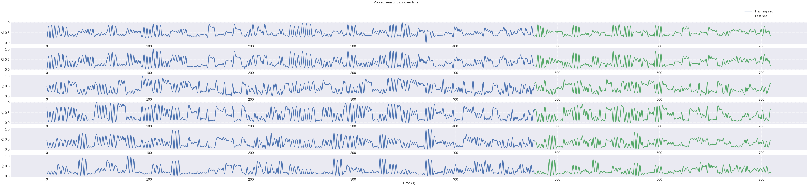
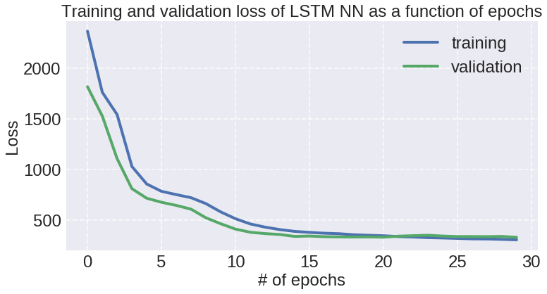

## Contents
{:.no_toc}
*  
{: toc}


# **Modeling Approach**

A table summarizing the results shown on this page is in the **Results and Conclusions Page** This page is a longer summary of the different methods that were tried, and a subset of all tuning parameters that were swept through to be concise on the webpage.  

The various models learned in class were implemented to attempt prediction of the wearer's arm movements based upon the output of the six sensors embedded in the shirt. The data used in these models were from a single subject, pooled across all three trials collected in the protocol. The subject data was taken from subject #4, because that particular data set had the fewest outliers as discussed in the **Data Description and Initial EDA** section. Additionally, due to the high frequency of the collecte data, the data was downsampled to reduce the training time of the models. 


**Train Test Split**
The data was split as a function of time - with the first 80% of the data used as the training set, and the last 20% reserved for testing. Initially, we had done a train_test_split randomly, however this yields artificially inflated test scores of the models because in the actual application of the shirt, it is impossible to predict\results based on future data.


## **1) Data Preparation and Cleaning**

**Normalize/Standardize Functions + Feature Engineering**
The data was standardized and normalized - additionally, new predictors were calculated, such as the first and second derivative of the sensing shirt outputs over sequencial time points, prior to the time stamps being dropped from the predictor list. 


```python
def standardize(X, X_ref):
    mean = np.mean(X_ref)
    std = np.std(X_ref)
    return (X-mean)/std
```


```python
def normalize(X, X_ref):
    return (X-np.min(X_ref))/(np.max(X_ref)-np.min(X_ref))
```


```python
def deriv_1st(df, features):
    prev = df.iloc[0:-2]
    nxt = df.iloc[2:]
    new_features = [f+'_1st' for f in features]
    results = pd.DataFrame(nxt[features].values - prev[features].values, columns=new_features)
    time_diff = pd.DataFrame(nxt['t'].values-prev['t'].values)
    for feature in new_features:
        results[feature] = results[[feature]].div(time_diff.values)
    return results
```


```python
def deriv_2nd(df, features):
    prev = df.iloc[0:-2]
    now = df.iloc[1:-1]
    nxt = df.iloc[2:]
    new_features = [f+'_2nd' for f in features]
    results = pd.DataFrame(nxt[features].values-2*now[features].values+prev[features].values, columns=new_features)
    time_diff = pd.DataFrame((nxt['t'].values-now['t'].values)*(now['t'].values-prev['t'].values))
    for feature in new_features:
        results[feature] = results[[feature]].div(time_diff.values)
    return results
```


```python
def prev_values(df, features, num):
    for i in range(1, num+1):
        new_features = [f+'_prev_'+str(i) for f in features]
        prev_df = df[features].shift(i)
        prev_df.columns = new_features
        df = pd.concat([df, prev_df], axis=1)
    return df.dropna()
```


```python
def add_features(df, features, angs, if_1st_deriv=False, if_2nd_deriv=False, num_prev=0):
    if if_1st_deriv: 
        df_1st_deriv = deriv_1st(df, features)
    else:
        df_1st_deriv = pd.DataFrame()
    if if_2nd_deriv:
        df_2nd_deriv = deriv_2nd(df, features)
    else:
        df_2nd_deriv = pd.DataFrame()
    results = pd.concat([pd.DataFrame(df[1:-1].values, columns=df.columns), df_1st_deriv, df_2nd_deriv], axis=1)
    results = prev_values(results, features, num_prev).drop('t', axis=1)
    return results.drop(columns=angs), results[angs]
```


```python
def load_data(names, nums, tests, features, angs, if_1st_deriv=False, if_2nd_deriv=False, num_prev=0):
    X_list = []
    y_list = []

    for number in nums:
        for test in tests:
            for name in names:
                file_dir = 'data/' + name + '_t' + str(number) + test + '.txt'
                data = pd.read_csv(file_dir, header=None,
                                   names=['t','s1','s2','s3','s4','s5','s6','hf','ab','ir'])
                data = data.iloc[::20]
                X_df, y_df = add_features(data, features, angs, if_1st_deriv=if_1st_deriv, if_2nd_deriv=if_2nd_deriv, num_prev=num_prev)
                X_list.append(X_df)
                y_list.append(y_df)
                
    X_return = pd.concat(X_list)
    y_return = pd.concat(y_list)
    return X_return, y_return
```


```python
def calc_plot_arrays(y, yhat):
    x_list = []
    num_list = []
    mean_list = []
    std_list = []
    mae_list = []
    rmse_list = []
    
    for val in np.arange(math.floor(min(y)), math.ceil(max(y))):
        idx = (y>val)&(y<val+1)
        y_pred = np.array(yhat)[np.where(idx)]
        y_true = np.array(y)[np.where(idx)]
        if len(y_true) > 0:
            x_list.append(np.mean(y_true))
            num_list.append(len(y_true))
            mean_list.append(np.mean(y_pred))
            std_list.append(np.std(y_pred))
            mae_list.append(mean_absolute_error(y_true=y_true, y_pred=y_pred))
            rmse_list.append(np.sqrt(mean_squared_error(y_true=y_true, y_pred=y_pred)))
        
    plot_dict = {'x_arr': x_list, 'num_arr':num_list, 'mean_arr':mean_list,
                 'std_arr': std_list, 'mae_arr':mae_list, 'rmse_arr':rmse_list}
    
    return plot_dict

```


```python
def display_result(model, X_train, y_train, X_test, y_test, plot=False):
    yhat_train = model.predict(X_train)
    yhat_test = model.predict(X_test)

    r2_train = r2_score(y_train, yhat_train)
    r2_test = r2_score(y_test, yhat_test)
    
    rmse_train = np.sqrt(mean_squared_error(y_true=y_train, y_pred=yhat_train))
    rmse_test = np.sqrt(mean_squared_error(y_true=y_test, y_pred=yhat_test))
    
    mae_train = mean_absolute_error(y_true=y_train, y_pred=yhat_train)
    mae_test = mean_absolute_error(y_true=y_test, y_pred=yhat_test)
    
    plot_dict_train = calc_plot_arrays(y_train, yhat_train)
    plot_dict_test = calc_plot_arrays(y_test, yhat_test)
    
    mean_std_train = np.mean(plot_dict_train['std_arr'])
    mean_std_test = np.mean(plot_dict_test['std_arr'])
    
    dict_train = {'r2':r2_train, 'mean_std':mean_std_train, 'rmse':rmse_train, 'mae':mae_train}
    dict_test = {'r2':r2_test, 'mean_std':mean_std_test, 'rmse':rmse_test, 'mae':mae_test}
    
    if plot:
        fig, axs = plt.subplots(2,2, figsize=(30,20))
        for case in range(0,2):
            if case == 0: 
                plot_dict = plot_dict_train
                plt_y = y_train
                title = 'Train'
            else: 
                plot_dict = plot_dict_test
                plt_y = y_test
                title = 'Test'

            plt_x = plot_dict['x_arr']
            plt_mean = np.array(plot_dict['mean_arr'])
            plt_std = np.array(plot_dict['std_arr'])

            axs[0,case].plot(plt_x, plt_mean)
            axs[0,case].fill_between(plt_x, plt_mean-plt_std, plt_mean+plt_std, alpha=0.3)
            axs[0,case].plot([min(plt_y), max(plt_y)], [min(plt_y), max(plt_y)], '--')
            axs[0,case].set_xlabel('True Angles')
            axs[0,case].set_ylabel('Predicted Angles')
            axs[0,case].set_title(title)

            axs[1,case].plot(plt_x, plot_dict['rmse_arr'], label='RMSE')
            axs[1,case].plot(plt_x, plot_dict['mae_arr'], label='MAE')
            axs[1,case].set_xlabel('True Angles')
            axs[1,case].set_ylabel('Error')
            axs[1,case].set_title(title)
            axs[1,case].legend()
        plt.show()
    result_df = pd.DataFrame([dict_train, dict_test], index=['Train','Test'])[['r2','mean_std','mae','rmse']]
    return result_df, dict_train, dict_test, plot_dict_train, plot_dict_test
    
```


```python
def display_all_results(model, X_df, df, if_display=True, if_plot=False, 
                        if_stand=False, if_norm=False,
                        if_PCA=False, poly_deg=1):
    frames = []
    sens = ['s'+str(k) for k in range(1,n_sens+1)]
    angs = ['ab', 'hf', 'ir']
    models = []
    poly = PolynomialFeatures(degree=poly_deg)
    
    X_train, X_test, y_train, y_test = train_test_split(X_df, df[angs], test_size=0.2, shuffle=False) #, random_state=42)
        
    if if_stand: 
        X_test = standardize(X_test, X_train)
        X_train = standardize(X_train, X_train)

    if if_norm:
        X_test = normalize(X_test, X_train)
        X_train = normalize(X_train, X_train)
                
    if poly_deg > 1:
        X_train_add = pd.DataFrame(poly.fit_transform(X_train[sens]))
        X_test_add = pd.DataFrame(poly.fit_transform(X_test[sens]))
        
        X_train = pd.concat([pd.DataFrame(X_train.values, columns=X_train.columns), 
                             X_train_add], axis=1).drop(sens, axis=1)
        X_test = pd.concat([pd.DataFrame(X_test.values, columns=X_test.columns), 
                            X_test_add], axis=1).drop(sens, axis=1)
    
    if if_PCA:
        # Note: should normalize before applying PCA
        n = X_train.shape[1]
        pca = PCA(n).fit(X_train)
        i = 1
        while np.sum(pca.explained_variance_ratio_[:i]) < 0.95:
            i += 1
        print([n, i])
        pca = PCA(i).fit(X_train)
        X_train = pca.transform(X_train)
        X_test = pca.transform(X_test)
    
    for i,a in enumerate(angs):
        model.fit(X_train, y_train[a])
        if if_plot == True: print(f'\n********** {a}: **********\n')
        results = display_result(model, X_train, y_train[a], X_test, y_test[a], plot=if_plot)
        frames.append(results[0])
        models.append(model)
        
    if if_display == True: display(pd.concat(frames, keys=angs))
        
    return frames, models
    
```


```python
def find_best_param(scores_list, params, param_name):
    for ind, score in enumerate(scores_list):
        best_score = np.max(score)
        best_ind = np.argmax(score)
        best_param = params[best_ind]
        print(angs[ind] + ':')
        print("The best model has " + param_name + " of {}.".format(best_param))                                                                      
        print("The best model has R2 = {}.\n".format(best_score))
```


```python
n_sens = 6
sens = ['s'+str(k) for k in range(1,n_sens+1)]
angs = ['ab', 'hf', 'ir']

X_df, y_df = load_data(['M1'], [1,2,3], ['A','B','C'], angs=angs, features=sens)
X_df_added, y_df_added = load_data(['M1'], [1,2,3], ['A','B','C'],
                                   angs=angs, features=sens, 
                                   if_1st_deriv=True, if_2nd_deriv=True, num_prev=2)
```


### **Models**

In all the models tested below, the model was run once on the original data (without the derivative terms) and once on the data set with the engineered features included in order to compare the performance of the two models. Different score metrics were calculated, such as $R^2$, mean standard error (mse), mean absolute error (mae), and root mean square error (rmse). The tables show all the scores, but $R^2$ was used as the metric to tune the models.


### **1) Linear Regression**


```python
linreg = LinearRegression()
display_all_results(linreg, X_df, y_df);
```


<div>
<style scoped>
    .dataframe tbody tr th:only-of-type {
        vertical-align: middle;
    }

    .dataframe tbody tr th {
        vertical-align: top;
    }

    .dataframe thead th {
        text-align: right;
    }
</style>
<table border="1" class="dataframe">
  <thead>
    <tr style="text-align: right;">
      <th></th>
      <th></th>
      <th>r2</th>
      <th>mean_std</th>
      <th>mae</th>
      <th>rmse</th>
    </tr>
  </thead>
  <tbody>
    <tr>
      <th rowspan="2" valign="top">ab</th>
      <th>Train</th>
      <td>0.901010</td>
      <td>11.897278</td>
      <td>9.753486</td>
      <td>12.761176</td>
    </tr>
    <tr>
      <th>Test</th>
      <td>0.775065</td>
      <td>12.240685</td>
      <td>14.914385</td>
      <td>19.012592</td>
    </tr>
    <tr>
      <th rowspan="2" valign="top">hf</th>
      <th>Train</th>
      <td>0.752430</td>
      <td>14.254330</td>
      <td>16.145868</td>
      <td>19.993084</td>
    </tr>
    <tr>
      <th>Test</th>
      <td>0.602819</td>
      <td>14.183518</td>
      <td>19.324524</td>
      <td>23.550622</td>
    </tr>
    <tr>
      <th rowspan="2" valign="top">ir</th>
      <th>Train</th>
      <td>0.591279</td>
      <td>15.805040</td>
      <td>21.354235</td>
      <td>26.978226</td>
    </tr>
    <tr>
      <th>Test</th>
      <td>0.544879</td>
      <td>11.211689</td>
      <td>17.111802</td>
      <td>21.717219</td>
    </tr>
  </tbody>
</table>
</div>


```python
linreg = LinearRegression()
display_all_results(linreg, X_df_added, y_df_added);
```


<div>
<style scoped>
    .dataframe tbody tr th:only-of-type {
        vertical-align: middle;
    }

    .dataframe tbody tr th {
        vertical-align: top;
    }

    .dataframe thead th {
        text-align: right;
    }
</style>
<table border="1" class="dataframe">
  <thead>
    <tr style="text-align: right;">
      <th></th>
      <th></th>
      <th>r2</th>
      <th>mean_std</th>
      <th>mae</th>
      <th>rmse</th>
    </tr>
  </thead>
  <tbody>
    <tr>
      <th rowspan="2" valign="top">ab</th>
      <th>Train</th>
      <td>0.911068</td>
      <td>11.183976</td>
      <td>9.135420</td>
      <td>12.087205</td>
    </tr>
    <tr>
      <th>Test</th>
      <td>0.779129</td>
      <td>11.777138</td>
      <td>14.690716</td>
      <td>18.811488</td>
    </tr>
    <tr>
      <th rowspan="2" valign="top">hf</th>
      <th>Train</th>
      <td>0.809676</td>
      <td>13.772353</td>
      <td>13.929124</td>
      <td>17.546370</td>
    </tr>
    <tr>
      <th>Test</th>
      <td>0.616968</td>
      <td>14.639168</td>
      <td>18.787604</td>
      <td>23.138092</td>
    </tr>
    <tr>
      <th rowspan="2" valign="top">ir</th>
      <th>Train</th>
      <td>0.649530</td>
      <td>15.648047</td>
      <td>20.272851</td>
      <td>24.967519</td>
    </tr>
    <tr>
      <th>Test</th>
      <td>0.586149</td>
      <td>11.540126</td>
      <td>16.253234</td>
      <td>20.613524</td>
    </tr>
  </tbody>
</table>
</div>


###**2) Polynomial Regression**


```python
degrees = range(2,7)
ab_scores, hf_scores, ir_scores = [], [], []
linreg = LinearRegression()

for deg in degrees:
    print('\nDegree = ', deg)
    result,_ = display_all_results(linreg, X_df, y_df, poly_deg=deg);
    ab_scores.append(result[0].r2[1])
    hf_scores.append(result[1].r2[1])
    ir_scores.append(result[2].r2[1])

scores_list = [ab_scores, hf_scores, ir_scores]
find_best_param(scores_list, degrees, 'degree')
```


k =  3

<div>
<style scoped>
    .dataframe tbody tr th:only-of-type {
        vertical-align: middle;
    }

    .dataframe tbody tr th {
        vertical-align: top;
    }

    .dataframe thead th {
        text-align: right;
    }
</style>
<table border="1" class="dataframe">
  <thead>
    <tr style="text-align: right;">
      <th></th>
      <th></th>
      <th>r2</th>
      <th>mean_std</th>
      <th>mae</th>
      <th>rmse</th>
    </tr>
  </thead>
  <tbody>
    <tr>
      <th rowspan="2" valign="top">ab</th>
      <th>Train</th>
      <td>0.931358</td>
      <td>10.249850</td>
      <td>7.704174</td>
      <td>10.626444</td>
    </tr>
    <tr>
      <th>Test</th>
      <td>0.793320</td>
      <td>12.746565</td>
      <td>13.934313</td>
      <td>18.224743</td>
    </tr>
    <tr>
      <th rowspan="2" valign="top">hf</th>
      <th>Train</th>
      <td>0.849286</td>
      <td>12.602613</td>
      <td>12.039398</td>
      <td>15.599368</td>
    </tr>
    <tr>
      <th>Test</th>
      <td>0.659580</td>
      <td>14.679145</td>
      <td>16.960386</td>
      <td>21.802962</td>
    </tr>
    <tr>
      <th rowspan="2" valign="top">ir</th>
      <th>Train</th>
      <td>0.773563</td>
      <td>15.527517</td>
      <td>15.385382</td>
      <td>20.080466</td>
    </tr>
    <tr>
      <th>Test</th>
      <td>0.700227</td>
      <td>11.792307</td>
      <td>13.584235</td>
      <td>17.625317</td>
    </tr>
  </tbody>
</table>
</div>


    
    Degree =  4


<div>
<style scoped>
    .dataframe tbody tr th:only-of-type {
        vertical-align: middle;
    }

    .dataframe tbody tr th {
        vertical-align: top;
    }

    .dataframe thead th {
        text-align: right;
    }
</style>
<table border="1" class="dataframe">
  <thead>
    <tr style="text-align: right;">
      <th></th>
      <th></th>
      <th>r2</th>
      <th>mean_std</th>
      <th>mae</th>
      <th>rmse</th>
    </tr>
  </thead>
  <tbody>
    <tr>
      <th rowspan="2" valign="top">ab</th>
      <th>Train</th>
      <td>0.901395</td>
      <td>12.545540</td>
      <td>9.538343</td>
      <td>12.736276</td>
    </tr>
    <tr>
      <th>Test</th>
      <td>0.760058</td>
      <td>14.711685</td>
      <td>15.136127</td>
      <td>19.636559</td>
    </tr>
    <tr>
      <th rowspan="2" valign="top">hf</th>
      <th>Train</th>
      <td>0.876125</td>
      <td>11.546491</td>
      <td>10.740009</td>
      <td>14.142372</td>
    </tr>
    <tr>
      <th>Test</th>
      <td>0.660900</td>
      <td>14.962774</td>
      <td>16.820597</td>
      <td>21.760667</td>
    </tr>
    <tr>
      <th rowspan="2" valign="top">ir</th>
      <th>Train</th>
      <td>0.649216</td>
      <td>19.957658</td>
      <td>19.101548</td>
      <td>24.993085</td>
    </tr>
    <tr>
      <th>Test</th>
      <td>0.511005</td>
      <td>15.725595</td>
      <td>17.106490</td>
      <td>22.510906</td>
    </tr>
  </tbody>
</table>
</div>


    ab:
    The best model has degree of 3.
    The best model has R2 = 0.7933202273384089.
    
    hf:
    The best model has degree of 4.
    The best model has R2 = 0.6608995319619955.
    
    ir:
    The best model has degree of 3.
    The best model has R2 = 0.7002273576394702.
    


```python
degrees = range(2,7)
ab_scores, hf_scores, ir_scores = [], [], []
linreg = LinearRegression()

for deg in degrees:
    print('\nDegree = ', deg)
    result,_ = display_all_results(linreg, X_df_added, y_df_added, poly_deg=deg);
    ab_scores.append(result[0].r2[1])
    hf_scores.append(result[1].r2[1])
    ir_scores.append(result[2].r2[1])

scores_list = [ab_scores, hf_scores, ir_scores]
find_best_param(scores_list, degrees, 'degree')
```


    
    Degree =  3


<div>
<style scoped>
    .dataframe tbody tr th:only-of-type {
        vertical-align: middle;
    }

    .dataframe tbody tr th {
        vertical-align: top;
    }

    .dataframe thead th {
        text-align: right;
    }
</style>
<table border="1" class="dataframe">
  <thead>
    <tr style="text-align: right;">
      <th></th>
      <th></th>
      <th>r2</th>
      <th>mean_std</th>
      <th>mae</th>
      <th>rmse</th>
    </tr>
  </thead>
  <tbody>
    <tr>
      <th rowspan="2" valign="top">ab</th>
      <th>Train</th>
      <td>0.938691</td>
      <td>9.631045</td>
      <td>7.223615</td>
      <td>10.035931</td>
    </tr>
    <tr>
      <th>Test</th>
      <td>0.805583</td>
      <td>12.408493</td>
      <td>13.439350</td>
      <td>17.649004</td>
    </tr>
    <tr>
      <th rowspan="2" valign="top">hf</th>
      <th>Train</th>
      <td>0.883283</td>
      <td>11.418579</td>
      <td>10.591613</td>
      <td>13.740668</td>
    </tr>
    <tr>
      <th>Test</th>
      <td>0.694339</td>
      <td>14.135169</td>
      <td>16.298434</td>
      <td>20.669499</td>
    </tr>
    <tr>
      <th rowspan="2" valign="top">ir</th>
      <th>Train</th>
      <td>0.792263</td>
      <td>15.181595</td>
      <td>14.827330</td>
      <td>19.222370</td>
    </tr>
    <tr>
      <th>Test</th>
      <td>0.711362</td>
      <td>11.543475</td>
      <td>13.234511</td>
      <td>17.215008</td>
    </tr>
  </tbody>
</table>
</div>


    ab:
    The best model has degree of 3.
    The best model has R2 = 0.8055832511619616.
    
    hf:
    The best model has degree of 3.
    The best model has R2 = 0.6943393775038769.
    
    ir:
    The best model has degree of 3.
    The best model has R2 = 0.7113616735074386.
    


### **3) kNN**


```python
k_values = [1, 10, 75, 250, 500, 750, 1000]
ab_scores, hf_scores, ir_scores = [], [], []

for val in k_values:
    print('\nk =', val)
    kNN = KNeighborsRegressor(n_neighbors=val)
    result,_ = display_all_results(kNN, X_df, y_df)
    ab_scores.append(result[0].r2[1])
    hf_scores.append(result[1].r2[1])
    ir_scores.append(result[2].r2[1])

scores_list = [ab_scores, hf_scores, ir_scores]
find_best_param(scores_list, k_values, 'k')
```


    
    k = 1


<div>
<style scoped>
    .dataframe tbody tr th:only-of-type {
        vertical-align: middle;
    }

    .dataframe tbody tr th {
        vertical-align: top;
    }

    .dataframe thead th {
        text-align: right;
    }
</style>
<table border="1" class="dataframe">
  <thead>
    <tr style="text-align: right;">
      <th></th>
      <th></th>
      <th>r2</th>
      <th>mean_std</th>
      <th>mae</th>
      <th>rmse</th>
    </tr>
  </thead>
  <tbody>
    <tr>
      <th rowspan="2" valign="top">ab</th>
      <th>Train</th>
      <td>1.000000</td>
      <td>0.270669</td>
      <td>0.000000</td>
      <td>0.000000</td>
    </tr>
    <tr>
      <th>Test</th>
      <td>0.678463</td>
      <td>17.175134</td>
      <td>16.561574</td>
      <td>22.731489</td>
    </tr>
    <tr>
      <th rowspan="2" valign="top">hf</th>
      <th>Train</th>
      <td>1.000000</td>
      <td>0.270279</td>
      <td>0.000000</td>
      <td>0.000000</td>
    </tr>
    <tr>
      <th>Test</th>
      <td>0.469556</td>
      <td>19.566608</td>
      <td>20.546974</td>
      <td>27.216222</td>
    </tr>
    <tr>
      <th rowspan="2" valign="top">ir</th>
      <th>Train</th>
      <td>1.000000</td>
      <td>0.259164</td>
      <td>0.000000</td>
      <td>0.000000</td>
    </tr>
    <tr>
      <th>Test</th>
      <td>0.467840</td>
      <td>17.389108</td>
      <td>16.620756</td>
      <td>23.483450</td>
    </tr>
  </tbody>
</table>
</div>


    
    k = 10


<div>
<style scoped>
    .dataframe tbody tr th:only-of-type {
        vertical-align: middle;
    }

    .dataframe tbody tr th {
        vertical-align: top;
    }

    .dataframe thead th {
        text-align: right;
    }
</style>
<table border="1" class="dataframe">
  <thead>
    <tr style="text-align: right;">
      <th></th>
      <th></th>
      <th>r2</th>
      <th>mean_std</th>
      <th>mae</th>
      <th>rmse</th>
    </tr>
  </thead>
  <tbody>
    <tr>
      <th rowspan="2" valign="top">ab</th>
      <th>Train</th>
      <td>0.945282</td>
      <td>9.230150</td>
      <td>6.561840</td>
      <td>9.487675</td>
    </tr>
    <tr>
      <th>Test</th>
      <td>0.778792</td>
      <td>13.967837</td>
      <td>14.266087</td>
      <td>18.854402</td>
    </tr>
    <tr>
      <th rowspan="2" valign="top">hf</th>
      <th>Train</th>
      <td>0.899476</td>
      <td>10.673805</td>
      <td>9.362343</td>
      <td>12.739906</td>
    </tr>
    <tr>
      <th>Test</th>
      <td>0.623361</td>
      <td>15.636259</td>
      <td>17.447701</td>
      <td>22.933512</td>
    </tr>
    <tr>
      <th rowspan="2" valign="top">ir</th>
      <th>Train</th>
      <td>0.867125</td>
      <td>11.748420</td>
      <td>10.733435</td>
      <td>15.382324</td>
    </tr>
    <tr>
      <th>Test</th>
      <td>0.674155</td>
      <td>13.459029</td>
      <td>13.214304</td>
      <td>18.375810</td>
    </tr>
  </tbody>
</table>
</div>


    
    k = 75


<div>
<style scoped>
    .dataframe tbody tr th:only-of-type {
        vertical-align: middle;
    }

    .dataframe tbody tr th {
        vertical-align: top;
    }

    .dataframe thead th {
        text-align: right;
    }
</style>
<table border="1" class="dataframe">
  <thead>
    <tr style="text-align: right;">
      <th></th>
      <th></th>
      <th>r2</th>
      <th>mean_std</th>
      <th>mae</th>
      <th>rmse</th>
    </tr>
  </thead>
  <tbody>
    <tr>
      <th rowspan="2" valign="top">ab</th>
      <th>Train</th>
      <td>0.925163</td>
      <td>10.524983</td>
      <td>7.879761</td>
      <td>11.095609</td>
    </tr>
    <tr>
      <th>Test</th>
      <td>0.787250</td>
      <td>13.304731</td>
      <td>14.032500</td>
      <td>18.490421</td>
    </tr>
    <tr>
      <th rowspan="2" valign="top">hf</th>
      <th>Train</th>
      <td>0.837995</td>
      <td>12.366574</td>
      <td>12.463764</td>
      <td>16.173168</td>
    </tr>
    <tr>
      <th>Test</th>
      <td>0.660431</td>
      <td>14.455948</td>
      <td>16.737630</td>
      <td>21.775709</td>
    </tr>
    <tr>
      <th rowspan="2" valign="top">ir</th>
      <th>Train</th>
      <td>0.768558</td>
      <td>13.167441</td>
      <td>15.256832</td>
      <td>20.301188</td>
    </tr>
    <tr>
      <th>Test</th>
      <td>0.667178</td>
      <td>11.600176</td>
      <td>14.185887</td>
      <td>18.571498</td>
    </tr>
  </tbody>
</table>
</div>


    ab:
    The best model has k of 75.
    The best model has R2 = 0.7872503962714331.
    
    hf:
    The best model has k of 75.
    The best model has R2 = 0.6604305914334088.
    
    ir:
    The best model has k of 10.
    The best model has R2 = 0.6741549638511204.
    


```python
k_values = [1, 10, 75, 250, 500, 750, 1000]
ab_scores, hf_scores, ir_scores = [], [], []

for val in k_values:
    print('\nk =', val)
    kNN = KNeighborsRegressor(n_neighbors=val)
    result,_ = display_all_results(kNN, X_df_added, y_df_added)
    ab_scores.append(result[0].r2[1])
    hf_scores.append(result[1].r2[1])
    ir_scores.append(result[2].r2[1])

scores_list = [ab_scores, hf_scores, ir_scores]
find_best_param(scores_list, k_values, 'k')
```


    
    k = 1


<div>
<style scoped>
    .dataframe tbody tr th:only-of-type {
        vertical-align: middle;
    }

    .dataframe tbody tr th {
        vertical-align: top;
    }

    .dataframe thead th {
        text-align: right;
    }
</style>
<table border="1" class="dataframe">
  <thead>
    <tr style="text-align: right;">
      <th></th>
      <th></th>
      <th>r2</th>
      <th>mean_std</th>
      <th>mae</th>
      <th>rmse</th>
    </tr>
  </thead>
  <tbody>
    <tr>
      <th rowspan="2" valign="top">ab</th>
      <th>Train</th>
      <td>1.000000</td>
      <td>0.270728</td>
      <td>0.000000</td>
      <td>0.000000</td>
    </tr>
    <tr>
      <th>Test</th>
      <td>0.663801</td>
      <td>17.926115</td>
      <td>16.186274</td>
      <td>23.208725</td>
    </tr>
    <tr>
      <th rowspan="2" valign="top">hf</th>
      <th>Train</th>
      <td>1.000000</td>
      <td>0.270308</td>
      <td>0.000000</td>
      <td>0.000000</td>
    </tr>
    <tr>
      <th>Test</th>
      <td>0.588078</td>
      <td>17.520518</td>
      <td>17.158687</td>
      <td>23.994822</td>
    </tr>
    <tr>
      <th rowspan="2" valign="top">ir</th>
      <th>Train</th>
      <td>1.000000</td>
      <td>0.259107</td>
      <td>0.000000</td>
      <td>0.000000</td>
    </tr>
    <tr>
      <th>Test</th>
      <td>0.380926</td>
      <td>16.583154</td>
      <td>17.703968</td>
      <td>25.211659</td>
    </tr>
  </tbody>
</table>
</div>


    
    k = 10


<div>
<style scoped>
    .dataframe tbody tr th:only-of-type {
        vertical-align: middle;
    }

    .dataframe tbody tr th {
        vertical-align: top;
    }

    .dataframe thead th {
        text-align: right;
    }
</style>
<table border="1" class="dataframe">
  <thead>
    <tr style="text-align: right;">
      <th></th>
      <th></th>
      <th>r2</th>
      <th>mean_std</th>
      <th>mae</th>
      <th>rmse</th>
    </tr>
  </thead>
  <tbody>
    <tr>
      <th rowspan="2" valign="top">ab</th>
      <th>Train</th>
      <td>0.957935</td>
      <td>7.951207</td>
      <td>5.760661</td>
      <td>8.312949</td>
    </tr>
    <tr>
      <th>Test</th>
      <td>0.774396</td>
      <td>14.262204</td>
      <td>13.842188</td>
      <td>19.011956</td>
    </tr>
    <tr>
      <th rowspan="2" valign="top">hf</th>
      <th>Train</th>
      <td>0.933720</td>
      <td>8.603562</td>
      <td>7.473064</td>
      <td>10.354538</td>
    </tr>
    <tr>
      <th>Test</th>
      <td>0.699214</td>
      <td>14.918886</td>
      <td>15.272554</td>
      <td>20.504022</td>
    </tr>
    <tr>
      <th rowspan="2" valign="top">ir</th>
      <th>Train</th>
      <td>0.906927</td>
      <td>9.894820</td>
      <td>9.307621</td>
      <td>12.866523</td>
    </tr>
    <tr>
      <th>Test</th>
      <td>0.585610</td>
      <td>12.343559</td>
      <td>15.461013</td>
      <td>20.626941</td>
    </tr>
  </tbody>
</table>
</div>


    
    k = 75


<div>
<style scoped>
    .dataframe tbody tr th:only-of-type {
        vertical-align: middle;
    }

    .dataframe tbody tr th {
        vertical-align: top;
    }

    .dataframe thead th {
        text-align: right;
    }
</style>
<table border="1" class="dataframe">
  <thead>
    <tr style="text-align: right;">
      <th></th>
      <th></th>
      <th>r2</th>
      <th>mean_std</th>
      <th>mae</th>
      <th>rmse</th>
    </tr>
  </thead>
  <tbody>
    <tr>
      <th rowspan="2" valign="top">ab</th>
      <th>Train</th>
      <td>0.916054</td>
      <td>10.293515</td>
      <td>8.457556</td>
      <td>11.743463</td>
    </tr>
    <tr>
      <th>Test</th>
      <td>0.769018</td>
      <td>13.118957</td>
      <td>14.398338</td>
      <td>19.237216</td>
    </tr>
    <tr>
      <th rowspan="2" valign="top">hf</th>
      <th>Train</th>
      <td>0.849166</td>
      <td>10.789343</td>
      <td>12.171727</td>
      <td>15.620362</td>
    </tr>
    <tr>
      <th>Test</th>
      <td>0.670157</td>
      <td>13.721727</td>
      <td>16.897021</td>
      <td>21.471562</td>
    </tr>
    <tr>
      <th rowspan="2" valign="top">ir</th>
      <th>Train</th>
      <td>0.770100</td>
      <td>12.397696</td>
      <td>15.865135</td>
      <td>20.221792</td>
    </tr>
    <tr>
      <th>Test</th>
      <td>0.516476</td>
      <td>11.208915</td>
      <td>17.499839</td>
      <td>22.281229</td>
    </tr>
  </tbody>
</table>
</div>


    ab:
    The best model has k of 10.
    The best model has R2 = 0.7743959737106147.
    
    hf:
    The best model has k of 10.
    The best model has R2 = 0.699213948625646.
    
    ir:
    The best model has k of 10.
    The best model has R2 = 0.5856100881336894.
    


### **4) Ridge**


```python
lambdas = [.01,.05,.1,.5,1,5,10,50,100]
degrees = np.arange(1,6)
ab_ridge_scores = np.zeros((len(lambdas),len(degrees)))
hf_ridge_scores = np.zeros((len(lambdas),len(degrees)))
ir_ridge_scores = np.zeros((len(lambdas),len(degrees)))

for ind1, alpha in enumerate(lambdas):
    for ind2, degree in enumerate(degrees):
        ridge = Ridge(alpha = alpha)
        result,_ = display_all_results(ridge, X_df, y_df, 
                                     if_display=False, if_stand=True, 
                                     poly_deg=degree)
        
        ab_ridge_scores[ind1][ind2] = result[0].r2[1]
        hf_ridge_scores[ind1][ind2] = result[1].r2[1]
        ir_ridge_scores[ind1][ind2] = result[2].r2[1]

display(pd.DataFrame(ab_ridge_scores, index=lambdas, columns=degrees))
display(pd.DataFrame(hf_ridge_scores, index=lambdas, columns=degrees))
display(pd.DataFrame(ir_ridge_scores, index=lambdas, columns=degrees))

scores_list = [ab_ridge_scores, hf_ridge_scores, ir_ridge_scores]

for ind, score in enumerate(scores_list):
    best_score = np.max(score)
    best_degree_ind = np.argmax(np.max(score, axis=0))
    best_alpha_ind = np.argmax(np.max(score, axis=1))
    best_degree = degrees[best_degree_ind]
    best_alpha = lambdas[best_alpha_ind]
    print(angs[ind] + ':')
    print("The best model has degree {} and Lambda = {}.".format(best_degree, best_alpha))                                                                      
    print("The best model has R2 = {}.\n".format(best_score))
```


<div>
<style scoped>
    .dataframe tbody tr th:only-of-type {
        vertical-align: middle;
    }

    .dataframe tbody tr th {
        vertical-align: top;
    }

    .dataframe thead th {
        text-align: right;
    }
</style>
<table border="1" class="dataframe">
  <thead>
    <tr style="text-align: right;">
      <th></th>
      <th>1</th>
      <th>2</th>
      <th>3</th>
      <th>4</th>
      <th>5</th>
    </tr>
  </thead>
  <tbody>
    <tr>
      <th>0.01</th>
      <td>0.775065</td>
      <td>0.780862</td>
      <td>0.793474</td>
      <td>0.789975</td>
      <td>0.777323</td>
    </tr>
    <tr>
      <th>0.05</th>
      <td>0.775065</td>
      <td>0.780864</td>
      <td>0.793717</td>
      <td>0.791744</td>
      <td>0.785153</td>
    </tr>
    <tr>
      <th>0.10</th>
      <td>0.775065</td>
      <td>0.780866</td>
      <td>0.793864</td>
      <td>0.792507</td>
      <td>0.788408</td>
    </tr>
    <tr>
      <th>0.50</th>
      <td>0.775066</td>
      <td>0.780881</td>
      <td>0.794191</td>
      <td>0.794032</td>
      <td>0.793153</td>
    </tr>
    <tr>
      <th>1.00</th>
      <td>0.775067</td>
      <td>0.780893</td>
      <td>0.794220</td>
      <td>0.794425</td>
      <td>0.793836</td>
    </tr>
    <tr>
      <th>5.00</th>
      <td>0.775072</td>
      <td>0.780878</td>
      <td>0.793962</td>
      <td>0.794663</td>
      <td>0.793617</td>
    </tr>
    <tr>
      <th>10.00</th>
      <td>0.775066</td>
      <td>0.780807</td>
      <td>0.793710</td>
      <td>0.794498</td>
      <td>0.793149</td>
    </tr>
    <tr>
      <th>50.00</th>
      <td>0.774761</td>
      <td>0.780222</td>
      <td>0.791792</td>
      <td>0.792765</td>
      <td>0.790269</td>
    </tr>
    <tr>
      <th>100.00</th>
      <td>0.774124</td>
      <td>0.779555</td>
      <td>0.789606</td>
      <td>0.790423</td>
      <td>0.787027</td>
    </tr>
  </tbody>
</table>
</div>


<div>
<style scoped>
    .dataframe tbody tr th:only-of-type {
        vertical-align: middle;
    }

    .dataframe tbody tr th {
        vertical-align: top;
    }

    .dataframe thead th {
        text-align: right;
    }
</style>
<table border="1" class="dataframe">
  <thead>
    <tr style="text-align: right;">
      <th></th>
      <th>1</th>
      <th>2</th>
      <th>3</th>
      <th>4</th>
      <th>5</th>
    </tr>
  </thead>
  <tbody>
    <tr>
      <th>0.01</th>
      <td>0.602819</td>
      <td>0.636403</td>
      <td>0.659930</td>
      <td>0.658693</td>
      <td>0.629463</td>
    </tr>
    <tr>
      <th>0.05</th>
      <td>0.602820</td>
      <td>0.636436</td>
      <td>0.660845</td>
      <td>0.657979</td>
      <td>0.641083</td>
    </tr>
    <tr>
      <th>0.10</th>
      <td>0.602821</td>
      <td>0.636476</td>
      <td>0.661426</td>
      <td>0.657252</td>
      <td>0.645908</td>
    </tr>
    <tr>
      <th>0.50</th>
      <td>0.602831</td>
      <td>0.636750</td>
      <td>0.662130</td>
      <td>0.654824</td>
      <td>0.653390</td>
    </tr>
    <tr>
      <th>1.00</th>
      <td>0.602843</td>
      <td>0.637013</td>
      <td>0.661884</td>
      <td>0.653645</td>
      <td>0.655513</td>
    </tr>
    <tr>
      <th>5.00</th>
      <td>0.602937</td>
      <td>0.637910</td>
      <td>0.661634</td>
      <td>0.653029</td>
      <td>0.657756</td>
    </tr>
    <tr>
      <th>10.00</th>
      <td>0.603049</td>
      <td>0.638177</td>
      <td>0.662741</td>
      <td>0.654850</td>
      <td>0.656851</td>
    </tr>
    <tr>
      <th>50.00</th>
      <td>0.603773</td>
      <td>0.638196</td>
      <td>0.667069</td>
      <td>0.661815</td>
      <td>0.651768</td>
    </tr>
    <tr>
      <th>100.00</th>
      <td>0.604359</td>
      <td>0.638013</td>
      <td>0.666535</td>
      <td>0.663434</td>
      <td>0.649848</td>
    </tr>
  </tbody>
</table>
</div>


<div>
<style scoped>
    .dataframe tbody tr th:only-of-type {
        vertical-align: middle;
    }

    .dataframe tbody tr th {
        vertical-align: top;
    }

    .dataframe thead th {
        text-align: right;
    }
</style>
<table border="1" class="dataframe">
  <thead>
    <tr style="text-align: right;">
      <th></th>
      <th>1</th>
      <th>2</th>
      <th>3</th>
      <th>4</th>
      <th>5</th>
    </tr>
  </thead>
  <tbody>
    <tr>
      <th>0.01</th>
      <td>0.544877</td>
      <td>0.638312</td>
      <td>0.701091</td>
      <td>0.698530</td>
      <td>0.576513</td>
    </tr>
    <tr>
      <th>0.05</th>
      <td>0.544869</td>
      <td>0.638329</td>
      <td>0.702185</td>
      <td>0.699159</td>
      <td>0.604853</td>
    </tr>
    <tr>
      <th>0.10</th>
      <td>0.544858</td>
      <td>0.638352</td>
      <td>0.702645</td>
      <td>0.698655</td>
      <td>0.617450</td>
    </tr>
    <tr>
      <th>0.50</th>
      <td>0.544772</td>
      <td>0.638583</td>
      <td>0.703379</td>
      <td>0.695230</td>
      <td>0.632445</td>
    </tr>
    <tr>
      <th>1.00</th>
      <td>0.544665</td>
      <td>0.638914</td>
      <td>0.702876</td>
      <td>0.694361</td>
      <td>0.641207</td>
    </tr>
    <tr>
      <th>5.00</th>
      <td>0.543804</td>
      <td>0.640211</td>
      <td>0.696778</td>
      <td>0.698839</td>
      <td>0.671412</td>
    </tr>
    <tr>
      <th>10.00</th>
      <td>0.542727</td>
      <td>0.639922</td>
      <td>0.692507</td>
      <td>0.701674</td>
      <td>0.682187</td>
    </tr>
    <tr>
      <th>50.00</th>
      <td>0.534310</td>
      <td>0.634709</td>
      <td>0.680213</td>
      <td>0.698343</td>
      <td>0.691880</td>
    </tr>
    <tr>
      <th>100.00</th>
      <td>0.524884</td>
      <td>0.630658</td>
      <td>0.671443</td>
      <td>0.690409</td>
      <td>0.688081</td>
    </tr>
  </tbody>
</table>
</div>


    ab:
    The best model has degree 4 and Lambda = 5.
    The best model has R2 = 0.7946630553302625.
    
    hf:
    The best model has degree 3 and Lambda = 50.
    The best model has R2 = 0.6670693257898499.
    
    ir:
    The best model has degree 3 and Lambda = 0.5.
    The best model has R2 = 0.7033793863924822.
    


```python
lambdas = [.01,.05,.1,.5,1,5,10,50,100]
degrees = np.arange(1,6)
ab_ridge_scores = np.zeros((len(lambdas),len(degrees)))
hf_ridge_scores = np.zeros((len(lambdas),len(degrees)))
ir_ridge_scores = np.zeros((len(lambdas),len(degrees)))

for ind1, alpha in enumerate(lambdas):
    for ind2, degree in enumerate(degrees):
        ridge = Ridge(alpha = alpha)
        result,_ = display_all_results(ridge, X_df_added, y_df_added,
                                     if_display=False, if_stand=True, 
                                     poly_deg=degree)
        
        ab_ridge_scores[ind1][ind2] = result[0].r2[1]
        hf_ridge_scores[ind1][ind2] = result[1].r2[1]
        ir_ridge_scores[ind1][ind2] = result[2].r2[1]

display(pd.DataFrame(ab_ridge_scores, index=lambdas, columns=degrees))
display(pd.DataFrame(hf_ridge_scores, index=lambdas, columns=degrees))
display(pd.DataFrame(ir_ridge_scores, index=lambdas, columns=degrees))

scores_list = [ab_ridge_scores, hf_ridge_scores, ir_ridge_scores]

for ind, score in enumerate(scores_list):
    best_score = np.max(score)
    best_degree_ind = np.argmax(np.max(score, axis=0))
    best_alpha_ind = np.argmax(np.max(score, axis=1))
    best_degree = degrees[best_degree_ind]
    best_alpha = lambdas[best_alpha_ind]
    print(angs[ind] + ':')
    print("The best model has degree {} and Lambda = {}.".format(best_degree, best_alpha))                                                                      
    print("The best model has R2 = {}.\n".format(best_score))
```


<div>
<style scoped>
    .dataframe tbody tr th:only-of-type {
        vertical-align: middle;
    }

    .dataframe tbody tr th {
        vertical-align: top;
    }

    .dataframe thead th {
        text-align: right;
    }
</style>
<table border="1" class="dataframe">
  <thead>
    <tr style="text-align: right;">
      <th></th>
      <th>1</th>
      <th>2</th>
      <th>3</th>
      <th>4</th>
      <th>5</th>
    </tr>
  </thead>
  <tbody>
    <tr>
      <th>0.01</th>
      <td>0.779339</td>
      <td>0.790371</td>
      <td>0.805645</td>
      <td>0.801182</td>
      <td>0.789101</td>
    </tr>
    <tr>
      <th>0.05</th>
      <td>0.779503</td>
      <td>0.790552</td>
      <td>0.805656</td>
      <td>0.802608</td>
      <td>0.794573</td>
    </tr>
    <tr>
      <th>0.10</th>
      <td>0.779540</td>
      <td>0.790612</td>
      <td>0.805617</td>
      <td>0.803060</td>
      <td>0.797167</td>
    </tr>
    <tr>
      <th>0.50</th>
      <td>0.779494</td>
      <td>0.790641</td>
      <td>0.805385</td>
      <td>0.803472</td>
      <td>0.801520</td>
    </tr>
    <tr>
      <th>1.00</th>
      <td>0.779436</td>
      <td>0.790594</td>
      <td>0.805162</td>
      <td>0.803444</td>
      <td>0.802353</td>
    </tr>
    <tr>
      <th>5.00</th>
      <td>0.779379</td>
      <td>0.790285</td>
      <td>0.804360</td>
      <td>0.803391</td>
      <td>0.802957</td>
    </tr>
    <tr>
      <th>10.00</th>
      <td>0.779463</td>
      <td>0.790099</td>
      <td>0.803971</td>
      <td>0.803426</td>
      <td>0.802983</td>
    </tr>
    <tr>
      <th>50.00</th>
      <td>0.779878</td>
      <td>0.789866</td>
      <td>0.802594</td>
      <td>0.803025</td>
      <td>0.802132</td>
    </tr>
    <tr>
      <th>100.00</th>
      <td>0.779916</td>
      <td>0.789703</td>
      <td>0.801405</td>
      <td>0.802116</td>
      <td>0.800854</td>
    </tr>
  </tbody>
</table>
</div>


<div>
<style scoped>
    .dataframe tbody tr th:only-of-type {
        vertical-align: middle;
    }

    .dataframe tbody tr th {
        vertical-align: top;
    }

    .dataframe thead th {
        text-align: right;
    }
</style>
<table border="1" class="dataframe">
  <thead>
    <tr style="text-align: right;">
      <th></th>
      <th>1</th>
      <th>2</th>
      <th>3</th>
      <th>4</th>
      <th>5</th>
    </tr>
  </thead>
  <tbody>
    <tr>
      <th>0.01</th>
      <td>0.616444</td>
      <td>0.656601</td>
      <td>0.694519</td>
      <td>0.694894</td>
      <td>0.678224</td>
    </tr>
    <tr>
      <th>0.05</th>
      <td>0.616260</td>
      <td>0.656632</td>
      <td>0.694876</td>
      <td>0.694959</td>
      <td>0.684240</td>
    </tr>
    <tr>
      <th>0.10</th>
      <td>0.616239</td>
      <td>0.656627</td>
      <td>0.695027</td>
      <td>0.694263</td>
      <td>0.688695</td>
    </tr>
    <tr>
      <th>0.50</th>
      <td>0.616535</td>
      <td>0.656638</td>
      <td>0.694898</td>
      <td>0.691479</td>
      <td>0.694641</td>
    </tr>
    <tr>
      <th>1.00</th>
      <td>0.616860</td>
      <td>0.656659</td>
      <td>0.694444</td>
      <td>0.690003</td>
      <td>0.695454</td>
    </tr>
    <tr>
      <th>5.00</th>
      <td>0.618099</td>
      <td>0.656592</td>
      <td>0.692940</td>
      <td>0.686613</td>
      <td>0.694527</td>
    </tr>
    <tr>
      <th>10.00</th>
      <td>0.618961</td>
      <td>0.656474</td>
      <td>0.692459</td>
      <td>0.685969</td>
      <td>0.692457</td>
    </tr>
    <tr>
      <th>50.00</th>
      <td>0.621723</td>
      <td>0.655843</td>
      <td>0.690697</td>
      <td>0.686470</td>
      <td>0.685369</td>
    </tr>
    <tr>
      <th>100.00</th>
      <td>0.622843</td>
      <td>0.655115</td>
      <td>0.687969</td>
      <td>0.686478</td>
      <td>0.682851</td>
    </tr>
  </tbody>
</table>
</div>


<div>
<style scoped>
    .dataframe tbody tr th:only-of-type {
        vertical-align: middle;
    }

    .dataframe tbody tr th {
        vertical-align: top;
    }

    .dataframe thead th {
        text-align: right;
    }
</style>
<table border="1" class="dataframe">
  <thead>
    <tr style="text-align: right;">
      <th></th>
      <th>1</th>
      <th>2</th>
      <th>3</th>
      <th>4</th>
      <th>5</th>
    </tr>
  </thead>
  <tbody>
    <tr>
      <th>0.01</th>
      <td>0.586467</td>
      <td>0.646678</td>
      <td>0.712595</td>
      <td>0.705014</td>
      <td>0.601489</td>
    </tr>
    <tr>
      <th>0.05</th>
      <td>0.586538</td>
      <td>0.646853</td>
      <td>0.713589</td>
      <td>0.704072</td>
      <td>0.627129</td>
    </tr>
    <tr>
      <th>0.10</th>
      <td>0.586474</td>
      <td>0.646805</td>
      <td>0.713577</td>
      <td>0.702655</td>
      <td>0.639527</td>
    </tr>
    <tr>
      <th>0.50</th>
      <td>0.586229</td>
      <td>0.646481</td>
      <td>0.711588</td>
      <td>0.697803</td>
      <td>0.654394</td>
    </tr>
    <tr>
      <th>1.00</th>
      <td>0.586093</td>
      <td>0.646339</td>
      <td>0.709648</td>
      <td>0.696381</td>
      <td>0.661132</td>
    </tr>
    <tr>
      <th>5.00</th>
      <td>0.585876</td>
      <td>0.646625</td>
      <td>0.702125</td>
      <td>0.697882</td>
      <td>0.681777</td>
    </tr>
    <tr>
      <th>10.00</th>
      <td>0.585930</td>
      <td>0.646658</td>
      <td>0.698443</td>
      <td>0.699854</td>
      <td>0.688716</td>
    </tr>
    <tr>
      <th>50.00</th>
      <td>0.583761</td>
      <td>0.643512</td>
      <td>0.690029</td>
      <td>0.699923</td>
      <td>0.695325</td>
    </tr>
    <tr>
      <th>100.00</th>
      <td>0.578028</td>
      <td>0.638849</td>
      <td>0.682706</td>
      <td>0.695331</td>
      <td>0.692741</td>
    </tr>
  </tbody>
</table>
</div>


    ab:
    The best model has degree 3 and Lambda = 0.05.
    The best model has R2 = 0.8056564691399584.
    
    hf:
    The best model has degree 5 and Lambda = 1.
    The best model has R2 = 0.6954541564287371.
    
    ir:
    The best model has degree 3 and Lambda = 0.05.
    The best model has R2 = 0.7135891878438536.
    


### **5) LASSO**


```python
lambdas = [.01,.05,.1,.5,1,5,10]
degrees = np.arange(1,6)
ab_lasso_scores = np.zeros((len(lambdas),len(degrees)))
hf_lasso_scores = np.zeros((len(lambdas),len(degrees)))
ir_lasso_scores = np.zeros((len(lambdas),len(degrees)))

for ind1, alpha in enumerate(lambdas):
    for ind2, degree in enumerate(degrees):
        lasso = Lasso(alpha=alpha)
        result,_ = display_all_results(lasso, X_df, y_df, 
                                     if_display=False, if_stand=True, 
                                     poly_deg=degree)
        
        ab_lasso_scores[ind1][ind2] = result[0].r2[1]
        hf_lasso_scores[ind1][ind2] = result[1].r2[1]
        ir_lasso_scores[ind1][ind2] = result[2].r2[1]

display(pd.DataFrame(ab_lasso_scores, index=lambdas, columns=degrees))
display(pd.DataFrame(hf_lasso_scores, index=lambdas, columns=degrees))
display(pd.DataFrame(ir_lasso_scores, index=lambdas, columns=degrees))

scores_list = [ab_lasso_scores, hf_lasso_scores, ir_lasso_scores]

for ind, score in enumerate(scores_list):
    best_score = np.max(score)
    best_degree_ind = np.argmax(np.max(score, axis=0))
    best_alpha_ind = np.argmax(np.max(score, axis=1))
    best_degree = degrees[best_degree_ind]
    best_alpha = lambdas[best_alpha_ind]
    print(angs[ind] + ':')
    print("The best model has degree {} and Lambda = {}.".format(best_degree, best_alpha))                                                                      
    print("The best model has R2 = {}.\n".format(best_score))
```


<div>
<style scoped>
    .dataframe tbody tr th:only-of-type {
        vertical-align: middle;
    }

    .dataframe tbody tr th {
        vertical-align: top;
    }

    .dataframe thead th {
        text-align: right;
    }
</style>
<table border="1" class="dataframe">
  <thead>
    <tr style="text-align: right;">
      <th></th>
      <th>1</th>
      <th>2</th>
      <th>3</th>
      <th>4</th>
      <th>5</th>
    </tr>
  </thead>
  <tbody>
    <tr>
      <th>0.01</th>
      <td>0.775109</td>
      <td>0.781135</td>
      <td>0.794017</td>
      <td>0.794750</td>
      <td>0.792898</td>
    </tr>
    <tr>
      <th>0.05</th>
      <td>0.774966</td>
      <td>0.780674</td>
      <td>0.791327</td>
      <td>0.792349</td>
      <td>0.791589</td>
    </tr>
    <tr>
      <th>0.10</th>
      <td>0.774661</td>
      <td>0.780156</td>
      <td>0.788851</td>
      <td>0.790071</td>
      <td>0.790393</td>
    </tr>
    <tr>
      <th>0.50</th>
      <td>0.772185</td>
      <td>0.776919</td>
      <td>0.781929</td>
      <td>0.780797</td>
      <td>0.781533</td>
    </tr>
    <tr>
      <th>1.00</th>
      <td>0.767553</td>
      <td>0.770684</td>
      <td>0.772111</td>
      <td>0.769390</td>
      <td>0.770190</td>
    </tr>
    <tr>
      <th>5.00</th>
      <td>0.727008</td>
      <td>0.727008</td>
      <td>0.692852</td>
      <td>0.692066</td>
      <td>0.688991</td>
    </tr>
    <tr>
      <th>10.00</th>
      <td>0.657677</td>
      <td>0.657677</td>
      <td>0.524965</td>
      <td>0.524916</td>
      <td>0.507041</td>
    </tr>
  </tbody>
</table>
</div>


<div>
<style scoped>
    .dataframe tbody tr th:only-of-type {
        vertical-align: middle;
    }

    .dataframe tbody tr th {
        vertical-align: top;
    }

    .dataframe thead th {
        text-align: right;
    }
</style>
<table border="1" class="dataframe">
  <thead>
    <tr style="text-align: right;">
      <th></th>
      <th>1</th>
      <th>2</th>
      <th>3</th>
      <th>4</th>
      <th>5</th>
    </tr>
  </thead>
  <tbody>
    <tr>
      <th>0.01</th>
      <td>0.602945</td>
      <td>0.637375</td>
      <td>0.658504</td>
      <td>0.649264</td>
      <td>0.654407</td>
    </tr>
    <tr>
      <th>0.05</th>
      <td>0.603184</td>
      <td>0.637524</td>
      <td>0.660632</td>
      <td>0.652710</td>
      <td>0.648170</td>
    </tr>
    <tr>
      <th>0.10</th>
      <td>0.603445</td>
      <td>0.638094</td>
      <td>0.662052</td>
      <td>0.654081</td>
      <td>0.647320</td>
    </tr>
    <tr>
      <th>0.50</th>
      <td>0.604944</td>
      <td>0.629086</td>
      <td>0.642175</td>
      <td>0.645688</td>
      <td>0.648051</td>
    </tr>
    <tr>
      <th>1.00</th>
      <td>0.605124</td>
      <td>0.626448</td>
      <td>0.631084</td>
      <td>0.629086</td>
      <td>0.636235</td>
    </tr>
    <tr>
      <th>5.00</th>
      <td>0.582814</td>
      <td>0.582816</td>
      <td>0.549937</td>
      <td>0.556732</td>
      <td>0.544786</td>
    </tr>
    <tr>
      <th>10.00</th>
      <td>0.498154</td>
      <td>0.496995</td>
      <td>0.404436</td>
      <td>0.410607</td>
      <td>0.376350</td>
    </tr>
  </tbody>
</table>
</div>


<div>
<style scoped>
    .dataframe tbody tr th:only-of-type {
        vertical-align: middle;
    }

    .dataframe tbody tr th {
        vertical-align: top;
    }

    .dataframe thead th {
        text-align: right;
    }
</style>
<table border="1" class="dataframe">
  <thead>
    <tr style="text-align: right;">
      <th></th>
      <th>1</th>
      <th>2</th>
      <th>3</th>
      <th>4</th>
      <th>5</th>
    </tr>
  </thead>
  <tbody>
    <tr>
      <th>0.01</th>
      <td>0.544503</td>
      <td>0.636264</td>
      <td>0.692386</td>
      <td>0.690612</td>
      <td>0.672849</td>
    </tr>
    <tr>
      <th>0.05</th>
      <td>0.542877</td>
      <td>0.636688</td>
      <td>0.682427</td>
      <td>0.689826</td>
      <td>0.668406</td>
    </tr>
    <tr>
      <th>0.10</th>
      <td>0.540569</td>
      <td>0.636454</td>
      <td>0.676009</td>
      <td>0.687418</td>
      <td>0.680220</td>
    </tr>
    <tr>
      <th>0.50</th>
      <td>0.510870</td>
      <td>0.631286</td>
      <td>0.646571</td>
      <td>0.655153</td>
      <td>0.647349</td>
    </tr>
    <tr>
      <th>1.00</th>
      <td>0.484399</td>
      <td>0.580630</td>
      <td>0.593550</td>
      <td>0.616546</td>
      <td>0.623451</td>
    </tr>
    <tr>
      <th>5.00</th>
      <td>0.416243</td>
      <td>0.521021</td>
      <td>0.468887</td>
      <td>0.473800</td>
      <td>0.473529</td>
    </tr>
    <tr>
      <th>10.00</th>
      <td>0.338867</td>
      <td>0.390363</td>
      <td>0.272261</td>
      <td>0.279209</td>
      <td>0.278518</td>
    </tr>
  </tbody>
</table>
</div>


    ab:
    The best model has degree 4 and Lambda = 0.01.
    The best model has R2 = 0.7947496261482627.
    
    hf:
    The best model has degree 3 and Lambda = 0.1.
    The best model has R2 = 0.6620516783088833.
    
    ir:
    The best model has degree 3 and Lambda = 0.01.
    The best model has R2 = 0.6923856081113988.
    


```python
lambdas = [.01,.05,.1,.5,1,5,10]
degrees = np.arange(1,6)
ab_lasso_scores = np.zeros((len(lambdas),len(degrees)))
hf_lasso_scores = np.zeros((len(lambdas),len(degrees)))
ir_lasso_scores = np.zeros((len(lambdas),len(degrees)))

for ind1, alpha in enumerate(lambdas):
    for ind2, degree in enumerate(degrees):
        lasso = Lasso(alpha=alpha)
        result,_ = display_all_results(lasso, X_df_added, y_df_added,
                                     if_display=False, if_stand=True, 
                                     poly_deg=degree)
        
        ab_lasso_scores[ind1][ind2] = result[0].r2[1]
        hf_lasso_scores[ind1][ind2] = result[1].r2[1]
        ir_lasso_scores[ind1][ind2] = result[2].r2[1]

display(pd.DataFrame(ab_lasso_scores, index=lambdas, columns=degrees))
display(pd.DataFrame(hf_lasso_scores, index=lambdas, columns=degrees))
display(pd.DataFrame(ir_lasso_scores, index=lambdas, columns=degrees))

scores_list = [ab_lasso_scores, hf_lasso_scores, ir_lasso_scores]

for ind, score in enumerate(scores_list):
    best_score = np.max(score)
    best_degree_ind = np.argmax(np.max(score, axis=0))
    best_alpha_ind = np.argmax(np.max(score, axis=1))
    best_degree = degrees[best_degree_ind]
    best_alpha = lambdas[best_alpha_ind]
    print(angs[ind] + ':')
    print("The best model has degree {} and Lambda = {}.".format(best_degree, best_alpha))                                                                      
    print("The best model has R2 = {}.\n".format(best_score))
```


<div>
<style scoped>
    .dataframe tbody tr th:only-of-type {
        vertical-align: middle;
    }

    .dataframe tbody tr th {
        vertical-align: top;
    }

    .dataframe thead th {
        text-align: right;
    }
</style>
<table border="1" class="dataframe">
  <thead>
    <tr style="text-align: right;">
      <th></th>
      <th>1</th>
      <th>2</th>
      <th>3</th>
      <th>4</th>
      <th>5</th>
    </tr>
  </thead>
  <tbody>
    <tr>
      <th>0.01</th>
      <td>0.779119</td>
      <td>0.789635</td>
      <td>0.803561</td>
      <td>0.803659</td>
      <td>0.802627</td>
    </tr>
    <tr>
      <th>0.05</th>
      <td>0.779186</td>
      <td>0.789338</td>
      <td>0.800218</td>
      <td>0.800828</td>
      <td>0.800438</td>
    </tr>
    <tr>
      <th>0.10</th>
      <td>0.779117</td>
      <td>0.788600</td>
      <td>0.797330</td>
      <td>0.798258</td>
      <td>0.799138</td>
    </tr>
    <tr>
      <th>0.50</th>
      <td>0.777495</td>
      <td>0.784789</td>
      <td>0.789073</td>
      <td>0.787980</td>
      <td>0.788906</td>
    </tr>
    <tr>
      <th>1.00</th>
      <td>0.770715</td>
      <td>0.775967</td>
      <td>0.777334</td>
      <td>0.775840</td>
      <td>0.776503</td>
    </tr>
    <tr>
      <th>5.00</th>
      <td>0.725592</td>
      <td>0.725592</td>
      <td>0.691094</td>
      <td>0.690424</td>
      <td>0.687228</td>
    </tr>
    <tr>
      <th>10.00</th>
      <td>0.656157</td>
      <td>0.656156</td>
      <td>0.522837</td>
      <td>0.522790</td>
      <td>0.504810</td>
    </tr>
  </tbody>
</table>
</div>


<div>
<style scoped>
    .dataframe tbody tr th:only-of-type {
        vertical-align: middle;
    }

    .dataframe tbody tr th {
        vertical-align: top;
    }

    .dataframe thead th {
        text-align: right;
    }
</style>
<table border="1" class="dataframe">
  <thead>
    <tr style="text-align: right;">
      <th></th>
      <th>1</th>
      <th>2</th>
      <th>3</th>
      <th>4</th>
      <th>5</th>
    </tr>
  </thead>
  <tbody>
    <tr>
      <th>0.01</th>
      <td>0.618571</td>
      <td>0.656976</td>
      <td>0.693268</td>
      <td>0.688790</td>
      <td>0.690049</td>
    </tr>
    <tr>
      <th>0.05</th>
      <td>0.621759</td>
      <td>0.656656</td>
      <td>0.691952</td>
      <td>0.690097</td>
      <td>0.687100</td>
    </tr>
    <tr>
      <th>0.10</th>
      <td>0.623666</td>
      <td>0.655164</td>
      <td>0.686706</td>
      <td>0.687112</td>
      <td>0.684236</td>
    </tr>
    <tr>
      <th>0.50</th>
      <td>0.628017</td>
      <td>0.645855</td>
      <td>0.659005</td>
      <td>0.666185</td>
      <td>0.668133</td>
    </tr>
    <tr>
      <th>1.00</th>
      <td>0.628140</td>
      <td>0.644823</td>
      <td>0.647316</td>
      <td>0.643878</td>
      <td>0.650485</td>
    </tr>
    <tr>
      <th>5.00</th>
      <td>0.589109</td>
      <td>0.589106</td>
      <td>0.557178</td>
      <td>0.563974</td>
      <td>0.554447</td>
    </tr>
    <tr>
      <th>10.00</th>
      <td>0.497926</td>
      <td>0.496965</td>
      <td>0.404584</td>
      <td>0.410871</td>
      <td>0.377001</td>
    </tr>
  </tbody>
</table>
</div>


<div>
<style scoped>
    .dataframe tbody tr th:only-of-type {
        vertical-align: middle;
    }

    .dataframe tbody tr th {
        vertical-align: top;
    }

    .dataframe thead th {
        text-align: right;
    }
</style>
<table border="1" class="dataframe">
  <thead>
    <tr style="text-align: right;">
      <th></th>
      <th>1</th>
      <th>2</th>
      <th>3</th>
      <th>4</th>
      <th>5</th>
    </tr>
  </thead>
  <tbody>
    <tr>
      <th>0.01</th>
      <td>0.585287</td>
      <td>0.644917</td>
      <td>0.698714</td>
      <td>0.692851</td>
      <td>0.678573</td>
    </tr>
    <tr>
      <th>0.05</th>
      <td>0.584840</td>
      <td>0.650377</td>
      <td>0.690849</td>
      <td>0.693854</td>
      <td>0.673450</td>
    </tr>
    <tr>
      <th>0.10</th>
      <td>0.581924</td>
      <td>0.651922</td>
      <td>0.681489</td>
      <td>0.688877</td>
      <td>0.679603</td>
    </tr>
    <tr>
      <th>0.50</th>
      <td>0.540373</td>
      <td>0.629923</td>
      <td>0.648876</td>
      <td>0.659081</td>
      <td>0.653771</td>
    </tr>
    <tr>
      <th>1.00</th>
      <td>0.518787</td>
      <td>0.583766</td>
      <td>0.605829</td>
      <td>0.620793</td>
      <td>0.630065</td>
    </tr>
    <tr>
      <th>5.00</th>
      <td>0.407538</td>
      <td>0.513806</td>
      <td>0.464434</td>
      <td>0.469021</td>
      <td>0.468557</td>
    </tr>
    <tr>
      <th>10.00</th>
      <td>0.332317</td>
      <td>0.385794</td>
      <td>0.267615</td>
      <td>0.274663</td>
      <td>0.273660</td>
    </tr>
  </tbody>
</table>
</div>


    ab:
    The best model has degree 4 and Lambda = 0.01.
    The best model has R2 = 0.8036594067228682.
    
    hf:
    The best model has degree 3 and Lambda = 0.01.
    The best model has R2 = 0.6932682670274342.
    
    ir:
    The best model has degree 3 and Lambda = 0.01.
    The best model has R2 = 0.6987143671261664.
    


### **6) Decision Tree**


```python
depths = list(range(1, 21))
ab_scores, hf_scores, ir_scores = [], [], []

for depth in depths:
    dt = DecisionTreeRegressor(max_depth = depth)
    result, _ = display_all_results(dt, X_df, y_df, poly_deg=5)
    ab_scores.append(result[0].r2[1])
    hf_scores.append(result[1].r2[1])
    ir_scores.append(result[2].r2[1])
    
scores_list = [ab_scores, hf_scores, ir_scores]
find_best_param(scores_list, depths, 'depth')
```


    ab:
    The best model has depth of 6.
    The best model has R2 = 0.7688269891757941.
    
    hf:
    The best model has depth of 4.
    The best model has R2 = 0.6101921165973727.
    
    ir:
    The best model has depth of 5.
    The best model has R2 = 0.6041895435296984.
    


```python
depths = list(range(1, 21))
ab_scores, hf_scores, ir_scores = [], [], []

for depth in depths:
    print(depth)
    dt = DecisionTreeRegressor(max_depth = depth)
    result, _ = display_all_results(dt, X_df_added, y_df_added, poly_deg=5)
    ab_scores.append(result[0].r2[1])
    hf_scores.append(result[1].r2[1])
    ir_scores.append(result[2].r2[1])
    
scores_list = [ab_scores, hf_scores, ir_scores]
find_best_param(scores_list, depths, 'depth')
```


    3


<div>
<style scoped>
    .dataframe tbody tr th:only-of-type {
        vertical-align: middle;
    }

    .dataframe tbody tr th {
        vertical-align: top;
    }

    .dataframe thead th {
        text-align: right;
    }
</style>
<table border="1" class="dataframe">
  <thead>
    <tr style="text-align: right;">
      <th></th>
      <th></th>
      <th>r2</th>
      <th>mean_std</th>
      <th>mae</th>
      <th>rmse</th>
    </tr>
  </thead>
  <tbody>
    <tr>
      <th rowspan="2" valign="top">ab</th>
      <th>Train</th>
      <td>0.873406</td>
      <td>13.351629</td>
      <td>10.596546</td>
      <td>14.421258</td>
    </tr>
    <tr>
      <th>Test</th>
      <td>0.718908</td>
      <td>13.794343</td>
      <td>16.033788</td>
      <td>21.221566</td>
    </tr>
    <tr>
      <th rowspan="2" valign="top">hf</th>
      <th>Train</th>
      <td>0.760616</td>
      <td>13.890368</td>
      <td>15.502760</td>
      <td>19.678319</td>
    </tr>
    <tr>
      <th>Test</th>
      <td>0.596606</td>
      <td>15.595939</td>
      <td>18.559299</td>
      <td>23.745149</td>
    </tr>
    <tr>
      <th rowspan="2" valign="top">ir</th>
      <th>Train</th>
      <td>0.698172</td>
      <td>13.532657</td>
      <td>17.800971</td>
      <td>23.170207</td>
    </tr>
    <tr>
      <th>Test</th>
      <td>0.589206</td>
      <td>13.138301</td>
      <td>15.207657</td>
      <td>20.537245</td>
    </tr>
  </tbody>
</table>
</div>

    6


<div>
<style scoped>
    .dataframe tbody tr th:only-of-type {
        vertical-align: middle;
    }

    .dataframe tbody tr th {
        vertical-align: top;
    }

    .dataframe thead th {
        text-align: right;
    }
</style>
<table border="1" class="dataframe">
  <thead>
    <tr style="text-align: right;">
      <th></th>
      <th></th>
      <th>r2</th>
      <th>mean_std</th>
      <th>mae</th>
      <th>rmse</th>
    </tr>
  </thead>
  <tbody>
    <tr>
      <th rowspan="2" valign="top">ab</th>
      <th>Train</th>
      <td>0.939771</td>
      <td>9.549532</td>
      <td>7.084320</td>
      <td>9.947173</td>
    </tr>
    <tr>
      <th>Test</th>
      <td>0.778031</td>
      <td>13.533125</td>
      <td>14.188678</td>
      <td>18.858157</td>
    </tr>
    <tr>
      <th rowspan="2" valign="top">hf</th>
      <th>Train</th>
      <td>0.876176</td>
      <td>11.337870</td>
      <td>10.629511</td>
      <td>14.152846</td>
    </tr>
    <tr>
      <th>Test</th>
      <td>0.595798</td>
      <td>16.463439</td>
      <td>17.751661</td>
      <td>23.768919</td>
    </tr>
    <tr>
      <th rowspan="2" valign="top">ir</th>
      <th>Train</th>
      <td>0.819450</td>
      <td>12.715751</td>
      <td>13.342843</td>
      <td>17.920440</td>
    </tr>
    <tr>
      <th>Test</th>
      <td>0.548035</td>
      <td>14.950049</td>
      <td>14.841446</td>
      <td>21.541837</td>
    </tr>
  </tbody>
</table>
</div>

    8


<div>
<style scoped>
    .dataframe tbody tr th:only-of-type {
        vertical-align: middle;
    }

    .dataframe tbody tr th {
        vertical-align: top;
    }

    .dataframe thead th {
        text-align: right;
    }
</style>
<table border="1" class="dataframe">
  <thead>
    <tr style="text-align: right;">
      <th></th>
      <th></th>
      <th>r2</th>
      <th>mean_std</th>
      <th>mae</th>
      <th>rmse</th>
    </tr>
  </thead>
  <tbody>
    <tr>
      <th rowspan="2" valign="top">ab</th>
      <th>Train</th>
      <td>0.965185</td>
      <td>7.360692</td>
      <td>5.287978</td>
      <td>7.562750</td>
    </tr>
    <tr>
      <th>Test</th>
      <td>0.769089</td>
      <td>13.789873</td>
      <td>14.165260</td>
      <td>19.234281</td>
    </tr>
    <tr>
      <th rowspan="2" valign="top">hf</th>
      <th>Train</th>
      <td>0.929101</td>
      <td>8.718941</td>
      <td>7.690449</td>
      <td>10.709320</td>
    </tr>
    <tr>
      <th>Test</th>
      <td>0.619483</td>
      <td>16.388025</td>
      <td>17.109926</td>
      <td>23.062018</td>
    </tr>
    <tr>
      <th rowspan="2" valign="top">ir</th>
      <th>Train</th>
      <td>0.882391</td>
      <td>11.314551</td>
      <td>9.956992</td>
      <td>14.463428</td>
    </tr>
    <tr>
      <th>Test</th>
      <td>0.477990</td>
      <td>16.478918</td>
      <td>15.470249</td>
      <td>23.150985</td>
    </tr>
  </tbody>
</table>
</div>

    ab:
    The best model has depth of 6.
    The best model has R2 = 0.7780312883067406.
    
    hf:
    The best model has depth of 8.
    The best model has R2 = 0.6194828913274988.
    
    ir:
    The best model has depth of 3.
    The best model has R2 = 0.5892061618840542.
    


### **7) Random Forest**


```python
forest = RandomForestRegressor(n_estimators=100, max_depth=8)
display_all_results(forest, X_df, y_df, poly_deg=3);
```


<div>
<style scoped>
    .dataframe tbody tr th:only-of-type {
        vertical-align: middle;
    }

    .dataframe tbody tr th {
        vertical-align: top;
    }

    .dataframe thead th {
        text-align: right;
    }
</style>
<table border="1" class="dataframe">
  <thead>
    <tr style="text-align: right;">
      <th></th>
      <th></th>
      <th>r2</th>
      <th>mean_std</th>
      <th>mae</th>
      <th>rmse</th>
    </tr>
  </thead>
  <tbody>
    <tr>
      <th rowspan="2" valign="top">ab</th>
      <th>Train</th>
      <td>0.964760</td>
      <td>7.392968</td>
      <td>5.483649</td>
      <td>7.614031</td>
    </tr>
    <tr>
      <th>Test</th>
      <td>0.794959</td>
      <td>12.978763</td>
      <td>13.805650</td>
      <td>18.152329</td>
    </tr>
    <tr>
      <th rowspan="2" valign="top">hf</th>
      <th>Train</th>
      <td>0.925808</td>
      <td>8.789922</td>
      <td>8.320427</td>
      <td>10.944857</td>
    </tr>
    <tr>
      <th>Test</th>
      <td>0.644144</td>
      <td>14.822792</td>
      <td>16.830980</td>
      <td>22.291793</td>
    </tr>
    <tr>
      <th rowspan="2" valign="top">ir</th>
      <th>Train</th>
      <td>0.888974</td>
      <td>10.248660</td>
      <td>10.401959</td>
      <td>14.060901</td>
    </tr>
    <tr>
      <th>Test</th>
      <td>0.669399</td>
      <td>12.628248</td>
      <td>13.505799</td>
      <td>18.509436</td>
    </tr>
  </tbody>
</table>
</div>


```python
forest = RandomForestRegressor(n_estimators=100, max_depth=8)
display_all_results(forest, X_df_added, y_df_added, poly_deg=3);
```


<div>
<style scoped>
    .dataframe tbody tr th:only-of-type {
        vertical-align: middle;
    }

    .dataframe tbody tr th {
        vertical-align: top;
    }

    .dataframe thead th {
        text-align: right;
    }
</style>
<table border="1" class="dataframe">
  <thead>
    <tr style="text-align: right;">
      <th></th>
      <th></th>
      <th>r2</th>
      <th>mean_std</th>
      <th>mae</th>
      <th>rmse</th>
    </tr>
  </thead>
  <tbody>
    <tr>
      <th rowspan="2" valign="top">ab</th>
      <th>Train</th>
      <td>0.973134</td>
      <td>6.360463</td>
      <td>4.738184</td>
      <td>6.643495</td>
    </tr>
    <tr>
      <th>Test</th>
      <td>0.805563</td>
      <td>12.404694</td>
      <td>13.298312</td>
      <td>17.649919</td>
    </tr>
    <tr>
      <th rowspan="2" valign="top">hf</th>
      <th>Train</th>
      <td>0.950976</td>
      <td>7.071727</td>
      <td>6.712307</td>
      <td>8.905242</td>
    </tr>
    <tr>
      <th>Test</th>
      <td>0.704424</td>
      <td>13.995740</td>
      <td>15.054805</td>
      <td>20.325673</td>
    </tr>
    <tr>
      <th rowspan="2" valign="top">ir</th>
      <th>Train</th>
      <td>0.909037</td>
      <td>9.209326</td>
      <td>9.540736</td>
      <td>12.719892</td>
    </tr>
    <tr>
      <th>Test</th>
      <td>0.692686</td>
      <td>12.174204</td>
      <td>13.053333</td>
      <td>17.763208</td>
    </tr>
  </tbody>
</table>
</div>


```python
depths = list(range(1, 11))
max_features = [0.25, 0.5, 0.75, 1]
ab_lasso_scores = np.zeros((len(depths),len(max_features)))
hf_lasso_scores = np.zeros((len(depths),len(max_features)))
ir_lasso_scores = np.zeros((len(depths),len(max_features)))

for ind1, depth in enumerate(depths):
    for ind2, max_feature in enumerate(max_features):
        print('Depth =', depth, 'Max_feature =', max_feature)
        forest = RandomForestRegressor(n_estimators=100, max_depth=depth, 
                                       max_features=max_feature)
        result, _ = display_all_results(forest, X_df_added, y_df_added, poly_deg=3)
        ab_lasso_scores[ind1][ind2] = result[0].r2[1]
        hf_lasso_scores[ind1][ind2] = result[1].r2[1]
        ir_lasso_scores[ind1][ind2] = result[2].r2[1]

display(pd.DataFrame(ab_lasso_scores, index=depths, columns=max_features))
display(pd.DataFrame(hf_lasso_scores, index=depths, columns=max_features))
display(pd.DataFrame(ir_lasso_scores, index=depths, columns=max_features))
scores_list = [ab_lasso_scores, hf_lasso_scores, ir_lasso_scores]
   
        
```

    Depth = 10 Max_feature = 0.5


<div>
<style scoped>
    .dataframe tbody tr th:only-of-type {
        vertical-align: middle;
    }

    .dataframe tbody tr th {
        vertical-align: top;
    }

    .dataframe thead th {
        text-align: right;
    }
</style>
<table border="1" class="dataframe">
  <thead>
    <tr style="text-align: right;">
      <th></th>
      <th></th>
      <th>r2</th>
      <th>mean_std</th>
      <th>mae</th>
      <th>rmse</th>
    </tr>
  </thead>
  <tbody>
    <tr>
      <th rowspan="2" valign="top">ab</th>
      <th>Train</th>
      <td>0.985428</td>
      <td>4.686904</td>
      <td>3.527231</td>
      <td>4.892846</td>
    </tr>
    <tr>
      <th>Test</th>
      <td>0.810291</td>
      <td>12.278618</td>
      <td>13.124159</td>
      <td>17.434025</td>
    </tr>
    <tr>
      <th rowspan="2" valign="top">hf</th>
      <th>Train</th>
      <td>0.971547</td>
      <td>5.377413</td>
      <td>5.078788</td>
      <td>6.784239</td>
    </tr>
    <tr>
      <th>Test</th>
      <td>0.705746</td>
      <td>13.995294</td>
      <td>14.893462</td>
      <td>20.280170</td>
    </tr>
    <tr>
      <th rowspan="2" valign="top">ir</th>
      <th>Train</th>
      <td>0.949007</td>
      <td>7.082387</td>
      <td>7.140659</td>
      <td>9.523682</td>
    </tr>
    <tr>
      <th>Test</th>
      <td>0.725758</td>
      <td>11.781772</td>
      <td>12.403824</td>
      <td>16.780218</td>
    </tr>
  </tbody>
</table>
</div>


    Depth = 10 Max_feature = 0.75


<div>
<style scoped>
    .dataframe tbody tr th:only-of-type {
        vertical-align: middle;
    }

    .dataframe tbody tr th {
        vertical-align: top;
    }

    .dataframe thead th {
        text-align: right;
    }
</style>
<table border="1" class="dataframe">
  <thead>
    <tr style="text-align: right;">
      <th></th>
      <th></th>
      <th>r2</th>
      <th>mean_std</th>
      <th>mae</th>
      <th>rmse</th>
    </tr>
  </thead>
  <tbody>
    <tr>
      <th rowspan="2" valign="top">ab</th>
      <th>Train</th>
      <td>0.985639</td>
      <td>4.657013</td>
      <td>3.512499</td>
      <td>4.857264</td>
    </tr>
    <tr>
      <th>Test</th>
      <td>0.808777</td>
      <td>12.337719</td>
      <td>13.143353</td>
      <td>17.503461</td>
    </tr>
    <tr>
      <th rowspan="2" valign="top">hf</th>
      <th>Train</th>
      <td>0.973370</td>
      <td>5.256930</td>
      <td>4.924952</td>
      <td>6.563343</td>
    </tr>
    <tr>
      <th>Test</th>
      <td>0.707947</td>
      <td>13.925694</td>
      <td>14.809216</td>
      <td>20.204161</td>
    </tr>
    <tr>
      <th rowspan="2" valign="top">ir</th>
      <th>Train</th>
      <td>0.948508</td>
      <td>7.100277</td>
      <td>7.112953</td>
      <td>9.570153</td>
    </tr>
    <tr>
      <th>Test</th>
      <td>0.709261</td>
      <td>12.113733</td>
      <td>12.661646</td>
      <td>17.277554</td>
    </tr>
  </tbody>
</table>
</div>


```python
for ind, score in enumerate(scores_list):
    best_score = np.max(score)
    best_degree_ind = np.argmax(np.max(score, axis=0))
    best_alpha_ind = np.argmax(np.max(score, axis=1))
    best_degree = max_features[best_degree_ind]
    best_alpha = depths[best_alpha_ind]
    print(angs[ind] + ':')
    print("The best model has depth = {} and max_feature = {}.".format(best_degree, best_alpha))                                                                      
    print("The best model has R2 = {}.\n".format(best_score))  
```


    ab:
    The best model has depth = 0.5 and max_feature = 10.
    The best model has R2 = 0.8102907174628234.
    
    hf:
    The best model has depth = 0.75 and max_feature = 10.
    The best model has R2 = 0.707947319008627.
    
    ir:
    The best model has depth = 0.5 and max_feature = 10.
    The best model has R2 = 0.7257575157235445.
    


### **8) Boosting**
For testing the Boosting method, various models were tested, such as XGBRegressor, LGBMRegressor, and CatBoostRegressor. For each of these, both the initial and augmented dataset were tested, with different base estimator models. 


```python
from xgboost import XGBRegressor
from lightgbm.sklearn import LGBMRegressor
from catboost import CatBoostRegressor
```


**XGBoost**
```python
xgb = XGBRegressor()
display_all_results(xgb, X_df, y_df, poly_deg=3);
```


<div>
<style scoped>
    .dataframe tbody tr th:only-of-type {
        vertical-align: middle;
    }

    .dataframe tbody tr th {
        vertical-align: top;
    }

    .dataframe thead th {
        text-align: right;
    }
</style>
<table border="1" class="dataframe">
  <thead>
    <tr style="text-align: right;">
      <th></th>
      <th></th>
      <th>r2</th>
      <th>mean_std</th>
      <th>mae</th>
      <th>rmse</th>
    </tr>
  </thead>
  <tbody>
    <tr>
      <th rowspan="2" valign="top">ab</th>
      <th>Train</th>
      <td>0.945032</td>
      <td>9.227888</td>
      <td>6.734068</td>
      <td>9.509303</td>
    </tr>
    <tr>
      <th>Test</th>
      <td>0.792408</td>
      <td>12.769256</td>
      <td>13.942710</td>
      <td>18.264920</td>
    </tr>
    <tr>
      <th rowspan="2" valign="top">hf</th>
      <th>Train</th>
      <td>0.883433</td>
      <td>10.895499</td>
      <td>10.475998</td>
      <td>13.718869</td>
    </tr>
    <tr>
      <th>Test</th>
      <td>0.650838</td>
      <td>14.893343</td>
      <td>16.826315</td>
      <td>22.081145</td>
    </tr>
    <tr>
      <th rowspan="2" valign="top">ir</th>
      <th>Train</th>
      <td>0.842136</td>
      <td>11.724480</td>
      <td>12.670775</td>
      <td>16.766489</td>
    </tr>
    <tr>
      <th>Test</th>
      <td>0.654466</td>
      <td>12.334764</td>
      <td>14.068693</td>
      <td>18.922829</td>
    </tr>
  </tbody>
</table>
</div>


```python
xgb = XGBRegressor()
display_all_results(xgb, X_df_added, y_df_added, poly_deg=3);
```


<div>
<style scoped>
    .dataframe tbody tr th:only-of-type {
        vertical-align: middle;
    }

    .dataframe tbody tr th {
        vertical-align: top;
    }

    .dataframe thead th {
        text-align: right;
    }
</style>
<table border="1" class="dataframe">
  <thead>
    <tr style="text-align: right;">
      <th></th>
      <th></th>
      <th>r2</th>
      <th>mean_std</th>
      <th>mae</th>
      <th>rmse</th>
    </tr>
  </thead>
  <tbody>
    <tr>
      <th rowspan="2" valign="top">ab</th>
      <th>Train</th>
      <td>0.957497</td>
      <td>8.127857</td>
      <td>5.861886</td>
      <td>8.356155</td>
    </tr>
    <tr>
      <th>Test</th>
      <td>0.806481</td>
      <td>12.489268</td>
      <td>13.222323</td>
      <td>17.608188</td>
    </tr>
    <tr>
      <th rowspan="2" valign="top">hf</th>
      <th>Train</th>
      <td>0.925544</td>
      <td>8.751848</td>
      <td>8.388052</td>
      <td>10.974622</td>
    </tr>
    <tr>
      <th>Test</th>
      <td>0.719418</td>
      <td>13.953463</td>
      <td>14.969674</td>
      <td>19.803409</td>
    </tr>
    <tr>
      <th rowspan="2" valign="top">ir</th>
      <th>Train</th>
      <td>0.888537</td>
      <td>10.170857</td>
      <td>10.769584</td>
      <td>14.080390</td>
    </tr>
    <tr>
      <th>Test</th>
      <td>0.678984</td>
      <td>12.047663</td>
      <td>13.891518</td>
      <td>18.154892</td>
    </tr>
  </tbody>
</table>
</div>


```python
xgb = XGBRegressor(max_depth=10, n_jobs=-1, max_features=0.5)
display_all_results(xgb, X_df_added, y_df_added, poly_deg=3);
```


<div>
<style scoped>
    .dataframe tbody tr th:only-of-type {
        vertical-align: middle;
    }

    .dataframe tbody tr th {
        vertical-align: top;
    }

    .dataframe thead th {
        text-align: right;
    }
</style>
<table border="1" class="dataframe">
  <thead>
    <tr style="text-align: right;">
      <th></th>
      <th></th>
      <th>r2</th>
      <th>mean_std</th>
      <th>mae</th>
      <th>rmse</th>
    </tr>
  </thead>
  <tbody>
    <tr>
      <th rowspan="2" valign="top">ab</th>
      <th>Train</th>
      <td>0.999774</td>
      <td>0.637062</td>
      <td>0.438409</td>
      <td>0.609184</td>
    </tr>
    <tr>
      <th>Test</th>
      <td>0.807097</td>
      <td>12.973329</td>
      <td>13.020379</td>
      <td>17.580171</td>
    </tr>
    <tr>
      <th rowspan="2" valign="top">hf</th>
      <th>Train</th>
      <td>0.999782</td>
      <td>0.603143</td>
      <td>0.418862</td>
      <td>0.593538</td>
    </tr>
    <tr>
      <th>Test</th>
      <td>0.718117</td>
      <td>14.148767</td>
      <td>14.575026</td>
      <td>19.849270</td>
    </tr>
    <tr>
      <th rowspan="2" valign="top">ir</th>
      <th>Train</th>
      <td>0.999641</td>
      <td>0.719508</td>
      <td>0.559872</td>
      <td>0.798641</td>
    </tr>
    <tr>
      <th>Test</th>
      <td>0.714146</td>
      <td>12.453013</td>
      <td>12.309883</td>
      <td>17.131770</td>
    </tr>
  </tbody>
</table>
</div>


**AdaBoost**
```python
ada = AdaBoostRegressor(base_estimator=RandomForestRegressor(n_estimators=100, max_depth=8),n_estimators=800, learning_rate=0.05)
display_all_results(ada, X_df, y_df, poly_deg=3);

```


<div>
<style scoped>
    .dataframe tbody tr th:only-of-type {
        vertical-align: middle;
    }

    .dataframe tbody tr th {
        vertical-align: top;
    }

    .dataframe thead th {
        text-align: right;
    }
</style>
<table border="1" class="dataframe">
  <thead>
    <tr style="text-align: right;">
      <th></th>
      <th></th>
      <th>r2</th>
      <th>mean_std</th>
      <th>mae</th>
      <th>rmse</th>
    </tr>
  </thead>
  <tbody>
    <tr>
      <th rowspan="2" valign="top">ab</th>
      <th>Train</th>
      <td>0.979030</td>
      <td>5.071491</td>
      <td>5.130644</td>
      <td>5.873479</td>
    </tr>
    <tr>
      <th>Test</th>
      <td>0.786030</td>
      <td>13.423021</td>
      <td>14.117580</td>
      <td>18.543393</td>
    </tr>
    <tr>
      <th rowspan="2" valign="top">hf</th>
      <th>Train</th>
      <td>0.949742</td>
      <td>6.468867</td>
      <td>7.929608</td>
      <td>9.008059</td>
    </tr>
    <tr>
      <th>Test</th>
      <td>0.661719</td>
      <td>14.203729</td>
      <td>16.905413</td>
      <td>21.734364</td>
    </tr>
    <tr>
      <th rowspan="2" valign="top">ir</th>
      <th>Train</th>
      <td>0.922570</td>
      <td>6.831917</td>
      <td>10.443387</td>
      <td>11.742351</td>
    </tr>
    <tr>
      <th>Test</th>
      <td>0.665649</td>
      <td>11.643401</td>
      <td>14.334614</td>
      <td>18.614121</td>
    </tr>
  </tbody>
</table>
</div>


```python
ada = AdaBoostRegressor(base_estimator=RandomForestRegressor(n_estimators=100, max_depth=8))
display_all_results(ada, X_df_added, y_df_added, poly_deg=3);

```


<div>
<style scoped>
    .dataframe tbody tr th:only-of-type {
        vertical-align: middle;
    }

    .dataframe tbody tr th {
        vertical-align: top;
    }

    .dataframe thead th {
        text-align: right;
    }
</style>
<table border="1" class="dataframe">
  <thead>
    <tr style="text-align: right;">
      <th></th>
      <th></th>
      <th>r2</th>
      <th>mean_std</th>
      <th>mae</th>
      <th>rmse</th>
    </tr>
  </thead>
  <tbody>
    <tr>
      <th rowspan="2" valign="top">ab</th>
      <th>Train</th>
      <td>0.987795</td>
      <td>3.871905</td>
      <td>3.936634</td>
      <td>4.477871</td>
    </tr>
    <tr>
      <th>Test</th>
      <td>0.807990</td>
      <td>12.640871</td>
      <td>13.150888</td>
      <td>17.539403</td>
    </tr>
    <tr>
      <th rowspan="2" valign="top">hf</th>
      <th>Train</th>
      <td>0.974649</td>
      <td>4.611158</td>
      <td>5.735085</td>
      <td>6.403779</td>
    </tr>
    <tr>
      <th>Test</th>
      <td>0.744624</td>
      <td>13.019459</td>
      <td>14.375384</td>
      <td>18.892959</td>
    </tr>
    <tr>
      <th rowspan="2" valign="top">ir</th>
      <th>Train</th>
      <td>0.956499</td>
      <td>5.146927</td>
      <td>7.895337</td>
      <td>8.796320</td>
    </tr>
    <tr>
      <th>Test</th>
      <td>0.728911</td>
      <td>11.157434</td>
      <td>12.651888</td>
      <td>16.683468</td>
    </tr>
  </tbody>
</table>
</div>


```python
ada = AdaBoostRegressor(base_estimator=RandomForestRegressor(n_estimators=100, max_depth=10, max_features=0.5))
display_all_results(ada, X_df_added, y_df_added, poly_deg=3);
    
```


<div>
<style scoped>
    .dataframe tbody tr th:only-of-type {
        vertical-align: middle;
    }

    .dataframe tbody tr th {
        vertical-align: top;
    }

    .dataframe thead th {
        text-align: right;
    }
</style>
<table border="1" class="dataframe">
  <thead>
    <tr style="text-align: right;">
      <th></th>
      <th></th>
      <th>r2</th>
      <th>mean_std</th>
      <th>mae</th>
      <th>rmse</th>
    </tr>
  </thead>
  <tbody>
    <tr>
      <th rowspan="2" valign="top">ab</th>
      <th>Train</th>
      <td>0.994329</td>
      <td>2.657201</td>
      <td>2.763343</td>
      <td>3.052345</td>
    </tr>
    <tr>
      <th>Test</th>
      <td>0.809683</td>
      <td>12.638447</td>
      <td>13.067078</td>
      <td>17.461914</td>
    </tr>
    <tr>
      <th rowspan="2" valign="top">hf</th>
      <th>Train</th>
      <td>0.987957</td>
      <td>3.248063</td>
      <td>4.047705</td>
      <td>4.413840</td>
    </tr>
    <tr>
      <th>Test</th>
      <td>0.742598</td>
      <td>13.128329</td>
      <td>14.303792</td>
      <td>18.967782</td>
    </tr>
    <tr>
      <th rowspan="2" valign="top">ir</th>
      <th>Train</th>
      <td>0.977696</td>
      <td>3.814832</td>
      <td>5.777417</td>
      <td>6.298600</td>
    </tr>
    <tr>
      <th>Test</th>
      <td>0.739101</td>
      <td>11.387519</td>
      <td>12.266190</td>
      <td>16.366898</td>
    </tr>
  </tbody>
</table>
</div>


```python
ada = AdaBoostRegressor(base_estimator=RandomForestRegressor(n_estimators=100, max_depth=12, max_features=0.5), n_estimators=100, loss='square')
display_all_results(ada, X_df_added, y_df_added, poly_deg=3);
    
```


<div>
<style scoped>
    .dataframe tbody tr th:only-of-type {
        vertical-align: middle;
    }

    .dataframe tbody tr th {
        vertical-align: top;
    }

    .dataframe thead th {
        text-align: right;
    }
</style>
<table border="1" class="dataframe">
  <thead>
    <tr style="text-align: right;">
      <th></th>
      <th></th>
      <th>r2</th>
      <th>mean_std</th>
      <th>mae</th>
      <th>rmse</th>
    </tr>
  </thead>
  <tbody>
    <tr>
      <th rowspan="2" valign="top">ab</th>
      <th>Train</th>
      <td>0.994896</td>
      <td>2.416440</td>
      <td>2.571844</td>
      <td>2.895563</td>
    </tr>
    <tr>
      <th>Test</th>
      <td>0.809607</td>
      <td>12.662546</td>
      <td>13.040656</td>
      <td>17.465406</td>
    </tr>
    <tr>
      <th rowspan="2" valign="top">hf</th>
      <th>Train</th>
      <td>0.990702</td>
      <td>2.878475</td>
      <td>3.528079</td>
      <td>3.878184</td>
    </tr>
    <tr>
      <th>Test</th>
      <td>0.746462</td>
      <td>12.994416</td>
      <td>14.258091</td>
      <td>18.824854</td>
    </tr>
    <tr>
      <th rowspan="2" valign="top">ir</th>
      <th>Train</th>
      <td>0.983927</td>
      <td>3.267041</td>
      <td>4.887371</td>
      <td>5.346830</td>
    </tr>
    <tr>
      <th>Test</th>
      <td>0.741833</td>
      <td>11.305865</td>
      <td>12.153426</td>
      <td>16.280985</td>
    </tr>
  </tbody>
</table>
</div>


```python
ada = AdaBoostRegressor(base_estimator=LinearRegression())
display_all_results(ada, X_df_added, y_df_added, poly_deg=3);

```


<div>
<style scoped>
    .dataframe tbody tr th:only-of-type {
        vertical-align: middle;
    }

    .dataframe tbody tr th {
        vertical-align: top;
    }

    .dataframe thead th {
        text-align: right;
    }
</style>
<table border="1" class="dataframe">
  <thead>
    <tr style="text-align: right;">
      <th></th>
      <th></th>
      <th>r2</th>
      <th>mean_std</th>
      <th>mae</th>
      <th>rmse</th>
    </tr>
  </thead>
  <tbody>
    <tr>
      <th rowspan="2" valign="top">ab</th>
      <th>Train</th>
      <td>0.842820</td>
      <td>14.229902</td>
      <td>13.308939</td>
      <td>16.069224</td>
    </tr>
    <tr>
      <th>Test</th>
      <td>0.738936</td>
      <td>14.068906</td>
      <td>16.475235</td>
      <td>20.451589</td>
    </tr>
    <tr>
      <th rowspan="2" valign="top">hf</th>
      <th>Train</th>
      <td>0.850910</td>
      <td>12.974844</td>
      <td>12.703229</td>
      <td>15.529756</td>
    </tr>
    <tr>
      <th>Test</th>
      <td>0.658032</td>
      <td>15.287865</td>
      <td>17.594061</td>
      <td>21.862650</td>
    </tr>
    <tr>
      <th rowspan="2" valign="top">ir</th>
      <th>Train</th>
      <td>0.719087</td>
      <td>16.370753</td>
      <td>18.686403</td>
      <td>22.353027</td>
    </tr>
    <tr>
      <th>Test</th>
      <td>0.635773</td>
      <td>10.491284</td>
      <td>15.613073</td>
      <td>19.338220</td>
    </tr>
  </tbody>
</table>
</div>


```python
ada = AdaBoostRegressor(base_estimator=Ridge(alpha = 0.05))
display_all_results(ada, X_df_added, y_df_added, poly_deg=3);

```


<div>
<style scoped>
    .dataframe tbody tr th:only-of-type {
        vertical-align: middle;
    }

    .dataframe tbody tr th {
        vertical-align: top;
    }

    .dataframe thead th {
        text-align: right;
    }
</style>
<table border="1" class="dataframe">
  <thead>
    <tr style="text-align: right;">
      <th></th>
      <th></th>
      <th>r2</th>
      <th>mean_std</th>
      <th>mae</th>
      <th>rmse</th>
    </tr>
  </thead>
  <tbody>
    <tr>
      <th rowspan="2" valign="top">ab</th>
      <th>Train</th>
      <td>0.932133</td>
      <td>10.010838</td>
      <td>8.017007</td>
      <td>10.559079</td>
    </tr>
    <tr>
      <th>Test</th>
      <td>0.804035</td>
      <td>12.746199</td>
      <td>13.713176</td>
      <td>17.719154</td>
    </tr>
    <tr>
      <th rowspan="2" valign="top">hf</th>
      <th>Train</th>
      <td>0.872833</td>
      <td>11.835100</td>
      <td>11.420992</td>
      <td>14.342631</td>
    </tr>
    <tr>
      <th>Test</th>
      <td>0.690843</td>
      <td>14.095384</td>
      <td>16.483647</td>
      <td>20.787381</td>
    </tr>
    <tr>
      <th rowspan="2" valign="top">ir</th>
      <th>Train</th>
      <td>0.753758</td>
      <td>15.659983</td>
      <td>17.156830</td>
      <td>20.928148</td>
    </tr>
    <tr>
      <th>Test</th>
      <td>0.658750</td>
      <td>10.733136</td>
      <td>14.831163</td>
      <td>18.718306</td>
    </tr>
  </tbody>
</table>
</div>


**Decision Tree**

```python
clf =  DecisionTreeRegressor()
display_all_results(clf, X_df_added, y_df_added, poly_deg=3);
```


<div>
<style scoped>
    .dataframe tbody tr th:only-of-type {
        vertical-align: middle;
    }

    .dataframe tbody tr th {
        vertical-align: top;
    }

    .dataframe thead th {
        text-align: right;
    }
</style>
<table border="1" class="dataframe">
  <thead>
    <tr style="text-align: right;">
      <th></th>
      <th></th>
      <th>r2</th>
      <th>mean_std</th>
      <th>mae</th>
      <th>rmse</th>
    </tr>
  </thead>
  <tbody>
    <tr>
      <th rowspan="2" valign="top">ab</th>
      <th>Train</th>
      <td>1.000000</td>
      <td>0.270728</td>
      <td>0.000000</td>
      <td>0.000000</td>
    </tr>
    <tr>
      <th>Test</th>
      <td>0.713999</td>
      <td>16.086946</td>
      <td>15.635510</td>
      <td>21.406081</td>
    </tr>
    <tr>
      <th rowspan="2" valign="top">hf</th>
      <th>Train</th>
      <td>1.000000</td>
      <td>0.270308</td>
      <td>0.000000</td>
      <td>0.000000</td>
    </tr>
    <tr>
      <th>Test</th>
      <td>0.604844</td>
      <td>17.327900</td>
      <td>17.677483</td>
      <td>23.501451</td>
    </tr>
    <tr>
      <th rowspan="2" valign="top">ir</th>
      <th>Train</th>
      <td>1.000000</td>
      <td>0.259107</td>
      <td>0.000000</td>
      <td>0.000000</td>
    </tr>
    <tr>
      <th>Test</th>
      <td>0.359829</td>
      <td>20.131737</td>
      <td>17.859467</td>
      <td>25.637646</td>
    </tr>
  </tbody>
</table>
</div>


**Random Forest**
```python
clf =  RandomForestRegressor()
display_all_results(clf, X_df_added, y_df_added, poly_deg=3);
```


<div>
<style scoped>
    .dataframe tbody tr th:only-of-type {
        vertical-align: middle;
    }

    .dataframe tbody tr th {
        vertical-align: top;
    }

    .dataframe thead th {
        text-align: right;
    }
</style>
<table border="1" class="dataframe">
  <thead>
    <tr style="text-align: right;">
      <th></th>
      <th></th>
      <th>r2</th>
      <th>mean_std</th>
      <th>mae</th>
      <th>rmse</th>
    </tr>
  </thead>
  <tbody>
    <tr>
      <th rowspan="2" valign="top">ab</th>
      <th>Train</th>
      <td>0.992606</td>
      <td>3.378041</td>
      <td>2.199304</td>
      <td>3.485238</td>
    </tr>
    <tr>
      <th>Test</th>
      <td>0.797680</td>
      <td>12.764953</td>
      <td>13.394845</td>
      <td>18.004159</td>
    </tr>
    <tr>
      <th rowspan="2" valign="top">hf</th>
      <th>Train</th>
      <td>0.987876</td>
      <td>3.735573</td>
      <td>2.988414</td>
      <td>4.428504</td>
    </tr>
    <tr>
      <th>Test</th>
      <td>0.698034</td>
      <td>14.304622</td>
      <td>15.026078</td>
      <td>20.544188</td>
    </tr>
    <tr>
      <th rowspan="2" valign="top">ir</th>
      <th>Train</th>
      <td>0.982839</td>
      <td>4.428270</td>
      <td>3.535780</td>
      <td>5.524860</td>
    </tr>
    <tr>
      <th>Test</th>
      <td>0.691154</td>
      <td>13.382255</td>
      <td>12.773699</td>
      <td>17.807429</td>
    </tr>
  </tbody>
</table>
</div>


**LGBMRegressor**


```python
clf = LGBMRegressor()
display_all_results(clf, X_df_added, y_df_added, poly_deg=3);
```


<div>
<style scoped>
    .dataframe tbody tr th:only-of-type {
        vertical-align: middle;
    }

    .dataframe tbody tr th {
        vertical-align: top;
    }

    .dataframe thead th {
        text-align: right;
    }
</style>
<table border="1" class="dataframe">
  <thead>
    <tr style="text-align: right;">
      <th></th>
      <th></th>
      <th>r2</th>
      <th>mean_std</th>
      <th>mae</th>
      <th>rmse</th>
    </tr>
  </thead>
  <tbody>
    <tr>
      <th rowspan="2" valign="top">ab</th>
      <th>Train</th>
      <td>0.989973</td>
      <td>3.918102</td>
      <td>3.015817</td>
      <td>4.058717</td>
    </tr>
    <tr>
      <th>Test</th>
      <td>0.808975</td>
      <td>12.559419</td>
      <td>12.983248</td>
      <td>17.494399</td>
    </tr>
    <tr>
      <th rowspan="2" valign="top">hf</th>
      <th>Train</th>
      <td>0.982982</td>
      <td>4.558194</td>
      <td>3.987053</td>
      <td>5.246791</td>
    </tr>
    <tr>
      <th>Test</th>
      <td>0.734621</td>
      <td>13.724970</td>
      <td>14.336482</td>
      <td>19.259425</td>
    </tr>
    <tr>
      <th rowspan="2" valign="top">ir</th>
      <th>Train</th>
      <td>0.977474</td>
      <td>5.084236</td>
      <td>4.725008</td>
      <td>6.329769</td>
    </tr>
    <tr>
      <th>Test</th>
      <td>0.703551</td>
      <td>12.527984</td>
      <td>12.749305</td>
      <td>17.446391</td>
    </tr>
  </tbody>
</table>
</div>


**CatBoost**

```python
clf = CatBoostRegressor(verbose=False)
display_all_results(clf, X_df_added, y_df_added, poly_deg=3);
```


<div>
<style scoped>
    .dataframe tbody tr th:only-of-type {
        vertical-align: middle;
    }

    .dataframe tbody tr th {
        vertical-align: top;
    }

    .dataframe thead th {
        text-align: right;
    }
</style>
<table border="1" class="dataframe">
  <thead>
    <tr style="text-align: right;">
      <th></th>
      <th></th>
      <th>r2</th>
      <th>mean_std</th>
      <th>mae</th>
      <th>rmse</th>
    </tr>
  </thead>
  <tbody>
    <tr>
      <th rowspan="2" valign="top">ab</th>
      <th>Train</th>
      <td>0.970982</td>
      <td>6.696114</td>
      <td>4.898650</td>
      <td>6.904451</td>
    </tr>
    <tr>
      <th>Test</th>
      <td>0.811617</td>
      <td>12.589948</td>
      <td>12.969229</td>
      <td>17.372992</td>
    </tr>
    <tr>
      <th rowspan="2" valign="top">hf</th>
      <th>Train</th>
      <td>0.954713</td>
      <td>7.236837</td>
      <td>6.443011</td>
      <td>8.559100</td>
    </tr>
    <tr>
      <th>Test</th>
      <td>0.730316</td>
      <td>13.753485</td>
      <td>14.685054</td>
      <td>19.415001</td>
    </tr>
    <tr>
      <th rowspan="2" valign="top">ir</th>
      <th>Train</th>
      <td>0.946233</td>
      <td>7.745285</td>
      <td>7.313509</td>
      <td>9.779302</td>
    </tr>
    <tr>
      <th>Test</th>
      <td>0.735704</td>
      <td>11.566283</td>
      <td>12.401721</td>
      <td>16.473098</td>
    </tr>
  </tbody>
</table>
</div>


```python
clf = CatBoostRegressor(verbose=False, max_depth=10, n_estimators=100)
display_all_results(clf, X_df_added, y_df_added, poly_deg=3);
```


<div>
<style scoped>
    .dataframe tbody tr th:only-of-type {
        vertical-align: middle;
    }

    .dataframe tbody tr th {
        vertical-align: top;
    }

    .dataframe thead th {
        text-align: right;
    }
</style>
<table border="1" class="dataframe">
  <thead>
    <tr style="text-align: right;">
      <th></th>
      <th></th>
      <th>r2</th>
      <th>mean_std</th>
      <th>mae</th>
      <th>rmse</th>
    </tr>
  </thead>
  <tbody>
    <tr>
      <th rowspan="2" valign="top">ab</th>
      <th>Train</th>
      <td>0.925584</td>
      <td>8.796673</td>
      <td>8.095190</td>
      <td>11.056774</td>
    </tr>
    <tr>
      <th>Test</th>
      <td>0.782788</td>
      <td>12.174500</td>
      <td>14.240207</td>
      <td>18.654992</td>
    </tr>
    <tr>
      <th rowspan="2" valign="top">hf</th>
      <th>Train</th>
      <td>0.898377</td>
      <td>8.924548</td>
      <td>10.020524</td>
      <td>12.821414</td>
    </tr>
    <tr>
      <th>Test</th>
      <td>0.700785</td>
      <td>13.559069</td>
      <td>15.581769</td>
      <td>20.450417</td>
    </tr>
    <tr>
      <th rowspan="2" valign="top">ir</th>
      <th>Train</th>
      <td>0.854887</td>
      <td>10.019681</td>
      <td>12.895308</td>
      <td>16.065857</td>
    </tr>
    <tr>
      <th>Test</th>
      <td>0.699962</td>
      <td>10.728880</td>
      <td>13.729617</td>
      <td>17.551657</td>
    </tr>
  </tbody>
</table>
</div>


### **9) NN**


```python
# import libraries

import random
random.seed(50) # set this so results can be reproduced

import numpy as np
import pandas as pd
import matplotlib.pyplot as plt

from sklearn.model_selection import train_test_split
from sklearn.utils import resample
from sklearn.preprocessing import MinMaxScaler
from sklearn.metrics import r2_score

import keras 
from keras.models import Sequential
from keras.layers import LSTM
from keras.layers import Dense
from keras.layers import Dropout

%matplotlib inline

pd.set_option('display.width', 1500)
pd.set_option('display.max_columns', 100)
```


```python
angs = ['hf','ab','ir'] # response: ground truth mocap angles (3 DOF)

n_sens = 6
sens = ['s'+str(k) for k in range(1,n_sens+1)] # predictors: sensor labels s1 through s6
```


# Data selection


```python
# # OPTION 1: SINGLE DATA SET (for quick testing purposes)

# # since for LSTM order matters, avoid pooled data (because not sure what will happen at discontinuities when concatenating)
# # try the longest file for now (m1 t2a)

# # load the data and set column headers
# df = pd.read_csv(mydir+'data/M1_t2A.txt', header=None, names=['time','s1','s2','s3','s4','s5','s6','hf','ab','ir'])
# display(df.head())
# print(df.shape)

# # separate out predictors X from response y
# X_raw = df[sens]
# y = df[angs]

# time = df.time # just for plotting purposes

# # train-test split over time (NOT RANDOMIZED)
# X_train_raw, X_test_raw, y_train, y_test, t_train, t_test = train_test_split(X_raw,y,time,shuffle=False,test_size=0.5)
```


```python
# OPTION 2: POOLED - use sets 1 and 2 as train, set 3 as test

dfs = [] # list of dataframes
t_offset = 0

for n in [1,2]:
  for t in ['A','B','C']:
    filepath = mydir+'data/M1_t'+str(n)+t+'.txt'
    df_temp = pd.read_csv(filepath, header=None, names=['time','s1','s2','s3','s4','s5','s6','hf','ab','ir'])
    df_temp.time = df_temp.time + t_offset
    t_offset = df_temp.time.values[-1]
    dfs.append(df_temp)

df_train_pooled = pd.concat(dfs, ignore_index=True)

# repeat to build test set

dfs = []

for t in ['A','B','C']:
  filepath = mydir+'data/M1_t3'+t+'.txt'
  df_temp = pd.read_csv(filepath, header=None, names=['time','s1','s2','s3','s4','s5','s6','hf','ab','ir'])
  df_temp.time = df_temp.time + t_offset
  t_offset = df_temp.time.values[-1]
  dfs.append(df_temp)
  
df_test_pooled = pd.concat(dfs, ignore_index=True)
    
# separate out predictors X from response y, set train and test

X_train_raw = df_train_pooled[sens]
y_train = df_train_pooled[angs]
t_train = df_train_pooled.time

X_test_raw = df_test_pooled[sens]
y_test = df_test_pooled[angs]
t_test = df_test_pooled.time
```


### 1) Data setup


```python
# verify sizes of train and test sets (before processing)
print(X_train_raw.shape)
print(y_train.shape)
display(X_train_raw.head())

print(X_test_raw.shape)
print(y_test.shape)
display(X_test_raw.head())
```


    (79690, 6)
    (79690, 3)


<div>
<style scoped>
    .dataframe tbody tr th:only-of-type {
        vertical-align: middle;
    }

    .dataframe tbody tr th {
        vertical-align: top;
    }

    .dataframe thead th {
        text-align: right;
    }
</style>
<table border="1" class="dataframe">
  <thead>
    <tr style="text-align: right;">
      <th></th>
      <th>s1</th>
      <th>s2</th>
      <th>s3</th>
      <th>s4</th>
      <th>s5</th>
      <th>s6</th>
    </tr>
  </thead>
  <tbody>
    <tr>
      <th>0</th>
      <td>205.33</td>
      <td>176.98</td>
      <td>225.10</td>
      <td>208.81</td>
      <td>152.47</td>
      <td>164.64</td>
    </tr>
    <tr>
      <th>1</th>
      <td>205.32</td>
      <td>177.00</td>
      <td>225.06</td>
      <td>208.67</td>
      <td>152.41</td>
      <td>164.62</td>
    </tr>
    <tr>
      <th>2</th>
      <td>205.31</td>
      <td>177.02</td>
      <td>225.02</td>
      <td>208.53</td>
      <td>152.36</td>
      <td>164.60</td>
    </tr>
    <tr>
      <th>3</th>
      <td>205.30</td>
      <td>177.03</td>
      <td>225.00</td>
      <td>208.45</td>
      <td>152.34</td>
      <td>164.59</td>
    </tr>
    <tr>
      <th>4</th>
      <td>205.30</td>
      <td>177.04</td>
      <td>224.98</td>
      <td>208.38</td>
      <td>152.31</td>
      <td>164.59</td>
    </tr>
  </tbody>
</table>
</div>


    (38586, 6)
    (38586, 3)


<div>
<style scoped>
    .dataframe tbody tr th:only-of-type {
        vertical-align: middle;
    }

    .dataframe tbody tr th {
        vertical-align: top;
    }

    .dataframe thead th {
        text-align: right;
    }
</style>
<table border="1" class="dataframe">
  <thead>
    <tr style="text-align: right;">
      <th></th>
      <th>s1</th>
      <th>s2</th>
      <th>s3</th>
      <th>s4</th>
      <th>s5</th>
      <th>s6</th>
    </tr>
  </thead>
  <tbody>
    <tr>
      <th>0</th>
      <td>208.22</td>
      <td>180.05</td>
      <td>229.88</td>
      <td>202.40</td>
      <td>150.06</td>
      <td>165.02</td>
    </tr>
    <tr>
      <th>1</th>
      <td>208.25</td>
      <td>180.04</td>
      <td>229.89</td>
      <td>202.42</td>
      <td>150.08</td>
      <td>165.02</td>
    </tr>
    <tr>
      <th>2</th>
      <td>208.29</td>
      <td>180.04</td>
      <td>229.91</td>
      <td>202.44</td>
      <td>150.09</td>
      <td>165.02</td>
    </tr>
    <tr>
      <th>3</th>
      <td>208.31</td>
      <td>180.04</td>
      <td>229.92</td>
      <td>202.45</td>
      <td>150.10</td>
      <td>165.02</td>
    </tr>
    <tr>
      <th>4</th>
      <td>208.32</td>
      <td>180.04</td>
      <td>229.93</td>
      <td>202.46</td>
      <td>150.11</td>
      <td>165.02</td>
    </tr>
  </tbody>
</table>
</div>


```python
# downsample data
# if you don't want to downsample just set f=1

f = 10 # factor of downsampling

X_train_raw_ds = X_train_raw.iloc[::f,:]
X_test_raw_ds = X_test_raw.iloc[::f,:]

y_train = y_train.iloc[::f,:]
y_test = y_test.iloc[::f,:]

t_train = t_train.iloc[::f,]
t_test = t_test.iloc[::f]
```


```python
# add sensor change rates

tvals = t_train

for s in sens:
  
  svals = X_train_raw_ds[s].values

  dt = np.diff(tvals)
  ds = np.diff(svals)

  dsdt = ds/dt

  dsdt = np.concatenate((np.zeros(1),dsdt)) # pad to match length
  
  # save to dataframe
  label = 'd'+s
  X_train_raw_ds[label] = pd.Series(dsdt, index=X_train_raw_ds.index)


# repeat for test

tvals = t_test

for s in sens:
  
  svals = X_test_raw_ds[s].values

  dt = np.diff(tvals)
  ds = np.diff(svals)

  dsdt = ds/dt

  dsdt = np.concatenate((np.zeros(1),dsdt)) # pad to match length
  
  # save to dataframe
  label = 'd'+s
  X_test_raw_ds[label] = pd.Series(dsdt, index=X_test_raw_ds.index)
```


```python
# normalize sensor data
scaler = MinMaxScaler() # default will scale 0 to 1
scaler.fit(X_train_raw_ds) # fit scaler on training data
X_train = scaler.transform(X_train_raw_ds)
X_test = scaler.transform(X_test_raw_ds)
```


```python
# verify sizes of train and test sets (final)
print(X_train.shape)
print(y_train.shape)
display(X_train)

print(X_test.shape)
print(y_test.shape)
display(X_test)
```


    (7969, 12)
    (7969, 3)


    array([[0.2698212 , 0.        , 0.47994908, ..., 0.79912748, 0.70426771,
            0.60297412],
           [0.26891819, 0.00862999, 0.46976448, ..., 0.72218873, 0.66008735,
            0.59030515],
           [0.27018241, 0.01833873, 0.45798854, ..., 0.71531321, 0.65376315,
            0.59307158],
           ...,
           [0.33592198, 0.17313916, 0.52450668, ..., 0.79988038, 0.70186826,
            0.59979847],
           [0.33592198, 0.17313916, 0.52514322, ..., 0.79982062, 0.70316321,
            0.60005051],
           [0.33592198, 0.17313916, 0.52577976, ..., 0.79912748, 0.70426771,
            0.60198386]])


    (3859, 12)
    (3859, 3)


    array([[0.32201553, 0.16558792, 0.63208148, ..., 0.79912748, 0.70426771,
            0.60297412],
           [0.32671122, 0.1639698 , 0.63621897, ..., 0.81021775, 0.71862633,
            0.60297412],
           [0.3314069 , 0.16343042, 0.640993  , ..., 0.81110095, 0.71885792,
            0.60396437],
           ...,
           [0.34386852, 0.19147789, 0.63017187, ..., 0.80289196, 0.70666716,
            0.60297412],
           [0.34350731, 0.19093851, 0.63049013, ..., 0.80060775, 0.7066265 ,
            0.60297412],
           [0.34350731, 0.19093851, 0.63049013, ..., 0.80063327, 0.70546744,
            0.60297412]])


#### Plot data


```python
# plot predictors and response variables over time

fig, ax = plt.subplots(n_sens, 1, figsize=(99,20))

fig.suptitle('Pooled sensor data over time')

for k in range(0,n_sens):
    ax[k].plot(t_train,X_train[:,k],label='Training set')
    ax[k].plot(t_test,X_test[:,k],label='Test set')
    ax[k].set_ylabel(sens[k])
    
ax[0].legend(loc=(0.92,1.1));
ax[-1].set_xlabel('Time (s)');
```





```python
fig, ax = plt.subplots(3, 1, figsize=(60,10))

fig.suptitle('Pooled angle data over time')

for k in range(0,3):
    ax[k].plot(t_train,y_train[angs[k]],label='Training set')
    ax[k].plot(t_test,y_test[angs[k]],label='Test set')
    ax[k].set_ylabel(angs[k])
    
ax[0].legend(loc=(0.92,1.1));
ax[-1].set_xlabel('Time (s)');
```


#### **Standard NN**


```python
# build NN structure

# n timepoints
# inputs are nx6
# outputs are nx3

model = Sequential()
model.add(Dense(100, input_dim=12, activation='tanh')) # hidden layer 1
model.add(Dense(200, activation='tanh')) # hidden layer 2
model.add(Dropout(0.2)) # dropout layer to help with overfitting
model.add(Dense(3, kernel_initializer='normal', activation='linear')) # output layer

model.compile(loss='mean_squared_error', optimizer='adam')
model.summary()
```


    _________________________________________________________________
    Layer (type)                 Output Shape              Param #   
    =================================================================
    dense_20 (Dense)             (None, 100)               1300      
    _________________________________________________________________
    dense_21 (Dense)             (None, 200)               20200     
    _________________________________________________________________
    dropout_10 (Dropout)         (None, 200)               0         
    _________________________________________________________________
    dense_22 (Dense)             (None, 3)                 603       
    =================================================================
    Total params: 22,103
    Trainable params: 22,103
    Non-trainable params: 0
    _________________________________________________________________


```python
# fit the model
model_history = model.fit(X_train, y_train, batch_size=32, epochs=100, validation_split=0.2, verbose=1)
```


```python
# plot training progress (via loss func) over epochs
fig,ax = plt.subplots(1,1,figsize=(12,6))
ax.plot(model_history.epoch,model_history.history['loss'],label='training')
ax.plot(model_history.epoch,model_history.history['val_loss'],label='validation')

ax.set_xlabel('# of epochs')
ax.set_ylabel('Loss')
ax.set_title('Training and validation loss of ANN as a function of epochs')

ax.legend();
```


```python
# make predictions
y_pred_train = model.predict(X_train)
y_pred_test = model.predict(X_test)
```


```python
# plot results

fig, axs = plt.subplots(3, 1,figsize=(99,12))

fig.suptitle('Performance of ANN model')

for k,ax in enumerate(axs):
    
    # plot actual ground truth
    ax.plot(pd.concat([t_train,t_test]),pd.concat([y_train,y_test])[angs[k]],label='actual')
    
    # plot train set prediction
    ax.plot(t_train,y_pred_train[:,k],label='train prediction')
    
    # plot test set prediction
    ax.plot(t_test,y_pred_test[:,k],label='test prediction')
    
    ax.set_ylabel(angs[k])

axs[-1].set_xlabel('Time')
axs[0].legend(loc=(0.95,1.1));
```


```python
model.evaluate(X_test, y_test) # prints loss function on test (currently, MSE)
```


    3859/3859 [==============================] - 0s 102us/step


    335.8110637501689


```python
r2_report = 'Train: '

for k, ang in enumerate(angs):
  r2_report = r2_report + ang + ' ' + str(r2_score(y_train.values[:,k],y_pred_train[:,k])) + ' // '
  
print(r2_report)

r2_report = 'Test: '

for k, ang in enumerate(angs):
  r2_report = r2_report + ang + ' ' + str(r2_score(y_test.values[:,k],y_pred_test[:,k])) + ' // '
  
print(r2_report)
```


    Train: hf 0.8818020647411097 // ab 0.9334365053860435 // ir 0.8368074925696078 // 
    Test: hf 0.7297862155990573 // ab 0.8571284122573701 // ir 0.7341002896679996 // 


#### **LSTM**


```python
# build LSTM NN

# n timepoints
# inputs are nx6
# outputs are nx3

# keras recurrent layers (of which LSTM is one type) expect input dimensions as follows:
# (batch_size, timesteps, input_dim)

n_batch = 5 # train set size is 12079 so size of 500 is ~25 passes per epoch
N_past = 5
n_LSTM = 20 # of neurons in LSTM layer

# reshape data to have timestep dimension

# X_train currently has shape (# of observations, # of features/sensors)

def data_addpast(X,n_pastwindow):
  
  X_reshaped = np.zeros((X.shape[0],n_pastwindow,X.shape[1]))
  
  for k in range(n_pastwindow):
    X_reshaped[:,k,:] = np.roll(X,k*-1,axis=0)
   
  return X_reshaped

X_train_reshaped = data_addpast(X_train,N_past)
X_test_reshaped = data_addpast(X_test,N_past)

# trim away rows where window rolls over
X_train_reshaped = X_train_reshaped[:-(N_past+1),:,:]
X_test_reshaped = X_test_reshaped[:-(N_past+1),:,:]
y_train_reshaped = y_train.iloc[:-(N_past+1)].values
y_test_reshaped = y_test.iloc[:-(N_past+1)].values
t_train_reshaped = t_train.iloc[:-(N_past+1)].values
t_test_reshaped = t_test.iloc[:-(N_past+1)].values

# check shapes
print(X_train_reshaped.shape)
print(y_train_reshaped.shape)
```


    (7963, 5, 12)
    (7963, 3)


```python

model2 = Sequential()
model2.add(LSTM(n_LSTM, input_shape=(N_past,n_sens*2), unroll=False)) # LSTM layer
model2.add(Dropout(0.2))
model2.add(Dense(50, activation='tanh'))
model2.add(Dense(3, kernel_initializer='normal', activation='linear')) # output layer

model2.compile(loss='mean_squared_error', optimizer='adam')
model2.summary()
```


    _________________________________________________________________
    Layer (type)                 Output Shape              Param #   
    =================================================================
    lstm_18 (LSTM)               (None, 20)                2640      
    _________________________________________________________________
    dropout_11 (Dropout)         (None, 20)                0         
    _________________________________________________________________
    dense_23 (Dense)             (None, 50)                1050      
    _________________________________________________________________
    dense_24 (Dense)             (None, 3)                 153       
    =================================================================
    Total params: 3,843
    Trainable params: 3,843
    Non-trainable params: 0
    _________________________________________________________________


```python
# train the NN

model_history2 = model2.fit(X_train_reshaped, y_train_reshaped, epochs=30, batch_size=n_batch, validation_split=0.1, verbose=1, shuffle=False)
```


```python
# plot training progress (via loss func) over epochs
fig,ax = plt.subplots(1,1,figsize=(12,6))
ax.plot(model_history2.epoch,model_history2.history['loss'],label='training')
ax.plot(model_history2.epoch,model_history2.history['val_loss'],label='validation')

ax.set_xlabel('# of epochs')
ax.set_ylabel('Loss')
ax.set_title('Training and validation loss of LSTM NN as a function of epochs')

ax.legend();
```



[](shirt_NN_FINAL_cleaned_files/shirt_NN_FINAL_cleaned_27_0.png)


```python
# make predictions

y_pred_train = model2.predict(X_train_reshaped)
y_pred_test = model2.predict(X_test_reshaped)

print('Score:')

print(model2.evaluate(X_test_reshaped, y_test_reshaped))
```


    Score:
    3853/3853 [==============================] - 1s 251us/step
    382.23176727374124


```python
# plot results

fig, axs = plt.subplots(3, 1,figsize=(99,12))

fig.suptitle('Performance of LSTM NN model')

for k,ax in enumerate(axs):
    
    # plot actual ground truth
    ax.plot(np.concatenate([t_train_reshaped,t_test_reshaped]),np.concatenate([y_train_reshaped,y_test_reshaped])[:,k],label='actual')
    
    # plot train set prediction
    ax.plot(t_train_reshaped,y_pred_train[:,k],label='train prediction')
    
    # plot test set prediction
    ax.plot(t_test_reshaped,y_pred_test[:,k],label='test prediction')
    
    ax.set_ylabel(angs[k])

axs[-1].set_xlabel('Time')
axs[0].legend(loc=(0.95,1.1));
```


[](shirt_NN_FINAL_cleaned_files/shirt_NN_FINAL_cleaned_29_0.png)


```python
r2_report = 'Train: '

for k, ang in enumerate(angs):
  r2_report = r2_report + ang + ' ' + str(r2_score(y_train_reshaped[:,k],y_pred_train[:,k])) + ' // '
  
print(r2_report)

r2_report = 'Test: '

for k, ang in enumerate(angs):
  r2_report = r2_report + ang + ' ' + str(r2_score(y_test_reshaped[:,k],y_pred_test[:,k])) + ' // '
  
print(r2_report)
```


    Train: hf 0.8352022248053942 // ab 0.9105047519829494 // ir 0.6993961170876826 // 
    Test: hf 0.7173217634708138 // ab 0.8333828511386261 // ir 0.6781037588002565 // 


