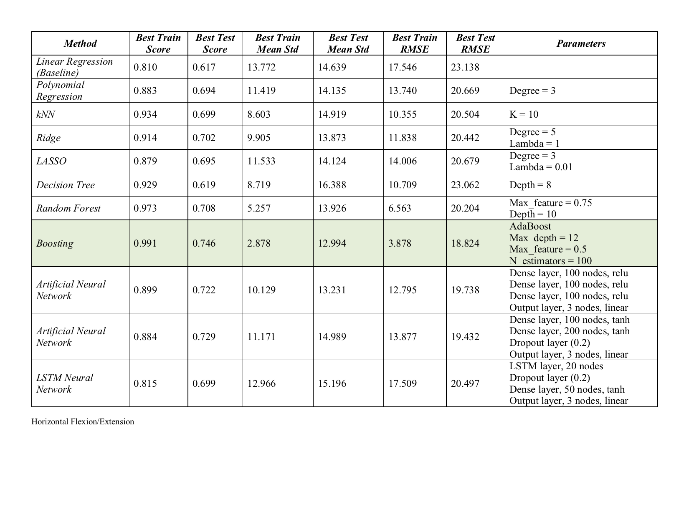
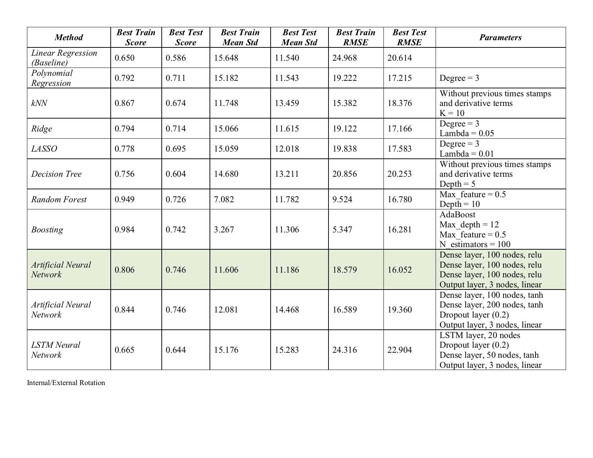
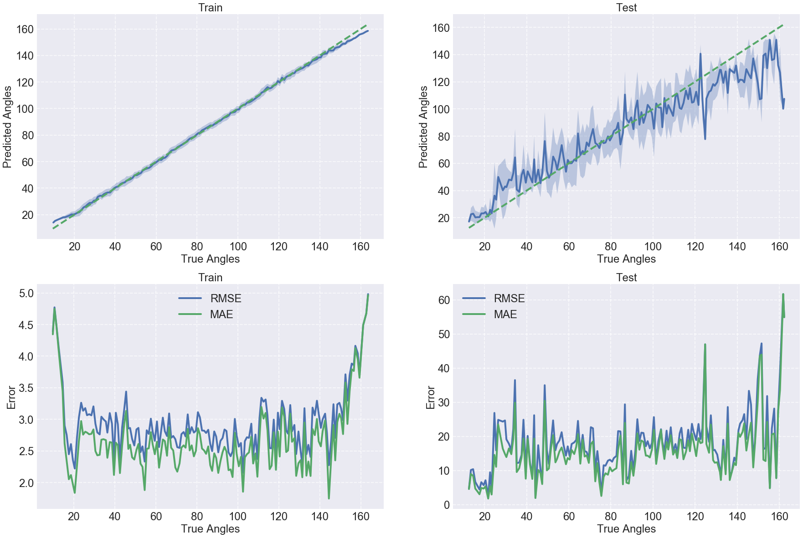
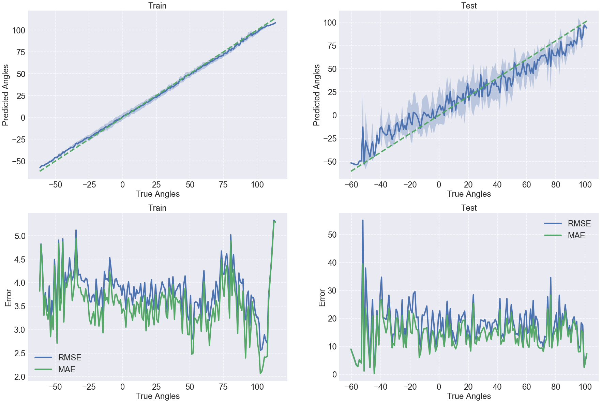
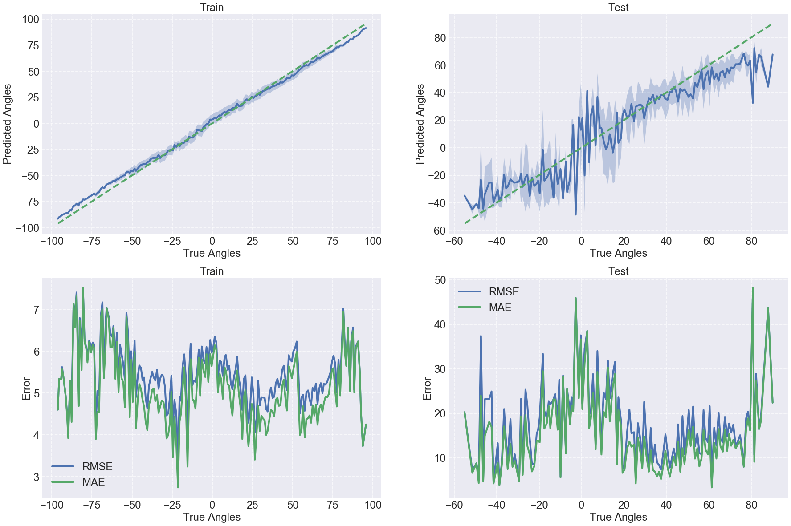

#Results Summary
Below is a summary of the mutiple models tested on the sensing shirt data of a single subject. 

# Conclusion

The initial motivation of this project was to create a sensing shirt that is capable of estimating the wearer's shoulder position. This goal aligns with our method of training and testing on a single subject, because the intended use case is to have tbe same user wear the sensing shirt - by training the model on a single subject (and not switching between multiple), using a single person's data seems appropriate. 

