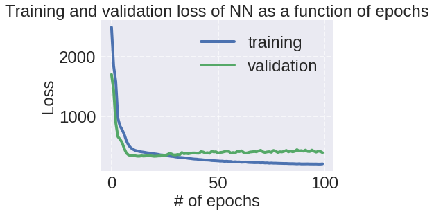

```
# add this to read data because using google colab, then need to change file paths

from google.colab import drive
drive.mount('/content/gdrive')
```


    Drive already mounted at /content/gdrive; to attempt to forcibly remount, call drive.mount("/content/gdrive", force_remount=True).


```
# project directory within Google drive
mydir = 'gdrive/My Drive/courses/AC209a/final project offline/'

# custom stype
plt.style.use(mydir+'code/ac209a.mplstyle')
```


```
# import libraries

import random
random.seed(50) # set this so results can be reproduced

import numpy as np
import pandas as pd
import matplotlib.pyplot as plt

from sklearn.model_selection import train_test_split
from sklearn.utils import resample
from sklearn.preprocessing import MinMaxScaler
from sklearn.metrics import r2_score

import keras 
from keras.models import Sequential
from keras.layers import LSTM
from keras.layers import Dense
from keras.layers import Dropout

%matplotlib inline

pd.set_option('display.width', 1500)
pd.set_option('display.max_columns', 100)
```


```
angs = ['hf','ab','ir'] # response: ground truth mocap angles (3 DOF)

n_sens = 6
sens = ['s'+str(k) for k in range(1,n_sens+1)] # predictors: sensor labels s1 through s6
```


#Data selection


```
# # OPTION 1: SINGLE DATA SET (for quick testing purposes)

# # since for LSTM order matters, avoid pooled data (because not sure what will happen at discontinuities when concatenating)
# # try the longest file for now (m1 t2a)

# # load the data and set column headers
# df = pd.read_csv(mydir+'data/M1_t2A.txt', header=None, names=['time','s1','s2','s3','s4','s5','s6','hf','ab','ir'])
# display(df.head())
# print(df.shape)

# # separate out predictors X from response y
# X_raw = df[sens]
# y = df[angs]

# time = df.time # just for plotting purposes

# # train-test split over time (NOT RANDOMIZED)
# X_train_raw, X_test_raw, y_train, y_test, t_train, t_test = train_test_split(X_raw,y,time,shuffle=False,test_size=0.5)
```


```
# OPTION 2: POOLED - use sets 1 and 2 as train, set 3 as test

dfs = [] # list of dataframes
t_offset = 0

for n in [1,2]:
  for t in ['A','B','C']:
    filepath = mydir+'data/M1_t'+str(n)+t+'.txt'
    df_temp = pd.read_csv(filepath, header=None, names=['time','s1','s2','s3','s4','s5','s6','hf','ab','ir'])
    df_temp.time = df_temp.time + t_offset
    t_offset = df_temp.time.values[-1]
    dfs.append(df_temp)

df_train_pooled = pd.concat(dfs, ignore_index=True)

# repeat to build test set

dfs = []

for t in ['A','B','C']:
  filepath = mydir+'data/M1_t3'+t+'.txt'
  df_temp = pd.read_csv(filepath, header=None, names=['time','s1','s2','s3','s4','s5','s6','hf','ab','ir'])
  df_temp.time = df_temp.time + t_offset
  t_offset = df_temp.time.values[-1]
  dfs.append(df_temp)
  
df_test_pooled = pd.concat(dfs, ignore_index=True)
    
# separate out predictors X from response y, set train and test

X_train_raw = df_train_pooled[sens]
y_train = df_train_pooled[angs]
t_train = df_train_pooled.time

X_test_raw = df_test_pooled[sens]
y_test = df_test_pooled[angs]
t_test = df_test_pooled.time
```


```
# # OPTION 3: Yichu's train/test set
# # all files pooled, every 20 points, first 80% as training set and last 20% as test set.
# # Added features: previous terms, 1st and 2nd derivative, polynomialFeatures of 3

# X_train = pd.read_csv(mydir+'data/X_train.csv')
# X_test = pd.read_csv(mydir+'data/X_test.csv')
# y_train = pd.read_csv(mydir+'data/y_train.csv')
# y_test = pd.read_csv(mydir+'data/y_test.csv')

# display(X_train.head())
# display(y_test.head())
```


#Data setup


```
# verify sizes of train and test sets (before processing)
print(X_train_raw.shape)
print(y_train.shape)
display(X_train_raw.head())

print(X_test_raw.shape)
print(y_test.shape)
display(X_test_raw.head())
```


    (79690, 6)
    (79690, 3)


<div>
<style scoped>
    .dataframe tbody tr th:only-of-type {
        vertical-align: middle;
    }

    .dataframe tbody tr th {
        vertical-align: top;
    }

    .dataframe thead th {
        text-align: right;
    }
</style>
<table border="1" class="dataframe">
  <thead>
    <tr style="text-align: right;">
      <th></th>
      <th>s1</th>
      <th>s2</th>
      <th>s3</th>
      <th>s4</th>
      <th>s5</th>
      <th>s6</th>
    </tr>
  </thead>
  <tbody>
    <tr>
      <th>0</th>
      <td>205.33</td>
      <td>176.98</td>
      <td>225.10</td>
      <td>208.81</td>
      <td>152.47</td>
      <td>164.64</td>
    </tr>
    <tr>
      <th>1</th>
      <td>205.32</td>
      <td>177.00</td>
      <td>225.06</td>
      <td>208.67</td>
      <td>152.41</td>
      <td>164.62</td>
    </tr>
    <tr>
      <th>2</th>
      <td>205.31</td>
      <td>177.02</td>
      <td>225.02</td>
      <td>208.53</td>
      <td>152.36</td>
      <td>164.60</td>
    </tr>
    <tr>
      <th>3</th>
      <td>205.30</td>
      <td>177.03</td>
      <td>225.00</td>
      <td>208.45</td>
      <td>152.34</td>
      <td>164.59</td>
    </tr>
    <tr>
      <th>4</th>
      <td>205.30</td>
      <td>177.04</td>
      <td>224.98</td>
      <td>208.38</td>
      <td>152.31</td>
      <td>164.59</td>
    </tr>
  </tbody>
</table>
</div>


    (38586, 6)
    (38586, 3)


<div>
<style scoped>
    .dataframe tbody tr th:only-of-type {
        vertical-align: middle;
    }

    .dataframe tbody tr th {
        vertical-align: top;
    }

    .dataframe thead th {
        text-align: right;
    }
</style>
<table border="1" class="dataframe">
  <thead>
    <tr style="text-align: right;">
      <th></th>
      <th>s1</th>
      <th>s2</th>
      <th>s3</th>
      <th>s4</th>
      <th>s5</th>
      <th>s6</th>
    </tr>
  </thead>
  <tbody>
    <tr>
      <th>0</th>
      <td>208.22</td>
      <td>180.05</td>
      <td>229.88</td>
      <td>202.40</td>
      <td>150.06</td>
      <td>165.02</td>
    </tr>
    <tr>
      <th>1</th>
      <td>208.25</td>
      <td>180.04</td>
      <td>229.89</td>
      <td>202.42</td>
      <td>150.08</td>
      <td>165.02</td>
    </tr>
    <tr>
      <th>2</th>
      <td>208.29</td>
      <td>180.04</td>
      <td>229.91</td>
      <td>202.44</td>
      <td>150.09</td>
      <td>165.02</td>
    </tr>
    <tr>
      <th>3</th>
      <td>208.31</td>
      <td>180.04</td>
      <td>229.92</td>
      <td>202.45</td>
      <td>150.10</td>
      <td>165.02</td>
    </tr>
    <tr>
      <th>4</th>
      <td>208.32</td>
      <td>180.04</td>
      <td>229.93</td>
      <td>202.46</td>
      <td>150.11</td>
      <td>165.02</td>
    </tr>
  </tbody>
</table>
</div>


```
# downsample data
# if you don't want to downsample just set f=1

f = 10 # factor of downsampling

X_train_raw_ds = X_train_raw.iloc[::f,:]
X_test_raw_ds = X_test_raw.iloc[::f,:]

y_train = y_train.iloc[::f,:]
y_test = y_test.iloc[::f,:]

t_train = t_train.iloc[::f,]
t_test = t_test.iloc[::f]
```


```
# add sensor change rates

tvals = t_train

for s in sens:
  
  svals = X_train_raw_ds[s].values

  dt = np.diff(tvals)
  ds = np.diff(svals)

  dsdt = ds/dt

  dsdt = np.concatenate((np.zeros(1),dsdt)) # pad to match length
  
  # save to dataframe
  label = 'd'+s
  X_train_raw_ds[label] = pd.Series(dsdt, index=X_train_raw_ds.index)


# repeat for test

tvals = t_test

for s in sens:
  
  svals = X_test_raw_ds[s].values

  dt = np.diff(tvals)
  ds = np.diff(svals)

  dsdt = ds/dt

  dsdt = np.concatenate((np.zeros(1),dsdt)) # pad to match length
  
  # save to dataframe
  label = 'd'+s
  X_test_raw_ds[label] = pd.Series(dsdt, index=X_test_raw_ds.index)
```


    /usr/local/lib/python3.6/dist-packages/ipykernel_launcher.py:17: SettingWithCopyWarning: 
    A value is trying to be set on a copy of a slice from a DataFrame.
    Try using .loc[row_indexer,col_indexer] = value instead
    
    See the caveats in the documentation: http://pandas.pydata.org/pandas-docs/stable/indexing.html#indexing-view-versus-copy
    /usr/local/lib/python3.6/dist-packages/ipykernel_launcher.py:37: SettingWithCopyWarning: 
    A value is trying to be set on a copy of a slice from a DataFrame.
    Try using .loc[row_indexer,col_indexer] = value instead
    
    See the caveats in the documentation: http://pandas.pydata.org/pandas-docs/stable/indexing.html#indexing-view-versus-copy


```
# normalize sensor data
scaler = MinMaxScaler() # default will scale 0 to 1
scaler.fit(X_train_raw_ds) # fit scaler on training data
X_train = scaler.transform(X_train_raw_ds)
X_test = scaler.transform(X_test_raw_ds)
```


```
# verify sizes of train and test sets (final)
print(X_train.shape)
print(y_train.shape)
display(X_train)

print(X_test.shape)
print(y_test.shape)
display(X_test)
```


    (7969, 12)
    (7969, 3)


    array([[0.2698212 , 0.        , 0.47994908, ..., 0.79912748, 0.70426771,
            0.60297412],
           [0.26891819, 0.00862999, 0.46976448, ..., 0.72218873, 0.66008735,
            0.59030515],
           [0.27018241, 0.01833873, 0.45798854, ..., 0.71531321, 0.65376315,
            0.59307158],
           ...,
           [0.33592198, 0.17313916, 0.52450668, ..., 0.79988038, 0.70186826,
            0.59979847],
           [0.33592198, 0.17313916, 0.52514322, ..., 0.79982062, 0.70316321,
            0.60005051],
           [0.33592198, 0.17313916, 0.52577976, ..., 0.79912748, 0.70426771,
            0.60198386]])


    (3859, 12)
    (3859, 3)


    array([[0.32201553, 0.16558792, 0.63208148, ..., 0.79912748, 0.70426771,
            0.60297412],
           [0.32671122, 0.1639698 , 0.63621897, ..., 0.81021775, 0.71862633,
            0.60297412],
           [0.3314069 , 0.16343042, 0.640993  , ..., 0.81110095, 0.71885792,
            0.60396437],
           ...,
           [0.34386852, 0.19147789, 0.63017187, ..., 0.80289196, 0.70666716,
            0.60297412],
           [0.34350731, 0.19093851, 0.63049013, ..., 0.80060775, 0.7066265 ,
            0.60297412],
           [0.34350731, 0.19093851, 0.63049013, ..., 0.80063327, 0.70546744,
            0.60297412]])


# Plot data


```
# plot predictors and response variables over time

fig, ax = plt.subplots(n_sens, 1, figsize=(99,20))

for k in range(0,n_sens):
    ax[k].plot(t_train,X_train[:,k])
    ax[k].plot(t_test,X_test[:,k])
    ax[k].set_ylabel(sens[k])
    
ax[-1].set_xlabel('Time (s)');
```


```

fig, ax = plt.subplots(3, 1, figsize=(60,10))

for k in range(0,3):
    ax[k].plot(t_train,y_train[angs[k]])
    ax[k].plot(t_test,y_test[angs[k]])
    ax[k].set_ylabel(angs[k])
    
ax[-1].set_xlabel('Time (s)');
```


# Standard NN


```
# build NN structure

# n timepoints
# inputs are nx6
# outputs are nx3

model = Sequential()
model.add(Dense(100, input_dim=12, activation='tanh')) # hidden layer 1
model.add(Dense(200, activation='tanh')) # hidden layer 2
model.add(Dropout(0.2)) # dropout layer to help with overfitting
model.add(Dense(3, kernel_initializer='normal', activation='linear')) # output layer

model.compile(loss='mean_squared_error', optimizer='adam')
model.summary()
```


    _________________________________________________________________
    Layer (type)                 Output Shape              Param #   
    =================================================================
    dense_20 (Dense)             (None, 100)               1300      
    _________________________________________________________________
    dense_21 (Dense)             (None, 200)               20200     
    _________________________________________________________________
    dropout_10 (Dropout)         (None, 200)               0         
    _________________________________________________________________
    dense_22 (Dense)             (None, 3)                 603       
    =================================================================
    Total params: 22,103
    Trainable params: 22,103
    Non-trainable params: 0
    _________________________________________________________________


```
model_history = model.fit(X_train, y_train, batch_size=32, epochs=100, validation_split=0.2, verbose=1)
```


    Train on 6375 samples, validate on 1594 samples
    Epoch 1/100
    6375/6375 [==============================] - 4s 565us/step - loss: 2499.4318 - val_loss: 1703.1983
    Epoch 2/100
    6375/6375 [==============================] - 1s 185us/step - loss: 1848.0567 - val_loss: 1442.9526
    Epoch 3/100
    6375/6375 [==============================] - 1s 183us/step - loss: 1585.1698 - val_loss: 893.6157
    Epoch 4/100
    6375/6375 [==============================] - 1s 179us/step - loss: 966.0027 - val_loss: 657.9483
    Epoch 5/100
    6375/6375 [==============================] - 1s 183us/step - loss: 837.4068 - val_loss: 614.9128
    Epoch 6/100
    6375/6375 [==============================] - 1s 184us/step - loss: 774.6220 - val_loss: 558.0791
    Epoch 7/100
    6375/6375 [==============================] - 1s 182us/step - loss: 695.1523 - val_loss: 455.7128
    Epoch 8/100
    6375/6375 [==============================] - 1s 190us/step - loss: 586.8512 - val_loss: 380.9901
    Epoch 9/100
    6375/6375 [==============================] - 1s 184us/step - loss: 515.4677 - val_loss: 350.4600
    Epoch 10/100
    6375/6375 [==============================] - 1s 185us/step - loss: 473.5766 - val_loss: 339.2905
    Epoch 11/100
    6375/6375 [==============================] - 1s 182us/step - loss: 447.0824 - val_loss: 344.3625
    Epoch 12/100
    6375/6375 [==============================] - 1s 182us/step - loss: 428.3781 - val_loss: 337.3541
    Epoch 13/100
    6375/6375 [==============================] - 1s 179us/step - loss: 418.5529 - val_loss: 329.8811
    Epoch 14/100
    6375/6375 [==============================] - 1s 182us/step - loss: 409.1926 - val_loss: 328.9539
    Epoch 15/100
    6375/6375 [==============================] - 1s 184us/step - loss: 402.5311 - val_loss: 335.5433
    Epoch 16/100
    6375/6375 [==============================] - 1s 189us/step - loss: 397.7316 - val_loss: 331.6946
    Epoch 17/100
    6375/6375 [==============================] - 1s 185us/step - loss: 391.5557 - val_loss: 334.1715
    Epoch 18/100
    6375/6375 [==============================] - 1s 180us/step - loss: 384.5381 - val_loss: 339.2335
    Epoch 19/100
    6375/6375 [==============================] - 1s 180us/step - loss: 381.8002 - val_loss: 338.9728
    Epoch 20/100
    6375/6375 [==============================] - 1s 181us/step - loss: 374.2169 - val_loss: 332.8290
    Epoch 21/100
    6375/6375 [==============================] - 1s 182us/step - loss: 370.0787 - val_loss: 327.9680
    Epoch 22/100
    6375/6375 [==============================] - 1s 184us/step - loss: 365.5531 - val_loss: 329.7460
    Epoch 23/100
    6375/6375 [==============================] - 1s 182us/step - loss: 359.4479 - val_loss: 333.4288
    Epoch 24/100
    6375/6375 [==============================] - 1s 185us/step - loss: 351.4229 - val_loss: 333.9170
    Epoch 25/100
    6375/6375 [==============================] - 1s 183us/step - loss: 348.9504 - val_loss: 347.9374
    Epoch 26/100
    6375/6375 [==============================] - 1s 181us/step - loss: 342.8881 - val_loss: 344.2763
    Epoch 27/100
    6375/6375 [==============================] - 1s 178us/step - loss: 336.2176 - val_loss: 353.0071
    Epoch 28/100
    6375/6375 [==============================] - 1s 176us/step - loss: 332.7861 - val_loss: 372.5992
    Epoch 29/100
    6375/6375 [==============================] - 1s 182us/step - loss: 326.8117 - val_loss: 369.5057
    Epoch 30/100
    6375/6375 [==============================] - 1s 184us/step - loss: 324.3075 - val_loss: 352.1431
    Epoch 31/100
    6375/6375 [==============================] - 1s 183us/step - loss: 316.7990 - val_loss: 350.0280
    Epoch 32/100
    6375/6375 [==============================] - 1s 182us/step - loss: 312.3790 - val_loss: 358.5343
    Epoch 33/100
    6375/6375 [==============================] - 1s 186us/step - loss: 308.4422 - val_loss: 354.6915
    Epoch 34/100
    6375/6375 [==============================] - 1s 177us/step - loss: 306.5524 - val_loss: 391.4256
    Epoch 35/100
    6375/6375 [==============================] - 1s 178us/step - loss: 302.2359 - val_loss: 370.6015
    Epoch 36/100
    6375/6375 [==============================] - 1s 180us/step - loss: 299.5328 - val_loss: 377.8638
    Epoch 37/100
    6375/6375 [==============================] - 1s 184us/step - loss: 293.2292 - val_loss: 370.4075
    Epoch 38/100
    6375/6375 [==============================] - 1s 185us/step - loss: 289.5931 - val_loss: 377.8006
    Epoch 39/100
    6375/6375 [==============================] - 1s 183us/step - loss: 284.3998 - val_loss: 383.3134
    Epoch 40/100
    6375/6375 [==============================] - 1s 184us/step - loss: 280.8011 - val_loss: 383.6052
    Epoch 41/100
    6375/6375 [==============================] - 1s 181us/step - loss: 279.2817 - val_loss: 380.3654
    Epoch 42/100
    6375/6375 [==============================] - 1s 176us/step - loss: 273.9392 - val_loss: 379.5005
    Epoch 43/100
    6375/6375 [==============================] - 1s 180us/step - loss: 272.0591 - val_loss: 406.7120
    Epoch 44/100
    6375/6375 [==============================] - 1s 184us/step - loss: 267.8477 - val_loss: 399.7667
    Epoch 45/100
    6375/6375 [==============================] - 1s 185us/step - loss: 264.3670 - val_loss: 381.9012
    Epoch 46/100
    6375/6375 [==============================] - 1s 183us/step - loss: 263.5897 - val_loss: 388.8706
    Epoch 47/100
    6375/6375 [==============================] - 1s 183us/step - loss: 261.0962 - val_loss: 378.2534
    Epoch 48/100
    6375/6375 [==============================] - 1s 179us/step - loss: 255.5351 - val_loss: 411.3993
    Epoch 49/100
    6375/6375 [==============================] - 1s 178us/step - loss: 253.9493 - val_loss: 401.2737
    Epoch 50/100
    6375/6375 [==============================] - 1s 182us/step - loss: 252.2055 - val_loss: 403.7516
    Epoch 51/100
    6375/6375 [==============================] - 1s 184us/step - loss: 249.3738 - val_loss: 381.5750
    Epoch 52/100
    6375/6375 [==============================] - 1s 186us/step - loss: 246.2976 - val_loss: 392.3172
    Epoch 53/100
    6375/6375 [==============================] - 1s 185us/step - loss: 246.4047 - val_loss: 396.0426
    Epoch 54/100
    6375/6375 [==============================] - 1s 182us/step - loss: 241.4298 - val_loss: 406.4418
    Epoch 55/100
    6375/6375 [==============================] - 1s 180us/step - loss: 243.9152 - val_loss: 412.6466
    Epoch 56/100
    6375/6375 [==============================] - 1s 179us/step - loss: 240.3452 - val_loss: 409.0809
    Epoch 57/100
    6375/6375 [==============================] - 1s 181us/step - loss: 239.9516 - val_loss: 382.0345
    Epoch 58/100
    6375/6375 [==============================] - 1s 189us/step - loss: 231.7831 - val_loss: 391.4969
    Epoch 59/100
    6375/6375 [==============================] - 1s 185us/step - loss: 235.5635 - val_loss: 384.9417
    Epoch 60/100
    6375/6375 [==============================] - 1s 189us/step - loss: 231.7898 - val_loss: 410.0629
    Epoch 61/100
    6375/6375 [==============================] - 1s 185us/step - loss: 232.7682 - val_loss: 405.1488
    Epoch 62/100
    6375/6375 [==============================] - 1s 184us/step - loss: 227.3918 - val_loss: 419.8626
    Epoch 63/100
    6375/6375 [==============================] - 1s 185us/step - loss: 229.3298 - val_loss: 391.7557
    Epoch 64/100
    6375/6375 [==============================] - 1s 184us/step - loss: 230.8497 - val_loss: 381.6628
    Epoch 65/100
    6375/6375 [==============================] - 1s 185us/step - loss: 224.9296 - val_loss: 387.8954
    Epoch 66/100
    6375/6375 [==============================] - 1s 185us/step - loss: 222.8157 - val_loss: 399.4332
    Epoch 67/100
    6375/6375 [==============================] - 1s 182us/step - loss: 221.9742 - val_loss: 403.0952
    Epoch 68/100
    6375/6375 [==============================] - 1s 182us/step - loss: 219.6450 - val_loss: 407.6237
    Epoch 69/100
    6375/6375 [==============================] - 1s 183us/step - loss: 220.4569 - val_loss: 402.9678
    Epoch 70/100
    6375/6375 [==============================] - 1s 183us/step - loss: 220.9188 - val_loss: 417.9301
    Epoch 71/100
    6375/6375 [==============================] - 1s 182us/step - loss: 217.2209 - val_loss: 429.4120
    Epoch 72/100
    6375/6375 [==============================] - 1s 182us/step - loss: 219.7498 - val_loss: 402.3319
    Epoch 73/100
    6375/6375 [==============================] - 1s 186us/step - loss: 215.1723 - val_loss: 391.7458
    Epoch 74/100
    6375/6375 [==============================] - 1s 182us/step - loss: 216.6396 - val_loss: 401.0542
    Epoch 75/100
    6375/6375 [==============================] - 1s 184us/step - loss: 211.7598 - val_loss: 404.9380
    Epoch 76/100
    6375/6375 [==============================] - 1s 181us/step - loss: 214.4346 - val_loss: 394.8202
    Epoch 77/100
    6375/6375 [==============================] - 1s 183us/step - loss: 211.4234 - val_loss: 426.5723
    Epoch 78/100
    6375/6375 [==============================] - 1s 186us/step - loss: 211.6442 - val_loss: 413.1396
    Epoch 79/100
    6375/6375 [==============================] - 1s 187us/step - loss: 209.6833 - val_loss: 392.3714
    Epoch 80/100
    6375/6375 [==============================] - 1s 184us/step - loss: 208.6977 - val_loss: 403.4472
    Epoch 81/100
    6375/6375 [==============================] - 1s 186us/step - loss: 207.8012 - val_loss: 400.9391
    Epoch 82/100
    6375/6375 [==============================] - 1s 184us/step - loss: 206.3725 - val_loss: 410.8671
    Epoch 83/100
    6375/6375 [==============================] - 1s 182us/step - loss: 206.9980 - val_loss: 427.0327
    Epoch 84/100
    6375/6375 [==============================] - 1s 184us/step - loss: 204.5088 - val_loss: 401.8384
    Epoch 85/100
    6375/6375 [==============================] - 1s 179us/step - loss: 203.5964 - val_loss: 414.8394
    Epoch 86/100
    6375/6375 [==============================] - 1s 183us/step - loss: 203.8588 - val_loss: 402.7258
    Epoch 87/100
    6375/6375 [==============================] - 1s 181us/step - loss: 202.2180 - val_loss: 411.1985
    Epoch 88/100
    6375/6375 [==============================] - 1s 183us/step - loss: 199.6234 - val_loss: 440.1273
    Epoch 89/100
    6375/6375 [==============================] - 1s 185us/step - loss: 202.5166 - val_loss: 416.9306
    Epoch 90/100
    6375/6375 [==============================] - 1s 181us/step - loss: 199.0725 - val_loss: 423.3878
    Epoch 91/100
    6375/6375 [==============================] - 1s 186us/step - loss: 199.0153 - val_loss: 414.5249
    Epoch 92/100
    6375/6375 [==============================] - 1s 185us/step - loss: 199.3241 - val_loss: 432.8573
    Epoch 93/100
    6375/6375 [==============================] - 1s 181us/step - loss: 200.0546 - val_loss: 409.5720
    Epoch 94/100
    6375/6375 [==============================] - 1s 181us/step - loss: 198.4487 - val_loss: 407.5772
    Epoch 95/100
    6375/6375 [==============================] - 1s 180us/step - loss: 198.2989 - val_loss: 432.7136
    Epoch 96/100
    6375/6375 [==============================] - 1s 186us/step - loss: 197.7724 - val_loss: 412.2946
    Epoch 97/100
    6375/6375 [==============================] - 1s 183us/step - loss: 198.2733 - val_loss: 397.4651
    Epoch 98/100
    6375/6375 [==============================] - 1s 184us/step - loss: 196.4165 - val_loss: 412.7698
    Epoch 99/100
    6375/6375 [==============================] - 1s 184us/step - loss: 196.5273 - val_loss: 408.4297
    Epoch 100/100
    6375/6375 [==============================] - 1s 185us/step - loss: 200.0868 - val_loss: 388.7474


```
# plot training progress (via loss func) over epochs
fig,ax = plt.subplots(1,1)
ax.plot(model_history.epoch,model_history.history['loss'],label='training')
ax.plot(model_history.epoch,model_history.history['val_loss'],label='validation')

ax.set_xlabel('# of epochs')
ax.set_ylabel('Loss')
ax.set_title('Training and validation loss of NN as a function of epochs')

ax.legend();
```





```
# make predictions
y_pred_train = model.predict(X_train)
y_pred_test = model.predict(X_test)
```


```
# plot results

fig, axs = plt.subplots(3, 1,figsize=(99,12))

for k,ax in enumerate(axs):
    
    # plot actual ground truth
#     ax.plot(df.time,df[angs[k]],label='actual')
    ax.plot(pd.concat([t_train,t_test]),pd.concat([y_train,y_test])[angs[k]],label='actual')
    
    # plot train set prediction
    ax.plot(t_train,y_pred_train[:,k],label='train prediction')
    
    # plot test set prediction
    ax.plot(t_test,y_pred_test[:,k],label='test prediction')
    
    ax.set_ylabel(angs[k])

axs[-1].set_xlabel('Time')
axs[0].legend(loc=(0.75,1.1));
```


```
model.evaluate(X_test, y_test) # prints loss function on test (currently, MSE)
```


    3859/3859 [==============================] - 0s 102us/step


    335.8110637501689


```
r2_report = 'Train: '

for k, ang in enumerate(angs):
  r2_report = r2_report + ang + ' ' + str(r2_score(y_train.values[:,k],y_pred_train[:,k])) + ' // '
  
print(r2_report)

r2_report = 'Test: '

for k, ang in enumerate(angs):
  r2_report = r2_report + ang + ' ' + str(r2_score(y_test.values[:,k],y_pred_test[:,k])) + ' // '
  
print(r2_report)
```


    Train: hf 0.8818020647411097 // ab 0.9334365053860435 // ir 0.8368074925696078 // 
    Test: hf 0.7297862155990573 // ab 0.8571284122573701 // ir 0.7341002896679996 // 


# LSTM


```
# build LSTM NN

# n timepoints
# inputs are nx6
# outputs are nx3

# keras recurrent layers (of which LSTM is one type) expect input dimensions as follows:
# (batch_size, timesteps, input_dim)

n_batch = 5 # train set size is 12079 so size of 500 is ~25 passes per epoch
N_past = 5
n_LSTM = 20 # of neurons in LSTM layer

# reshape data to have timestep dimension

# X_train currently has shape (# of observations, # of features/sensors)

def data_addpast(X,n_pastwindow):
  
  X_reshaped = np.zeros((X.shape[0],n_pastwindow,X.shape[1]))
  
  for k in range(n_pastwindow):
    X_reshaped[:,k,:] = np.roll(X,k*-1,axis=0)
   
  return X_reshaped

X_train_reshaped = data_addpast(X_train,N_past)
X_test_reshaped = data_addpast(X_test,N_past)

# trim away rows where window rolls over
X_train_reshaped = X_train_reshaped[:-(N_past+1),:,:]
X_test_reshaped = X_test_reshaped[:-(N_past+1),:,:]
y_train_reshaped = y_train.iloc[:-(N_past+1)].values
y_test_reshaped = y_test.iloc[:-(N_past+1)].values
t_train_reshaped = t_train.iloc[:-(N_past+1)].values
t_test_reshaped = t_test.iloc[:-(N_past+1)].values

# check shapes
print(X_train_reshaped.shape)
print(y_train_reshaped.shape)
```


    (7963, 5, 12)
    (7963, 3)


```

model2 = Sequential()
model2.add(LSTM(n_LSTM, input_shape=(N_past,n_sens*2), unroll=False)) # LSTM layer
model2.add(Dropout(0.2))
model2.add(Dense(50, activation='tanh'))
model2.add(Dense(3, kernel_initializer='normal', activation='linear')) # output layer

model2.compile(loss='mean_squared_error', optimizer='adam')
model2.summary()
```


    _________________________________________________________________
    Layer (type)                 Output Shape              Param #   
    =================================================================
    lstm_18 (LSTM)               (None, 20)                2640      
    _________________________________________________________________
    dropout_11 (Dropout)         (None, 20)                0         
    _________________________________________________________________
    dense_23 (Dense)             (None, 50)                1050      
    _________________________________________________________________
    dense_24 (Dense)             (None, 3)                 153       
    =================================================================
    Total params: 3,843
    Trainable params: 3,843
    Non-trainable params: 0
    _________________________________________________________________


```
# train the NN

model_history2 = model2.fit(X_train_reshaped, y_train_reshaped, epochs=30, batch_size=n_batch, validation_split=0.1, verbose=1, shuffle=False)
```


    Train on 7166 samples, validate on 797 samples
    Epoch 1/30
    7166/7166 [==============================] - 33s 5ms/step - loss: 2361.8291 - val_loss: 1815.3323
    Epoch 2/30
    7166/7166 [==============================] - 30s 4ms/step - loss: 1760.1575 - val_loss: 1525.8264
    Epoch 3/30
    7166/7166 [==============================] - 30s 4ms/step - loss: 1540.7264 - val_loss: 1106.0512
    Epoch 4/30
    7166/7166 [==============================] - 30s 4ms/step - loss: 1028.7381 - val_loss: 809.6668
    Epoch 5/30
    7166/7166 [==============================] - 30s 4ms/step - loss: 855.7780 - val_loss: 715.2795
    Epoch 6/30
    7166/7166 [==============================] - 30s 4ms/step - loss: 783.4627 - val_loss: 675.5497
    Epoch 7/30
    7166/7166 [==============================] - 30s 4ms/step - loss: 751.0486 - val_loss: 644.4537
    Epoch 8/30
    7166/7166 [==============================] - 30s 4ms/step - loss: 720.4553 - val_loss: 607.3744
    Epoch 9/30
    7166/7166 [==============================] - 30s 4ms/step - loss: 662.2511 - val_loss: 522.6050
    Epoch 10/30
    7166/7166 [==============================] - 30s 4ms/step - loss: 580.6877 - val_loss: 463.8829
    Epoch 11/30
    7166/7166 [==============================] - 30s 4ms/step - loss: 513.1900 - val_loss: 410.8962
    Epoch 12/30
    7166/7166 [==============================] - 30s 4ms/step - loss: 461.8144 - val_loss: 379.8276
    Epoch 13/30
    7166/7166 [==============================] - 30s 4ms/step - loss: 430.2695 - val_loss: 366.5972
    Epoch 14/30
    7166/7166 [==============================] - 30s 4ms/step - loss: 406.0733 - val_loss: 357.8273
    Epoch 15/30
    7166/7166 [==============================] - 30s 4ms/step - loss: 388.3479 - val_loss: 338.6456
    Epoch 16/30
    7166/7166 [==============================] - 30s 4ms/step - loss: 378.6358 - val_loss: 342.3746
    Epoch 17/30
    7166/7166 [==============================] - 30s 4ms/step - loss: 370.2778 - val_loss: 336.0961
    Epoch 18/30
    7166/7166 [==============================] - 30s 4ms/step - loss: 365.4725 - val_loss: 333.8308
    Epoch 19/30
    7166/7166 [==============================] - 30s 4ms/step - loss: 355.2044 - val_loss: 332.8503
    Epoch 20/30
    7166/7166 [==============================] - 30s 4ms/step - loss: 349.8313 - val_loss: 333.6745
    Epoch 21/30
    7166/7166 [==============================] - 30s 4ms/step - loss: 345.2659 - val_loss: 331.1187
    Epoch 22/30
    7166/7166 [==============================] - 30s 4ms/step - loss: 337.0660 - val_loss: 340.9268
    Epoch 23/30
    7166/7166 [==============================] - 30s 4ms/step - loss: 333.0173 - val_loss: 345.7700
    Epoch 24/30
    7166/7166 [==============================] - 30s 4ms/step - loss: 326.4641 - val_loss: 350.3204
    Epoch 25/30
    7166/7166 [==============================] - 30s 4ms/step - loss: 323.1489 - val_loss: 342.2582
    Epoch 26/30
    7166/7166 [==============================] - 30s 4ms/step - loss: 319.1131 - val_loss: 337.3899
    Epoch 27/30
    7166/7166 [==============================] - 30s 4ms/step - loss: 314.7945 - val_loss: 337.2631
    Epoch 28/30
    7166/7166 [==============================] - 30s 4ms/step - loss: 313.7213 - val_loss: 336.5863
    Epoch 29/30
    7166/7166 [==============================] - 30s 4ms/step - loss: 309.8308 - val_loss: 338.5186
    Epoch 30/30
    7166/7166 [==============================] - 30s 4ms/step - loss: 305.1022 - val_loss: 330.2332


```
# plot training progress (via loss func) over epochs
fig,ax = plt.subplots(1,1)
ax.plot(model_history2.epoch,model_history2.history['loss'],label='training')
ax.plot(model_history2.epoch,model_history2.history['val_loss'],label='validation')

ax.set_xlabel('# of epochs')
ax.set_ylabel('Loss')
ax.set_title('Training and validation loss of NN as a function of epochs')

ax.legend();
```


```
# make predictions

y_pred_train = model2.predict(X_train_reshaped)
y_pred_test = model2.predict(X_test_reshaped)

print('Score:')

print(model2.evaluate(X_test_reshaped, y_test_reshaped))
```


    Score:
    3853/3853 [==============================] - 1s 245us/step
    382.23176727374124


```
# plot results

fig, axs = plt.subplots(3, 1,figsize=(99,12))

for k,ax in enumerate(axs):
    
    # plot actual ground truth
    ax.plot(np.concatenate([t_train_reshaped,t_test_reshaped]),np.concatenate([y_train_reshaped,y_test_reshaped])[:,k],label='actual')
    
    # plot train set prediction
    ax.plot(t_train_reshaped,y_pred_train[:,k],label='train prediction')
    
    # plot test set prediction
    ax.plot(t_test_reshaped,y_pred_test[:,k],label='test prediction')
    
    ax.set_ylabel(angs[k])

axs[-1].set_xlabel('Time')
axs[0].legend(loc=(0.95,1.1));
```


```
r2_report = 'Train: '

for k, ang in enumerate(angs):
  r2_report = r2_report + ang + ' ' + str(r2_score(y_train_reshaped[:,k],y_pred_train[:,k])) + ' // '
  
print(r2_report)

r2_report = 'Test: '

for k, ang in enumerate(angs):
  r2_report = r2_report + ang + ' ' + str(r2_score(y_test_reshaped[:,k],y_pred_test[:,k])) + ' // '
  
print(r2_report)
```


    Train: hf 0.8352022248053942 // ab 0.9105047519829494 // ir 0.6993961170876826 // 
    Test: hf 0.7173217634708138 // ab 0.8333828511386261 // ir 0.6781037588002565 // 

